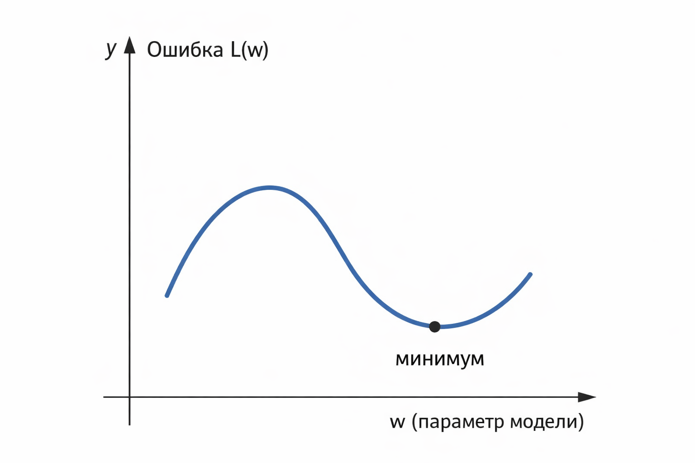
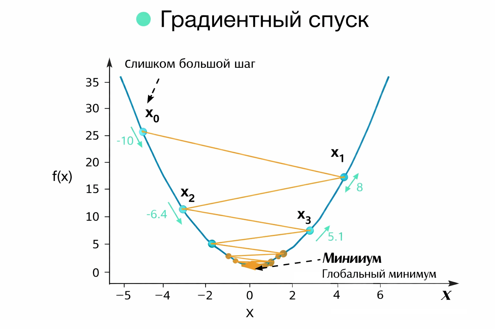
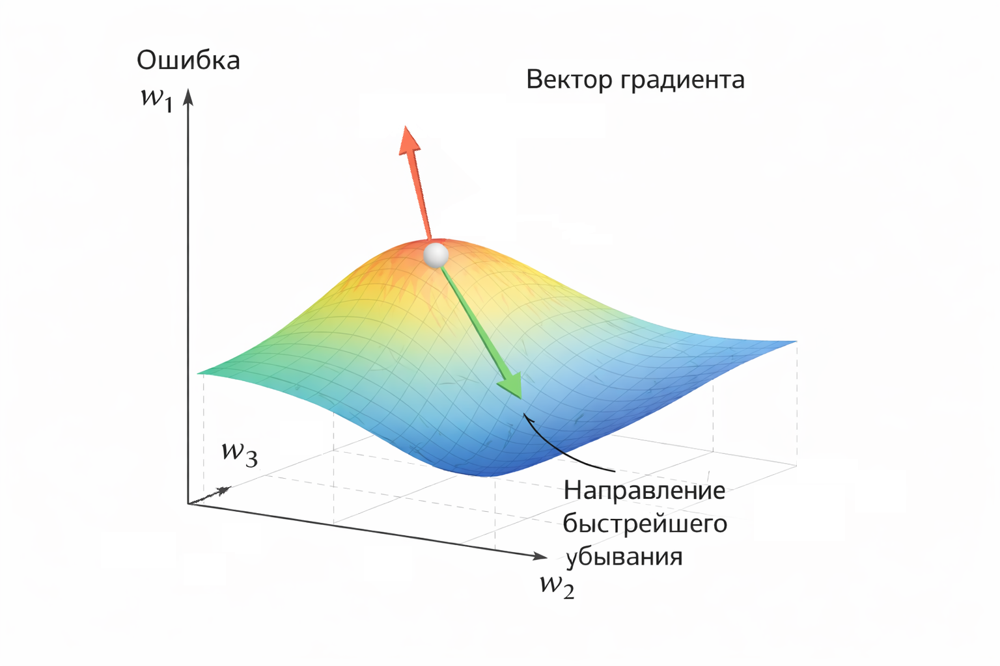

# Градиентный спуск на пальцах

### Градиентный спуск на пальцах

Строго говоря, производная указывает направление роста функции, а направление движения при обучении – это направление, противоположное ей.

Когда в машинном обучении говорят "обучение модели", почти всегда имеют в виду одно и то же: мы хотим подобрать параметры так, чтобы ошибка стала как можно меньше. Какая именно модель – линейная регрессия, логистическая, нейросеть – не так важно. Важнее то, что за кулисами почти всегда работает один и тот же механизм – градиентный спуск.

Слово звучит грозно, но идея у него на удивление простая. Настолько простая, что ее можно объяснить буквально "на пальцах".

### Ошибка как ландшафт

Представим себе очень простую ситуацию. У нас есть модель с одним параметром $$w$$. Мы меняем $$w$$ и каждый раз считаем ошибку $$L(w)$$. Например, это может быть MSE.

Если нарисовать график зависимости ошибки от $$w$$, то мы увидим кривую. Где-то ошибка большая, где-то меньше, а в одной точке – минимальная.

В этот момент полезно сменить абстракцию. Перестать думать об ошибке как о формуле и начать думать о ней как о ландшафте.

Значение параметра $$w$$ – это положение по горизонтали.

Значение ошибки $$L(w)$$ – это высота.

Мы как будто идем по гористой местности и хотим спуститься в самую низкую точку – в минимум.

<div align="left"><figure><figcaption><p>12.1 График ошибки как холм</p></figcaption></figure></div>

### Почему "спуск"

Если мы находимся на склоне холма, то интуитивно понятно, что делать. Нужно идти вниз. Но вот проблема: мы не знаем, где именно низина. У нас нет карты местности. Мы видим только то место, где стоим сейчас.

Все, что мы можем сделать – посмотреть под ноги и понять, куда склон уходит вниз сильнее.

Вот здесь и появляется производная.

### Производная как наклон

Производная функции $$L(w)$$ по $$w$$ – это, по сути, наклон кривой в текущей точке.

Формально:

$$
\frac{dL}{dw}
$$

Но без формального ада это означает следующее:

* если производная положительная, то при увеличении $$w$$ ошибка растет
* если производная отрицательная, то при увеличении $$w$$ ошибка уменьшается
* если производная равна нулю, то мы либо в минимуме, либо в максимуме, либо на плато (в многомерном случае – также в седловой точке)

Геометрически производная – это тангенс угла наклона касательной к графику.

<div align="left"><figure><figcaption><p>12.2 График функции и касательная, показывающая наклон</p></figcaption></figure></div>

### Почему производная – это направление движения

Допустим, мы стоим в точке $$w_0$$.

Если $$\frac{dL}{dw} > 0$$, значит график "идет вверх вправо". Чтобы спускаться, нам нужно двигаться влево, то есть уменьшать $$w$$.

Если $$\frac{dL}{dw} < 0$$, график “идет вниз вправо”. Значит, выгодно двигаться вправо, увеличивая $$w$$.

Обратите внимание на важный момент: мы не идем _по_ производной, мы идем _против_ нее.

Именно поэтому шаг градиентного спуска выглядит так:

$$
w_{new} = w_{old} - \eta \cdot \frac{dL}{dw}
$$

Здесь $$\eta$$ (эта буква называется "эта") – это скорость обучения, или learning rate.

Она отвечает за то, насколько длинный шаг мы делаем.

### Интуиция шага

Можно читать эту формулу буквально словами:

"Возьми текущее значение параметра и сдвинь его в сторону, противоположную наклону, на величину, пропорциональную этому наклону".

Если склон крутой, производная большая, и шаг получается больше.

Если склон пологий, производная маленькая, и шаг уменьшается.

Это очень похоже на то, как человек осторожно спускается с горы. На крутом участке он делает заметный шаг вниз. На почти ровном месте – еле переставляет ноги.

### Что будет, если шаг слишком большой

Интуиция подсказывает, что можно "ускориться" и взять очень большое значение $$\eta$$. Но тут нас поджидает классическая ловушка.

Если шаг слишком большой, мы не спускаемся, а начинаем перепрыгивать минимум. Сегодня – слева от него, завтра – справа, послезавтра – снова слева. Ошибка не уменьшается, а скачет.

<div align="left"><figure><figcaption><p>12.3 График с перескакиванием минимума</p></figcaption></figure></div>

Если же шаг слишком маленький, обучение становится мучительно медленным. Мы вроде бы движемся в правильном направлении, но настолько медленно, что кажется, будто модель вообще не обучается.

Отсюда и главный практический вывод: learning rate – один из самых чувствительных параметров в обучении моделей.

### Много параметров – тот же принцип

До этого мы говорили про один параметр $$w$$. В реальных моделях параметров десятки, тысячи или миллионы.

Но идея не меняется.

Ошибка становится функцией многих переменных:

$$
L(w_1, w_2, \dots, w_n)
$$

Производная превращается в градиент – вектор из частных производных:

$$
\nabla L =
\left(
\frac{\partial L}{\partial w_1},
\frac{\partial L}{\partial w_2},
\dots,
\frac{\partial L}{\partial w_n}
\right)
$$

Этот вектор указывает направление _наибольшего роста_ функции ошибки. А значит, движение в противоположную сторону – это направление _наискорейшего убывания_. Это верно для стандартного евклидова пространства, в котором работают базовые алгоритмы градиентного спуска.

И снова никакой магии. Мы просто идем вниз по самому крутому склону.

<div align="left"><figure><figcaption><p>12.4 3D-поверхность ошибки и вектор градиента</p></figcaption></figure></div>

### Почему без производных никуда

Теперь становится понятно, почему производные – это не академическая прихоть, а рабочий инструмент.

Производная отвечает на простой вопрос:

"Если я слегка пошевелю параметры, в какую сторону и насколько изменится ошибка?"

Градиентный спуск – это не более чем повторение одного и того же цикла:

1. посчитай текущую ошибку
2. посчитай производные
3. сделай шаг в сторону уменьшения ошибки

Этот цикл и есть "обучение".

### Реализация на PHP – с нуля

Начнём с минимального примера: один признак, один вес. Оценка стоимости квартиры по её площади.

```php
// Обучающие данные
$x = [30, 40, 50, 60]; // площадь в м²
$y = [3, 4, 5, 6];     // цена (условно)

// Параметры модели
$w = 0.0; // вес
$b = 0.0; // смещение

// Параметры обучения
$learningRate = 0.0001;
$epochs = 5000;
$n = count($x);

// Градиентный спуск
for ($epoch = 0; $epoch < $epochs; $epoch++) {

    // Накопленные градиенты
    $dw = 0.0;
    $db = 0.0;

    // Проходим по всем точкам
    for ($i = 0; $i < $n; $i++) {
        // Предсказание модели
        $yPred = $w * $x[$i] + $b;
        
        // Ошибка предсказания
        // Если ошибка положительная – модель недооценила
        // Если отрицательная – переоценила
        $error = $y[$i] - $yPred;
    
        // Производные MSE по w и b (см. определение выше)
        $dw += -2 * $x[$i] * $error;
        $db += -2 * $error;
    }

    // Усредняем градиенты
    // Мы считаем средний градиент по всем точкам, а не делаем шаг после каждой. 
    // Это классический batch gradient descent.
    $dw /= $n;
    $db /= $n;

    // Обновляем параметры модели - шаг градиентного спуска
    // Мы двигаемся против направления градиента, потому что градиент указывает, куда ошибка растёт.
    // Маленький шаг – стабильное обучение.
    $w -= $learningRate * $dw;
    $b -= $learningRate * $db;
}

echo "w = {$w}, b = {$b}\n";

// Результат: w = 0.099958681685724, b = 0.0019740438781496
// Для этих данных результат будет близок к: y = 0.1x + 0
```

Этот код обучает простейшую линейную регрессию методом градиентного спуска.

Модель имеет вид:

$$
y = w \cdot x + b
$$

где

* $$x$$ – один признак (площадь),
* $$y$$ – целевая величина (цена),
* $$w$$ – вес (насколько цена растёт при увеличении площади),
* $$b$$ – смещение (базовая цена).

Код:

1. берёт набор пар $$(x, y)$$,
2. начинает с нулевых параметров $$w$$ и $$b$$,
3. много раз (epochs) считает ошибку,
4. вычисляет, как нужно изменить $$w$$ и $$b$$, чтобы ошибка уменьшалась,
5. постепенно сходится к значениям, которые лучше всего описывают данные.

В итоге мы получаем линию, максимально близкую к точкам. Важно, что здесь нет никакой "магии ML". Это обычный цикл, обычная математика и аккуратная работа с числами.

### Векторная версия

Когда признаков больше, удобнее мыслить векторами.

```php
// Скалярное произведение двух векторов
// Используется для вычисления предсказания ŷ = w · x
function dot(array $a, array $b): float {
    $sum = 0.0;
    foreach ($a as $i => $v) {
        $sum += $v * $b[$i];
    }
    return $sum;
}

// Матрица признаков X
// Каждая строка — один объект
// Первый элемент — реальный признак (площадь)
// Второй элемент всегда равен 1 — это bias, включённый как признак
$X = [
    [30, 1],
    [40, 1],
    [50, 1],
    [60, 1],
];

// Истинные значения (целевая переменная)
$y = [3, 4, 5, 6];

// Вектор весов модели
// w[0] — вес площади
// w[1] — вес bias (смещение)
$w = [0.0, 0.0];

// Параметры обучения
$learningRate = 0.0001;
$epochs = 1000;
$n = count($X);

// Градиентный спуск
for ($epoch = 0; $epoch < $epochs; $epoch++) {

    // Вектор градиентов для каждого веса
    $dw = [0.0, 0.0];

    // Проходим по всем объектам
    for ($i = 0; $i < $n; $i++) {

        // Предсказание: скалярное произведение весов и признаков
        $yPred = dot($w, $X[$i]);

        // Ошибка модели на текущем объекте
        $error = $y[$i] - $yPred;

        // Обновляем градиенты по каждому весу
        // ∂L/∂w_j = -2 * x_j * (y - ŷ)
        foreach ($dw as $j => $_) {
            $dw[$j] += -2 * $X[$i][$j] * $error;
        }
    }

    // Обновляем веса, двигаясь против градиента
    foreach ($w as $j => $_) {
        $w[$j] -= $learningRate * ($dw[$j] / $n);
    }
}

// Итоговые веса модели
print_r($w);

// Результат: 
// Array
// (
//   [0] => 0.099956715379918
//   [1] => 0.0020679870606752
// )
// Для этих данных результат будет близок к: y = 0.1x + 0
```

Здесь bias уже включён как дополнительный признак со значением 1. Это эквивалентно предыдущей формуле, просто записано в расширенном векторном виде.

Это стандартный трюк, который часто используется в ML, потому что:

* одинаково работает для линейных моделей, логистической регрессии, SVM, нейросетей,
* упрощает backprop,
* позволяет хранить всё в матрицах,
* убирает условные ветки из кода и формул.

На практике почти все линейные модели в библиотеках делают именно так.

### Подведём итог

Если вынести за скобки формулы, градиентный спуск – это про ориентирование в пространстве ошибок. Производная – это наш компас. Она не говорит, где именно находится глобальный минимум, но всегда подсказывает, куда идти прямо сейчас.

И в этом смысле машинное обучение удивительно похоже на человеческий опыт. Мы редко знаем конечную цель в деталях. Но если мы понимаем, что становится хуже, а что – лучше, то можем шаг за шагом двигаться в правильном направлении.

Именно это и делает градиентный спуск.
