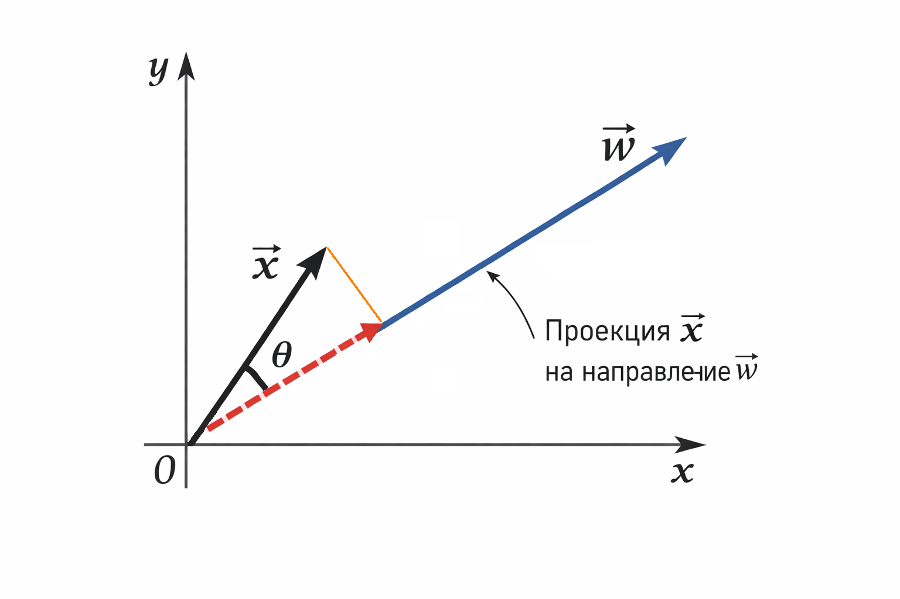
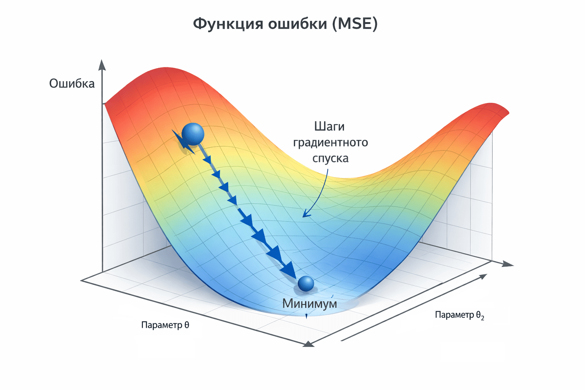

# Линейная регрессия как базовая модель

### Линейная регрессия как базовая модель

Линейная регрессия – это та точка, с которой удобно начинать разговор про машинное обучение. Не потому, что она "простая", а потому, что в ней уже есть почти всё: модель как функция, параметры, ошибка, оптимизация и геометрический смысл. Если понять линейную регрессию, дальше большинство моделей будут восприниматься как её усложнения.

### Идея модели

Представим, что у нас есть данные: входы и правильные ответы. Например, площадь квартиры и её цена. Мы хотим научиться по входу $$x$$ предсказывать значение $$y$$.

Линейная регрессия предполагает, что зависимость можно аппроксимировать линейной функцией:

$$
\hat{y} = w \cdot x + b
$$

Здесь:

* $$x$$ – входной признак
* $$w$$  – коэффициент (вес)
* $$b$$ – смещение (bias, свободный член)
* $$\hat{y}$$ – предсказание модели

Если признаков несколько, формула обобщается:

$$
\hat{y} = w_1 x_1 + w_2 x_2 + \dots + w_n x_n + b
$$

Или в векторной форме, которая важна для ML:

$$
\hat{y} = \mathbf{w} \cdot \mathbf{x} + b
$$

Здесь $$\mathbf{w}$$ и $$\mathbf{x}$$ – векторы, а точка означает скалярное произведение.

По сути, модель отвечает на вопрос: какие веса нужно подобрать, чтобы линейная комбинация признаков как можно лучше совпадала с реальными данными.

### Ошибка и функция потерь

Модель сама по себе ничего не значит, пока мы не определили, что такое "хорошо" и "плохо". Для этого вводится ошибка.

Для одного объекта ошибка выглядит так:

$$
e = y - \hat{y}
$$

Строго говоря, величина $$e$$ называется остатком (residual), а функция, которую мы оптимизируем, называется функцией потерь.

Но оптимизировать просто ошибку неудобно – положительные и отрицательные значения будут взаимно уничтожаться. Поэтому в классической линейной регрессии почти всегда используют квадратичную ошибку:

$$
L = (y - \hat{y})^2
$$

А для всего датасета – среднеквадратичную ошибку (MSE):

$$
\text{MSE} = \frac{1}{N} \sum_{i=1}^{N} (y_i - \hat{y}_i)^2
$$

Именно эту величину мы будем минимизировать, подбирая параметры $$w$$ и $$b$$.

### Геометрический смысл

Геометрия – ключ к пониманию линейной регрессии.

#### **Один признак – прямая**

Если у нас один признак, то данные – это точки на плоскости $$(x, y)$$. Модель – это прямая. Обучение линейной регрессии означает поиск такой прямой, которая проходит "как можно ближе" к этим точкам в смысле минимальной суммарной квадратичной ошибки.

<figure><figcaption>
11.1 Точки данных и аппроксимирующая прямая, которая минимизирует сумму квадратов вертикальных отклонений
</figcaption></figure>

Вертикальные отрезки от точек до прямой – это и есть ошибки предсказания.

#### **Несколько признаков – плоскость и гиперплоскость**

Если признаков два, модель становится плоскостью. Если признаков больше – гиперплоскостью в многомерном пространстве.

Вектор $$\mathbf{w}$$ задаёт ориентацию этой плоскости, а $$b$$ – её сдвиг. Предсказание $$\hat{y}$$ – это значение линейной функции, зависящее от проекции вектора признаков $$x$$ на направление вектора весов  $$w$$, с учётом смещения.

С этой точки зрения линейная регрессия – это задача подбора такого направления в пространстве признаков, которое лучше всего объясняет данные.

<figure><figcaption>
11.2 Векторы x, w и проекция на направление w
</figcaption></figure>

### Как находятся веса

Существует два основных подхода:

1. Аналитическое решение через нормальные уравнения
2. Итеративная оптимизация (градиентный спуск)

В прикладном ML чаще используется второй подход, потому что он масштабируется и логически совпадает с тем, как обучаются нейросети.

### Градиентный спуск – интуитивно

Идея простая: представим, что функция потерь – это поверхность. Мы стоим в случайной точке и хотим спуститься в самую низкую.

Градиент показывает направление наибольшего роста функции. Если идти в противоположную сторону, ошибка будет уменьшаться.

Для линейной регрессии производные считаются просто. Для наглядности запишем производные для одного объекта. В случае всего датасета градиенты усредняются по всем примерам.

$$
\frac{\partial L}{\partial w} = -2 x (y - \hat{y})
$$

$$
\frac{\partial L}{\partial b} = -2 (y - \hat{y})
$$

Обновление параметров выглядит так:

$$
w := w - \eta \frac{\partial L}{\partial w}
$$

$$
b := b - \eta \frac{\partial L}{\partial b}
$$

Где $$\eta$$ – learning rate, шаг обучения.

<figure><figcaption>
11.3 Поверхность ошибки и шаги градиентного спуска
</figcaption></figure>

### Почему линейная регрессия так важна

Линейная регрессия кажется простой, но она:

* задаёт базовый шаблон "модель" → "ошибка" → "оптимизация"
* показывает геометрический смысл обучения
* учит мыслить векторами и пространствами
* напрямую связана с нейросетями (один нейрон без активации – это линейная модель)

Фактически, каждый линейный слой в нейросети – это обобщение линейной регрессии. Разница лишь в количестве слоёв и нелинейностях между ними.

Если вы смогли понять, что происходит здесь, вы уже понимаете одну из важнейших частей машинного обучения – независимо от языка, фреймворка или модной библиотеки.

В следующих главах мы усложним картину и поговорим о том, почему линейности часто недостаточно и как появляются нелинейные модели.
