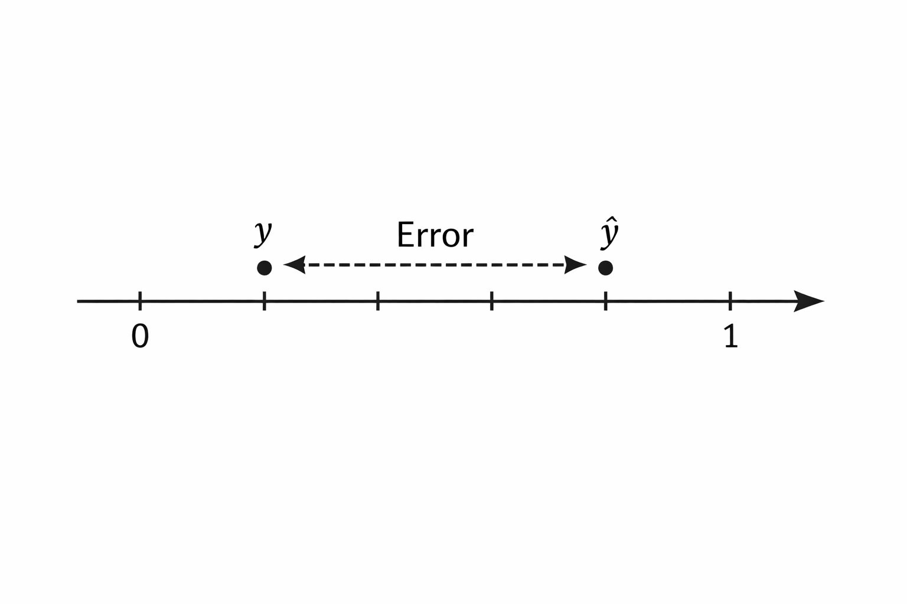

# Ошибка, loss-функции и зачем они нужны

### Ошибка, loss-функции и зачем они нужны

Любая модель машинного обучения сводится к простой идее: она пытается приблизить реальность функцией. А значит, между тем, что есть на самом деле, и тем, что говорит модель, всегда будет расхождение. Это расхождение мы и называем ошибкой.

Важно сразу понять одну вещь: модель не знает, что такое “хорошо” и “плохо”. Она не понимает смысл задачи. Всё, что она умеет – уменьшать число, которое мы ей дали. Это число и есть loss. Формально ошибка – это отклонение между $$y$$ и $$\hat{y}$$, а loss – функция, которая превращает это отклонение в число, удобное для оптимизации.

### Ошибка как расстояние

Пусть у нас есть реальное значение y и предсказание модели $$\hat{y}$$. Самое естественное, что приходит в голову – посмотреть на разницу:

$$
e = y - \hat{y}
$$

Но такая ошибка неудобна. Она может быть отрицательной и положительной. Если у нас много объектов, ошибки начнут компенсировать друг друга.

Геометрически это выглядит так: мы смотрим, насколько далеко предсказание отстоит от реального значения на числовой прямой.

<figure><figcaption>
10.1 Расстояние между y и ŷ на числовой оси
</figcaption></figure>

По сути, мы хотим превратить отклонение в расстояние.

> В регрессии ошибку удобно интерпретировать как расстояние, но не каждая loss-функция является расстоянием в строгом смысле.
>
> * В MSE — да, это квадрат евклидова расстояния.&#x20;
> * В log loss — это уже **не метрическое расстояние**, а дивергенция

А значит, мы сразу приходим к идее: ошибка должна быть неотрицательной.

### Квадрат ошибки как наказание за промах

Самый простой способ убрать знак – взять модуль. Но в ML чаще всего берут квадрат:

$$
(y - \hat{y})^2
$$

Почему?

Во-первых, квадрат делает функцию гладкой и дифференцируемой везде, что критично для градиентной оптимизации и удобной для оптимизации.

Во-вторых, квадрат усиливает большие ошибки.

Если ошибка выросла в 2 раза, штраф вырастает в 4 раза:

$$
(2e)^2 = 4e^2
$$

Это важный философский момент: мы заранее говорим модели, что редкие, но большие промахи хуже, чем много маленьких.

### Mean Squared Error (MSE)

Если объектов много, мы усредняем квадраты ошибок:

$$
\text{MSE} = \frac{1}{n} \sum_{i=1}^{n} (y_i - \hat{y}_i)^2
$$

С точки зрения геометрии, MSE – это средний квадрат расстояния между точками и предсказаниями.

Если представить данные как точки на плоскости, а модель как линию или поверхность, MSE измеряет, насколько далеко точки находятся от этой поверхности.

<figure><figcaption>
10.2 Точки данных и линия регрессии, вертикальные отрезки – ошибки
</figcaption></figure>

#### Немного полезной математики

Почему MSE так часто используют? Потому что минимум MSE ведёт себя очень предсказуемо.

Если модель линейная:

$$
\hat{y} = wx + b
$$

то MSE как функция параметров w и b является выпуклой функцией (по параметрам модели). Это означает:

– у неё один глобальный минимум

– градиент всегда указывает в сторону улучшения

– обучение стабильно

<figure><figcaption>
10.3 График выпуклой функции потерь с единственным минимумом
</figcaption></figure>

Это одна из причин, почему линейная регрессия – базовый и надёжный инструмент.

#### Связь MSE и нормального распределения

Есть важный, но часто неявный факт. Минимизация MSE эквивалентна максимизации правдоподобия в том случае, если мы предполагаем, что ошибки распределены нормально:

$$
\varepsilon = y - \hat{y} \sim \mathcal{N}(0, \sigma^2)
$$

В этом случае минимизация MSE эквивалентна максимизации правдоподобия.

Иначе говоря, MSE – это не просто удобная формула. Это зашитая гипотеза о природе шума в данных.

#### Почему MSE не подходит для классификации

Теперь представим задачу “да / нет”. Например, спам или не спам.

Реальное значение:

$$
y \in \{0, 1\}
$$

Предсказание модели:

$$
\hat{p} \in [0, 1]
$$

Если использовать MSE, то ошибка для 0.99 и 0.51 не отражает принципиальной разницы в уверенности, если правильный ответ – 1. Но интуитивно мы чувствуем, что это не одно и то же качество предсказания.

MSE слабо различает степень уверенности и не соответствует вероятностной природе задачи.

Нам важно не просто угадать, а насколько модель уверена.

### Log loss как цена уверенности

Log loss решает именно эту проблему. Для одного объекта:

$$
\text{loss} = - \left( y \cdot \log(\hat{p}) + (1 - y) \cdot \log(1 - \hat{p}) \right)
$$

Если y = 1, остаётся только:

$$
-\log(\hat{p})
$$

График этой функции очень показателен.

<figure><figcaption>
10.4 График -log(p) при p → 0 и p → 1
</figcaption></figure>

– при $$\hat{p} \to 1$$ ошибка стремится к нулю

– при $$\hat{p} \to 0$$ ошибка стремится к бесконечности

Это математическое выражение идеи:

> Быть уверенно неправым – почти преступление.

#### Геометрический смысл log loss

Log loss можно интерпретировать как меру расхождения между реальным распределением и предсказанным распределением вероятностей.

Формально это частный случай кросс-энтропии:

$$
H(p, q) = - \sum p \log q
$$

Где:

– $$p$$ – истинное распределение

– $$q$$ – распределение модели

<figure><figcaption>
10.5: Два распределения вероятностей и расстояние между ними
</figcaption></figure>

Это делает log loss естественным выбором для вероятностных моделей.

#### Сравнение MSE и log loss интуитивно

MSE спрашивает:

> Насколько далеко мы промахнулись по значению?

Log loss спрашивает:

> Насколько мы ошиблись в своей уверенности?

Именно поэтому можно использовать практическое правило выбора в большинстве практических случаев:

– регрессия → MSE

– классификация → log loss

### Итоговая мысль

Loss-функция – это единственный способ общения с моделью. Через неё мы объясняем, что считаем ошибкой, что считаем катастрофой, а что допустимым компромиссом.

Модель не знает ни денег, ни спама, ни смысла текста. Она знает только одно: куда двигаться, чтобы уменьшить loss.

В следующей главе мы увидим, как минимизация loss превращается в конкретный алгоритм обучения – через градиенты и обновление параметров.
