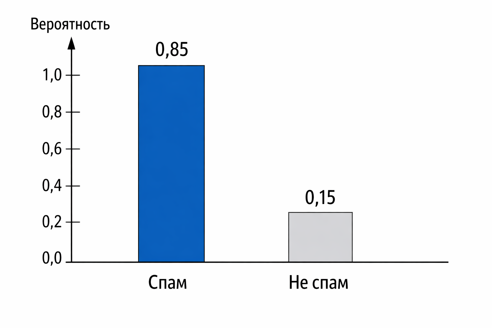
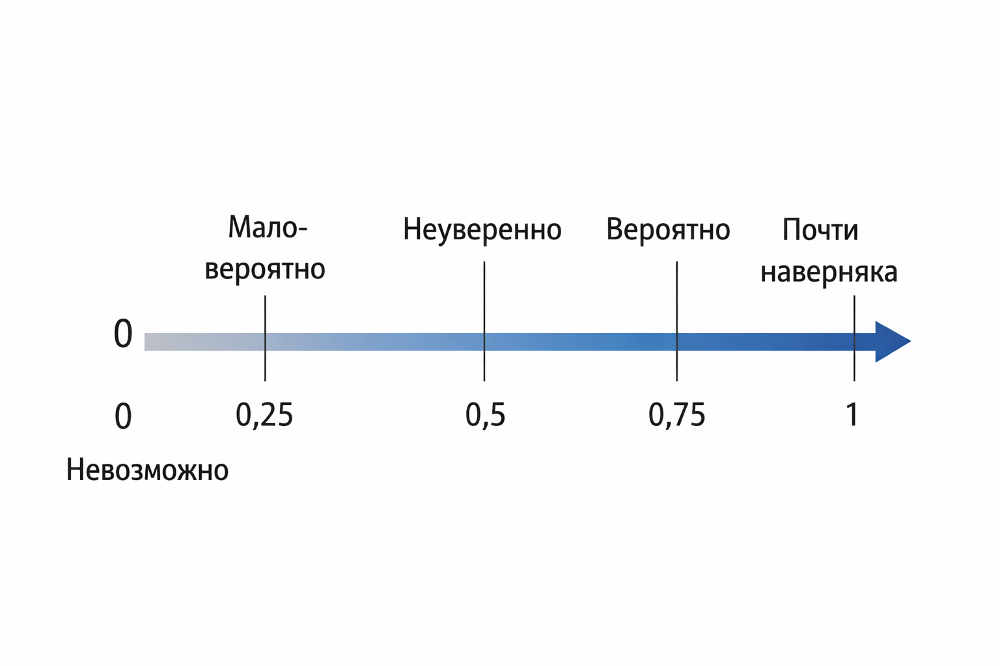

# Вероятность как степень уверенности

### Вероятность как степень уверенности

Когда разработчики слышат слово "вероятность", в голове часто всплывают игральные кости, подбрасывание монетки и школьная формула "благоприятные исходы делить на все возможные". Это полезная, но очень узкая картинка. В машинном обучении и в прикладной аналитике вероятность почти всегда означает другое – степень нашей уверенности в утверждении, исходя из имеющихся данных.

Эта глава нужна, чтобы аккуратно сдвинуть мышление: от вероятности как свойства мира к вероятности как модели нашего знания о мире.

### Классическая интуиция: вероятность как частота

Начнем с привычного. Если мы много раз подбрасываем честную монетку, то ожидаем, что орел будет выпадать примерно в половине случаев. Формально это записывается так:

$$
P(\text{орел}) = \frac{1}{2}
$$

Здесь вероятность интерпретируется как предел относительной частоты при большом числе экспериментов. Это так называемая частотная (frequentist) интерпретация.

Она хорошо работает там, где:

* эксперимент можно повторять бесконечно;
* условия не меняются;
* объект стабилен (монетка сегодня и завтра "та же самая").

Но уже на этом этапе возникает вопрос: а что делать с единичными событиями?

Какова вероятность того, что завтра пойдет дождь? Или что пользователь кликнет на кнопку? Или что письмо – это спам?

Мы не можем "прокрутить мир" миллион раз и посмотреть частоты. И вот здесь появляется другая, гораздо более полезная для разработчика интерпретация.

### Вероятность как степень уверенности

В байесовском смысле вероятность – это число, которое отражает нашу уверенность в утверждении, исходя из информации, которой мы располагаем.

Например:

* вероятность дождя 70% означает не то, что дождь "пойдет на 70%";
* это означает: при текущих данных и модели мы довольно уверены, что дождь будет.

То же самое в ML:

* модель говорит, что письмо – спам с вероятностью 0.92;
* это значит, что при всех известных признаках модель почти уверена в принадлежности письма к этому классу.

Важно: вероятность здесь не свойство объекта, а свойство нашей модели и нашего знания.

Это ключевой сдвиг мышления.

### Формально: вероятность как число от 0 до 1

Математически вероятность – это просто число:

$$
0 \le P(A) \le 1
$$

где:

* P(A) = 0 означает полную уверенность, что событие не произойдет;
* P(A) = 1 – полную уверенность, что произойдет;
* промежуточные значения – степень уверенности.

В машинном обучении мы почти всегда работаем именно с такими значениями. Модель не говорит "да" или "нет", она говорит "насколько я уверена".

### Пример из жизни: медицинский тест

Представим, что у нас есть некоторый тест на заболевание. Он не идеален.

* Если человек болен, тест положительный в 99% случаев.
* Если человек здоров, тест отрицательный в 95% случаев.
* Болезнь встречается у 1 человека из 1000.

Если тест показал "положительно", какова вероятность, что человек действительно болен?

Интуиция часто подводит. Кажется: "почти 99%" Но реальный ответ будет сильно меньше из-за редкости болезни.

Это классический пример того, почему вероятность – это не просто свойство теста, а результат обновления уверенности с учетом контекста.

Здесь впервые появляется формула Байеса.

### Немного математики: формула Байеса

Давайте посмотрим на эту формулу: 

$$
P(A \mid B) = \frac{P(B \mid A) \cdot P(A)}{P(B)}
$$

Где:

* $$A$$ – гипотеза (человек болен);
* $$B$$ – наблюдение (тест положительный);
* $$P(A)$$ – априорная вероятность (наша уверенность до теста);
* $$P(A \mid B)$$ – апостериорная вероятность (уверенность после теста).

В машинном обучении эта логика используется постоянно, даже если формула явно не выписывается. Любая модель классификации по сути обновляет нашу уверенность на основе признаков.

### Визуальная интуиция вероятности

Вероятность удобно представлять не как абстрактное число, а как "массу уверенности", распределенную между вариантами.

Например, модель классификации текста может сказать:

* спам: 0.85
* не спам: 0.15

Это не просто два числа. Это распределение нашей уверенности между гипотезами.

<figure><figcaption>
12.1 Распределение вероятности между двумя классами
</figcaption></figure>

#### Вероятность и softmax

Во многих моделях (логистическая регрессия, нейросети) на выходе используется функция softmax:

$$
P(y = i) = \frac{e^{z_i}}{\sum_{j} e^{z_j}}
$$

Она превращает произвольные числа (оценки модели) в корректные вероятности:

* все значения от 0 до 1;
* сумма равна 1.

Смысл этого шага в том, чтобы привести оценки модели к форме степеней уверенности, с которыми удобно работать дальше – сравнивать, устанавливать пороговые значения и интерпретировать.

### Почему вероятность почти никогда не бывает 0 или 1

В реальных данных почти всегда есть шум, неполнота и неизвестные факторы. Поэтому хорошие модели крайне редко выдают вероятность ровно 0 или ровно 1.

Если модель говорит "100% уверенности", это обычно тревожный сигнал:

* переобучение;
* утечка данных;
* слишком агрессивные предположения.

Здоровая модель почти всегда оставляет место сомнению.

<figure><figcaption>
12.2 Шкала уверенности от 0 до 1
</figcaption></figure>

### Вероятность и решения

Не менее важно понимать: вероятность сама по себе ничего не решает. Решения принимает бизнес-логика.

Например:

* письмо – спам с вероятностью 0.6;
* удалять ли его автоматически? зависит от цены ошибки.

Поэтому в прикладных системах вероятность – это вход в принятие решений, а не само решение.

### Итог

Вероятность в машинном обучении – это не про монетки и кубики. Это язык, на котором модель говорит о своей уверенности.

Она:

* отражает наше знание, а не объективную истину;
* обновляется при поступлении новых данных;
* почти всегда содержит неопределенность;
* служит основой для принятия решений, но не подменяет их.

Если держать эту интуицию в голове, формулы и алгоритмы начинают выглядеть гораздо более человечными – и гораздо менее мистическими.
