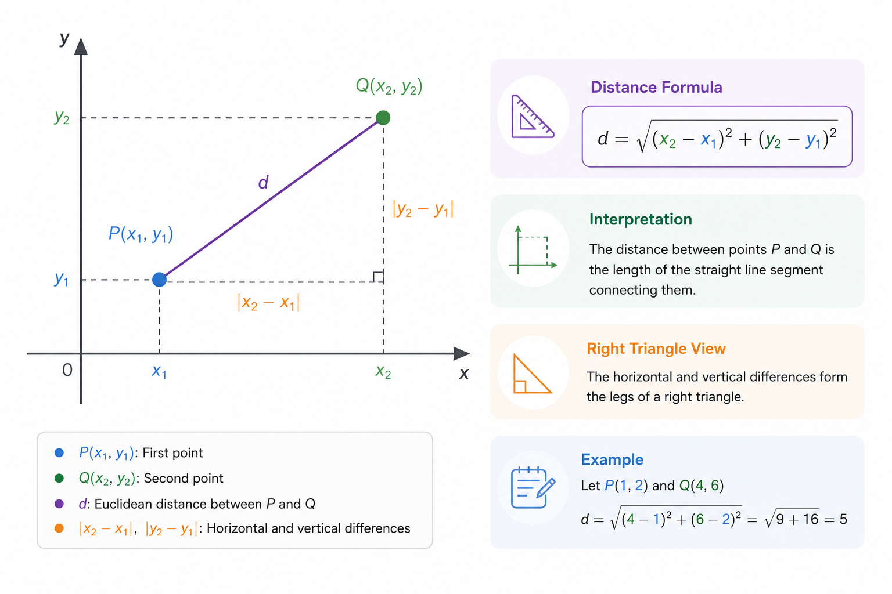
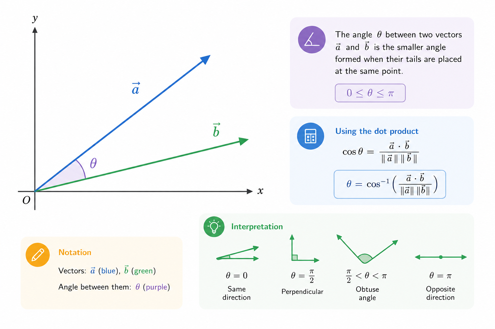
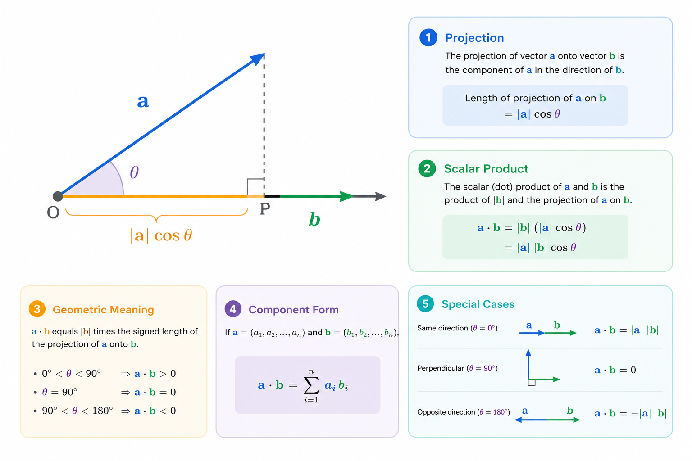
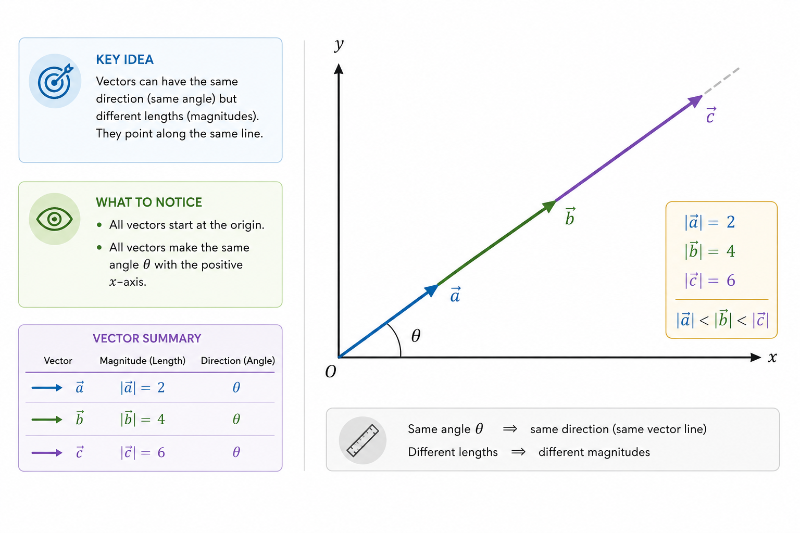

# 1.3. Distances and similarity

## Distances and Similarity

Once we represent data as numbers and vectors, a natural question arises: how do we tell whether two objects are similar or very different? Machine learning almost always comes down to comparison. Is this text closer to this one or that one? Is this user similar to another? Does this image belong to class A or B, and so on.

To formalize this, we need distance measures and similarity measures. In math and ML, these are not abstract ideas but concrete functions that take two vectors and return a number. The algorithm makes decisions based on that number.

In this chapter, we will cover three key tools: Euclidean distance, dot product, and cosine similarity. These are fundamental to k-NN, linear models, recommender systems, text search, and embeddings.

#### Euclidean Distance – "regular" geometry

Euclidean distance is the "ruler distance" between two points in space.

If we have two vectors

$$
\begin{aligned}
x &= (x_1, x_2, \dots, x_n) \\
y &= (y_1, y_2, \dots, y_n)
\end{aligned}
$$

then the Euclidean distance between them is defined as:

$$
d(x, y) = \sqrt{\sum_{i=1}^{n} (x_i - y_i)^2}
$$

If $$n = 1$$, this is the distance between points on a line; if $$n = 2$$ , it is the distance on a plane; if $$n = 3$$  – in three-dimensional space, and so on. If $$n = 100$$ or, say, $$768$$, the geometry is essentially the same – we just cannot visualize it directly, because humans cannot perceive spaces with more than three dimensions.

<figure><figcaption><p>Figure 2.1-1. Euclidean distance in 2D</p></figcaption></figure>

On a plane, it is very intuitive: two points and a segment between them. In machine learning, we do exactly the same thing, just in higher-dimensional space.

As you may remember from the previous chapter, Euclidean distance is sensitive to scale. That is why data is often normalized or standardized before using it, especially when features have different scales.

Intuitively: two objects are similar if the distance between their vectors is small.

**PHP example**

```php
function euclideanDistance(array $a, array $b): float {
    $n = count($a);

    if ($n !== count($b)) {
        throw new InvalidArgumentException('Vectors must have the same length');
    }

    $sum = 0.0;

    for ($i = 0; $i < $n; $i++) {
        $diff = $a[$i] - $b[$i];
        $sum += $diff ** 2;
    }

    return sqrt($sum);
}
```

Example:

```php
$a = [1, 2, 3];
$b = [4, 6, 3];

$distance = euclideanDistance($a, $b);
echo $distance;

// Result: 5
// Explanation: √((1 - 4)^2 + (2 - 6)^2 + (3 - 3)^2) = √(9 + 16 + 0) = √(25) = 5
```

This code can already be used in a simple k-NN classifier: we just look for objects with the smallest distance in the dataset.

#### Dot Product – a measure of alignment

The dot product of two vectors is defined as:

$$
x \cdot y = \sum_{i=1}^{n} x_i y_i
$$

At first glance, this is just the sum of products of corresponding coordinates – a convenient way to multiply two sets of numbers. However, the dot product also has a geometric meaning:

$$
x \cdot y = |x| |y| \cos(\theta)
$$

where $$\theta$$ is the angle between the vectors, and the length (magnitude) of a vector is defined as:&#x20;

$$
|x| = \sqrt{x \cdot x}
$$

<figure><figcaption><p>Figure 2.1-2. Two vectors and the angle between them</p></figcaption></figure>

The dot product becomes larger when two conditions are met at the same time:

1. The vectors point in nearly the same direction\
   If the angle $$\theta$$ between them is small, their directions align – the directional contribution is maximal ($$cos\theta \approx 1$$).
2. The vectors are long\
   The larger their magnitudes, the larger the result (the product $$|x||y|$$ is large), even if the direction stays fixed.

In simple terms:

> dot product = how well directions align × how "large" the vectors are

This is important: the dot product captures both direction and scale. Because of that, it mixes two different effects:

* direction (are the vectors similar)
* scale (how large they are)

So it is not a "pure" similarity measure. Two vectors may point in exactly the same direction, but if one is 10 times longer, the dot product will also be 10 times larger – even though the direction did not change.

In machine learning, this behavior is used intentionally. In linear models, a large dot product means strong activation. In neural networks and [attention mechanisms](getting-started/glossary.md#attention-mechanism), it is interpreted as a measure of importance or relevance.

<figure><figcaption><p>Figure 2.1-3. Dot product as a projection of one vector onto another</p></figcaption></figure>

Geometrically, $$x \cdot y$$ can be interpreted as the length of the projection of one vector onto the direction of the other, multiplied by the length of the second vector.

**PHP example**

```php
function dotProduct(array $a, array $b): float {
    $n = count($a);

    if ($n !== count($b)) {
        throw new InvalidArgumentException('Vectors must have the same length');
    }

    $sum = 0.0;

    for ($i = 0; $i < $n; $i++) {
        $sum += $a[$i] * $b[$i];
    }

    return $sum;
}
```

Example:

```php
$a = [1, 2, 3];
$b = [4, 5, 6];

$result = dotProduct($a, $b);
echo $result;

// Result: 32
// Explanation: (1 * 4) + (2 * 5) + (3 * 6) = 4 + 10 + 18 = 32
```

#### Cosine Similarity – comparing directions

As mentioned in the previous chapter, cosine similarity answers the question: how much do two vectors point in the same direction, regardless of their length.

It is defined as (you can see it follows directly from the dot product formula):

$$
\text{cosine\_sim}(x, y) = \frac{x \cdot y}{|x| |y|}
$$

The result ranges from -1 to 1. While negative values are rare in practical NLP and embedding tasks, they are mathematically possible:

* 1 – same direction
* 0 – orthogonal vectors
* -1 – opposite directions

<figure><figcaption><p>Figure 2.1-4. Same angle, different vector lengths</p></figcaption></figure>

What matters in this illustration: the lengths differ, but the angle is the same – so the cosine similarity is the same.

This makes cosine similarity an ideal measure for texts and embeddings, where vector length often reflects scale (text length, word frequency) rather than meaning.

**PHP example**

```php
function cosineSimilarity(array $a, array $b): float {
    $dot = dotProduct($a, $b);
    $normA = sqrt(dotProduct($a, $a));
    $normB = sqrt(dotProduct($b, $b));

    if ($normA == 0 || $normB == 0) {
       throw new InvalidArgumentException('Zero vector');
    }

    return $dot / ($normA * $normB);
}
```

Example:

```php
$a = [1, 2];
$b = [2, 1];

$similarity = cosineSimilarity($a, $b);
echo $similarity;

// Result: 0.8
// Explanation: 
// dot = 1 * 2 + 2 * 1 = 4
// normA = sqrt(1 * 1 + 2 * 2) = sqrt(5)
// normB = sqrt(2 * 2 + 1 * 1) = sqrt(5)
// cosine = 4 / (sqrt(5) * sqrt(5)) = 4 / 5 = 0.8
```

In this case, the result 0.8 means the vectors are fairly similar in direction, but not identical.
