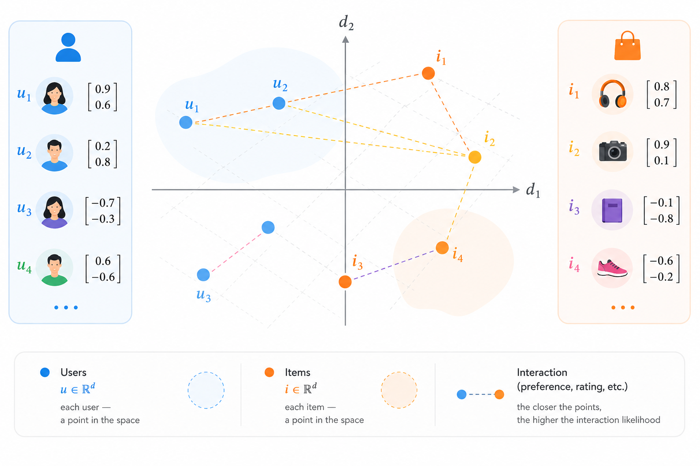

# Case 1: Comparing Objects and Users

When comparing numerical objects, Euclidean distance is often the most natural choice. It works well when features have comparable meaning and are expressed on a similar scale. Under these conditions, the distance directly reflects how close the objects are to one another.

The dot product, on the other hand, is more commonly used in recommendation systems. It helps estimate how well a user and an item "fit" each other: the larger the value, the stronger the match. Importantly, it takes into account not only the direction of preferences but also their strength.

<figure><figcaption><p>Figure 1.3-5. Users and products in one space</p></figcaption></figure>

**Problem Statement**

Let's consider a typical machine learning and recommendation-system task. We have users and items (products, services, subscriptions), each described by a set of numerical features. Our goal is to determine which users are similar to each other and which items are most suitable for them.

Suppose each user is represented by the following vector:

$$
x = (\text{age}, \text{income}, \text{purchase frequency})
$$

This is a classic example where the features:

* have a clear real-world meaning
* are measured in different units
* should contribute on a comparable scale

**Step 1: Feature Normalization**

Without normalization, Euclidean distance will not work correctly. Income values measured in thousands would simply overwhelm age and purchase frequency.

One of the simplest and most commonly used approaches is min-max normalization:

$$
x_i' = \frac{x_i - \min(x_i)}{\max(x_i) - \min(x_i)}
$$

In a real project, the minimum and maximum values are calculated across the entire dataset, but for this example we will define them manually.

```php
function normalize(array $x, array $min, array $max): array {
    $result = [];
    
    foreach ($x as $i => $value) {
        $result[$i] = ($value - $min[$i]) / ($max[$i] - $min[$i]);
    }
    
    return $result;
}
```

Suppose we have two users:

```php
// = [age, income, purchases per month]
$userA = [25, 3000, 5];
$userB = [40, 5000, 8];

$min = [18, 1000, 1];
$max = [65, 10000, 20];

$userANorm = normalize($userA, $min, $max);
$userBNorm = normalize($userB, $min, $max);

// Result:
// $userANorm = [0.1489, 0.2222, 0.2105]
// $userBNorm = [0.4681, 0.4444, 0.3684]
```

After normalization, both users become points on the same scale.

**Step 2: Euclidean Distance Between Users**

Now we can correctly measure the overall similarity of the two profiles.

The Euclidean distance formula:

$$
d(x, y) = \sqrt{\sum_{i=1}^{n} (x_i - y_i)^2}
$$

PHP implementation:

```php
function euclideanDistance(array $a, array $b): float {
    $n = count($a);

    if ($n !== count($b)) {
        throw new InvalidArgumentException('Vectors must have the same length');
    }

    $sum = 0.0;

    for ($i = 0; $i < $n; $i++) {
        $diff = $a[$i] - $b[$i];
        $sum += $diff ** 2;
    }

    return sqrt($sum);
}
```

Usage:

```php
$distance = euclideanDistance($userANorm, $userBNorm);

// Result: 0.4197
// Calculation:
// d = √((0.1489 − 0.4681)^2 + (0.2222 − 0.4444)^2 + (0.2105 − 0.3684)^2)
//   ≈ 0.4197
```

A small value means the users are similar across the entire set of features. In our case, a distance of approximately 0.4197 indicates that the users differ quite noticeably in age, income, and purchasing activity.


By a "small" Euclidean distance, we generally mean a value close to zero and significantly smaller than the typical distances between objects in the dataset (often below 0.2–0.3 for normalized features).


This is exactly the principle used by:

* k-NN (k-Nearest Neighbors) for finding similar users
* customer segmentation
* cold-start recommendation systems

It is important to emphasize that Euclidean distance answers the question, "How similar are these profiles overall?" It does not answer, "How well would this user interact with a particular item?"

**Step 3: Moving to Items and the Dot Product**

Now let's introduce items, such as products. Suppose each item is represented by a preference vector:

$$
y = (\text{age focus}, \text{income focus}, \text{activity focus})
$$

This is no longer a user profile but rather a direction that the item is "targeting".

Example:

```php
$item = [0.2, 0.9, 0.7];
```

Now we want to determine how well a user matches the item. Euclidean distance is no longer the most appropriate tool. Instead, we want large user feature values to reinforce the item features that matter most.

This is where the dot product comes in:

$$
x \cdot y = \sum_{i=1}^{n} x_i y_i
$$

PHP implementation:

```php
function dotProduct(array $a, array $b): float {
    $sum = 0.0;
    
    foreach ($a as $i => $value) {
        $sum += $value * $b[$i];
    }
    
    return $sum;
}
```

Usage:

```php
$score = dotProduct($userANorm, $item);

// Result: 0.3771
// Calculation:
// score = (0.1489 * 0.2) + (0.2222 * 0.9) + (0.2105 * 0.7)
//       = 0.02978 + 0.19998 + 0.14735
//       = 0.3771
```

A high value means the user is strongly represented in the features that are important for the item.

In our example, the result suggests that if the product is aimed at users with higher income and stronger purchasing activity, User A is a reasonable match, but not an ideal one.

This type of score forms the foundation of recommendation systems:

* matrix factorization
* user and item embeddings
* neural recommendation models

**Why Different Measures Are Used Here**

Euclidean distance is good at answering the question: "Which users are similar to one another?"

The dot product answers a different question: "How well does a user match an item?"

These are fundamentally different tasks, and trying to solve both with the same metric often leads to poor results.

A concise way to put it:

* distance is about similarity
* the dot product is about interaction and response strength

**Practical Summary**


Important: In real systems, these two approaches are almost always used together. First, we identify similar users or segments using Euclidean distance. Then, within each segment, we rank items using the dot product.


This combination is the foundation of most production recommendation systems – from simple e-commerce solutions to complex ML pipelines.


To try this code yourself, use the [online demo](https://aiwithphp.org/books/ai-for-php-developers/examples/part-1/distances-and-similarity) to run it.

