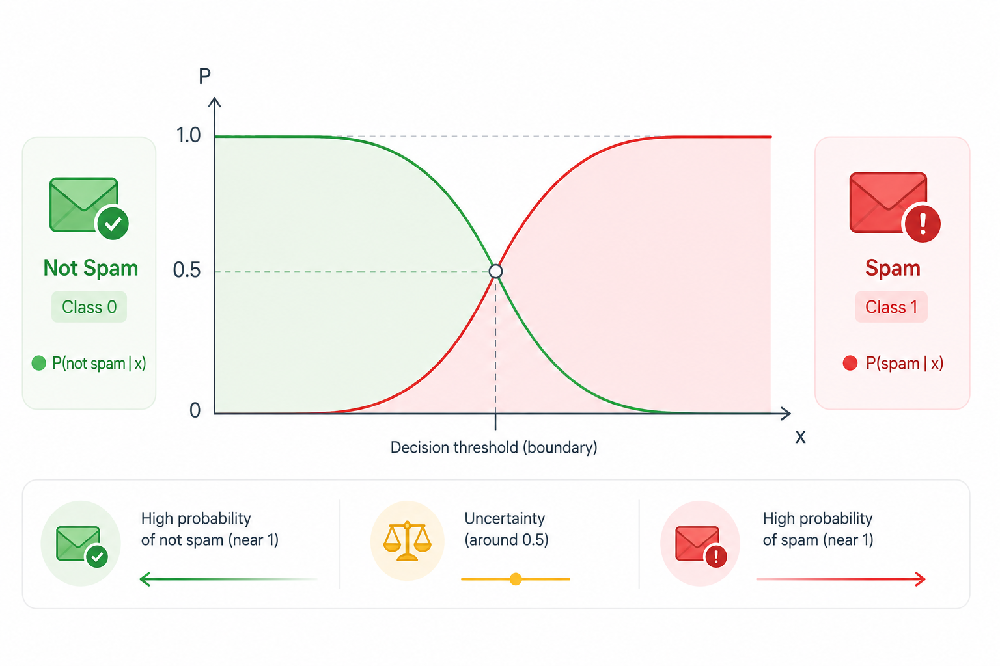
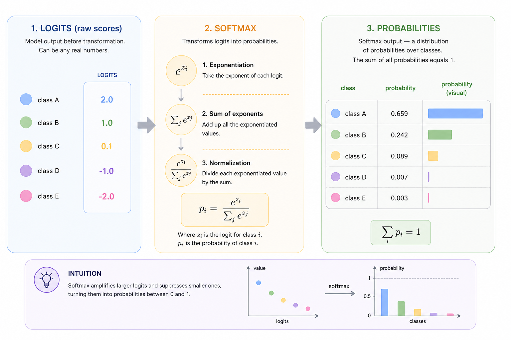
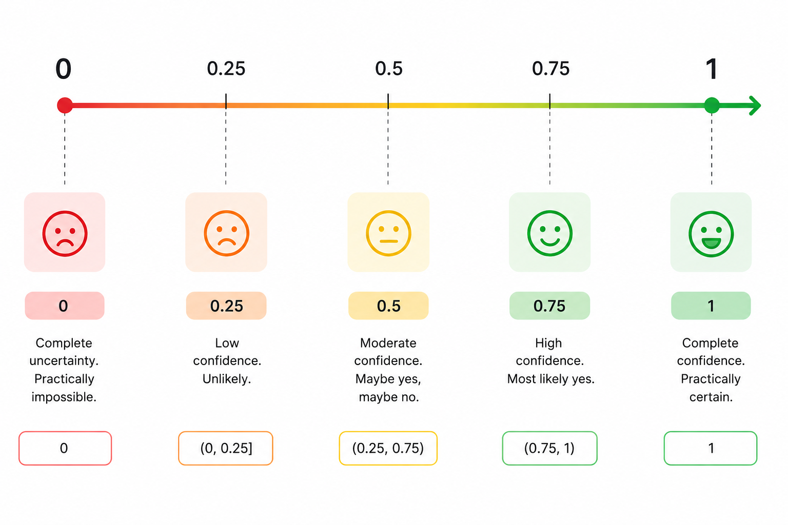

# 3.1 Probability as a degree of confidence

When developers hear the word "probability", they often think of dice, coin flips, and the school formula "favorable outcomes divided by all possible outcomes". That's useful, but it's a very narrow view. In machine learning and applied analytics, probability is most often interpreted as a measure of our confidence in a statement based on the data available to us.

The goal of this chapter is to gently shift your thinking – from probability as a property of the world to probability as a model of our knowledge about the world.

### Classical Intuition: Probability as Frequency

Let's start with the familiar interpretation. If we flip a fair coin many times (one where neither side appears more often than the other over a long series of flips), we expect heads to come up roughly half the time. Formally:

$$
P(\text{heads}) = \frac{1}{2}
$$

Here, probability is interpreted as the limiting relative frequency over a large number of experiments. This is known as the _frequentist interpretation_.

It works well when:

* the experiment can be repeated indefinitely
* conditions remain unchanged
* the object is stable (the coin today and tomorrow is "the same" coin)

But even at this stage, a question arises: what do we do with one-off events?

What is the probability that it will rain tomorrow? Or that a user will click a button? Or that an email is spam?

We cannot "rerun the world" a million times and observe frequencies. This is where another interpretation appears – one that is often far more useful for developers.

### Probability as a Degree of Confidence

In the Bayesian sense, probability is a number that reflects our confidence in a statement given the information we currently have.

For example:

* a 70% chance of rain does not mean it will "rain by 70%"
* it means that, given the current data and model, we are fairly confident that it will rain

The same idea applies in machine learning:

* a model says an email is spam with probability 0.92
* this means that, given all known features, the model is highly confident that the email belongs to that class

An important point: in the Bayesian interpretation, probability is not a property of the object itself. It is a property of our model and our knowledge. With a different model or different data, the estimate could be different.

This is the key shift in perspective.

### Formally: Probability as a Number Between 0 and 1

Mathematically, probability is simply a number:

$$
0 \le P(A) \le 1
$$

In the Bayesian interpretation, this number represents a degree of confidence, where:

* $$P(A) = 0$$ means complete certainty that the event will not occur;
* $$P(A) = 1$$ means complete certainty that it will occur;
* values in between represent varying levels of confidence.

In Bayesian reasoning, values of exactly 0 and 1 represent absolute (dogmatic) certainty and are rarely used in practice.

Machine learning models typically produce intermediate values – degrees of confidence rather than hard "yes" or "no" answers.

### A Real-World Example: A Medical Test

Imagine we have a medical test for a disease. The test is not perfect.

* If a person has the disease, the test is positive in 99% of cases.
* If a person is healthy, the test is negative in 95% of cases.
* The disease occurs in 1 out of every 1,000 people.

If the test result is positive, what is the probability that the person actually has the disease?

Intuition often gets this wrong. It may seem like the answer should be "almost 99%". In reality, it is much lower because the disease is so rare. We'll see exactly how much lower shortly.

This is a classic example of why probability is not simply a property of the test. It is the result of updating our confidence based on context.

And this is where Bayes' theorem first appears.


The theorem is named after the English mathematician and minister [Thomas Bayes](https://en.wikipedia.org/wiki/Thomas_Bayes) (18th century). He was the first to formulate the idea of updating probabilities when new evidence becomes available. Later, [Pierre-Simon Laplace](https://en.wikipedia.org/wiki/Pierre-Simon_Laplace) independently developed and generalized the approach, turning it into a full framework for probabilistic inference.


### A Bit of Math: Bayes' Theorem

Let's look at the formula:

$$
P(A \mid B) = \frac{P(B \mid A) P(A)}{P(B)}
$$

Where:

* $$A$$ – the hypothesis (the person has the disease);
* $$B$$ – the observation (the test is positive);
* $$P(A)$$ – the prior probability (our confidence before seeing the test result);
* $$P(B)$$ – the probability of the observation, serving as a normalization factor;
* $$P(B \mid A)$$ – the probability of the observation given that the hypothesis is true (the probability of a positive test if the person actually has the disease; the test's sensitivity);
* $$P(A \mid B)$$ – the posterior probability (our confidence after seeing the test result).

This logic is used constantly in machine learning, even when the formula itself is not written explicitly. Most practical classification models are essentially updating our confidence based on observed features.

<details>

<summary><strong>Medical test. Calculation using Bayes' formula</strong></summary>

Let's work through the calculation carefully using Bayes' theorem.\
For clarity, we'll use the following notation: "D" – diseased, "H" – healthy, and "+" – a positive test result.

**Given:**

* Disease prevalence:\
  ( $$P(D) = 1/1000 = 0.001$$ )
* Test sensitivity (true positive rate):\
  ( $$P(+ \mid D) = 0.99$$ )
* Test specificity (true negative rate):\
  ( $$P(- \mid H) = 0.95$$ )\
  ⇒ false positive rate:\
  ( $$P(+ \mid H) = 0.05$$ )

**Step 1. Probability of a positive test result**

$$P(+) = P(+ \mid D)P(D) + P(+ \mid H)P(H)$$

$$P(+) = 0.99 \cdot 0.001 + 0.05 \cdot 0.999$$

$$P(+) = 0.00099 + 0.04995 = 0.05094$$

**Step 2. Probability that the person has the disease given a positive test**

$$P(D \mid +) = \frac{P(+ \mid D)P(D)}{P(+)}$$

$$P(D \mid +) = \frac{0.99 \cdot 0.001}{0.05094}$$

$$P(D \mid +) \approx 0.0194$$

**Answer**

**≈ 1.94%**

***

**A quick sanity check**

Let's take 100,000 people:

* Diseased: 100
  * Positive test: 99
* Healthy: 99,900
  * False positive test: ≈ 4,995

Total positive tests:

99 + 4,995 = 5,094

Fraction of truly diseased people among all positive results:

$$99 / 5,094 \approx 1.94%$$

**Conclusion**

Even with a very accurate test, if the disease is rare, a positive result does not imply a high probability of having the disease.

This is a classic example of how the base rate can completely overturn intuition.

</details>

### Visual Intuition for Probability

It is often helpful to think of probability not as an abstract number, but as a "mass of confidence" distributed among different possibilities.

For example, a text classification model might output:

* spam: 0.85
* not spam: 0.15

These are not just two numbers. They represent how the model distributes its confidence across competing hypotheses.

<figure><figcaption><p>Figure 3.1-1. Probability distribution between two classes</p></figcaption></figure>

#### **Probability and Softmax**

Many models (logistic regression, neural networks) use the softmax function at the output layer:

$$
P(y = i) = \frac{e^{z_i}}{\sum_{j} e^{z_j}}
$$

It converts arbitrary numbers (model scores) into valid probabilities:

* every value is between 0 and 1;
* the values sum to 1.

These are the model's normalized probabilities. They are not necessarily well-calibrated estimates of real-world frequencies. Strictly speaking, they are probabilities according to the model, not objective probabilities of the world.

The purpose is to transform model scores into confidence values that are easier to compare, threshold, and interpret.

#### **A Softmax Probability Example**

In many machine learning models, the output is not a probability but a set of _scores_ (logits). These are simply numbers representing the model's relative confidence in each option. They can be positive, negative, large, or small, and by themselves they are not probabilities.

To convert these scores into proper probabilities, we use the `softmax` function.

Consider a simple example. Suppose a model evaluates an incoming email and produces the following scores for three classes:

```php
$scores = [
    'spam'   => 2.1,
    'promo'  => 1.3,
    'normal' => 0.2,
];
```

These values are not probabilities. Their sum is not 1, and they are not constrained to the range from 0 to 1.

Let's implement `softmax` in plain PHP:

```php
function softmax(array $scores): array {
    // For numerical stability, subtract the maximum value
    $max = max($scores);

    $expValues = [];
    $sum = 0.0;

    foreach ($scores as $key => $value) {
        $exp = exp($value - $max); // e^(value - max)
        $expValues[$key] = $exp;
        $sum += $exp; // accumulate the amount for normalization
    }

    $probabilities = [];
    foreach ($expValues as $key => $value) {
        $probabilities[$key] = $value / max($sum, 1);
​    }

    return $probabilities;
}
```

Apply `softmax` to the model scores:

```php
$probabilities = softmax($scores);

foreach ($probabilities as $class => $probability) {
    echo $class . ': ' . round($probability, 3) . "\n";
}

// Result:
// spam: 0.625
// promo: 0.281
// normal: 0.094
```

Now we have a valid probability distribution:

* every value is between 0 and 1
* all values sum to 1
* the numbers can be interpreted as the model's degree of confidence

An important note: `softmax` does not make the model smarter. It simply converts the model's internal scores into a form that is easier to interpret and use for decision-making. The model is still uncertain and distributes confidence across alternatives rather than producing a hard "yes" or "no" answer.

<figure><figcaption><p>Figure 3.1-2. How softmax transforms logits into probabilities</p></figcaption></figure>

### Why Probability Is Almost Never 0 or 1

Real-world data almost always contains noise, missing information, and unknown factors. As a result, good models rarely produce probabilities of exactly 0 or exactly 1.

If a model says it is "100% certain", that is usually a warning sign:

* overfitting
* data leakage
* overly aggressive assumptions

A healthy model almost always leaves room for doubt.

<figure><figcaption><p>Figure 3.1-3. Confidence scale from 0 to 1</p></figcaption></figure>

### Probability and Decisions

It is equally important to understand that probability itself does not make decisions. Decisions are made at the business-logic level.

For example:

* an email is classified as spam with probability 0.6
* whether it should be deleted automatically depends on the cost of making a mistake

In practical systems, probability is an input to decision-making, not the decision itself.

### Summary

In machine learning, probability is not about coins and dice. It is the language a model uses to express its confidence.

It:

* reflects our knowledge, not objective truth
* is updated as new data arrives
* almost always includes uncertainty
* provides a foundation for decision-making without replacing it

Once you internalize this intuition, formulas and algorithms start to feel much more human – and much less mysterious.


To try this code yourself, use the [online demo](https://aiwithphp.org/books/ai-for-php-developers/examples/part-3/probability-as-degree-of-confidence) to run it.

