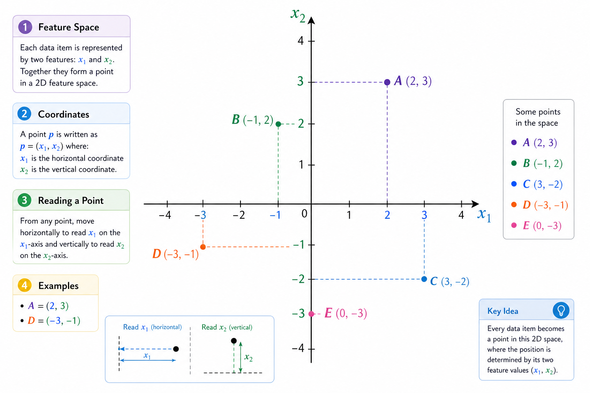

# Vectors, dimensions, and feature spaces

If you strip machine learning of all the complex terminology and buzzwords, you almost always end up with the same core idea: we represent real-world objects as numbers and work with those numbers mathematically. This is where vectors, dimensions, and feature spaces come in. As PHP developers, it’s especially important to understand this intuitively rather than formally, because in code you’ll deal not with abstract linear algebra, but with arrays of numbers, matrices, and operations on them.

#### **A vector as a way to describe an object**

In machine learning, a vector is simply an ordered set of numbers. Each number represents some aspect of an object. If the object is simple, the vector is short. If the object is complex, the vector can be very long.

Imagine a user of an online store. We can describe them using: age, number of purchases per year, and average order value. Then one user is a vector of three numbers:

(age, purchases, average order value)

In PHP, this looks very straightforward:

```php
$userVector = [35, 12, 78.5];
```

It’s important to understand: a vector is not just an array. The order of elements matters. If you swap age and average order value, the model won’t "figure out" what you meant. To it, these are completely different data.

#### **Vector dimensionality**

The dimensionality of a vector is the number of values it contains. In the example above, the dimensionality is 3. If you add another feature, say "days since last purchase", the dimensionality becomes 4.

Dimensionality is directly tied to how detailed your object description is. Low dimensionality means a rough description, high dimensionality means a more detailed one. But higher dimensionality is not always better. Every additional feature is both a new degree of freedom for the model and a potential source of noise.

It helps to think of dimensionality as a fixed contract. If a model expects a vector of length 10, you must always pass exactly 10 numbers, in the same order.

```php
function predict(array $features): float {
    if (count($features) !== 10) {
        throw new InvalidArgumentException("Expected a vector of dimensionality 10");
    }

    // further computations
}
```

Example:

```php
$features = [0.12, 0.85, 0.33, 0.67, 0.91, 0.44, 0.58, 0.76, 0.29, 0.50];

try {
    $result = predict($features);
    echo "Model score: " . round($result, 3) . PHP_EOL;
    
    // Interpret the result
    if ($result > 0.7) {
        echo "High probability of a positive outcome";
    } elseif ($result > 0.4) {
        echo "Medium probability";
    } else {
        echo "Low probability";
    }
} catch (Exception $e) {
    echo "Error: " . $e->getMessage();
}

// Model score: 0.75
// High probability of a positive outcome
```

#### **Feature space**

Formally, a feature space is usually denoted as $$R^n$$. This means each object is represented by a vector $$x = (x₁, x₂, …, xₙ)$$ of $$n$$ real numbers, and the set of all such vectors forms a single abstract space. Most machine learning models operate within this  $$n$$-dimensional space: vector addition and scalar multiplication are defined here, which allows us to use linear algebra tools. While formal axioms are rarely the focus in practice, it’s critical to understand that any model always operates within a fixed space defined by the structure of its input features.\
\
If the dimensionality is 2, the feature space is a plane. If it’s 3, it’s the familiar 3D space. If it’s higher, we can no longer visualize it, but mathematically it’s still the same feature-engineering $$R^n$$ space.

Each point in this space is a real-world object translated into numbers. A user, a product, a document, an image – after preprocessing, all of them become points in feature space.

Feature space is the environment where the machine learning algorithm operates. Everything that used to be strings, dates, categories, and JSON becomes pure math – a set of numbers – after [feature engineering](getting-started/glossary.md#feature-engineering).

#### **Features as coordinate axes**

Each feature is a separate coordinate axis in the space. Mathematically, this means the value $$xᵢ$$ is the coordinate of the point along the $$i$$-th axis.

For example, the vector (35, 12, 78.5) is a point in 3D space where the first axis is age, the second is number of purchases, and the third is average order value.

This immediately explains a few important things.

First, features should be comparable in scale (another reason we convert everything to numbers). If one axis is measured in tens and another in hundreds of thousands, then distances and angles computed by the chosen metric stop reflecting true similarity between objects.

Second, adding a new feature means adding a new axis. The space becomes higher-dimensional (one more dimension), and each point gets an additional coordinate. The model now has to account for another direction when making decisions.

### **Normalization and scaling**

In practice, you almost always need to bring features to comparable scales. This can be done in different ways: normalization (mapping values to a fixed range, for example from 0 to 1) or standardization (transforming the distribution to have zero mean and unit standard deviation). Both approaches solve the same engineering problem – making features comparable for the algorithm.

Depending on the data, logarithmic or other nonlinear transformations may also be used, but those are beyond the scope of this book.\
\
It’s important to understand that normalization and scaling are not mathematical niceties, but practical necessities. Most machine learning algorithms are sensitive to the scale of input data: features with large numeric values start to dominate others, distorting the contribution of truly informative features. This reduces both the quality and stability of training.

#### **Normalization**

The simplest example is normalization to the range \[0, 1]:

```php
function normalize(float $value, float $min, float $max): float {  
    $range = $max - $min;

    if ($range === 0.0) {
        return 0.0;
    }

    return ($value - $min) / $range;
}
```

Example:

```php
$result = normalize(value: 75, min: 50, max: 100);
echo $result; 

// Result: 0.5
// Explanation: (75 - 50) / (100 - 50) = 0.5
```

After this transformation, age, number of purchases, and average order value start to "weigh" roughly the same in feature space.

#### **Standardization**

Another widely used approach is feature standardization. Unlike normalization, it does not constrain values to a fixed range, but transforms the feature distribution to have zero mean and unit standard deviation. This is especially important for models that are sensitive to feature scale (linear and logistic regression, SVM, neural networks), as well as optimization methods based on gradient descent. Standardization makes features comparable while preserving information about outliers and relative deviations.

The basic standardization formula looks like this:

```php
function standardize(float $value, float $mean, float $std): float {
    if ($std == 0.0) {
        return 0.0;
    }
    
    return ($value - $mean) / $std;
}
```

Example:

```php
// Suppose this is the feature "user response time" (in seconds)
$value = 8.5;
// Statistics from the training dataset
$mean = 5.0;   // mean
$std  = 2.0;   // standard deviation

$zScore = standardize($value, $mean, $std);

echo "Z-score: " . round($zScore, 2) . PHP_EOL;

// Interpretation
if ($zScore > 2) {
    echo "Significantly above average (anomaly)";
} elseif ($zScore < -2) {
    echo "Significantly below average (anomaly)";
} elseif ($zScore > 1) {
    echo "Above average";
} elseif ($zScore < -1) {
    echo "Below average";
} else {
    echo "Within normal range";
}

// Result: 1.75
// Explanation: (8.5 − 5.0) / 2.0 = 1.75
```

After standardization, age, number of purchases, and average order value have a mean around zero and comparable variance, making training more stable and optimization faster and more predictable.

### **Categorical features and dimensionality**

Not all features are numeric by default. Color, country, device type – these are categories. To place them in feature space, we need to convert them into numbers. The most common approach is one-hot encoding.

If we have three possible colors: red, green, blue, then one feature becomes three coordinates:

```php
function encodeColor(string $color): array {
    return [
        $color === 'red' ? 1 : 0,
        $color === 'green' ? 1 : 0,
        $color === 'blue' ? 1 : 0,
    ];
}

echo 'Red: ' . encodeColor(color: 'red') . PHP_EOL;
echo 'Green: ' . encodeColor(color: 'green') . PHP_EOL;
echo 'Blue: ' . encodeColor(color: 'blue');

// Red:   [1, 0, 0]
// Green: [0, 1, 0]
// Blue:  [0, 0, 1]
```

Notice that dimensionality grows quickly. In this example, one logical feature turned into three numeric ones. In real-world tasks with hundreds of categories, this becomes a serious issue and directly affects model complexity.

In production systems, you also need to handle unknown or new categories. Typically, this is done by adding a separate feature (e.g., "unknown") that is activated when a value is not in the training vocabulary.

#### **Why data is represented as points in space**

The reason machine learning treats data as points in space is simple. Most algorithms rely on geometry: distances, angles, projections, and surfaces.

If you have a set of objects, each described by the same set of numeric features, the mathematically rigorous way to work with them is to treat them as points in the same space $$R^n$$.

Formally: let each object be described by a vector $$x = (x₁, x₂, …, xₙ)$$. Then the dataset is a finite set of points $${x¹, x², …, xᵐ} ⊂ Rⁿ$$.

The distance between two points $$||x − y||$$ reflects how similar they are. The direction of the vector $$(x − y)$$ shows which features differ the most. A plane or hyperplane is the set of points satisfying a linear equation.

That’s why even very different models ultimately reduce to geometric operations on vectors.

<div align="left"><figure><figcaption><p>8.1 Points in 2D feature space</p></figcaption></figure></div>

#### **Geometric meaning of distances and angles**

In feature space, not only distances matter, but also angles between vectors.\
The angle between vectors shows how similar two directions of change are.

Intuitively: we often care less about the absolute magnitude of change and more about which features change together. Even if values differ in scale, a small angle between vectors means the features change in a coordinated way.

That’s why cosine similarity is commonly used with text embeddings and other high-dimensional data, where direction matters more than magnitude.

In practice, such vectors are often normalized to unit length so that cosine similarity reflects only direction, not scale.

Formally, this is expressed via the dot product. The dot product of two vectors $$\mathbf{x}$$ and $$\mathbf{y}$$ is defined as:

$$
\mathbf{x} \cdot \mathbf{y} = \sum_{i=1}^{n} x_i y_i
$$

From this, the cosine of the angle between vectors is:

$$
\cos(\theta) = \frac{\mathbf{x} \cdot \mathbf{y}}{\|\mathbf{x}\| \|\mathbf{y}\|}
$$

This is directly used, for example, when comparing text embeddings or user profiles.

From a machine learning perspective, this means something simple: two objects can be considered similar not because they are close in all coordinates, but because they "point" in the same direction in feature space.

#### **Connection to specific algorithms**

The k-nearest neighbors algorithm (k-NN) literally lives in feature space. It doesn’t "learn" in the classical sense – it simply finds the k closest points to a new point using a chosen distance metric.

In other words, its entire behavior is determined by how we measure distance between points.

That’s why feature scaling is critical for k-NN. If features are on different scales, distances will be dominated by features with the largest values, regardless of their actual importance.

Mathematically, for a new vector $$\mathbf{x}$$, we look for vectors $$xᵢ$$ from the training set such that the distance $$d(x, xᵢ)$$ is minimal.

The function below implements the classic Euclidean distance between two points:

$$
d(a, b) = \sqrt{\sum_{i=1}^{n} (a_i - b_i)^2}
$$

> Euclidean distance is the most intuitive and commonly used way to measure distance in feature space, but it is not universal. Depending on the task and the nature of the data, other metrics may be used – for example, Manhattan distance or cosine similarity. Different metrics define "closeness" differently, and the choice of metric directly affects algorithm behavior and model results.

In the next chapter, we’ll look at the Euclidean distance function in more detail.

However, not all models rely on distances between points. Linear models view the space differently. They try to find a hyperplane that best separates points or approximates their values.

Formally, a linear model is written as:

$$
f(x) = \mathbf{w} \cdot \mathbf{x} + b
$$

Geometrically, this means all points satisfying

$$
\mathbf{w} \cdot \mathbf{x} + b = 0
$$

lie on the same hyperplane. The sign of $$f(x)$$ determines which side of the boundary the point lies on.

A more "engineering-style" way to say this:

> A linear model splits the feature space with a hyperplane, and the sign of the linear function determines the class of the object.

The function below computes:

$$
f(x) = \mathbf{w} \cdot \mathbf{x} + b = \sum_{i=1}^{n} w_i x_i + b
$$

Geometric meaning:

* The function value is proportional to the distance from the point to the separating hyperplane.
* If $$f(x) = 0$$ – the point lies on the hyperplane.
* If $$f(x) > 0$$  or $$f(x) < 0$$  – the point lies on different sides of the boundary.

```php
function linearModel(array $x, array $w, float $b): float {
    $n = count($x);

    if ($n !== count($w)) {
        throw new InvalidArgumentException('Arguments x and w must have the same length');
    }

    $sum = $b;
    for ($i = 0; $i < $n; $i++) {
        $sum += $x[$i] * $w[$i];
    }

    return $sum;
}
```

Example:

```php
$x = [2, 3];        // input features
$w = [0.5, 1.5];    // weights
$b = 1.0;           // bias

$result = linearModel($x, $w, $b);
echo $result;

// Result: 6.5
// Explanation: b + (x[0] * w[0]) + (x[1] * w[1]) = 1.0 + (2 * 0.5) + (3 * 1.5) = 6.5
```

Neural networks are the next level of complexity. Each layer performs an [affine transformation](getting-started/glossary.md#affine-transformation):

$$
z = W x + b
$$

Then applies a nonlinear activation function. Geometrically, this means the space is first linearly rotated and stretched, and then nonlinearly "bent". After several such transformations, data that was not linearly separable becomes separable.

Regardless of architectural complexity, the input to a neural network is always the same – a vector of fixed dimensionality.

### **High dimensionality and its consequences**

When the dimensionality of feature space becomes large, effects appear that may seem counterintuitive. The volume of space grows exponentially, points become sparse, and distances between them start to even out. This is often called the "[curse of dimensionality](https://en.wikipedia.org/wiki/Curse_of_dimensionality)".

From a developer’s perspective, the practical takeaway is simple: don’t add features "just in case". Every feature should have a clear meaning and value for the task.

**Connection to real models**

Linear regression, logistic regression, neural networks – they all operate in feature space. The difference is in what kind of surfaces they can construct. A linear model builds a plane or hyperplane. A neural network builds a complex nonlinear surface.

But the input is always the same – a vector of fixed dimensionality.

```php
$features = [0.42, 0.15, 0.78, 0.03];
$prediction = $model->predict($features);
```

If you clearly understand what each element of this array represents and in which space it lives, you’ve already solved half of the problems in machine learning.

### Key idea

Vectors are the language data uses to talk to models. Dimensionality is the complexity of that language. Feature space is the stage where all machine learning happens. As a developer, it’s important to stop seeing this as abstract math and start seeing well-structured arrays of numbers that represent real properties of real objects.

All further machine learning math builds on this geometric interpretation: data are points, the model is a surface, and training is the process of finding the shape that best separates or approximates those points.


To try this code yourself, use the [online demo](https://aiwithphp.org/books/ai-for-php-developers/examples/part-1/what-is-a-model) to run it.

