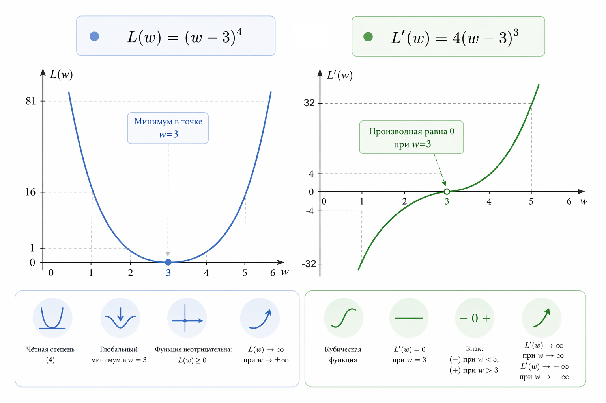

# Пример 3. Плато и почти нулевой градиент

#### Цель

Понять, что происходит с градиентным спуском в ситуации, когда градиент формально существует, но его значение становится очень маленьким.

Этот пример показывает важную и часто неочевидную вещь: модель может продолжать обучаться, но при этом выглядеть так, будто она "застряла", особенно при ограниченной точности вычислений.

#### Сценарий

В предыдущих примерах мы работали с линейной регрессией, где поверхность ошибки имеет простую форму. Здесь мы сознательно уходим от реальных данных и используем искусственную функцию ошибки, чтобы изолировать эффект.

Возьмем функцию:

$$
L(w) = (w - 3)^4
$$

Минимум находится в точке:

$$
w = 3
$$

Производная:

$$
\frac{dL}{dw} = 4 (w - 3)^3
$$

Главное отличие от предыдущих примеров – форма функции. Вблизи минимума она становится очень "плоской". Это пример области с почти нулевым градиентом (иногда её неформально называют плато).

<div align="left"><figure><figcaption><p>Рис. 2.3-5. Функция L(w) = (w - 3)⁴ и её производная</p></figcaption></figure></div>

#### Реализация на PHP

```php
$w = 0.0;
$lr = 0.05;

echo "epoch\tw\t\tgradient\tloss\n";

for ($epoch = 1; $epoch <= 25; $epoch++) {

    $loss = ($w - 3) ** 4;
    $gradient = 4 * ($w - 3) ** 3;

    echo $epoch . "\t" .
         round($w, 5) . "\t" .
         round($gradient, 5) . "\t\t" .
         round($loss, 5) . "\n";

    $w -= $lr * $gradient;
}

// Результат:
// epoch	 w		           gradient	          loss
// 1       0               -108               81             
// 2       5.4             55.296             33.1776    
// ...
// 21      2.74114         -0.06938           0.00449        
// 22      2.74461         -0.06663           0.00425        
// 23      2.74794         -0.06406           0.00404        
// 24      2.75114         -0.06165           0.00384        
// 25      2.75423         -0.05938           0.00365    
```

#### Что происходит во время обучения

Если посмотреть на вывод программы, можно заметить три характерных этапа.

Сначала, когда параметр далеко от оптимума, градиент имеет достаточно большое значение. Шаги получаются заметными, и параметр быстро движется в сторону минимума. Затем, по мере приближения к $$w = 3$$, градиент быстро стремится к нулю.

Причина в том, что он пропорционален кубу расстояния до оптимума:

$$
(w - 3)^3
$$

Кроме того, вторая производная также стремится к нулю, поэтому поверхность становится всё более пологой. Это дополнительно замедляет движение параметра.

В какой-то момент происходит ключевой эффект: параметр продолжает изменяться, но изменения становятся настолько малы, что визуально кажется, будто обучение остановилось.

#### Что такое плато

Плато – это участок функции ошибки, где поверхность почти горизонтальна на некотором интервале параметров.

В таких областях:

* градиент близок к нулю
* шаги градиентного спуска становятся очень маленькими
* обучение резко замедляется

Важно подчеркнуть: это не ошибка алгоритма.

Это свойство самой функции.

#### Интуитивное объяснение

Представьте, что вы спускаетесь с холма. Сначала склон крутой, и вы уверенно идете вниз. Затем поверхность становится почти ровной.&#x20;

Вы все еще идете в правильном направлении, но шаги становятся маленькими и почти незаметными.

Со стороны может показаться, что вы стоите на месте, хотя движение продолжается.

#### Почему это важно на практике

Эффект плато – одна из причин, почему обучение моделей может быть медленным и трудным для интерпретации.

Даже если:

* формула корректна
* градиент считается правильно
* learning rate выбран разумно

модель все равно может "тормозить" из-за геометрии функции ошибки.

В более сложных моделях (например, нейросетях) такие участки встречаются регулярно.

#### Связь с дальнейшими методами

Этот пример подводит к важной идее: обычного градиентного спуска иногда недостаточно.

Чтобы эффективно проходить плато, используются более продвинутые методы:

* [momentum](../../../vvedenie/glossarii.md#momentum-i-adaptivnye-algoritmy)
* адаптивные алгоритмы (например, [Adam](../../../vvedenie/glossarii.md#momentum-i-adaptivnye-algoritmy))

Они помогают ускорять движение параметров на плоских участках и частично компенсировать эффект малого градиента.

Но важно сначала понять базовую проблему – и именно это делает данный пример.

#### Выводы

Этот разбор показывает еще одно ограничение градиентного спуска.

Во-первых, маленький градиент не означает, что минимум достигнут. Он может означать, что модель находится на плоском участке функции.

Во-вторых, скорость обучения зависит не только от learning rate, но и от формы самой функции ошибки.&#x20;

И наконец, становится понятно, почему в реальных задачах используют более сложные оптимизаторы.

Они не заменяют градиентный спуск, а помогают ему работать там, где он сам по себе замедляется.


Чтобы самостоятельно протестировать этот код, воспользуйтесь [онлайн-демонстрацией](https://aiwithphp.org/books/ai-for-php-developers/examples/part-2/gradient-descent-on-fingers) для его запуска.

