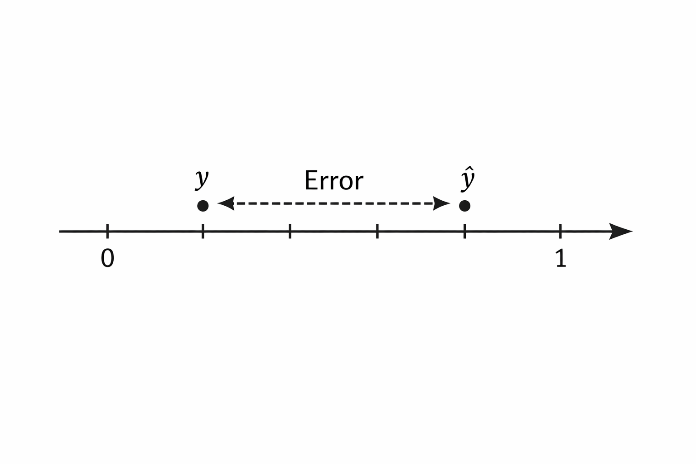
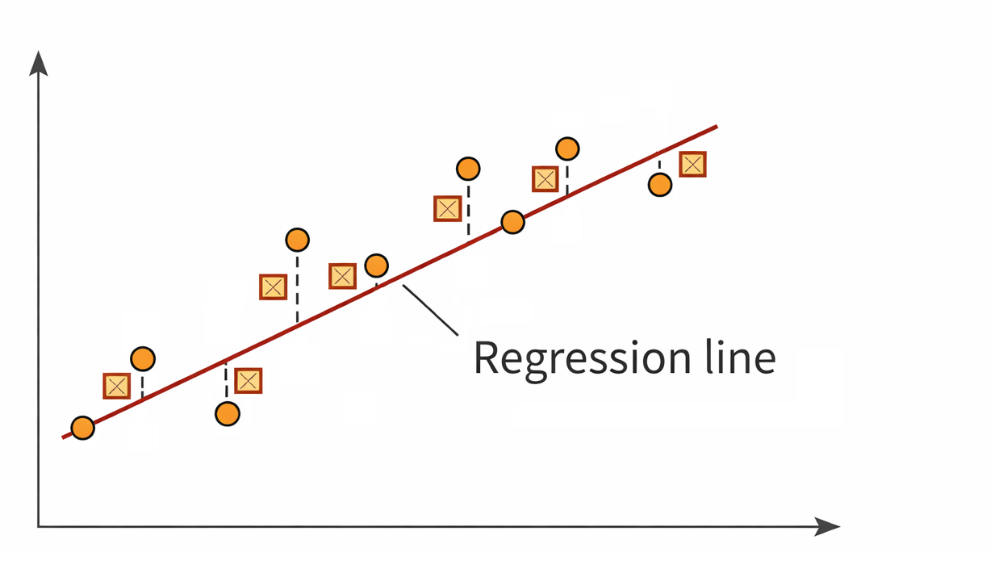
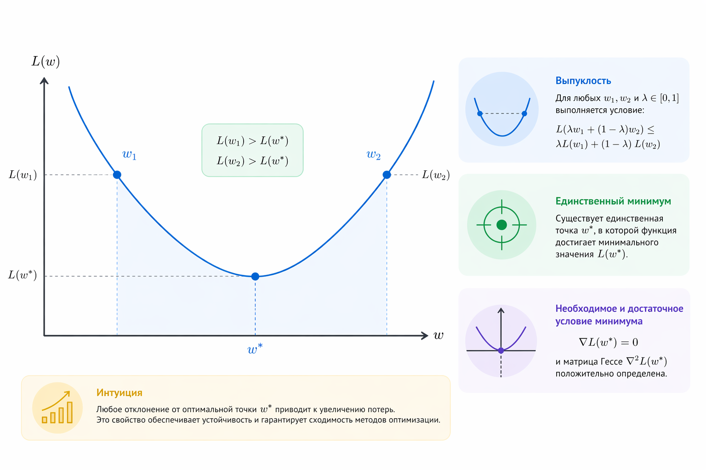
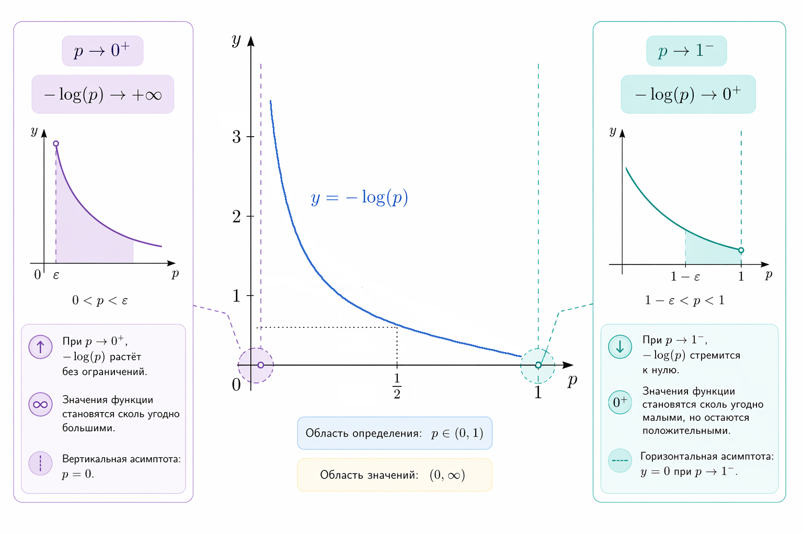
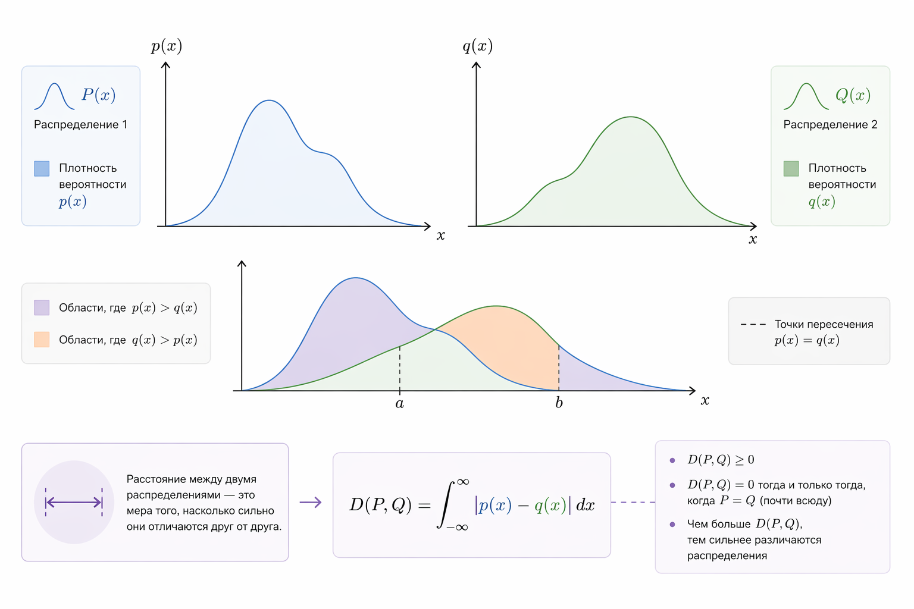

# Ошибка, loss-функции и зачем они нужны

Любая модель машинного обучения сводится к простой идее: она пытается описать реальность с помощью некой функции. Это значит, что между тем, что есть на самом деле и тем, что говорит модель - всегда будет расхождение. Это расхождение мы и называем ошибкой.

Важно понять одну существенную вещь: модель не знает, что такое "хорошо" и "плохо". Она не понимает смысл задачи. Всё, что она умеет – уменьшать число, которое мы ей дали. Это число и есть [loss](../../vvedenie/zaklyuchitelnye-materialy/glossarii.md#loss-funkciya-funkciya-poter).&#x20;

Формально ошибка (error) – это отклонение между реальным значением $$y$$ и предсказанием модели $$\hat{y}$$, а loss – функция, которая превращает это отклонение в число, удобное для оптимизации, то есть число, которое модель старается минимизировать в процессе обучения.

Представим простой пример. Пусть модель должна предсказать цену квартиры.

```
Реальная цена: y = 200 000
Предсказание модели: ŷ = 180 000
```

Модель ошиблась. Вопрос только в том, как именно измерить эту ошибку.

### Ошибка как расстояние

Пусть у нас есть реальное значение y и предсказание модели $$\hat{y}$$. Самое естественное, что приходит в голову – посмотреть на разницу:

$$
error = y - \hat{y}
$$

Но само по себе это значение неудобно использовать для обучения модели. Она может быть отрицательной и положительной. Если у нас много объектов, положительные и отрицательные ошибки могут компенсировать друг друга.

Например:

```
+10
-10
```

Средняя ошибка будет равна нулю, хотя модель явно ошибается.

Поэтому вводят loss-функцию – функцию, которая преобразует ошибку в неотрицательное число, удобное для оптимизации. Именно это число модель пытается минимизировать во время обучения.

Геометрически это выглядит так: мы смотрим, насколько далеко предсказание отстоит от реального значения на числовой прямой.

<div align="left"><figure><figcaption><p>10.1 Расстояние между y и ŷ на числовой оси</p></figcaption></figure></div>

По сути, мы хотим превратить отклонение в число, которое ведёт себя как расстояние. Давайте поясним почему. В задачах регрессии ошибку удобно интерпретировать как расстояние между реальным значением и предсказанием, то есть всегда неотрицательное и увеличивается при росте ошибки.

Однако не каждая loss-функция является расстоянием в строгом математическом смысле:

* В MSE – да, это квадрат евклидова расстояния между предсказанием и реальным значением
* В log loss (logarithmic loss) – это уже не метрическое расстояние, а дивергенция

А значит, мы сразу приходим к идее: ошибка должна быть неотрицательной.

### Квадрат ошибки как наказание за промах

Самый простой способ избавиться от знака – взять модуль ошибки.

$$
L = |y - ŷ|
$$

Но модуль не дифференцируем в точке 0, что усложняет оптимизацию. Поэтому в ML чаще используют квадрат ошибки:

$$
L = (y - \hat{y})^2
$$

Почему?

Во-первых, возведение в квадрат делает функцию гладкой и везде дифференцируемой, что критически важно для применения градиентной оптимизации и обеспечивает удобство при обучении модели.

Во-вторых, квадрат сильно усиливает большие ошибки.

Если ошибка выросла в 2 раза, штраф вырастает в 4 раза:

$$
(2e)^2 = 4e^2
$$

Например:

```
Ошибка   →    Квадрат ошибки
-----------------------------
 1                   1
 2                   4  
 5                  25
10                 100
```

Из-за этого свойства MSE особенно чувствительна к большим ошибкам и выбросам.

Это важное свойство: мы заранее говорим модели, что редкие, но большие промахи хуже, чем много маленьких.

#### Mean Squared Error (MSE)

Если у нас много объектов, мы берём квадрат ошибки для каждого из них и затем усредняем:

$$
\text{MSE} = \frac{1}{n} \sum_{i=1}^{n} (y_i - \hat{y}_i)^2
$$

С точки зрения геометрии, [MSE](../../vvedenie/zaklyuchitelnye-materialy/glossarii.md#mse-mean-squared-error) – это средний квадрат расстояния между реальными значениями и предсказаниями (то есть квадрат вертикальных отклонений точек от модели).

Если представить данные как точки на плоскости, а модель как линию или поверхность, MSE измеряет, насколько далеко точки находятся от этой поверхности.

<div align="left"><figure><figcaption><p>10.2 Точки данных и линия регрессии, вертикальные отрезки – ошибки</p></figcaption></figure></div>

#### Немного полезной математики

Почему MSE так часто используют? Потому что минимум MSE ведёт себя очень предсказуемо.

Если модель линейная:

$$
\hat{y} = wx + b
$$

то MSE как функция параметров w и b является выпуклой функцией (по параметрам модели).&#x20;

Это означает:

* у неё один глобальный минимум
* антиградиент (обратное направление градиента) указывает путь к уменьшению функции ошибки
* обучение стабильно

<div align="left"><figure><figcaption><p>10.3 График выпуклой функции потерь с единственным минимумом</p></figcaption></figure></div>

Это одна из причин, почему линейная регрессия – базовый и надёжный инструмент.

#### Связь MSE и нормального распределения

Есть ещё один важный, но часто неявный факт. Минимизация MSE эквивалентна максимизации правдоподобия в том случае, если мы предполагаем, что ошибки распределены нормально:

$$
\varepsilon = (y - \hat{y}) \sim \mathcal{N}(0, \sigma^2)
$$

В этом случае минимизация MSE эквивалентна максимизации правдоподобия.

Иначе говоря, MSE – это не просто удобная формула. Используя её, мы молчаливо предполагаем, что шум $$\varepsilon$$ подчиняется [нормальному распределению](../../vvedenie/zaklyuchitelnye-materialy/glossarii.md#gaussovo-raspredelenie) – тому самому "колоколу Гаусса".

#### Почему MSE не подходит для классификации

До сих пор мы говорили о задачах регрессии, где модель предсказывает числовое значение. Но существует другой тип задач – классификация, где модель должна выбрать один из возможных вариантов ответа.

Представим задачу типа классификации с двумя вариантами ответа: "да" и "нет". Например, спам или не спам.

Реальное значение:

$$
y \in \{0,1\}
$$

Предсказание модели:

$$
\hat{p} \in [0, 1]
$$

Если использовать MSE, разница между вероятностями 0.99 и 0.51 оказывается не такой значительной, хотя интуитивно это предсказания совершенно разного качества, когда правильный ответ это 1 (то есть - спам).

В общем, MSE слабо различает степень уверенности и не соответствует вероятностной природе задачи.

Нам важно не просто угадать, а понять насколько модель уверена в ответе.

### Log loss как цена уверенности

Log loss решает именно эту проблему. Идея этой функции очень простая: она сильно наказывает модель, если она уверенно ошибается.&#x20;

Представим, что правильный ответ равен 1 (спам), т.е. $$y = 1$$.

Если модель говорит:

```
p = 0.9 → ошибка маленькая
p = 0.6 → ошибка больше
p = 0.01 → ошибка огромная
```

То есть чем увереннее модель ошибается, тем сильнее должен быть штраф.

Эту идею математически выражает функция log loss.&#x20;

Для одного объекта:

$$
LogLoss = - \left( y \cdot \log(\hat{p}) + (1 - y) \cdot \log(1 - \hat{p}) \right)
$$

Если $$y = 1$$, остаётся только:

$$
-\log(\hat{p})
$$

Рассмотрим несколько примеров.

```
Вероятность  →    Loss
-----------------------
0.9               0.105
0.6               0.51
0.01              4.6
```

Как видим, быть уверенно неправым обходится очень дорого.

На практике модель делает предсказания сразу для многих объектов. Поэтому общая функция потерь – это среднее значение log loss по всем наблюдениям:

$$
LogLoss = -\frac{1}{n} \sum_{i=1}^{n}
\left(
y_i \log(\hat{p}_i) + (1 - y_i)\log(1 - \hat{p}_i)
\right)
$$

Рассмотрим простой пример для трёх объектов.

```
y         p̂         loss
-------------------------
1        0.9        0.105
0        0.2        0.223
1        0.6        0.511
```

Средний log loss будет равен:

$$
\frac{0.105 + 0.223 + 0.511}{3} \approx 0.28
$$

Именно это значение модель и пытается минимизировать при обучении.

А теперь давайте обратим внимание на график этой функции - он очень показателен.

<div align="left"><figure><figcaption><p>10.4 График -log(p) при p → 0 и p → 1</p></figcaption></figure></div>

* при $$\hat{p} \to 1$$ ошибка стремится к нулю
* при $$\hat{p} \to 0$$ ошибка стремится к бесконечности

Это математическое выражение идеи:

> Быть уверенно неправым – почти преступление.

#### Геометрический смысл log loss

Log loss можно интерпретировать как меру расхождения между реальным распределением и предсказанным распределением вероятностей.

Формально это частный случай кросс-энтропии:

$$
H(p, q) = - \sum p \log(q)
$$

Где:

* $$p$$ – истинное распределение
* $$q$$ – распределение модели

<div align="left"><figure><figcaption><p>10.5: Два распределения вероятностей и расстояние между ними</p></figcaption></figure></div>

Это делает log loss естественным выбором для вероятностных моделей.

#### Сравнение MSE и log loss интуитивно

MSE спрашивает:

> Насколько далеко мы промахнулись по значению?

Log loss спрашивает:

> Насколько мы ошиблись в своей уверенности?

Именно поэтому можно использовать практическое правило выбора в большинстве практических случаев:

* регрессия → MSE
* классификация → log loss

### Итоговая мысль

Loss-функция – это язык, на котором мы разговариваем с моделью. Через неё мы объясняем, что считаем ошибкой, какие ошибки особенно плохи, а какие допустимы.

Модель не знает ничего ни о деньгах, ни о спаме, ни о смысле текста. Она знает только одно: куда двигаться, чтобы уменьшить loss.

В следующей главе мы увидим, как минимизация loss превращается в конкретный алгоритм обучения – через градиенты и обновление параметров.
