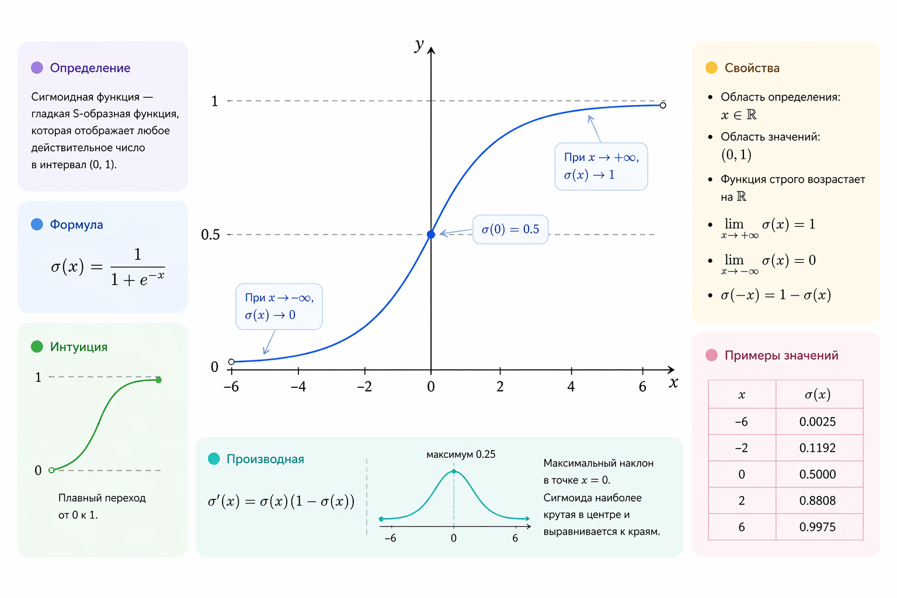
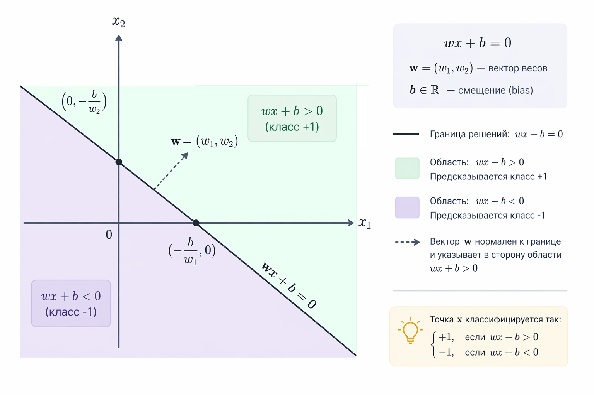
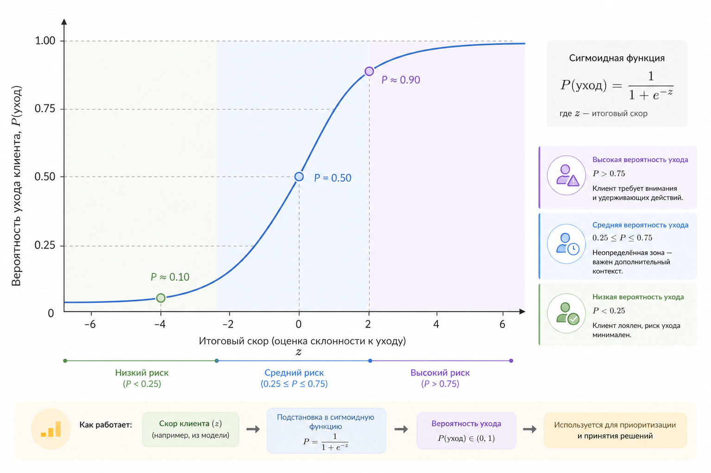

# 14. Логистическая регрессия

Линейная регрессия хорошо справляется с предсказанием чисел, но как только задача становится бинарной – "да или нет", "спам или не спам", "клиент уйдет или останется" – она уже не подходит для таких задач. Это происходит потому, что модель может выдавать значения больше 1 или меньше 0 (то есть значения вне диапазона $$[0, 1]$$), а интерпретация результата становится размытой.

Логистическая регрессия решает именно эту проблему. По духу это все та же линейная модель, но поверх линейной комбинации признаков мы накладываем нелинейное преобразование – [сигмоиду](https://ru.wikipedia.org/wiki/%D0%A1%D0%B8%D0%B3%D0%BC%D0%BE%D0%B8%D0%B4%D0%B0). В результате модель предсказывает не произвольное число, а вероятность принадлежности объекта к классу 1. Это хорошо укладывается в общий подход, который мы используем в нашей книге: сначала простая линейная идея, затем аккуратное расширение под реальную задачу.

### От линейной модели к вероятности

Начнем с привычной формы линейной модели. Пусть у нас есть объект с признаками $$x$$. Тогда

$$
z = w \cdot x + b
$$

Это обычное [аффинное преобразование](../../vvedenie/glossarii.md#affinnoe-preobrazovanie): скалярное произведение вектора признаков и весов плюс смещение. В линейной регрессии $$z$$ и было бы итоговым предсказанием. В логистической регрессии $$z$$ – лишь промежуточная величина, которая интерпретируется как логарифм шансов ([log-odds](../../vvedenie/glossarii.md#log-odds)) и сама по себе не является вероятностью.

Чтобы превратить [логит](../../vvedenie/glossarii.md#logits) в вероятность, используется сигмоидная (логистическая) функция:

$$
\sigma(z) = \frac{1}{1 + e^{-z}}
$$

Она переводит любое вещественное число в диапазон $$(0, 1)$$. Большие положительные значения $$z$$ дают вероятность, близкую к $$1$$, большие отрицательные – близкую к $$0$$.

<div align="left"><figure><figcaption><p>14.1 <mark style="color:$info;">График сигмоидной функции</mark></p></figcaption></figure></div>

Здесь важно уловить одну важную мысль. Логистическая регрессия – это не просто "классификатор с порогом", а вероятностная модель, из которой классификация получается введением порога. Она моделирует вероятность $$P(y = 1 \mid x)$$. Классификация появляется уже потом, как прикладное решение, когда мы вводим порог вероятности.

### Decision boundary – граница решений

Пусть мы решаем задачу бинарной классификации и считаем, что объект относится к классу $$1$$, если вероятность не меньше $$0.5$$. Тогда условие выглядит так:

$$
σ(z) ≥ 0.5
$$

Так как $$\sigma(0) = 0.5$$, это эквивалентно более простому линейному условию:

$$
wx + b ≥ 0
$$

Отсюда следует важный вывод: decision boundary – это множество точек, для которых $$wx + b = 0$$. В двумерном случае это прямая, в трехмерном – плоскость, в общем случае – гиперплоскость.

<div align="left"><figure><figcaption><p>14.2 Граница принятия решений 2D</p></figcaption></figure></div>

Здесь хорошо видно сходство с линейной регрессией и одновременно ключевое отличие. Сама граница линейна, но уверенность модели меняется нелинейно по мере удаления от нее. Рядом с границей модель сомневается, далеко от нее – уверена в своем решении.

### Немного математики: логарифм шансов

Почему именно сигмоида? Ответ связан с логарифмом шансов, или log-odds. Пусть $$p = P(y = 1 \mid x)$$. Тогда отношение шансов равно

$$
\frac{p}{1 - p}
$$

Логистическая регрессия предполагает, что логарифм этого отношения линейно зависит от признаков:

$$
\log\left(\frac{p}{1 - p}\right) = w  x + b
$$

Если выразить p из этого уравнения, мы снова получим сигмоидную функцию. Важно подчеркнуть: логистическая регрессия – это линейная модель в пространстве log-odds. Сигмоида здесь не случайный трюк, а следствие предположения о линейной зависимости логарифма шансов от признаков.

### Функция потерь и обучение

Так как модель предсказывает вероятность, MSE здесь используется редко, так как не связана с вероятностной моделью и приводит к менее удобной оптимизации. Вместо нее используется логистическая функция потерь, чаще всего называемая log loss или binary cross-entropy:

$$
L(y, p) = -\left[ y \log(p) + (1 - y) \log(1 - p) \right]
$$

где $$y∈{0,1}$$, а $$p=P(y=1 \mid x)$$.

Если рассматривать сразу всю выборку из $$n$$ объектов, получаем:

$$
L(\mathbf{w}) = -\frac{1}{n} \sum_{i=1}^n \left[ y_i \log p_i + (1 - y_i)\log(1 - p_i) \right], \quad p_i = \sigma(x_i^T \mathbf{w})
$$

Оптимизация проводится стандартными методами – чаще всего градиентным спуском. По механике это очень похоже на линейную регрессию, но из-за сигмоиды модель становится нелинейной функцией параметров, и градиенты проходят через это преобразование. При этом в стандартной постановке функция потерь остается выпуклой, что гарантирует наличие единственного глобального минимума.

В этом месте возникает важное отличие от линейной регрессии. Там мы могли получить решение в явном виде через нормальные уравнения. В логистической регрессии так не получится. Если выписать градиент функции потерь,

$$
\nabla_{\mathbf{w}} L = \frac{1}{n} X^T (\mathbf{p} - \mathbf{y})
$$

и приравнять его к нулю, мы приходим к уравнению

$$
X^T\big(\sigma(X\mathbf{w}) - \mathbf{y}\big) = 0
$$

которое уже нелинейно по $$\mathbf{w}$$. Решить его "в лоб" и выразить веса через данные не удаётся.

> Иначе говоря, **для логистической регрессии нет аналитического решения через нормальные уравнения**.

Поэтому обучение здесь устроено иначе – мы ищем решение постепенно, шаг за шагом. Задаём начальные веса и дальше итеративно улучшаем их, уменьшая функцию потерь. Самый простой способ — градиентный спуск:

$$
\mathbf{w} := \mathbf{w} - \eta , \nabla_{\mathbf{w}} L
$$

где $$\eta$$ – шаг обучения.

Интуитивно это выглядит так: модель делает предсказание, сравнивает его с правильным ответом, получает ошибку $$\mathbf{p} - \mathbf{y}$$ и немного сдвигает веса в сторону, которая эту ошибку уменьшает. Затем процесс повторяется много раз, пока модель не "сойдётся".

По механике это очень похоже на линейную регрессию, но из-за сигмоиды зависимость от параметров становится нелинейной. При этом функция потерь остаётся выпуклой, так что у неё есть единственный глобальный минимум – и градиентный спуск действительно к нему приходит.

#### Как это выглядит в коде

Если отбросить матричную запись и посмотреть на один объект, обновление весов выглядит очень просто. Мы считаем предсказание, находим ошибку и слегка корректируем веса:

$$
w_j := w_j - \eta (p_i - y_i)x_{ij}
$$

В коде это обычно выглядит примерно так:

```php
$z = dot($weights, $x) + $bias;
$p = sigmoid($z);

$error = $p - $y[$i];

foreach ($weights as $j => $w) {
    $weights[$j] -= $learningRate * $error * $x[$j];
}

$bias -= $learningRate * $error;
```

Здесь хорошо видно, как формула напрямую превращается в несколько строк кода:

* считаем логит (z)
* пропускаем через сигмоиду → получаем вероятность (p)
* считаем ошибку (p - y)
* обновляем веса

По сути, это и есть градиентный спуск в самом "сыром" виде – шаг за шагом подгоняем модель под данные – мы будем использовать этот приём в ближайшем практическом кейсе. На практике для ускорения и стабильности часто используют обновления не по одному объекту, а по небольшим батчам (mini-batch), что позволяет лучше использовать векторные операции и быстрее сходиться.

### Кейс: бинарная классификация клиентов

Рассмотрим простой и при этом реалистичный кейс. Есть сервис подписки. Для каждого пользователя известны:

* количество входов за последний месяц
* средняя длительность сессии
* число дней с момента регистрации

Цель – предсказать, уйдет ли пользователь в ближайший месяц ($$1$$ – уйдёт, $$0$$ – останется).

Логистическая регрессия здесь подходит особенно хорошо. Модель возвращает вероятность ухода. Это важно не только с технической, но и с продуктовой точки зрения: мы можем ранжировать пользователей по риску и работать лишь с теми, у кого вероятность выше выбранного порога.

<div align="left"><figure><figcaption><p>14.3 <mark style="color:$info;">Сигмоидная кривая вероятности ухода клиента</mark></p></figcaption></figure></div>

Важно подчеркнуть, что выбор порога $$(0.5, 0.7, 0.9)$$ – это уже бизнес-решение. Модель лишь предоставляет вероятность, а не жесткий ответ.

### Ограничения логистической регрессии

Несмотря на нелинейность сигмоиды в вероятностном пространстве, логистическая регрессия остается линейным классификатором по форме границы решений. Если классы не линейно разделимы, логистическая регрессия не сможет идеально разделить их одной гиперплоскостью и будет давать лишь наилучшее линейное приближение. В таких случаях помогают либо новые признаки, либо более сложные модели – деревья решений, SVM с ядрами или нейросети.

Тем не менее логистическая регрессия до сих пор остается одной из самых популярных моделей в прикладном машинном обучении. Она проста, интерпретируема, устойчива и часто оказывается отличной отправной точкой.

### Вывод

Логистическая регрессия – это логичное продолжение линейных моделей в задачах классификации. Она сохраняет простоту линейного подхода, но добавляет вероятностную интерпретацию, четкую decision boundary и удобную связь с реальными бизнес-задачами. Именно поэтому с нее почти всегда начинают изучение бинарной классификации в машинном обучении.
