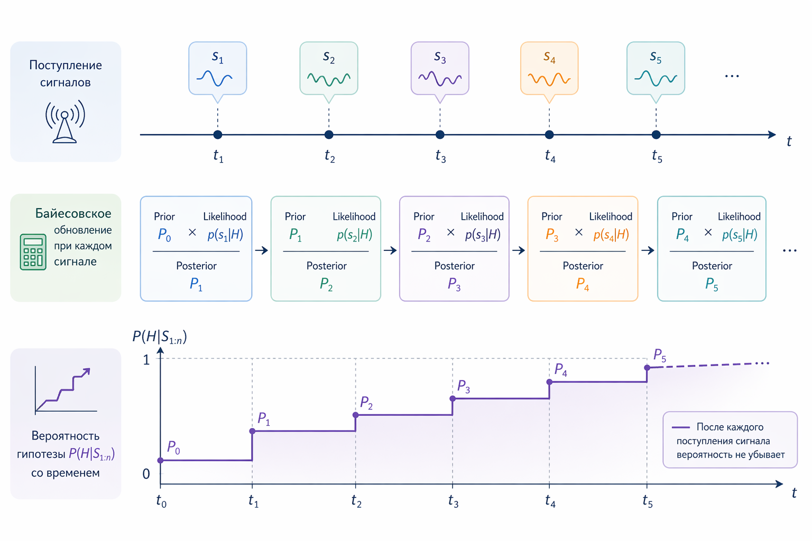

# Кейс 5. Обновление уверенности при новых данных

#### Цель кейса

Этот кейс показывает важную идею: вероятность – это не фиксированное число, а изменяемая оценка, которая обновляется при поступлении новой информации.

В машинном обучении и продуктовой аналитике это происходит постоянно:

* пользователь совершает действия
* приходят новые события
* модель получает дополнительные сигналы

И каждый такой сигнал меняет нашу уверенность в гипотезе.

Ключевая идея: вероятность – это оценка, которая обновляется по мере поступления данных ("живое знание", которое эволюционирует со временем).

#### Сценарий

Представим продукт с подпиской. Нас интересует вероятность того, что пользователь уйдет, то есть перестанет пользоваться сервисом (customer churn).

На основе исторических данных у нас уже есть базовая оценка:

* вероятность оттока пользователя: 30%

Это наша априорная вероятность – начальная уверенность.

Далее происходит событие:

* пользователь не заходил в систему несколько дней
* перестал открывать письма
* не использует ключевые функции

Это новый сигнал, который говорит: риск оттока вырос.

#### Упрощенная модель обновления

Для иллюстрации используем простую модель: каждый сигнал добавляет вклад в вероятность.

```php
$prior = 0.3;            // базовая вероятность оттока
$signalStrength = 0.25;  // влияние нового сигнала

$posterior = min(1.0, $prior + $signalStrength);

echo "Prior: $prior\n";
echo "Posterior: $probability";

// Результат:
// Prior: 0.55
// Posterior: 0.65
```

Результат:

```
0.55
```

Теперь вероятность оттока – 55%. Здесь 0.25 – это не реальные "процентные пункты", а условная сила сигнала в модели.

#### Интерпретация

Что произошло:

* было: 30%
* пришел новый негативный сигнал
* стало: 55%

Мы не игнорируем прошлую оценку, а обновляем её с учетом новых данных.

Важно: модель не утверждает, что пользователь точно уйдет.

Она говорит: _с учетом новых данных вероятность выросла_.

#### Почему это важно

В реальных системах решения принимаются не один раз, а постоянно:

* показывать ли пользователю акцию
* отправлять ли уведомление
* подключать ли менеджера
* менять ли интерфейс

Если вероятность не обновляется, система становится "слепой" к новым данным.

#### Более реалистичная картина

В реальности:

* сигналов много
* они приходят последовательно
* каждый сигнал влияет по-разному

Например (предполагая, что сигналы независимы и их влияние складывается линейно – это упрощение):

```php
$prior = 0.3;

echo "Prior: $prior\n";

$signals = [
    0.1,  // не зашел сегодня
    0.05, // не открыл письмо
    0.2,  // отменил подписку на уведомления
];

$probability = $prior;

foreach ($signals as $signal) {
    $probability = min(1.0, $probability + $signal);
}

echo "Posterior: $probability";

// Результат:
// Prior: 0.3
// Posterior: 0.65
```

Так формируется динамическая оценка риска.

#### Связь с байесовским мышлением

Этот пример иллюстрирует идею обновления уверенности, но не является строгим байесовским обновлением.

В более строгой форме:

* есть априорная вероятность
* приходит новое наблюдение
* мы пересчитываем вероятность с учетом этого наблюдения

Здесь используется простая линейная модель накопления сигналов, а не формула Байеса. Но интуиция та же:&#x20;

> каждый новый факт меняет нашу уверенность.

#### Где это используется

Такая логика применяется почти везде:

* churn prediction (отток пользователей)
* fraud detection (мошенничество)
* рекомендации (интерес пользователя)
* системы уведомлений
* оценка риска в финтехе

Везде, где данные приходят постепенно, вероятность должна обновляться.

#### Типичная ошибка

Распространенная ошибка – воспринимать вероятность как "раз и навсегда посчитанную": модель дала 0.3 → значит всегда 0.3

Это неверно.

Если система не учитывает новые события:

* она игнорирует контекст
* перестает адаптироваться
* начинает принимать устаревшие решения

#### Ограничение упрощенной модели

Важно понимать: формула

```php
$posterior = $prior + $signalStrength;
```

предполагает линейное и независимое влияние сигналов – это упрощение для иллюстрации.

В реальных системах:

* сигналы могут взаимодействовать
* влияние может быть нелинейным
* используется логистическая регрессия, бустинг или нейросети

Но даже в сложных моделях сохраняется та же идея, хотя само обновление происходит не через сложение вероятностей, а через более сложные преобразования:&#x20;

> вероятность обновляется при поступлении новых данных.

#### Визуальная интуиция

<div align="left"><figure><figcaption><p>Рис. 3.1-5. Рост вероятности со временем при поступлении сигналов</p></figcaption></figure></div>

#### Выводы

1. Вероятность – это динамическая оценка, а не фиксированное число
2. Новые данные должны изменять уверенность модели
3. Даже простые сигналы могут существенно влиять на итоговую вероятность
4. Обновление вероятности – основа адаптивных систем

Этот кейс завершает важную мысль всей главы:

> вероятность – это не ответ, а процесс постоянного уточнения знания о мире.


Чтобы самостоятельно протестировать этот код, воспользуйтесь [онлайн-демонстрацией](https://aiwithphp.org/books/ai-for-php-developers/examples/part-3/probability-as-degree-of-confidence) для его запуска.

