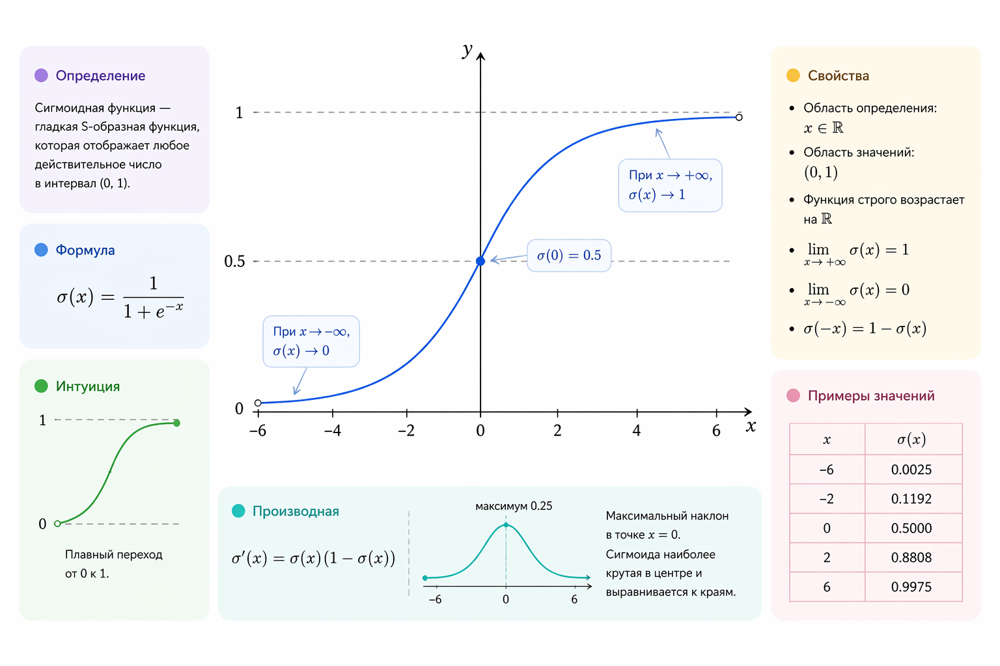
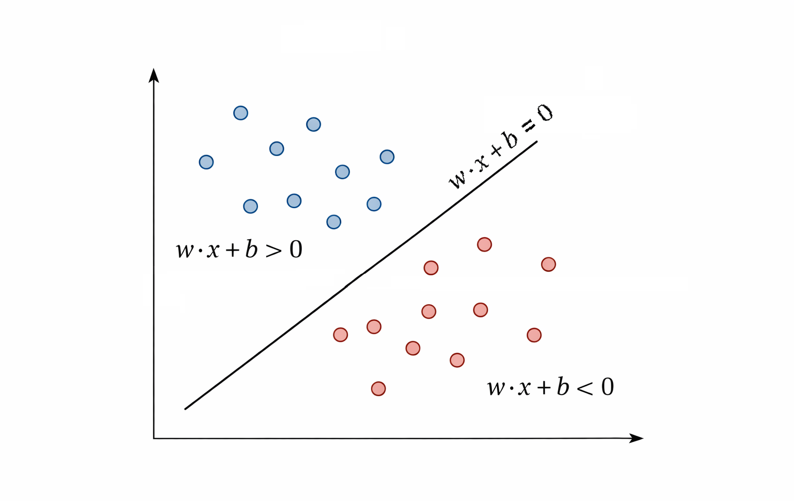

# Логистическая регрессия

Линейная регрессия хорошо справляется с предсказанием чисел, но как только задача становится бинарной – "да или нет", "спам или не спам", "клиент уйдет или останется" – она начинает работать против нас. Это происходит потому, что модель может выдавать значения больше 1 или меньше 0, а интерпретация результата становится размытой.

Логистическая регрессия решает именно эту проблему. По духу это все та же линейная модель, но поверх линейной комбинации признаков мы накладываем нелинейное преобразование – сигмоиду. В результате модель предсказывает не произвольное число, а вероятность принадлежности объекта к классу 1. Это хорошо укладывается в общий подход книги: сначала простая линейная идея, затем аккуратное расширение под реальную задачу.

### От линейной модели к вероятности

Начнем с привычной формы линейной модели. Пусть у нас есть объект с признаками $$x$$. Тогда

$$
z = w·x + b
$$

Это обычное аффинное преобразование: скалярное произведение вектора признаков и весов плюс смещение. В линейной регрессии $$z$$ и было бы итоговым предсказанием. В логистической регрессии $$z$$ – лишь промежуточная величина, соответствующая логиту (log-odds), который сам по себе еще не является вероятностью.

Чтобы превратить логит в вероятность, используется сигмоидная (логистическая) функция:

$$
\sigma(z) = \frac{1}{1 + e^{-z}}
$$

Она переводит любое вещественное число в диапазон $$(0, 1)$$. Большие положительные значения $$z$$ дают вероятность, близкую к $$1$$, большие отрицательные – близкую к $$0$$.

<figure><figcaption>
14.1 <mark style="color:$info;">График сигмоидной функции</mark>
</figcaption></figure>

Здесь важно уловить смысл. Логистическая регрессия не просто "классификатор с порогом". Она моделирует вероятность $$P(y = 1 \mid x)$$. Классификация появляется уже потом, как прикладное решение, когда мы вводим порог вероятности.

### Decision boundary – граница решений

Пусть мы решаем задачу бинарной классификации и считаем, что объект относится к классу $$1$$, если вероятность не меньше $$0.5$$. Тогда условие выглядит так:

$$
σ(z) ≥ 0.5
$$

Так как $$\sigma(0) = 0.5$$, это эквивалентно более простому линейному условию:

$$
w·x + b ≥ 0
$$

Отсюда следует важный вывод: decision boundary – это множество точек, для которых $$w·x + b = 0$$. В двумерном случае это прямая, в трехмерном – плоскость, в общем случае – гиперплоскость.

<figure><figcaption>
14.2 Граница принятия решений 2D
</figcaption></figure>

Здесь хорошо видно сходство с линейной регрессией и одновременно ключевое отличие. Сама граница линейна, но уверенность модели меняется нелинейно по мере удаления от нее. Рядом с границей модель сомневается, далеко от нее – уверена в своем решении.

### Немного математики: логарифм шансов

Почему именно сигмоида? Ответ связан с логарифмом шансов, или log-odds. Пусть $$p = P(y = 1 \mid x)$$. Тогда отношение шансов равно

$$
\frac{p}{1 - p}
$$

Логистическая регрессия предполагает, что логарифм этого отношения линейно зависит от признаков:

$$
\log\left(\frac{p}{1 - p}\right) = w \cdot x + b
$$

Если выразить p из этого уравнения, мы снова получим сигмоидную функцию. Важно подчеркнуть: логистическая регрессия – это линейная модель в пространстве log-odds. Сигмоида здесь не случайный трюк, а следствие выбранного предположения о данных.

### Функция потерь и обучение

Так как модель предсказывает вероятность, MSE здесь работает плохо, так как она не согласуется с вероятностной интерпретацией предсказаний. Вместо нее используется логистическая функция потерь, чаще всего называемая log loss или binary cross-entropy:

$$
L(y, p) = -\left[ y \cdot \log(p) + (1 - y) \cdot \log(1 - p) \right]
$$

где $$y∈{0,1}$$, а $$p=P(y=1 \mid x)$$.

Эта функция особенно сильно штрафует уверенные, но неправильные предсказания. Если модель говорит $$p ≈ 1$$, а реальный класс равен $$0$$, ошибка становится большой. Это именно то поведение, которое ожидается от классификатора.

Оптимизация проводится стандартными методами – чаще всего градиентным спуском. По механике это очень похоже на линейную регрессию, но градиенты проходят через сигмоиду, делая функцию потерь нелинейной по параметрам модели. При этом функция потерь остается выпуклой, что гарантирует наличие единственного глобального минимума.

### Кейс: бинарная классификация клиентов

Рассмотрим простой и при этом реалистичный кейс. Есть сервис подписки. Для каждого пользователя известны:

* количество входов за последний месяц
* средняя длительность сессии
* число дней с момента регистрации

Цель – предсказать, уйдет ли пользователь в ближайший месяц ($$1$$ – уйдёт, $$0$$ – останется).

Логистическая регрессия здесь подходит особенно хорошо. Модель возвращает вероятность ухода. Это важно не только с технической, но и с продуктовой точки зрения: мы можем ранжировать пользователей по риску и работать лишь с теми, у кого вероятность выше выбранного порога.

<figure><figcaption>
14.3 <mark style="color:$info;">Сигмоидная кривая вероятности ухода клиента</mark>
</figcaption></figure>

Важно подчеркнуть, что выбор порога $$(0.5, 0.7, 0.9)$$ – это уже бизнес-решение. Модель лишь предоставляет вероятность, а не жесткий ответ.

### Ограничения логистической регрессии

Несмотря на нелинейность сигмоиды в вероятностном пространстве, логистическая регрессия остается линейным классификатором. Если классы не линейно разделимы, логистическая регрессия не сможет идеально разделить их одной гиперплоскостью и будет давать лишь наилучшее линейное приближение. В таких случаях помогают либо новые признаки, либо более сложные модели – деревья решений, SVM с ядрами, нейросети.

Тем не менее логистическая регрессия до сих пор остается одной из самых популярных моделей в прикладном машинном обучении. Она проста, интерпретируема, устойчива и часто оказывается отличной отправной точкой.

### Вывод

Логистическая регрессия – это логичное продолжение линейных моделей в задачах классификации. Она сохраняет простоту линейного подхода, но добавляет вероятностную интерпретацию, четкую decision boundary и удобную связь с реальными бизнес-задачами. Именно поэтому с нее почти всегда начинают изучение бинарной классификации в машинном обучении.
