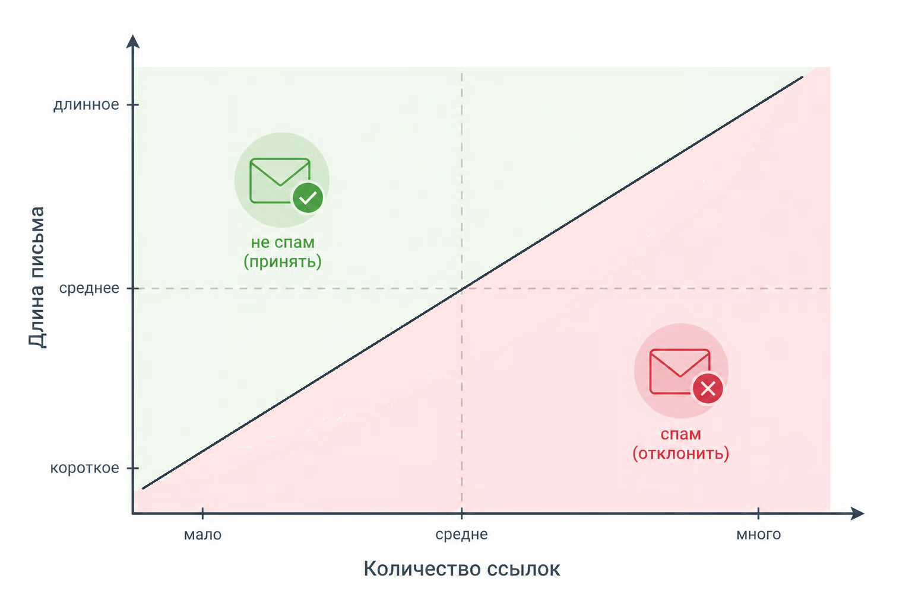

# Кейс 3. Спам или не спам

Фильтрация спама – одна из классических задач машинного обучения. Почтовые сервисы ежедневно принимают миллионы сообщений, и среди них всегда есть нежелательная почта: рекламные рассылки, мошеннические письма, автоматические уведомления сомнительного происхождения и т.п.

На практике такие системы используют десятки и даже сотни признаков. Но чтобы понять механику логистической регрессии, достаточно начать с двух.

#### Цель кейса

Построить простую модель, которая определяет, является ли письмо спамом, используя два базовых признака:

* количество ссылок в письме
* длину письма

Это позволит увидеть, как логистическая регрессия работает уже не на одной оси, а в двумерном пространстве признаков.

#### Сценарий

Представим, что мы анализируем входящие письма и замечаем простую закономерность:

* короткие письма без ссылок чаще всего обычные
* длинные письма с большим количеством ссылок часто оказываются спамом

Это, конечно, сильное упрощение. Но для демонстрации модели его достаточно.

Каждое письмо описывается двумя числами:

```
x = [links, length]
```

где

* links – количество ссылок в письме
* length – длина письма (например, количество слов или символов – важно выбрать один способ измерения)

Целевая переменная:

* "spam" – спам
* "not\_spam" – обычное письмо

#### Данные

Подготовим небольшой учебный датасет.

```php
use Rubix\ML\Classifiers\LogisticRegression;
use Rubix\ML\Datasets\Labeled;
use Rubix\ML\Datasets\Unlabeled;

// links, length
$samples = [
    [0, 50],
    [1, 120],
    [5, 300],
    [7, 500],
    [0, 40],
];

$labels = ['not_spam', 'not_spam', 'spam', 'spam', 'not_spam'];

$dataset = new Labeled($samples, $labels);

$model = new LogisticRegression();
$model->train($dataset);

$prediction = new Unlabeled([[3, 200]]);
$labels = $model->predict($prediction);

echo "Предсказанная метка: ";
print_r($labels);

// Show probabilities
$probas = $model->proba($prediction);
echo "\nВероятности (по классам): ";
print_r($probas[0]);

// Результат:
// Предсказанная метка: Array (
//     [0] => spam
// )
// Вероятности (по классам): Array (
//     [not_spam] => 0.16068560912089
//     [spam] => 0.83931439087911
//  )
```

Мы обучаем модель на нескольких примерах и затем проверяем, как она классифицирует новое письмо. \
\
Небольшое замечание: такой маленький датасет используется только для демонстрации. В реальных задачах на столь малом количестве примеров модель не будет устойчивой.

В примере \[3, 200]:

* 3 ссылки
* длина письма 200

Модель должна оценить вероятность того, что такое письмо является спамом.

#### Что происходит внутри модели

Логистическая регрессия вычисляет линейную комбинацию признаков:

$$
z = w_1  links + w_2 length + b
$$

Затем применяется сигмоида:

$$
p = \frac{1}{1 + e^{-z}}
$$

Результат $$p$$ интерпретируется как вероятность спама (строго говоря, это оценка вероятности при условии выбранной модели).

Если вероятность превышает выбранный порог (обычно 0.5), письмо классифицируется как спам.

#### Граница принятия решения (decision boundary)

Здесь появляется важное отличие от предыдущего кейса.

Теперь признаков два, а значит пространство признаков становится двумерным. Каждое письмо – это точка на плоскости:

* ось X – количество ссылок
* ось Y – длина письма

Decision boundary определяется условием:

$$
w_1 x_1 + w_2 x_2 + b = 0
$$

Геометрически это прямая линия, которая делит пространство признаков на две области:

* область обычных писем
* область спама

<div align="left"><figure><figcaption><p>14.6 Граница принятия решения по спаму</p></figcaption></figure></div>

#### Интерпретация

Интересно, что логистическая регрессия не строит сложные кривые границы.

В базовом виде она пытается разделить пространство линейно.

Это означает:

* модель ищет такую прямую, которая максимально хорошо разделяет два класса
* чем дальше точка от этой линии, тем выше уверенность модели

Если письмо находится далеко в "зоне спама", вероятность будет близка к 1.

Если далеко в "зоне обычных писем" – вероятность будет близка к 0.

Рядом с границей решения модель менее уверена.

#### Практический смысл

Даже такой простой набор признаков может быть полезен:

* большое число ссылок часто встречается в рекламных письмах
* необычно длинные сообщения могут сигнализировать о массовой рассылке

В реальных антиспам-системах к этому добавляются десятки других признаков:

* наличие подозрительных слов
* частота восклицательных знаков
* репутация домена
* структура HTML-письма

Но математическая модель при этом может оставаться той же.

#### Выводы

Этот кейс показывает следующий шаг в сложности:

* признаки становятся многомерными
* пространство данных превращается в плоскость
* decision boundary становится линией

При этом логика модели не меняется:

```
линейная комбинация признаков → сигмоида → вероятность → порог решения.
```

Дальше, при увеличении числа признаков, decision boundary превращается уже не в линию, а в гиперплоскость в многомерном пространстве. Но принцип работы остается тем же.


Чтобы самостоятельно протестировать этот код, установите примеры из официального репозитория [GitHub](https://github.com/apphp/ai-for-php-developers-examples) или воспользуйтесь [онлайн-демонстрацией](https://aiwithphp.org/books/ai-for-php-developers/examples/part-3/logistic-regression) для его запуска.

