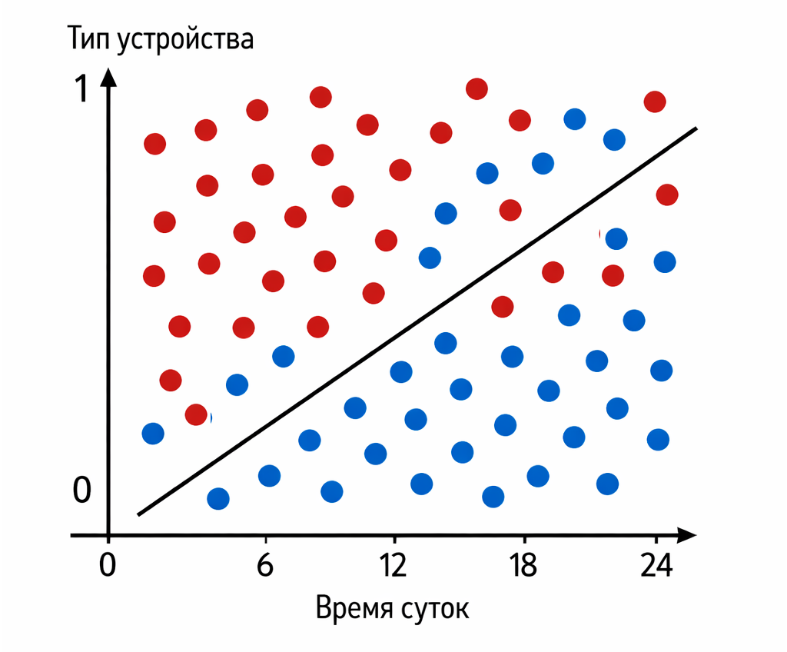

# Кейс 4. Клик по рекламе (CTR)

Задача предсказания клика по рекламе – одна из самых массовых и практических в машинном обучении. Каждый показ баннера – это маленькое решение: кликнет пользователь или нет.

Именно здесь логистическая регрессия долгое время была стандартом де-факто. Простая, быстрая, хорошо масштабируется и сразу дает вероятность.

#### Цель кейса

Предсказать вероятность того, что пользователь кликнет по рекламному объявлению, используя простые поведенческие признаки.

Важно не просто получить "клик / не клик", а именно вероятность клика – CTR (Click-Through Rate).

#### Сценарий

Предположим, у нас есть рекламная система, которая показывает объявления пользователям в разное время и на разных устройствах.

Мы замечаем, что поведение пользователей зависит от контекста:&#x20;

* днем пользователи активнее взаимодействуют с контентом
* на мобильных устройствах кликают чаще, чем на десктопе

Упростим задачу до двух признаков:

* время суток (например, часы от 0 до 23)
* тип устройства (0 – desktop, 1 – mobile)

Каждый показ рекламы описывается так:

$$
x = [hour, device]
$$

Целевая переменная:

* "click" – пользователь кликнул
* "no\_click" – пользователь не кликну

#### Данные

Минимальный учебный пример:

```php
use Rubix\ML\Classifiers\LogisticRegression;
use Rubix\ML\Datasets\Labeled;
use Rubix\ML\Datasets\Unlabeled;

// Features: [time_on_page, clicked_before]
$samples = [
    [9, 0],
    [12, 1],
    [18, 1],
    [22, 0],
    [14, 1],
];

$labels = ['no_click', 'click', 'click', 'no_click', 'click'];

$dataset = new Labeled($samples, $labels);

$model = new LogisticRegression();
$model->train($dataset);

$sampleToPredict = new Unlabeled([[20, 1]]);
$prediction = $model->predict($sampleToPredict);

echo 'Предсказанная метка: ';
print_r($prediction);

$probas = $model->proba($sampleToPredict);
$ctr = $probas[0]['click'] ?? null;

echo "\nВероятность клика (CTR): ";
print_r($ctr);
echo "\nВероятности (по классам): ";
print_r($probas[0]);

// Результат:
// Предсказанная метка: 
// Array (
//    [0] => click
// )
// Вероятность клика (CTR): 0.68015274582898
// Вероятности (по классам): 
// Array (
//    [no_click] => 0.31984725417102
//    [click] => 0.68015274582898
// )
```

В примере мы проверяем ситуацию, когда время - 20:00, а устройство - mobile.

Модель должна оценить вероятность клика в таком контексте.

#### Что делает модель

Как и раньше, логистическая регрессия считает:

$$
z = w_1 \ hour + w_2 \ device + b
$$

Затем применяет сигмоиду:

$$
p = \frac{1}{1 + e^{-z}}
$$

Результат $$p$$ – это вероятность клика.

После получения оценки вероятности, если она выше выбранного порога, система может:

* чаще показывать объявление
* повышать ставку на аукционе
* выбирать более "дорогой" креатив

#### Decision boundary

В этом кейсе у нас снова два признака, значит пространство – двумерное:&#x20;

* ось X – время суток
* ось Y – тип устройства

Decision boundary задается уравнением:

$$
w_1 x_1 + w_2 x_2 + b = 0
$$

Это прямая, которая разделяет пространство на:

* область с высокой вероятностью клика
* область с низкой вероятностью

Но здесь появляется важный нюанс: один из признаков (device) – дискретный.

Это означает, что фактически у нас две "полосы" данных:

* device = 0 (desktop)
* device = 1 (mobile)

И модель учится сдвигать вероятность между ними.

<div align="left"><figure><figcaption><p>14.9 Граница принятия решения для CTR</p></figcaption></figure></div>

#### Интерпретация

Этот кейс хорошо показывает, что логистическая регрессия работает не только с "геометрическими" признаками, но и с категориальными.

Тип устройства закодирован как число (0 или 1), и модель:

* увеличивает или уменьшает вероятность клика в зависимости от устройства
* учитывает влияние времени суток

При этом модель остается линейной, но за счет комбинации признаков может описывать довольно сложные зависимости.

#### Почему логистическая регрессия – стандарт для CTR

В индустрии рекламы логистическая регрессия долгое время была основным инструментом. Причины простые:&#x20;

* работает очень быстро
* легко масштабируется на миллионы показов
* выдает вероятность, которая напрямую используется в расчетах
* хорошо интерпретируется

CTR – это по сути и есть вероятность клика. Логистическая регрессия идеально совпадает с этой задачей.

#### Практический смысл

В реальной системе на основе таких предсказаний можно:

* ранжировать объявления по вероятности клика
* оптимизировать рекламные ставки
* персонализировать показ рекламы

Даже простая модель уже позволяет принимать более точные решения на основе оценок вероятности, чем случайный выбор.

#### Выводы

Этот кейс добавляет важный слой понимания:

* логистическая регрессия работает с разными типами признаков
* вероятность напрямую используется как бизнес-метрика (CTR)
* модель применяется в задачах с огромными объемами данных

И самое главное – становится очевидно, почему именно логистическая регрессия так широко используется на практике.

Дальше мы перейдем к кейсам, где важна не только сама вероятность, но и цена ошибки и выбор порога.


Чтобы самостоятельно протестировать этот код, воспользуйтесь [онлайн-демонстрацией](https://aiwithphp.org/books/ai-for-php-developers/examples/part-3/logistic-regression) для его запуска.

