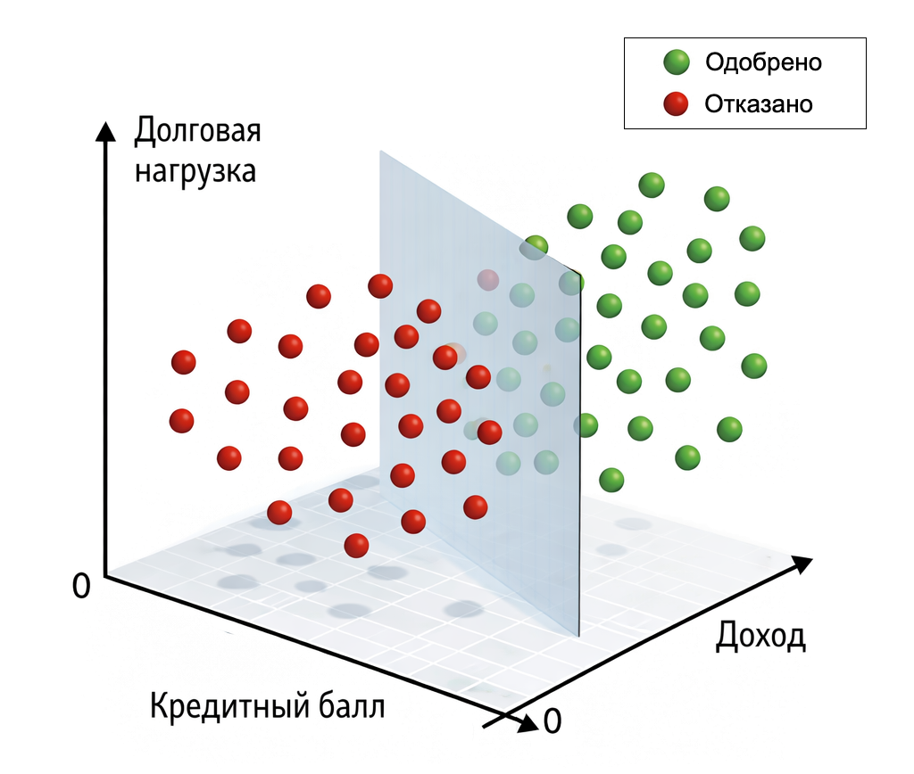

# Кейс 5. Одобрение кредита

В задачах кредитования модель редко отвечает на вопрос "да или нет" напрямую. Она оценивает вероятность, на основе которой принимается решение.

Гораздо важнее другое: насколько рискован клиент.

Именно поэтому логистическая регрессия здесь используется очень часто – она дает не просто решение, а вероятность того, что клиент является надежным, с которой уже можно работать.

#### Цель кейса

Оценить кредитный риск клиента и на его основе принять решение об одобрении кредита.

Модель должна:

1. Вычислить вероятность того, что клиент вернет кредит
2. Позволить гибко управлять решением через порог

#### Сценарий

Представим, что банк рассматривает заявки на кредит.

Для каждого клиента доступны базовые признаки:

* доход
* кредитная история (скоринговый балл)
* долговая нагрузка (доля дохода, уходящая на обязательства)

Каждый клиент описывается так:

$$
x = [income, score, debtLoad]
$$

Целевая переменная:

* "approve" – кредит можно одобрить (надежный клиент)
* "decline" – кредит лучше не выдавать (высокий риск)

#### Данные

Учебный пример:

```php
use Rubix\ML\Classifiers\LogisticRegression;
use Rubix\ML\Datasets\Labeled;
use Rubix\ML\Datasets\Unlabeled;

$samples = [
    [3000, 600, 0.4],
    [8000, 750, 0.2],
    [2000, 500, 0.7],
    [10000, 800, 0.1],
];

$labels = ['decline', 'approve', 'decline', 'approve'];

$dataset = new Labeled($samples, $labels);

$model = new LogisticRegression();
$model->train($dataset);

$client = new Unlabeled([[5000, 680, 0.3]]);
$prediction = $model->predict($client);

echo "Predicted label: \n";
print_r($prediction);

$probas = $model->proba($client);
$probabilityOfApproval = $probas[0]['approve'] ?? null;

echo  "\nProbability of approval (class=approve): ";
print_r($probabilityOfApproval);

echo PHP_EOL;

$threshold = 0.6;
$approved = $probabilityOfApproval !== null && $probabilityOfApproval >= $threshold;

echo 'Threshold: ' . $threshold . "\n";
echo 'Decision: ' . ($approved ? 'APPROVE' : 'DECLINE') . "\n";

// Результат:
// Predicted label: 
// Array (
//    [0] => approve
// )
// Probability of approval (class=approve): 1
// Threshold: 0.6
// Decision: APPROVE
```

Мы оцениваем нового клиента:

* доход: 5000
* скоринг: 680
* долговая нагрузка: 0.3

Модель должна определить, насколько он надежен. Для этого важно получить не только класс, но и вероятность.

#### Что делает модель

Как и в предыдущих кейсах, логистическая регрессия считает:

$$
z = w_1 \ income + w_2 \ score + w_3 \ debtLoad + b
$$

Затем применяет сигмоиду:

$$
p = \frac{1}{1 + e^{-z}}
$$

Здесь $$p$$  – это вероятность того, что клиент относится к "хорошему" классу, т.е. надежный клиент (или наоборот, к дефолту – в зависимости от формулировки задачи).

#### Ключевой момент: порог

И вот здесь появляется важное отличие от предыдущих кейсов.

Модель выдает вероятность.

Но решение принимает бизнес.

Например:

* если $$p$$ > 0.5 → одобрить
* если $$p$$ > 0.7 → одобрить только надежных клиентов
* если $$p$$ > 0.9 → максимально снизить риск

Это означает:

> порог – это бизнес-решение, а не ML-решение

Модель лишь предоставляет вероятность, на основе которой принимается решение.

#### Визуальная интуиция

В этом кейсе признаков уже три, поэтому decision boundary становится:

$$
w_1 x_1 + w_2 x_2 + w_3 x_3 + b = 0
$$

Это уже не линия, а плоскость в трехмерном пространстве.

Если признаков больше – это гиперплоскость, которую невозможно визуализировать напрямую, но логика остается той же.

<div align="left"><figure><figcaption><p>14.8 Граница принятия кредитного решения</p></figcaption></figure></div>

#### Интерпретация

Логистическая регрессия позволяет не только предсказывать, но и понимать:

* положительный вес у дохода → выше доход, выше вероятность одобрения
* положительный вес у скоринга → лучше история, ниже риск
* отрицательный вес у долговой нагрузки → чем больше долгов, тем хуже

Это делает модель прозрачной и удобной для объяснения.

#### Практический смысл

В реальной банковской системе такая модель используется для:

* предварительного скоринга заявок
* ранжирования клиентов по риску
* автоматического принятия решений
* настройки кредитной политики

И главное – для управления балансом между:

* прибылью (выданные кредиты)
* риском (невозвраты)

#### Выводы

Этот кейс добавляет важный уровень понимания:

* модель выдает вероятность, а не решение
* решение зависит от порога
* порог определяется бизнесом, а не алгоритмом

Логистическая регрессия здесь становится не просто классификатором, а инструментом управления риском.

Именно в таких задачах особенно хорошо видно её главное преимущество – интерпретируемость и контроль.


Чтобы самостоятельно протестировать этот код, воспользуйтесь [онлайн-демонстрацией](https://aiwithphp.org/books/ai-for-php-developers/examples/part-3/logistic-regression) для его запуска.

