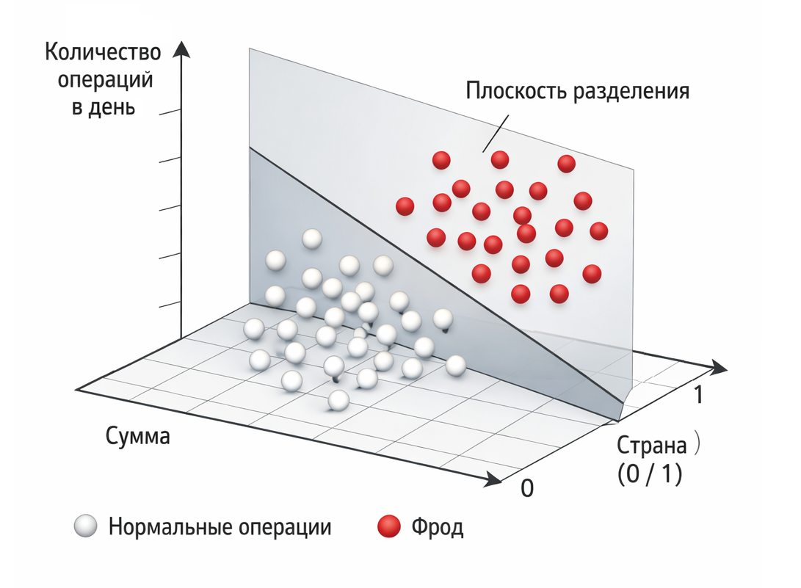

# Кейс 6. Фрод или нормальная транзакция

Фрод (fraud - мошенничество) – это задача, где ошибка стоит денег. Иногда – очень больших.

В отличие от предыдущих кейсов, здесь важно не только предсказать класс, но и понимать последствия ошибки. Пропустить мошенническую операцию и заблокировать нормальную – это две разные по цене ошибки.

Логистическая регрессия в таких задачах используется как базовый инструмент оценки риска.

#### Цель кейса

Оценить вероятность того, что транзакция является мошеннической (фрод) и на её основе принять решение о транзакции.

Модель должна:

1. Оценить риск операции
2. Дать вероятность, с которой можно работать дальше
3. Позволить управлять чувствительностью системы через порог

#### Сценарий

Представим платежную систему, которая обрабатывает транзакции в реальном времени.

Для каждой операции доступны простые признаки:

* сумма транзакции
* страна (в учебном примере закодирована как 0 – подозрительная, 1 – обычная; в реальности требует более сложного кодирования)
* количество операций за день

Каждая транзакция описывается так:

$$
x = [amount, country, transactionsPerDay]
$$

Целевая переменная:

* "fraud" – фрод
* "normal" – нормальная операция

#### Данные

Минимальный учебный пример:

```php
use Rubix\ML\Classifiers\LogisticRegression;
use Rubix\ML\Datasets\Labeled;
use Rubix\ML\Datasets\Unlabeled;

$samples = [
    [50, 1, 2],
    [5000, 0, 15],
    [200, 1, 1],
    [7000, 0, 20],
];

$labels = ['normal', 'fraud', 'normal', 'fraud'];
$dataset = new Labeled($samples, $labels);

$model = new LogisticRegression();
$model->train($dataset);

$transaction = new Unlabeled([[3000, 0, 10]]);
$prediction = $model->predict($transaction);

echo "Предсказанная метка (normal or fraud): \n";
print_r($prediction);

$probas = $model->proba($transaction);
$probabilityOfFraud = $probas[0]['fraud'] ?? null;

echo "\nВероятность мошенничества (class=fraud): ";
print_r($probabilityOfFraud);
echo "\n";

$threshold = 0.7;
$fraud = $probabilityOfFraud !== null && $probabilityOfFraud >= $threshold;

echo 'Порог: ' . $threshold . "\n";
echo 'Решение: ' . ($fraud ? 'BLOCK' : 'ALLOW') . "\n";

// Результат:
// Предсказанная метка (normal or fraud): 
// Array (
//    [0] => fraud
// )
// Вероятность мошенничества (class=fraud): ~1
// (в реальных задачах вероятность редко бывает ровно 0 или 1)
// Порог: 0.7
// Решение: BLOCK
```

Мы анализируем новую транзакцию:

* сумма: 3000
* страна: 0 (подозрительная)
* операций за день: 10

Модель должна оценить вероятность того, что это фрод.

### Что делает модель

Как и в других кейсах, логистическая регрессия считает:

$$
z = w_1 \ amount + w_2 \ country + w_3 \ transactions + b
$$

И затем:

$$
p = \frac{1}{1 + e^{-z}}
$$

Здесь $$p$$ – вероятность того, что транзакция является мошеннической.

#### Главное отличие: цена ошибки

В этой задаче важно не только качество модели, но и тип ошибок.

Есть два варианта:

* False Positive – нормальную транзакцию считаем фродом
* False Negative – пропускаем мошенническую транзакцию

Их цена сильно отличается:

* False Positive → раздражение клиента, потеря лояльности
* False Negative → прямые финансовые потери

Обычно False Negative дороже.

#### Порог как инструмент управления

Как и в кейсе с кредитами, модель возвращает вероятность.

Но решение зависит от порога.

Например:

* порог 0.5 → баланс
* порог 0.3 → агрессивная защита (ловим больше фрода, но больше блокировок)
* порог 0.7 → мягкая защита (меньше ложных блокировок, но больше пропусков)

Это означает: систему можно "настроить" под бизнес-задачу.

#### Decision boundary

С тремя признаками decision boundary имеет вид:

$$
w_1 x_1 + w_2 x_2 + w_3 x_3 + b = 0
$$

Это гиперплоскость (в данном случае – плоскость), которая разделяет пространство на:

* подозрительные операции
* нормальные операции

Чем дальше точка от границы, тем выше уверенность модели (относительно порога вероятности, например 0.5).

<div align="left"><figure><figcaption><p>14.9 Граница принятия решения о мошенничестве</p></figcaption></figure></div>

#### Интерпретация

Даже в таком простом виде модель уже отражает здравую логику:

* большие суммы → повышенный риск
* подозрительная страна → повышенный риск
* высокая частота операций → повышенный риск

Вес каждого признака показывает его вклад в итоговое решение (знак веса показывает направление влияния, а величина – силу).

#### Практический смысл

В реальных системах антифрода:

* признаков гораздо больше
* используются ансамбли моделей
* решения принимаются в миллисекундах

Но базовая идея остается той же: оценить вероятность риска и принять решение на основе порога.

#### Выводы

Этот кейс добавляет важный слой понимания:

* не все ошибки одинаковы по цене
* модель дает вероятность, а не финальное решение
* порог становится инструментом управления системой

И ключевой практический вывод:

> False Negative дороже False Positive.

Логистическая регрессия здесь выступает как простой и понятный способ оценить риск и встроить его в бизнес-процесс.

И именно в таких задачах становится ясно: важно не только "насколько точна модель", но и как используется её результат.


Чтобы самостоятельно протестировать этот код, воспользуйтесь [онлайн-демонстрацией](https://aiwithphp.org/books/ai-for-php-developers/examples/part-3/logistic-regression) для его запуска.

