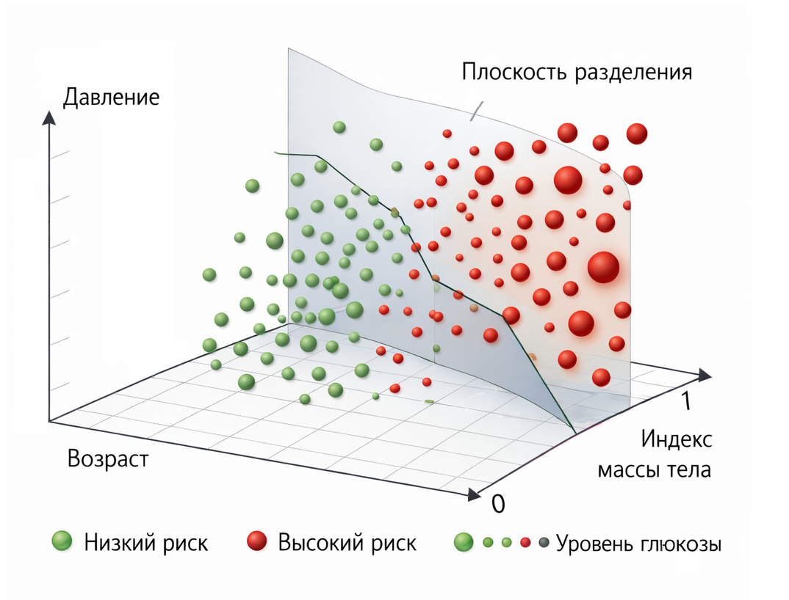

# Кейс 7. Медицинский скрининг

Медицинские задачи – это особая область, где машинное обучение используется очень осторожно. Здесь важно не просто предсказать класс, а правильно интерпретировать результат.

Логистическая регрессия в таких сценариях часто применяется для скрининга – предварительной оценки риска, а не постановки диагноза.

#### Цель кейса

Оценить вероятность наличия заболевания на основе базовых показателей пациента.

Модель должна:

1. Оценить риск
2. Помочь выделить пациентов, которым нужно дополнительное обследование
3. Работать как инструмент поддержки, а не как замена врачу

#### Сценарий

Представим, что мы строим систему предварительного медицинского скрининга.

Для каждого пациента доступны простые признаки:

* возраст
* артериальное давление
* индекс массы тела (BMI)
* уровень глюкозы

Каждый пациент описывается так:

$$
x = [age, pressure, bmi, glucose]
$$

Целевая переменная:

* 1 – есть риск заболевания
* 0 – низкий риск

Важно: речь не о диагнозе, а о вероятности риска.

#### Данные

Учебный пример (чуть расширим датасет, но без перегруза – чтобы он оставался читаемым и "учебным", а не шумным):

```php
use Rubix\ML\Datasets\Labeled;

$samples = [
    [30, 120, 22, 90],
    [60, 150, 30, 140],
    [45, 140, 28, 130],
    [25, 110, 20, 85],
    [50, 135, 26, 120],
    [55, 145, 29, 135],
    [35, 125, 24, 100],
    [40, 130, 27, 110],
    [65, 160, 32, 150],
    [28, 115, 21, 95],
];

$labels = [
    0, 1, 1, 0, 1, 1, 0, 0, 1, 0,
];

$model->train(new Labeled($samples, $labels));

print_r($model->predict([[50, 145, 27, 135]]));
```

Мы анализируем пациента:

* возраст: 50
* давление: 145
* BMI: 27
* уровень глюкозы: 135

Модель оценивает вероятность того, что пациент находится в группе риска.

#### Что делает модель

Как и в предыдущих кейсах, логистическая регрессия считает:

$$
z = w_1 \cdot age + w_2 \cdot pressure + w_3 \cdot bmi + w_4 \cdot glucose + b
$$

Затем:

$$
p = \frac{1}{1 + e^{-z}}
$$

Здесь $$p$$ – вероятность того, что пациент попадает в группу риска.

#### Decision boundary

В трехмерном пространстве признаков decision boundary задается как:

$$
w_1 x_1 + w_2 x_2 + w_3 x_3 + w_4 x_4 + b = 0
$$

Это плоскость, разделяющая пациентов на:

* группу повышенного риска
* группу низкого риска

Чем дальше пациент от границы, тем выше уверенность модели.

Как вы понимаете, когда число признаков превышает четыре, границу решений уже невозможно напрямую визуализировать: она превращается в гиперплоскость в многомерном пространстве.

Тем не менее, можно использовать простой приём, позволяющий частично отразить влияние четвёртого признака. Для этого его удобно закодировать через размер точек на графике – так мы сможем наглядно увидеть, как он соотносится с остальными признаками.

<div align="left"><figure><figcaption><p>14.10 Граница медицинского решения</p></figcaption></figure></div>

#### Ключевая мысль

Вероятность ≠ диагноз.

Это самый важный момент во всем кейсе.

Модель может сказать:

> вероятность риска: 0.72

Но это не означает, что:

> у пациента есть заболевание

Но, это означает то, что:

> пациенту стоит уделить больше внимания и, возможно, направить на дополнительное обследование

#### Интерпретация

Логистическая регрессия здесь особенно ценна своей прозрачностью:

* возраст может увеличивать риск
* высокое давление – сильный фактор
* повышенный BMI – дополнительный сигнал

Веса модели можно интерпретировать и обсуждать с врачами, что критически важно в медицине.

#### Практический смысл

В реальных системах такие модели используются для:

* первичного отбора пациентов
* раннего выявления рисков
* оптимизации нагрузки на врачей
* автоматизации скрининговых программ

Модель помогает не заменить врача, а сфокусировать внимание там, где это важно.

#### Выводы

Этот кейс подчеркивает важное отличие медицинских задач от многих других:

* модель работает с вероятностями, а не с окончательными решениями
* интерпретация результата критически важна
* ошибка может иметь серьезные последствия

И главный вывод:

Вероятность – это сигнал, а не диагноз.

Логистическая регрессия в таких задачах ценится не за сложность, а за прозрачность и предсказуемость.
