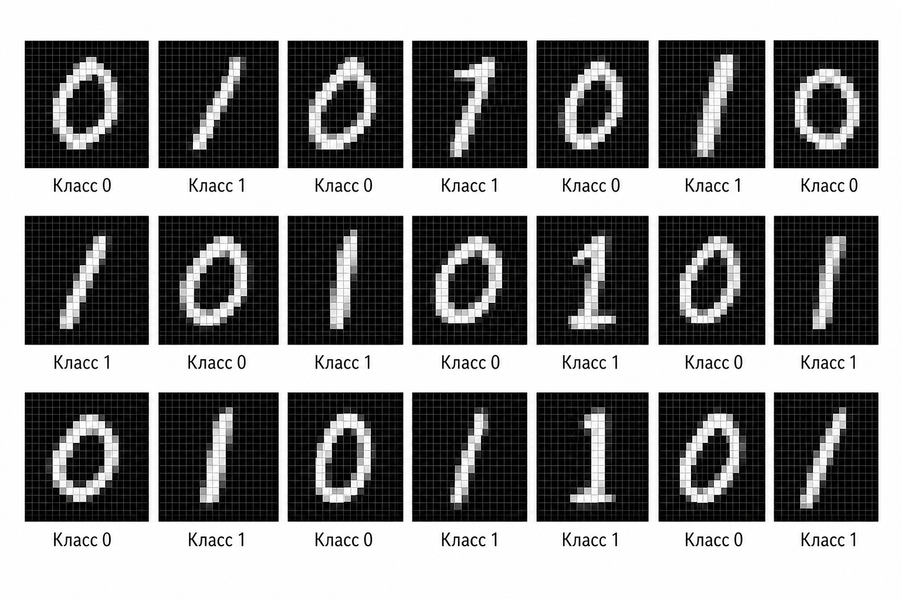

# Сквозной кейс: распознавание цифр (MNIST)


**Сквозной практический кейс**

Начиная с этой части, в дополнение к отдельным практическим заданиям для глав мы будем работать с ещё одной задачей. Эта задача – распознавание рукописных цифр из датасета [MNIST](https://ru.wikipedia.org/wiki/MNIST_\(%D0%B1%D0%B0%D0%B7%D0%B0_%D0%B4%D0%B0%D0%BD%D0%BD%D1%8B%D1%85\)) (Modified National Institute of Standards and Technology).

С каждой новой моделью мы будем возвращаться к этой задаче и улучшать результат.


#### **Что это за задача**

[MNIST](https://www.kaggle.com/datasets/hojjatk/mnist-dataset) – это классический датасет в машинном обучении:

* изображения рукописных цифр от 0 до 9
* размер каждого изображения: 28×28 пикселей
* каждое изображение – это матрица 28×28 пикселей, которую можно представить как набор из 784 чисел

Наша цель:

> по изображению определить, какая цифра на нём изображена

это задача многоклассовой классификации (10 классов: цифры от 0 до 9)

#### **Подготовка данных**

Мы будем использовать реальный MNIST датасет в CSV ( считайте, что это картинка, которая уже была трансформирована в удобный нам формат):

* первый столбец – label
* остальные 784 – пиксели

Что мы будем делать:

* оставляем только 0 и 1
* нормализуем пиксели: делим значение пикселя на 255
* затем нужно разделить датасет на две подвыборки (subsets): train и test, но в нашем случае мы используем уже готовое разбиение MNIST на train и test, поэтому дополнительное разделение не требуется


Использование датасет MNIST в формате CSV для практических примеров.

1. Перейдите на страницу:\
   [https://www.kaggle.com/datasets/oddrationale/mnist-in-csv](https://www.kaggle.com/datasets/oddrationale/mnist-in-csv)
2. Скачайте файлы:
   * mnist\_train.csv
   * mnist\_test.csv
3. Поместите их в папку своего проекта:

```
mnist/
 ├── train.csv
 └── test.csv
```

\
CSV-формат позволяет работать с данными напрямую в PHP без дополнительных библиотек.

Что внутри:

Каждая строка хранится в следующем формате:

```
label,1x1,1x2,1x3,1x4,1x5,1x6,...,1x26,1x27,1x28,2x1,2x2,2x3,2x4,2x5,2x6,..,28x28
```

Пример:

```
7,0,0,0,0,0,0,0,0,169,253,253,253,253,253,253,218,30,0,0,0,0,0,0,0,0,0,0,0,0,...,0
```


#### **Загрузка данных**

Для загрузки данных создадим специальный класс, которым будем пользоваться в нашим примерах **MnistLoader.**

<details>

<summary><strong>Class MnistLoader</strong></summary>

```php
class MnistLoader {

    static public function loadMNIST(string $file, string $directory = '', bool $categoricalLabels = false, bool $normalize = true, array $digits = [0, 1]): array {
        $features = [];
        $labels = [];

        // Open the CSV file from the requested directory.
        $handle = @fopen($directory . $file, 'r');

        if ($handle === false) {
            throw new Exception('Dataset file not found.');
        }

        // Read each sample, skip malformed rows, and keep only the digits we need.
        while (($row = fgetcsv($handle)) !== false) {
            if ($row === [] || $row[0] === null || $row[0] === '') {
                continue;
            }

            // The first value is the digit label.
            $label = (int)$row[0];

            // 1. Leave only required classes: 0 and 1 (by default)
            if (!in_array($label, $digits)) {
                continue;
            }

            // The remaining columns contain pixel intensity values.
            $pixels = array_slice($row, 1);

            // 2. Normalize (0–255 → 0–1)
            if ($normalize) {
                $pixels = array_map(function ($p): float {
                    return ((float) trim((string) $p)) / 255.0;
                }, $pixels);
            }

            // Store the normalized features and the chosen label format.
            $features[] = $pixels;
            $labels[] = $categoricalLabels ? ($label === 1 ? 'one' : 'zero') : $label;
        }

        // Return features and labels in the format expected by callers.
        return [$features, $labels];
    }
}
```

</details>

#### **Визуализация**

<div align="left"><figure><figcaption><p>14.4 MNIST примеры</p></figcaption></figure></div>

#### **Как мы будем с этим работать**

Важно понимать:

> модель не "видит цифру" — она видит только числа (пиксели)

Каждое изображение мы будем представлять как вектор:

* 784 признака (каждый пиксель – отдельный признак)
* значения будем нормализовывать (например, приводить к диапазону от 0 до 1)

#### **Как будет развиваться решение**

Мы не будем сразу использовать сложные модели. Вместо этого мы пройдём путь от простого к сложному:

1. **Логистическая регрессия** → попробуем отличать 0 от 1 → увидим ограничения линейной модели (проверим в этой главе)
2. **Naive Bayes** → рассмотрим вероятностный подход → научимся оценивать, насколько признаки “похожи” на каждый класс → поймём силу и наивность предположения о независимости признаков
3. **k-ближайших соседей (kNN)** → попробуем решить задачу без явного этапа обучения → сравним с предыдущим подходом
4. **Decision Trees** → посмотрим, как модель разбивает пространство признаков
5. **Нейросети** → наконец решим задачу полноценно → получим заметно более высокое качество

#### **Зачем это нужно**

Этот кейс позволит нам увидеть:

* как разные модели работают на одной и той же задаче
* где простые подходы ломаются
* почему появляются более сложные модели

И главное:

> как из простых идей постепенно собирается современный AI

Как использовать этот кейс при чтении

В каждой главе в практических кейсах мы будем добавлять специальный сквозной кейс, который будет связан с MNIST.

Обращайте внимание:

* как меняется качество модели (например, accuracy)
* какие ошибки она допускает
* что именно даёт улучшение

Это важнее, Это важнее, чем запоминание самих формул.
