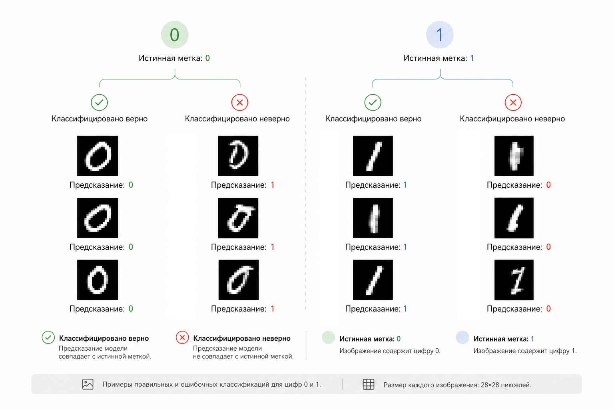

# MNIST: бинарная классификация - отличаем 0 от 1

Это один из самых известных учебных кейсов в машинном обучении.

Он прост в установке и запуске, но при этом очень наглядно показывает, как работает модель – и где проявляются её ограничения.

Кроме того, мы с вами совершаем важный "поворот" в нашей книге, а именно: мы переходим от табличных данных к изображениям.

#### Цель кейса

Научиться классифицировать изображения цифр как "0" или "1" с помощью логистической регрессии и понять ограничения линейной модели.

#### Сценарий

У нас есть датасет MNIST – набор изображений рукописных цифр.

Каждое изображение:

* размер: 28×28 пикселей
* всего: 784 пикселя

Модель не "видит" цифру как человек.

Она получает:

$$
x = [p_1, p_2, ..., p_{784}]
$$

где каждый $$p_i$$ — интенсивность пикселя (0–255 или 0–1 после нормализации).

Задача:

* если цифра = 0 → класс 0
* если цифра = 1 → класс 1

Это бинарная классификация, но уже в 784-мерном пространстве.

#### Как модель "видит" изображение

Важно проговорить про себя и запомнить, чтобы была ясность:

> Изображение – это просто массив чисел.

Модель не имеет явного представления о "формах", "контурах" или "линиях" – она работает только с числовыми значениями пикселей. И она учится находить закономерности в этих числах.

#### Модель

В этой главе мы рассматриваем логистическую регрессию, где применяется:

$$
z = w \cdot x + b
$$

и

$$
p = \frac{1}{1 + e^{-z}}
$$

При этом:

* $$x$$ – 784 пикселя
* $$w$$ – 784 веса

Если:

* $$p \approx 1$$ → это "1"
* $$p \approx 0$$ → это "0"

####

#### Реализация на чистом PHP

Для начала создадим класс логистической регрессии.&#x20;

<details>

<summary><strong>Class LogisticRegression</strong></summary>

```php
class LogisticRegression {
    private array $weights;
    private float $bias;
    private float $learningRate;

    public function __construct(int $numFeatures, float $learningRate = 0.1) {
        // Start with zeroed parameters for every feature.
        $this->learningRate = $learningRate;
        $this->weights = array_fill(0, $numFeatures, 0.0);
        $this->bias = 0.0;
    }

    // Convert a linear score into a probability in the range [0, 1].
    private function sigmoid(float $z): float {
        return 1.0 / (1.0 + exp(-$z));
    }

    // Compute the weighted sum of the input features.
    private function dot(array $a, array $b): float {
        $sum = 0.0;
        foreach ($a as $i => $v) {
            $sum += $v * $b[$i];
        }
        return $sum;
    }

    // Return the probability that the sample belongs to class 1.
    public function predictProb(array $x): float {
        return $this->sigmoid($this->dot($this->weights, $x) + $this->bias);
    }

    // Convert the probability into a binary class prediction.
    public function predict(array $x): int {
        return $this->predictProb($x) >= 0.5 ? 1 : 0;
    }

    // Train the model with simple gradient descent.
    public function train(array $X, array $y, int $epochs = 5): void {
        foreach (range(1, $epochs) as $epoch) {
            foreach ($X as $i => $x) {
                // Compare the prediction to the expected label.
                $p = $this->predictProb($x);
                $error = $p - $y[$i];

                // Update each weight using the feature value and error.
                foreach ($this->weights as $j => $w) {
                    $this->weights[$j] -= $this->learningRate * $error * $x[$j];
                }

                // Update the bias term separately.
                $this->bias -= $this->learningRate * $error;
            }

            // echo "Epoch $epoch done\n";
        }
    }

    // Calculate score a set of predictions
    public function score(array $X, array $y): float {
        $correct = 0;

        foreach ($X as $i => $x) {
            if ($this->predict($x) === $y[$i]) {
                $correct++;
            }
        }

        return count($X) > 0 ? ($correct / count($X)) : 0.0;
    }
}

```

</details>

Теперь загрузим две наши подвыборки и начнём и тренировать:

```php
[$trainSamples, $trainLabels] = MnistLoader::load('train.csv');
[$testSamples, $testLabels] = MnistLoader::load('test.csv');

$model = new LogisticRegression(784, 0.1);
$model->train($trainSamples, $trainLabels, epochs: $epochs = 5);

// Calculate model accuracy
$score = $model->score($testSamples, $testLabels);

echo 'бработано данных для обучения: ' . number_format(count($trainSamples)) . "\n";
echo 'Обработано данных для тестирования: ' . number_format(count($testSamples)) . "\n\n";
echo 'Количество эпох: ' . $epochs . "\n\n";
echo 'Точность: ' . round($score * 100, 2) . '%';

```

**Результат:**

```
Обработано данных для обучения: 12,666
Обработано данных для тестирования: 2,116

Количество эпох: 5

Точность: 99.91%
```

**Объяснение:**

Для данной задачи с MNIST 0 vs 1 (относительно простой) – классы почти линейно разделимы в пространстве признаков, поэтому даже простая линейная модель даёт \~99% точности.

#### Реализация с RubixML

```php
use Rubix\ML\Classifiers\LogisticRegression;
use Rubix\ML\CrossValidation\Metrics\Accuracy;
use Rubix\ML\Datasets\Labeled;
use Rubix\ML\Datasets\Unlabeled;
use Rubix\ML\Extractors\CSV;

// Build the training and test datasets from the filtered CSV rows.
$trainRows = MnistLoader::loadIterable('train.csv', categoricalLabels: true, normalize: true, digits: [0, 1]);
$testRows = MnistLoader::loadIterable('test.csv', categoricalLabels: true, normalize: true, digits: [0, 1]);

$dataset = Labeled::fromIterator($trainRows);
$testDataset = Labeled::fromIterator($testRows);

$model = new LogisticRegression(epochs: 5);
$model->train($dataset);

$predictions = [];
$testingLabels = $testDataset->labels();

foreach ($testDataset->samples() as $i => $x) {
    $prediction = $model->predict(new Unlabeled([$x]))[0];
    $predictions[] = $prediction;
}

$metric = new Accuracy();
$score = $metric->score($predictions, $testingLabels);

echo 'Обработано данных для обучения: ' . $dataset->numSamples() . "\n";
echo 'Обработано данных для тестирования: ' . $testDataset->numSamples() . "\n\n";
echo 'Количество эпох: ' . $model->params()['epochs'] . "\n\n";
echo 'Точность: ' . round($score * 100, 2) . '%';
```

**Результат:**

```
Обработано данных для обучения: 12,666
Обработано данных для тестирования: 2,116

Количество эпох: 5

Точность: 99.95%
```

**Объяснение:**

Не смотря на то, что для данной задачи 0 vs 1  – классы хорошо разделимы, тем не менее RubixML может дать результат чуть лучше (99.95%) за счёт отличий в реализации оптимизации (например, регуляризации и более стабильных численных методов).

#### Где модель ломается (проявляются её ограничения)

Это ключевой момент кейса.

Логистическая регрессия может провести только одну гиперплоскость.

Но изображения цифр:

* имеют сложную форму
* сильно варьируются
* иногда выглядят неоднозначно

Примеры проблем:

* "кривые" единицы похожи на нули
* "тонкие" нули похожи на единицы
* шум и артефакты

<div align="left"><figure><figcaption><p>14.12 Ошибки классификации MNIST</p></figcaption></figure></div>

#### Практический результат

Даже при всей простоте модель показывает неожиданно хороший результат.

Для нас важно подчеркнуть:

> Линейная модель уже умеет решать нетривиальные задачи.

Но важно понимать, что такой результат – скорее исключение, чем правило, и у модели есть фундаментальные ограничения (см. выше)

#### Выводы и следующие шаги

Этот кейс – важная точка в понимании машинного обучения. Он наглядно показывает, как изображения превращаются в числа, как модели работают в пространствах высокой размерности и что логистическая регрессия в целом хорошо масштабируется даже на задачи с сотнями признаков.

Однако ключевое ограничение становится очевидным: модель способна построить только линейную границу. В случае с MNIST это означает попытку разделить пространство из 784 признаков одной гиперплоскостью. И хотя результат оказывается лучше, чем можно было бы ожидать, модель всё равно упирается в геометрию данных – рукописные цифры по своей природе не являются линейно разделимыми структурами.

Отсюда возникает естественный вопрос:&#x20;

> А можно ли подойти к задаче иначе – не через поиск границы между классами, а через моделирование вероятности самих данных?

Ответ - да, это возможно. Но к этому подходу мы перейдём в следующей главе, где рассмотрим вероятностную модель классификации – Naive Bayes.

**Прогресс**

Мы будем возвращаться к этому кейсу в следующих главах и постепенно улучшать модель, добавляя новые идеи и методы. Важно не просто увидеть разные алгоритмы, а понять, как они меняют поведение модели на одной и той же задаче. Ниже – прогресс, который мы имеет на текущий момент.

Прогресс моделей на MNIST:

<table><thead><tr><th width="193.01953125">Модель</th><th width="181.01171875">Задача</th><th width="168.92578125">Точность</th><th>Комментарий</th></tr></thead><tbody><tr><td><a href="mnist-binarnaya-klassifikaciya-otlichaem-0-ot-1.md">Logistic</a></td><td>0 vs 1 (binary)</td><td>~99%</td><td>линейная</td></tr><tr><td>...</td><td></td><td>...</td><td>далее: Naive Bayes</td></tr></tbody></table>


Чтобы самостоятельно протестировать этот код, воспользуйтесь [онлайн-демонстрацией](https://aiwithphp.org/books/ai-for-php-developers/examples/part-3/logistic-regression) для его запуска.

