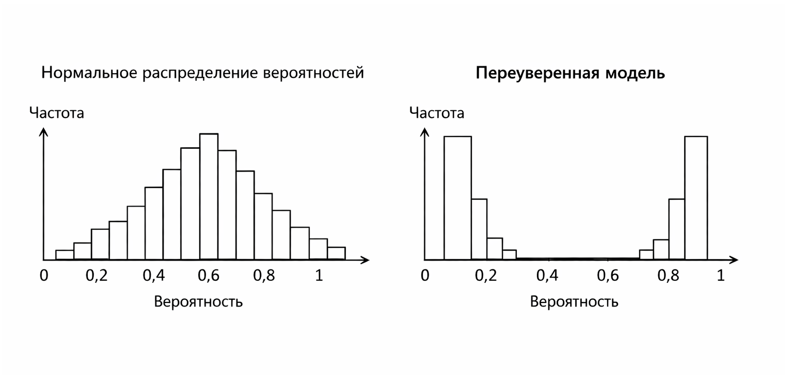

# Кейс 4. Переуверенная модель как сигнал проблемы

#### Цель кейса

Этот кейс показывает важную инженерную интуицию: слишком высокая уверенность модели – это не всегда хорошо.

На практике разработчики часто радуются, когда модель выдает вероятности 0.99 или даже 1.0. Кажется, что модель "уверена" и значит работает отлично. Но в реальности это часто сигнал проблем:

* переобучение (overfitting)
* утечка данных (data leakage)
* слишком простые или "грязные" данные
* некорректная оценка вероятностей (calibration).

Ключевая идея: здоровая модель почти всегда сомневается, то есть сохраняет неопределённость на сложных и пограничных примерах.

#### Сценарий

Представим, что у нас есть модель классификации (например, фильтр спама или fraud detection).

После внедрения мы начинаем смотреть на её предсказания и замечаем странную картину:

* почти все вероятности находятся в диапазоне 0.97–1.0
* модель почти никогда не "сомневается", то есть крайне редко выдает промежуточные вероятности (например, 0.4–0.6)
* распределение вероятностей выглядит "перекошенным", то есть сильно смещено к значениям, близким к 1

Пример:

```php
$probabilities = [
    'spam' => 0.99,
    'normal' => 0.01,
];
```

Или даже:

```php
$probabilities = [
    'spam' => 1.0,
    'normal' => 0.0,
];

// или значения, очень близкие к 1.0 и 0.0
```

На первый взгляд это выглядит идеально. Но на практике – это повод насторожиться.

Важно различать два понятия:

* уверенность модели (confidence) – насколько она "решительна"
* калибровка (calibration) – насколько эта уверенность соответствует реальности

Проблема возникает не из-за самой высокой вероятности, а когда высокая уверенность систематически не соответствует фактической точности.

#### Почему это подозрительно

В реальном мире данные почти всегда:

* шумные
* неполные
* неоднозначные

Если модель систематически (для большинства объектов) выдает вероятность, близкую к 1, это означает, что она:

* либо видит слишком "очевидные" признаки
* либо запомнила обучающую выборку
* либо получила доступ к информации, которой не должно быть

Другими словами, модель ведет себя так, как будто не существует неопределенности, что почти никогда не бывает правдой.

#### Простая проверка в коде

Один из самых простых способов – проверить, как часто модель выдает "слишком высокую" уверенность.

```php
foreach ($probabilities as $class => $p) {
    if ($p > 0.97) {
        echo "Подозрительно высокая уверенность: $class = $p\n";
    }
}
```

Порог (например, 0.97) условный и зависит от задачи – важно не само значение, а то, насколько часто модель выдает такие высокие вероятности. Если такие значения встречаются часто – это повод провести более глубокую диагностику.

#### Расширенная проверка

(проверка на уровне [батча](../../../vvedenie/zaklyuchitelnye-materialy/glossarii.md#batch-batch))

В реальной системе лучше проверять не один пример, а поток предсказаний:

```php
$predictions = [
    ['spam' => 0.99, 'normal' => 0.01],
    ['spam' => 0.98, 'normal' => 0.02],
    ['spam' => 1.00, 'normal' => 0.00],
    ['spam' => 0.85, 'normal' => 0.15],
    ['spam' => 0.98, 'normal' => 0.02],
];

$threshold = 0.97;
$flaggedRows = 0;

foreach ($predictions as $i => $probs) {
    foreach ($probs as $class => $p) {
        if ($p > $threshold) {
            echo "[$i] high confidence: $class = $p\n";
            $flaggedRows++;
        }
    }
}

$totalRows = count($predictions);
$isSystemic = $totalRows > 0 && ($flaggedRows / $totalRows) >= 0.8;

echo "Строк с высокой уверенностью: $flaggedRows из $totalRows\n";

if ($isSystemic) {
    echo 'Почти все строки попадают под это условие – это уже системная проблема.';
}

// Результат:
// [0] high confidence: spam = 0.99
// [1] high confidence: spam = 0.98
// [2] high confidence: spam = 1
// [4] high confidence: spam = 0.98

// Интерпретация:
// Строк с высокой уверенностью: 4 из 5
// Почти все строки попадают под это условие – это уже системная проблема.
```

Если почти все строки попадают под это условие – это уже системная проблема.

#### Основные причины переуверенности

**Проблемы данных:**

**1. Утечка данных (data leakage)**

В модель попала информация, напрямую связанная с ответом.

Пример:

* в признаках есть поле, косвенно указывающее на класс
* данные из будущего попали в обучение

Это самая опасная ситуация, потому что модель кажется "идеальной".

**2. Несбалансированные или слишком простые данные**

Если классы сильно различаются или признаки слишком очевидны, модель может стать чрезмерно уверенной.

**Проблемы модели:**

**1. Переобучение (overfitting)**

Модель запомнила обучающие данные и перестала обобщать.

Признаки:

* отличные результаты на обучающей или некорректно сформированной тестовой выборке
* ухудшение на новых данных
* высокая уверенность даже на сложных примерах

**Проблемы вероятностей:**

**4. Некалиброванные вероятности**

Некоторые модели (особенно сложные) выдают вероятности, которые плохо соответствуют реальной частоте событий.

Например:

* модель говорит 0.99
* в реальности такие случаи происходят лишь в 80%

#### Как это проявляется в продукте

Переуверенная модель часто приводит к проблемам:

* агрессивная фильтрация (теряются важные письма)
* ложные блокировки пользователей
* недоверие к системе со стороны пользователей
* резкие ошибки без «плавных» пограничных случаев

#### Что с этим делать

Несколько практических шагов:

* проверить качество на отложенной выборке (validation / test)
* убедиться, что нет утечки данных
* посмотреть распределение вероятностей (гистограмма)
* использовать методы калибровки (Platt scaling, isotonic regression)
* упростить модель или добавить регуляризацию

#### Визуальная интуиция

<div align="left"><figure><figcaption><p>13.4 Нормальное распределение вероятностей vs переуверенное</p></figcaption></figure></div>

#### Выводы

1. Вероятность 0.99 – это не всегда признак хорошей модели
2. Переуверенность часто указывает на проблемы в данных или обучении
3. Здоровая модель почти всегда оставляет место сомнению
4. Проверка распределения вероятностей – важная часть диагностики ML-систем

Этот кейс формирует важное инженерное правило:&#x20;

> если модель почти никогда не сомневается – это сильный сигнал, что ей нельзя доверять без дополнительной проверки.


Чтобы самостоятельно протестировать этот код, воспользуйтесь [онлайн-демонстрацией](https://aiwithphp.org/books/ai-for-php-developers/examples/part-3/probability-as-degree-of-confidence) для его запуска.

