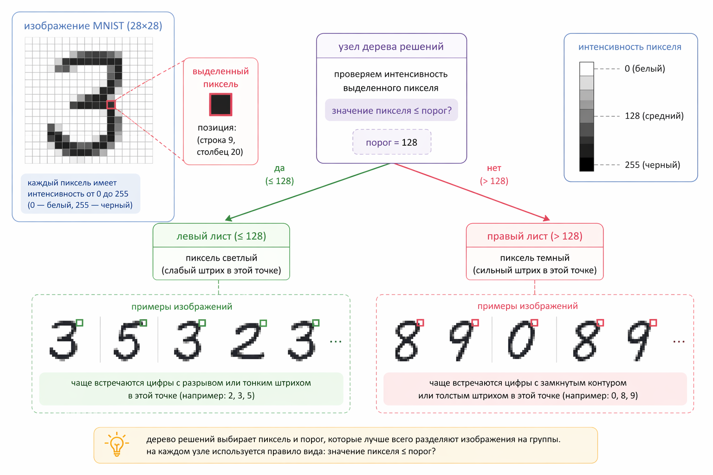

# MNIST: дерево решений – как модель "смотрит" на пиксели

Этот кейс продолжает сквозную тему MNIST и показывает, как дерево решений работает не с "абстрактными признаками", а с сырыми пикселями изображения.&#x20;

Здесь особенно хорошо видно, как модель превращает изображение в набор простых логических правил.

#### Цель кейса

Понять:

* как изображение превращается в признаки для дерева
* какие "вопросы" дерево задаёт пикселям
* почему дерево решений плохо масштабируется на задачи с изображениями, но при этом даёт ценную интуицию

Этот кейс не про достижение высокой точности. Он про понимание того, как модель видит данные.

#### Сценарий

Напомню, что мы работаем с датасетом MNIST – изображениями цифр 0–9 размером 28×28 пикселей.

Каждое изображение:

* это матрица 28×28
* или 784 числа (если "развернуть" в вектор)

Наша задача: классифицировать цифру (например, 0 или 1 для упрощения)

#### Как дерево видит изображение

Для дерева решений изображение — это просто массив чисел:

```php
[pixel_0, pixel_1, pixel_2, ..., pixel_783]
```

Где каждый пиксель:

* значение от 0 до 255
* или нормализованное от 0 до 1

Дерево не знает, что это "изображение" или "цифра". Оно знает только: "у нас есть 784 признака".

#### Какие вопросы задаёт дерево

Дерево начинает строить модель, задавая вопросы вида:

* pixel\_123 > 0.5 ?
* pixel\_456 < 0.2 ?
* pixel\_78 > 0.7 ?

То есть: "в этом конкретном месте изображения есть чернила или нет?"

#### Визуальная интуиция

Представим, что один из первых сплитов:

* pixel\_350 > 0.6

Это означает:

* модель проверяет, закрашена ли конкретная точка изображения

<figure><figcaption><p>17.4 Разбиение в дереве решений по интенсивности пикселя (MNIST)</p></figcaption></figure>

#### Что в итоге строит дерево

Дерево превращает классификацию цифры в набор правил:

```
если pixel_100 > 0.5
     и pixel_250 < 0.3
     и pixel_400 > 0.7
→ это цифра 1
```

Это важно:

> модель не видит "форму цифры" – она видит набор условий по пикселям.

При этом комбинация таких условий может косвенно отражать форму, но делает это неэффективно и без явного понимания структуры.

#### Пример на RubixML

Упрощённый пример (две цифры: 0 и 1):

```php
use app\classes\MnistLoader;
use Rubix\ML\CrossValidation\Metrics\Accuracy;
use Rubix\ML\Datasets\Labeled;
use Rubix\ML\Classifiers\ClassificationTree;
use Rubix\ML\Datasets\Unlabeled;

try {
    $trainRows = MnistLoader::loadIterable('train.csv', categoricalLabels: true, normalize: true, digits: [0, 1]);
    $testRows = MnistLoader::loadIterable('test.csv', categoricalLabels: true, normalize: true, digits: [0, 1]);

    $dataset = Labeled::fromIterator($trainRows);
    $testDataset = Labeled::fromIterator($testRows);
} catch (Exception $e) {
    echo '<div class="alert alert-danger" role="alert">' . htmlspecialchars($e->getMessage(), ENT_QUOTES, 'UTF-8') . '</div>';
    exit;
}

$model = new ClassificationTree(
    maxHeight: 10,
    maxLeafSize: 5
);

$model->train($dataset);

$predictions = [];
$testingLabels = $testDataset->labels();

foreach ($testDataset->samples() as $i => $x) {
    $prediction = $model->predict(new Unlabeled([$x]))[0];
    $predictions[] = $prediction;
}

$metric = new Accuracy();
$score = $metric->score($predictions, $testingLabels);

echo 'Обработано данных для обучения: ' . number_format($dataset->numSamples()) . "\n";
echo 'Обработано данных для тестирования: ' . number_format($testDataset->numSamples()) . "\n\n";
echo 'Точность: ' . round($score * 100, 2) . '%';
```

**Результат:**

```
Обработано данных для обучения: 12,666
Обработано данных для тестирования: 2,116

Точность: 99.72%
```

> Важно: здесь рассматривается упрощённая задача (0 vs 1). Эти цифры визуально сильно отличаются, поэтому даже простые модели могут показывать очень высокую точность. На более сложной задаче (10 классов) дерево решений работает значительно хуже.

**Объяснение:**

На практике дерево:

* выбирает подмножество пикселей (часто довольно большое)
* строит на них правила
* не учитывает пространственную структуру изображения явно

То есть: оно работает как "набор тестов по координатам", а не как анализ изображения.

**Почему это ограничение**

Изображения имеют структуру:

* соседние пиксели связаны
* есть линии, формы, контуры

Дерево этого не учитывает.

Оно делает axis-aligned разбиения: проверяет пиксели по одному и не умеет эффективно захватывать паттерны целиком. В результате: требуется очень глубокое дерево, модель легко переобучается и его точность ограничена.

**Сравнение с "правильным" подходом**

Для изображений лучше подходят:

* сверточные нейросети (CNN)
* методы, учитывающие локальные паттерны

Почему?

Потому что они смотрят не на отдельные пиксели, а на: комбинации пикселей, их формы, текстуры и прочее.

#### Почему этот кейс важен

Несмотря на ограничения, этот кейс даёт очень сильную интуицию.

Он показывает:

* что любой алгоритм работает с числами
* что модели не "понимают" изображение в человеческом смысле
* что всё сводится к преобразованию признаков

И самое главное: как выглядит decision tree в "сыром" пространстве признаков.

#### Выводы и следующие шаги

Этот кейс даёт один из самых важных инсайтов во всей теме машинного обучения: модель не "понимает" данные – она задаёт к ним вопросы.

В случае дерева решений эти вопросы предельно простые:

* закрашен ли этот пиксель?
* больше ли значение порога?

И именно из таких примитивных проверок складывается итоговое решение.

На MNIST особенно хорошо видно ограничение этого подхода. Дерево не видит форму цифры, не учитывает соседство пикселей, не понимает линии и контуры. Оно просто строит набор условий по координатам.

Это делает его понятным, интерпретируемым, но плохо масштабируемым на задачи с пространственной структурой.

Именно здесь становится очевидно:

> разные алгоритмы – это не просто разные "формулы", а разные способы смотреть на данные

В одной из следующих глав мы вернёмся к этому же кейсу чтобы посмотреть, как меняется поведение модели:

* когда мы используем более сложные алгоритмы
* когда начинаем учитывать структуру данных
* когда переходим от "пикселей" к "паттернам"

Цель – не просто повысить точность, а увидеть: как меняется сама логика принятия решений.

### Прогресс

Мы ещё вернёмся к этому кейсу в следующих главах и будем продолжать улучшать модель, добавляя новые идеи и методы. Важно не просто увидеть разные алгоритмы, а понять, как они меняют поведение модели на одной и той же задаче. Ниже – прогресс, который мы имеем на текущий момент.

Прогресс моделей на MNIST:

<table><thead><tr><th width="193.01953125">Модель</th><th width="181.01171875">Задача</th><th width="168.92578125">Точность</th><th>Комментарий</th></tr></thead><tbody><tr><td><a href="../../../chast-iii.-klassifikaciya-i-veroyatnosti/3.2-logisticheskaya-regressiya/skvoznoi-keis-raspoznavanie-cifr-mnist/mnist-binarnaya-klassifikaciya-otlichaem-0-ot-1.md">Logistic</a></td><td>0 vs 1 (binary)</td><td>~99%</td><td>линейная</td></tr><tr><td><a href="../../../chast-iii.-klassifikaciya-i-veroyatnosti/3.3-pochemu-naivnyi-baies-rabotaet/skvoznoi-keis-raspoznavanie-cifr-mnist/mnist-veroyatnostnaya-model-klassifikacii-cifr-naive-bayes.md">Naive Bayes</a></td><td>0 vs 1 (binary)</td><td>~98–99%</td><td>простая вероятностная модель, предполагает независимость пикселей</td></tr><tr><td><a href="../../4.1-algoritm-k-blizhaishikh-sosedei-i-lokalnye-resheniya/skvoznoi-keis-raspoznavanie-cifr-mnist/mnist-raspoznavanie-cifr-cherez-k-nn-bez-obucheniya.md">k-NN</a></td><td>0 vs 1 (binary)</td><td>~99%</td><td>локальная модель, основанная на расстояниях, без обучения параметров (запоминает данные)</td></tr><tr><td><a href="mnist-derevo-reshenii-kak-model-smotrit-na-pikseli.md">Decision Tree</a></td><td>0 vs 1 (binary)</td><td>~99%</td><td>задаёт простые пороговые вопросы к отдельным пикселям</td></tr><tr><td>…</td><td>…</td><td>…</td><td>далее: нейросети</td></tr></tbody></table>


Чтобы самостоятельно протестировать этот код, воспользуйтесь [онлайн-демонстрацией](https://aiwithphp.org/books/ai-for-php-developers/examples/part-4/decision-trees-and-space-partitioning) для его запуска.

