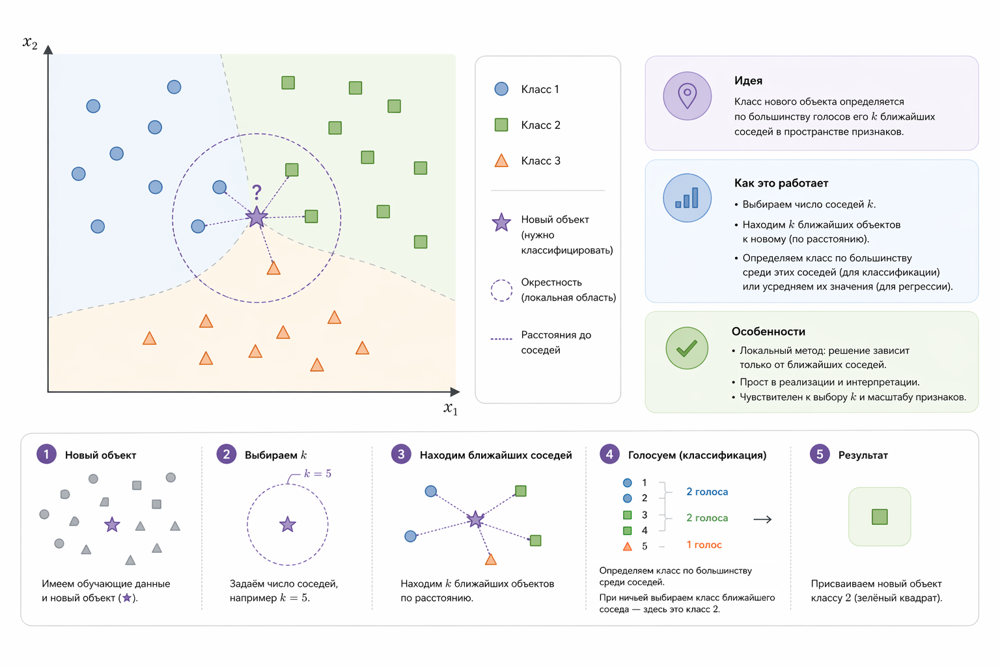
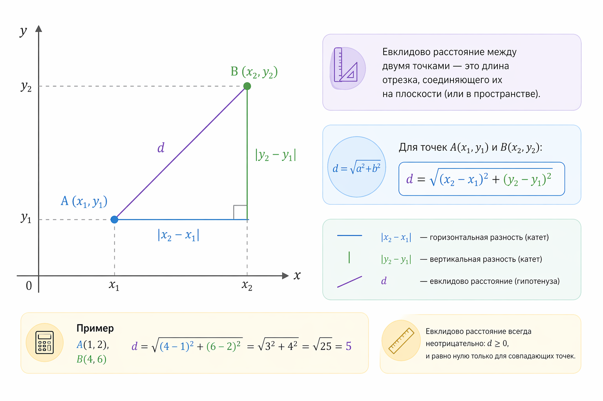
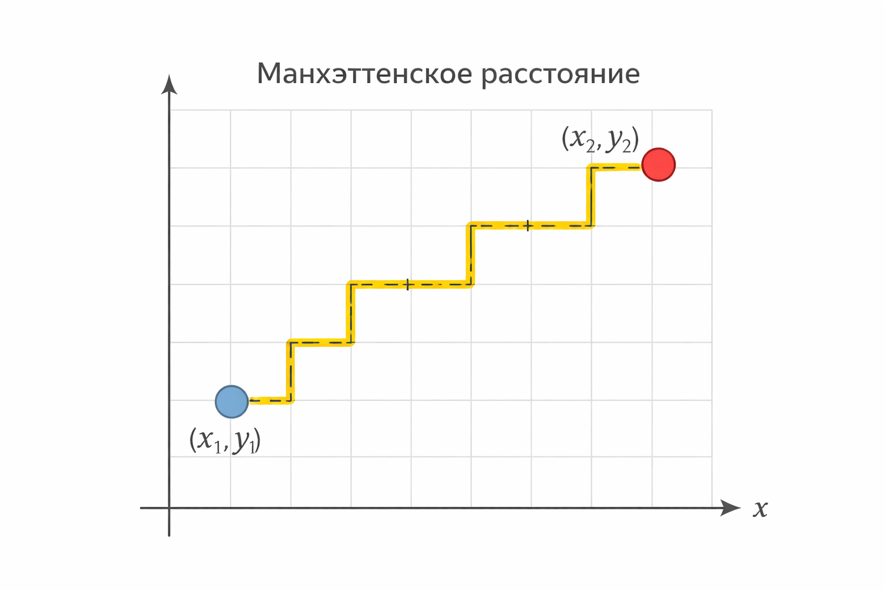
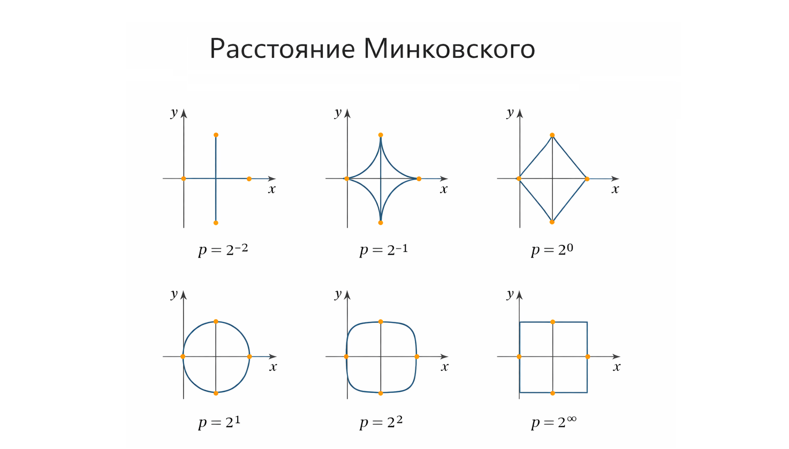
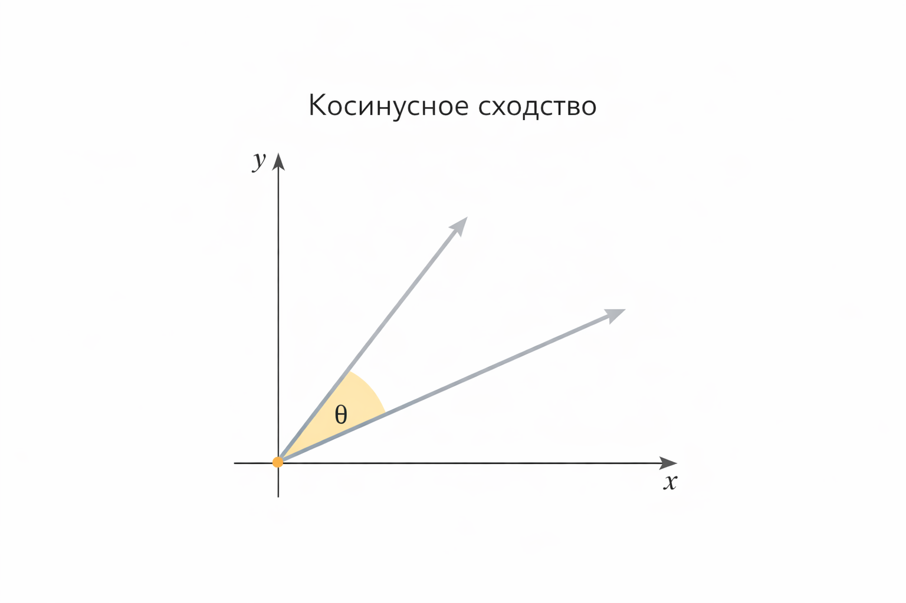
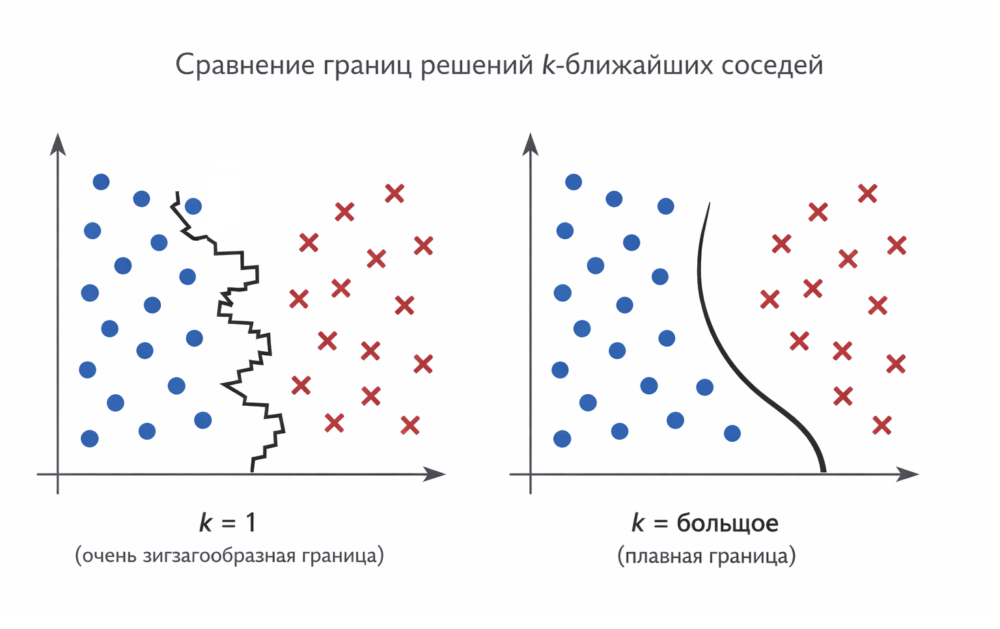

# Алгоритм k-ближайших соседей и локальные решения

Алгоритм k-ближайших соседей (k-Nearest Neighbors, kNN) – один из самых интуитивных и при этом фундаментальных алгоритмов машинного обучения. Он почти не делает предположений о данных, не обучает явную модель и опирается на простую, почти геометрическую идею: _похожие объекты должны иметь похожие ответы_.

Именно поэтому kNN особенно хорошо подходит для объяснения того, что такое локальные решения, почему геометрия данных важна и как выбор метрики расстояния напрямую влияет на результат.

### Локальные решения вместо глобальной модели

В отличие от линейной или логистической регрессии, kNN не пытается найти одну общую формулу для всех данных. У него нет коэффициентов, весов или функции потерь в привычном смысле.

Алгоритм работает иначе:

1. Мы сохраняем все обучающие данные.
2. Для нового объекта ищем _k_ ближайших к нему примеров.
3. Принимаем решение, глядя только на этих соседей.

Это и есть локальное решение. Для каждой новой точки решение строится заново, исходя из её ближайшего окружения.

Можно сказать, что kNN каждый раз отвечает на вопрос:

> Что обычно происходит с объектами, _похожими именно на этот_?

<figure><figcaption>
16.1 Локальные решения c kNN
</figcaption></figure>

### Геометрическая интуиция kNN

Рассмотрим самый простой случай – пространство из двух признаков. Каждый объект – это точка на плоскости. Тогда работа алгоритма выглядит буквально геометрически:

* есть точка запроса
* мы измеряем расстояния до всех остальных точек
* выбираем $$k$$ точек с минимальным расстоянием

Для классификации чаще всего используется голосование:

$$
\hat{y} = \operatorname{mode}(y_1, y_2, \dots, y_k)
$$

Для регрессии – усреднение:

$$
\hat{y} = \frac{1}{k} \sum_{i=1}^{k} y_i
$$

Таким образом, решение определяется формой локального "облака" точек вокруг запроса.

### Метрики расстояния: как мы определяем "близость"

Ключевой вопрос kNN – что значит "ближайший"? Ответ задаётся метрикой расстояния.

#### Евклидово расстояние

Самая распространённая метрика:

$$
d(x, y) = \sqrt{\sum_{i=1}^{n} (x_i - y_i)^2}
$$

Она хорошо работает, когда:

* признаки имеют одинаковый масштаб
* пространство относительно низкой размерности
* важна геометрическая форма облаков

<figure><figcaption>
16.2 Евклидово расстояние
</figcaption></figure>

#### Манхэттенское расстояние

Иногда важнее не прямая линия, а сумма перемещений по осям:

$$
d(x, y) = \sum_{i=1}^{n} |x_i - y_i|
$$

Эта метрика часто используется, когда признаки независимы и имеют интерпретацию "стоимости шага".

<figure><figcaption>
16.3 Манхэттенское расстояние
</figcaption></figure>

#### Расстояние Минковского

Обобщающая форма:

$$
d(x, y) = \left( \sum_{i=1}^{n} |x_i - y_i|^p \right)^{1/p}
$$

* при $$p = 2$$ получаем евклидово расстояние
* при $$p = 1$$ – манхэттенское

Выбор p позволяет плавно менять форму "окрестности" точки.

<figure><figcaption>
16.4 Расстояние Минковского
</figcaption></figure>

#### Косинусное расстояние

Когда важна не длина вектора, а направление:

$$
\cos(\theta) = \frac{x \cdot y}{||x|| \cdot ||y||}
$$

Используется в задачах с текстами, эмбеддингами, рекомендациями, где абсолютные значения менее важны, чем относительные пропорции.

<figure><figcaption>
16.5 Косинусное расстояние
</figcaption></figure>

### Выбор k и компромисс смещения и дисперсии

Параметр $$k$$ определяет, насколько локальным будет решение.

Малое k (например, $$k = 1$$):

* очень чувствителен к шуму
* низкое смещение, высокая дисперсия

Большое k:

* решения более сглаженные
* выше смещение, ниже дисперсия

<figure><figcaption>
16.6 Сравнение границ принятия решений kNN
</figcaption></figure>

kNN – наглядный пример классического компромисса bias–variance.

### Размерность и проклятие размерности

С ростом числа признаков возникает проблема, известная как проклятие размерности.

Интуитивно:

* в высоких размерностях все точки становятся "далёкими"
* различия между ближайшим и дальним соседом уменьшаются
* метрики расстояния теряют выразительность

Формально, при росте размерности отношение:

$$
\frac{d_{\min}}{d_{\max}} \to 1
$$

Это делает kNN менее эффективным без:

* нормализации признаков
* отбора признаков
* снижения размерности (PCA, autoencoders)

### Почему kNN важен концептуально

Несмотря на простоту и вычислительную дороговизну на больших данных, kNN остаётся ключевым алгоритмом для понимания машинного обучения:

* он показывает разницу между локальными и глобальными моделями
* делает геометрию данных зримой
* подчёркивает роль метрик и масштабов
* демонстрирует компромисс bias–variance без сложной математики

kNN – это почти "честный" алгоритм. Он не прячет логику за весами и слоями, а напрямую говорит: _посмотри на своих соседей_.

Именно поэтому он так хорошо подходит для обучения интуиции, даже если в промышленном коде его используют не так часто.
