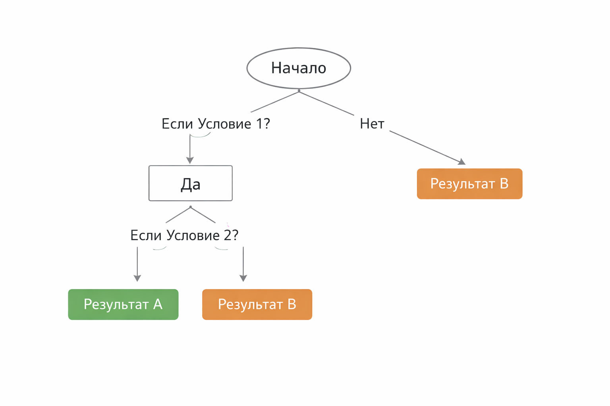
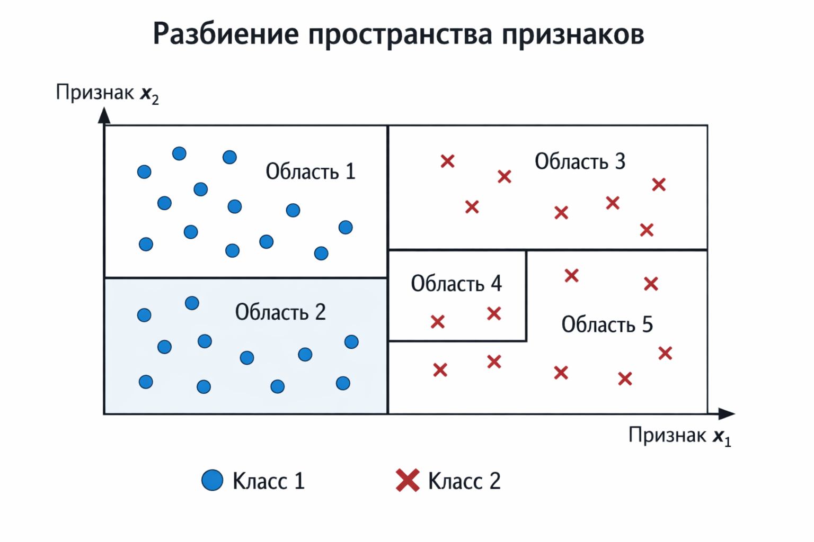
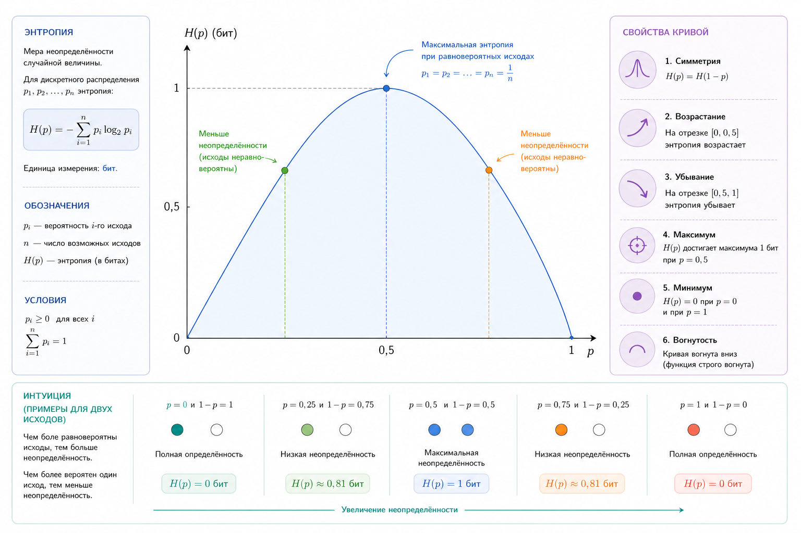

# Decision Trees и разбиение пространства

Деревья решений – один из самых интуитивных и одновременно мощных алгоритмов машинного обучения. Их любят за наглядность, за близость к человеческой логике "если – то" и за то, что результат можно объяснить не только инженеру, но и бизнесу, менеджеру или клиенту. В отличие от многих других моделей, дерево решений не выглядит как чёрный ящик – оно буквально рисуется на бумаге.

В этой главе мы разберём, как дерево решений последовательно делит пространство признаков, почему в основе этого процесса лежит энтропия, что такое information gain и почему именно эти идеи делают деревья такими объяснимыми.

### Дерево как последовательность вопросов

В самом простом виде дерево решений – это набор вопросов. Каждый внутренний узел задаёт вопрос про один из признаков: "x > 5?", "цвет = красный?", "возраст < 30?". В зависимости от ответа объект отправляется по одной из ветвей. В листьях дерева лежит итоговое решение – класс или числовое значение.

Если смотреть на это геометрически, то дерево шаг за шагом разрезает пространство признаков на области. Сначала грубо, потом всё более точно. Каждый новый вопрос уточняет, в какой части пространства мы находимся.

<figure><figcaption>
17.1 Простое дерево решений
</figcaption></figure>

Важно понимать, что дерево не ищет сразу идеальное решение. Оно действует жадно: на каждом шаге выбирает такой вопрос, который прямо сейчас лучше всего упорядочивает данные.

### Разбиение пространства признаков

Представим двухмерный случай: у нас есть признаки $$x1$$ и $$x2$$. Дерево решений будет проводить вертикальные или горизонтальные линии, разделяя плоскость на прямоугольные области. В каждой такой области решение становится более однородным.

Сначала может появиться, например, линия $$x1 < 4$$. Затем в одной из половин – линия $$x2 < 7$$. Так постепенно пространство разбивается на мозаику прямоугольников.

<figure><figcaption>
17.2 Разделение пространства признаков
</figcaption></figure>

Это ключевое отличие деревьев от линейных моделей. Линейная регрессия или логистическая регрессия проводят одну границу. Дерево строит ломаную, ступенчатую границу, приближая даже очень сложные формы.

### Чистота узла и интуиция энтропии

Чтобы понять, какой вопрос задавать в следующем узле, нужно формализовать понятие "хорошего разбиения". Интуитивно хорошее разбиение – это такое, после которого в дочерних узлах данные становятся более однородными по классам.

Если в узле все объекты принадлежат одному классу, вопрос больше не нужен – это идеальная ситуация. Если классы перемешаны, узел "грязный".

Эту идею формализует энтропия. В бинарной классификации она определяется как:

$$
H(p) = - p * log2(p) - (1 - p) * log2(1 - p)
$$

где $$p$$ – доля объектов первого класса.

Если $$p = 0$$ или $$p = 1$$, энтропия равна $$0$$ – никакой неопределённости нет. Если $$p = 0.5$$, энтропия максимальна – мы не можем уверенно угадать класс.

<figure><figcaption>
17.3 Кривая энтропии
</figcaption></figure>

Энтропия – это мера неопределённости. Чем она выше, тем сложнее принять решение.

### Information Gain – критерий выбора вопроса

Теперь у нас есть инструмент, чтобы оценивать качество разбиений. Пусть у нас есть текущий узел с энтропией $$H_{parent}$$. Мы пробуем задать вопрос и получить несколько дочерних узлов. Для них можно посчитать взвешенную среднюю энтропию:

$$
H_{children} = sum_i (N_i / N) * H_i
$$

где $$N_i$$ – количество объектов в $$i$$-м дочернем узле.

Information gain определяется как уменьшение энтропии:

$$
IG = H_{parent} - H_{children}
$$

Чем больше information прирост, тем лучше вопрос. Он сильнее снижает неопределённость и делает данные более "чистыми".

Важно, что дерево каждый раз выбирает вопрос с максимальным information gain именно в текущем узле. Оно не думает глобально о всей структуре, а действует локально.

### Небольшой числовой пример

Допустим, в узле 10 объектов: 6 класса A и 4 класса B. Энтропия этого узла примерно равна 0.97.

Мы пробуем разбиение по признаку $$x < 5$$ и получаем два узла:

В первом – 4 объекта класса A и 0 класса B, энтропия 0. Во втором – 2 объекта класса A и 4 класса B, энтропия около 0.92.

Взвешенная энтропия будет меньше исходной, а разница и есть information gain. Именно такие разбиения дерево и предпочитает.

### Жадность, переобучение и глубина

Из-за своей "жадной" природы деревья легко переобучаются. Если разрешить дереву расти без ограничений, оно может выучить данные наизусть, создавая листья с одним-двумя объектами.

Это приводит к идеально нулевой ошибке на обучении и плохой обобщающей способности. Поэтому на практике почти всегда вводят ограничения: максимальную глубину, минимальное количество объектов в узле, минимальный information gain.

Эти параметры напрямую влияют на форму разбиения пространства – от грубых крупных областей до мелкой, детальной мозаики.

### Объяснимость деревьев решений

Одно из главных преимуществ деревьев – объяснимость. Любое решение можно представить как путь от корня к листу:

"Если возраст < 30, и доход > X, и регион = Европа, то класс = A".

Это объяснение понятно человеку. Его можно показать в отчёте, логах или интерфейсе продукта. Именно поэтому деревья часто используются в финтехе, медицине и других областях, где важно объяснять решения модели.

Кроме того, дерево позволяет оценивать важность признаков. Чем чаще и выше по дереву используется признак, тем больший вклад он вносит в итоговое решение. Эта идея потом развивается в ансамблях, таких как Random Forest и Gradient Boosting.

### Ограничения геометрии деревьев

Несмотря на свою гибкость, деревья имеют ограничения. Их разбиения всегда осевые – параллельные осям признаков. Это означает, что наклонные или диагональные границы они аппроксимируют ступенчато.

Для сложных задач одно дерево часто оказывается слишком грубым или слишком переобученным. Именно поэтому в реальных системах деревья почти всегда используются в ансамблях, то есть в методах, которые объединяют множество деревьев в одну модель, чтобы улучшить точность и устойчивость.

### Итог

Дерево решений – это алгоритм, который последовательно уменьшает неопределённость, разрезая пространство признаков на всё более однородные области. Энтропия даёт меру хаоса, information gain – критерий выбора вопросов, а сама структура дерева делает модель объяснимой и понятной.

Понимание этих идей важно не только для работы с деревьями, но и для понимания ансамблевых методов, которые строятся поверх них и усиливают их сильные стороны.
