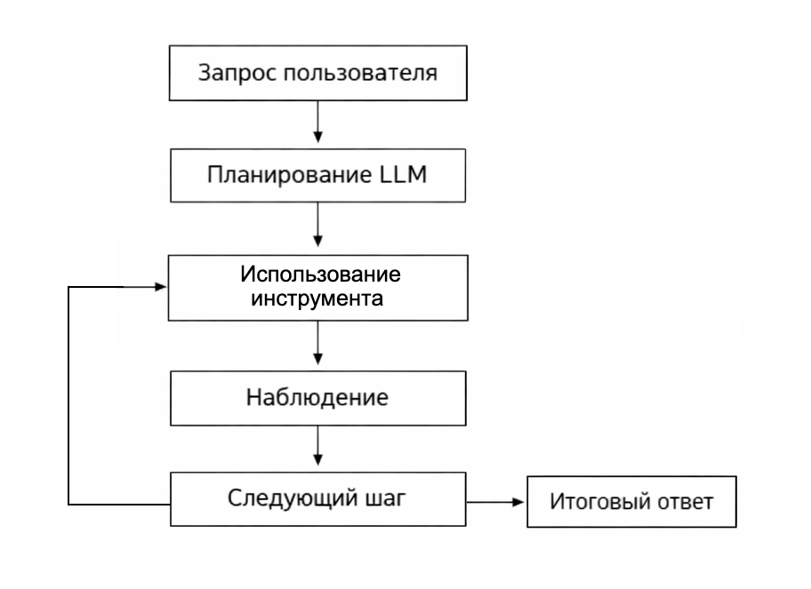
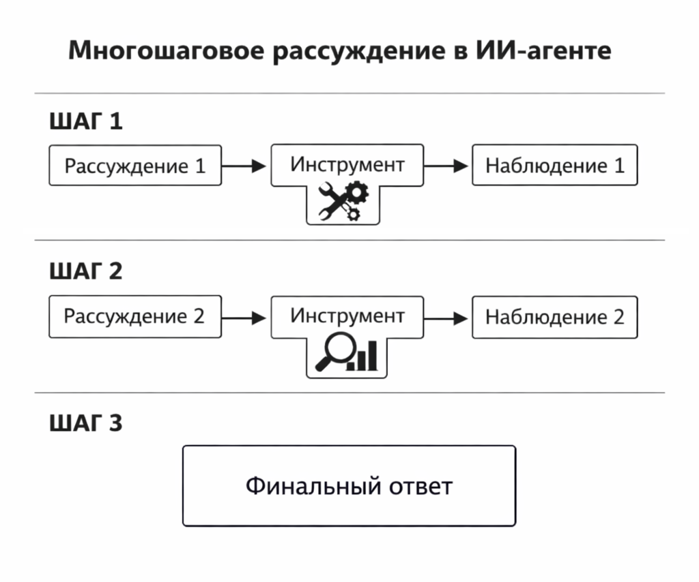

# Агентные системы и multi-step reasoning в PHP

Когда разработчики впервые сталкиваются с LLM, они обычно воспринимают модель как "умный автокомплит". Мы задаём вопрос – модель генерирует ответ. Однако такой способ использования раскрывает лишь небольшую часть потенциала современных моделей.

На практике наиболее мощные системы строятся иначе. LLM используется не как финальный источник ответа, а как компонент внутри управляемой системы, где:

* модель планирует действия
* система вызывает инструменты
* промежуточные результаты проверяются
* процесс повторяется до достижения цели

Такой подход называется агентной архитектурой.

В этой главе мы разберём:

* что такое агентные системы
* что такое multi-step reasoning
* как устроено планирование действий
* как подключать инструменты
* как контролировать выполнение

Ну а затем мы реализуем это на PHP.

### Почему одного запроса к LLM недостаточно

Представим задачу.

Пользователь спрашивает:

> "Сколько будет средняя зарплата PHP-разработчика в Германии, если учитывать последние данные?"

Чтобы ответить на этот вопрос, система должна:

1. Найти свежие данные по зарплатам
2. Отфильтровать по PHP
3. Посчитать среднее
4. Сформировать ответ

LLM не имеет доступа к интернету и вычислениям, если её специально этому не научить.

Поэтому система должна выполнить цепочку действий:

```
Запрос пользователя
      ↓
Планирование шагов
      ↓
Вызов инструментов
      ↓
Получение данных
      ↓
Анализ
      ↓
Финальный ответ
```

Так работает агентная система.

### Что такое агент

Агент – это система, которая может:

1. понимать цель
2. планировать действия
3. использовать инструменты
4. оценивать результат
5. повторять процесс

Формально можно представить агента как функцию:

$$
a_t = \pi(s_t)
$$

где

* $$s_t$$ – состояние системы
* $$a_t$$ – действие
* $$\pi$$ – стратегия агента

После действия состояние меняется:

$$
s_{t+1} = f(s_t, a_t)
$$

LLM выступает в роли политики принятия решений.

### Multi-step reasoning

Большинство сложных задач нельзя решить за один шаг.

Они требуют последовательного рассуждения. Рассмотрим следующий пример.

Запрос:

> "Какая компания дороже – Apple или Microsoft?"

Шаги:

1. Получить капитализацию Apple
2. Получить капитализацию Microsoft
3. Сравнить

Формально процесс рассуждения (reasoning) можно представить как последовательность состояний:

$$
S = (s_0, s_1, s_2, ..., s_n)
$$

где каждое состояние зависит от предыдущего.

#### Внутренний цикл агента

```php
while (!$goalReached) {
    $plan = $llm->plan($state);
    $tool = $plan->tool;
    $result = $tool->execute();
    $state->update($result);
}
```

<div align="left"><figure><figcaption><p>32.1 Цикл работы ИИ агента</p></figcaption></figure></div>

### Архитектура агентной системы

Типичная архитектура выглядит так:

```
User
 ↓
Controller
 ↓
LLM planner
 ↓
Tool selection
 ↓
Tool execution
 ↓
Memory update
 ↓
Next step
```

Компоненты:

**1. Планировщик (Planner)**

LLM решает:

* что делать дальше
* какой инструмент использовать

**2. Инструменты (Tools)**

Функции системы:

* поиск
* API
* базы данных
* вычисления

**3. Память (Memory)**

Контекст предыдущих шагов.

**4. Контроллер**

Логика цикла выполнения.

**5. Инструменты**

Инструмент – это функция, которую агент может вызвать.

Примеры:

```
search(query)
get_weather(city)
run_sql(query)
calculate(expression)
```

Формально инструмент:

$$
tool: X \rightarrow Y
$$

### Память агента

Для multi-step reasoning нужна память.

Простейшая память – список сообщений.

```
memory = [
  user_question
  step_1
  observation_1
  step_2
]
```

#### PHP реализация

```php
class Memory {
    private $history = [];

    public function add($message) {
        $this->history[] = $message;
    }

    public function context() {
        return implode("\n", $this->history);
    }
}
```

### Планирование нескольких шагов

Агент может выполнять несколько действий.

Пример:

```
Goal: Найти среднюю зарплату

Step 1:
search salary data

Step 2:
extract numbers

Step 3:
calculate mean
```

#### Цикл агента

```php
for ($i = 0; $i < 5; $i++) {
    $plan = $planner->nextStep($memory);

    if ($plan["tool"] == "finish") {
        break;
    }

    $result = $tool->execute($plan["input"]);

    $memory->add($result);
}
```

<div align="left"><figure><figcaption><p>32.2 Многошаговое рассуждение</p></figcaption></figure></div>

### Контроль и безопасность

Без контроля агент может:

* зациклиться
* вызвать опасный инструмент
* генерировать мусор

Поэтому система должна иметь ограничения.

#### Ограничение шагов

```
max_steps = 10
```

#### Ограничение инструментов

Белый список:

```
allowed_tools = [
  search
  calculator
  database
]
```

#### Валидация аргументов

```php
if (!is_numeric($input["expression"])) {
    throw new Exception("Invalid input");
}
```

### Evaluator – критик агента

В более сложных системах есть критик.

Он проверяет:

* правильность шага
* достижение цели

Формально:

$$
score = V(s_t)
$$

где $$V$$ – функция оценки.

LLM может выступать и в роли критика.

### Self-Reflection

Современные агентные системы используют саморефлексию.

Модель анализирует собственные ошибки.

```
Step result: incorrect

Reflection:
I used wrong tool.
Next step: use calculator.
```

### Почему агентные системы – это будущее LLM

Большинство современных AI-систем уже используют агентную архитектуру.

Причины:

1. LLM плохо считает
2. LLM не имеет данных
3. LLM делает ошибки

Агентная архитектура решает это:

* инструменты делают вычисления
* базы дают данные
* контроллер следит за процессом

В итоге LLM становится оркестратором интеллекта, а не источником истины.

### Итог

LLM сама по себе – это генератор текста.

Но внутри агентной архитектуры она превращается в универсальный планировщик действий.

Агентная система включает:

* планирование
* инструменты
* память
* контроль
* оценку

Такая архитектура позволяет решать сложные задачи через multi-step reasoning, объединяя сильные стороны LLM и традиционного программирования.

Для PHP-разработчиков это особенно важно: большая часть логики агента реализуется обычным кодом, а LLM используется только там, где нужна гибкость и семантическое понимание.

Именно поэтому современная разработка AI-систем всё чаще выглядит не как вызов модели, а как проектирование управляемой интеллектуальной системы.
