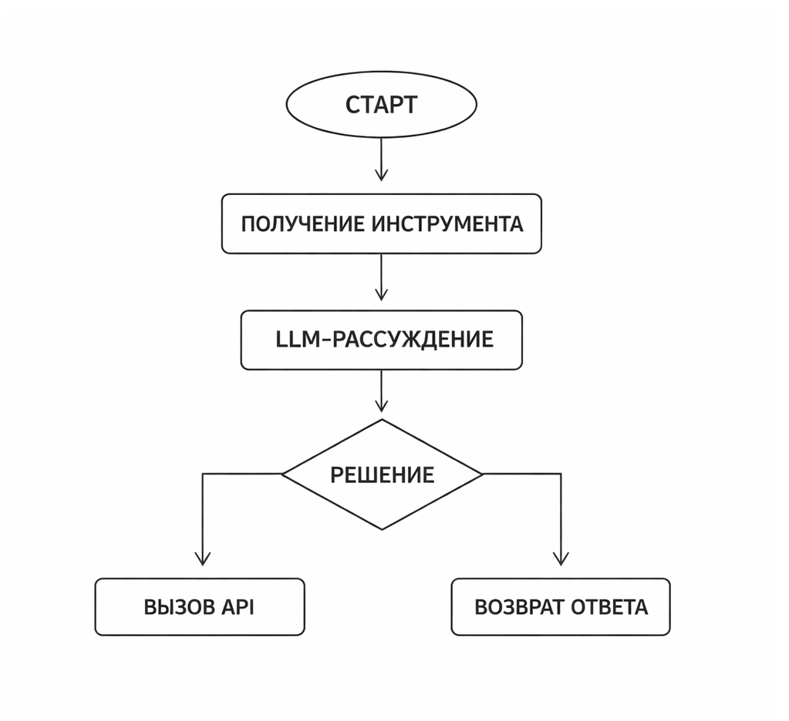

# Как использовать AI в PHP-проектах

AI в PHP-проекте – это не "магия модели", а инженерная система. Модель – лишь один из компонентов. Вокруг нее всегда есть данные, пайплайны, очереди, кэш, мониторинг, fallback-логика и бизнес-ограничения.

В этой главе мы разберем:

* типовые архитектуры интеграции AI в PHP
* orchestration – как управлять цепочками вызовов
* математическую основу (что реально происходит под капотом)
* практические PHP-примеры
* где ставить границы и как не сломать прод

### AI как слой над существующей архитектурой

Важно понимать: AI почти никогда не является "ядром" системы. Он – слой принятия решений.

Классическая web-архитектура:

```
User → Controller → Service → Repository → DB
```

С использованием AI:

```
User → Controller → AI Service → Orchestrator
                             ↓
                Vector DB / LLM / Classifier
                             ↓
                         Cache / Queue
```

AI-сервис становится отдельным уровнем – с собственной логикой.

### Основные архитектурные паттерны

#### Sync-интеграция (inline inference)

Самый простой вариант: при запросе вызываем модель и возвращаем результат.

Пример – модерация комментария.

```php
class CommentModerationService {
    public function isToxic(string $text): bool {
        $response = $this->callModel($text);

        return $response['toxicity_score'] > 0.8;
    }

    private function callModel(string $text): array {
        // HTTP-запрос к AI API
        // или локальная модель
        return [
            'toxicity_score' => 0.91
        ];
    }
}
```

Плюсы: просто.

Минусы: задержка, зависимость от внешнего сервиса.

#### Async-интеграция (через очередь)

Подходит для тяжелых задач: генерация отчета, анализ документа.

```
User → API → Queue → Worker → AI → DB
```

В PHP можно использовать:

* Redis
* RabbitMQ
* Symfony Messenger

```php
class AnalyzeDocumentJob {
    public function handle(Document $doc) {
        $embedding = $this->embeddingService->vectorize($doc->text);
        $this->vectorRepository->store($doc->id, $embedding);
    }
}
```

Асинхронность – ключ к масштабируемости.

#### AI как микросервис

Если проект растет, AI лучше вынести в отдельный сервис.

```
PHP → HTTP → AI-service (Python / Rust / Go)
```

Плюсы:

* изоляция
* масштабирование отдельно
* разные языки

Минусы:

* DevOps сложнее
* сеть добавляет latency

### Математика под капотом (что происходит реально)

AI – это функция:

$$
f(x; θ) → y
$$

Где:

* $$x$$ – входные данные
* $$θ$$ – параметры модели
* $$y$$ – предсказание

В продакшене мы не обучаем $$θ$$. Мы используем уже обученную модель.

#### Вероятностная интерпретация

Большинство моделей возвращают:

$$
P(y \mid x)
$$

Например:

$$
P(spam \mid email) = 0.92
$$

Решение:

```
if P > threshold → spam
```

Где threshold – бизнес-порог (например 0.8).

#### Эмбеддинги и косинусная близость

Векторизация текста:

$$
text → embedding ∈ R^n
$$

Сравнение:

$$
\cos(\theta) = \frac{\mathbf{A} \cdot \mathbf{B}}{\|\mathbf{A}\| \, \|\mathbf{B}\|}
$$

Где:

* $$\mathbf{A} \cdot \mathbf{B}$$– скалярное произведение
* $$\|\mathbf{A}\|$$ – длина вектора

Если cos ≈ 1 → тексты похожи.

Напомним в качестве примера PHP-реализацию косинусной близости:

```php
function cosineSimilarity(array $a, array $b): float {
    $dot = 0.0;
    $normA = 0.0;
    $normB = 0.0;

    foreach ($a as $i => $value) {
        $dot += $value * $b[$i];
        $normA += $value * $value;
        $normB += $b[$i] * $b[$i];
    }

    return $dot / (sqrt($normA) * sqrt($normB));
}
```

### Orchestration – управление AI-пайплайном

Orchestration – это управление шагами:

1. Принять запрос
2. Разбить на чанки
3. Создать эмбеддинги
4. Найти релевантные документы
5. Сформировать prompt
6. Вызвать LLM
7. Проверить ответ
8. Закэшировать

Это уже не "вызов модели", а workflow.

#### Простой Orchestrator в PHP

```php
class RagOrchestrator {
    public function answer(string $question): string     {
        $embedding = $this->embeddingService->vectorize($question);
        $documents = $this->vectorStore->search($embedding, 5);
        $prompt = $this->promptBuilder->build($question, $documents);
        $response = $this->llmService->generate($prompt);

        return $this->postProcessor->clean($response);
    }
}
```

Каждый шаг изолирован.

Это уже архитектура, а не "AI-функция".

### RAG в PHP-проекте

RAG – Retrieval Augmented Generation.

Связанные технологии:

* LLPhant
* OpenAI
* Pinecone

Пайплайн:

```
Query → Embedding → Vector Search → Context → LLM → Answer
```

<div align="left"><figure><figcaption><p>31.1 Пайплайн RAG </p></figcaption></figure></div>

### Кэширование AI

AI дорогой. Поэтому:

* кэшируйте ответы
* кэшируйте эмбеддинги
* кэшируйте промпты

Пример:

```php
class CachedLLMService {
    public function generate(string $prompt): string     {
        $key = md5($prompt);

        if ($cached = $this->cache->get($key)) {
            return $cached;
        }

        $response = $this->callModel($prompt);

        $this->cache->set($key, $response, 3600);

        return $response;
    }
}
```

### Guardrails и валидация

LLM может:

* галлюцинировать
* нарушать формат
* давать неожиданные ответы

Поэтому:

1. Валидируйте JSON
2. Проверяйте confidence
3. Делайте fallback

```php
$response = $llm->generate($prompt);

$data = json_decode($response, true);

if (!isset($data['score'])) {
    throw new RuntimeException('Invalid model output');
}
```

### Monitoring AI

Нужно измерять:

* latency
* error rate
* average token usage
* drift

Простейшая метрика drift:

$$
D = \|\boldsymbol{\mu}_{\text{new}} - \boldsymbol{\mu}_{\text{old}}\|
$$

Где $$μ$$  – средний embedding.

Если $$D$$  растет – данные меняются.

### Когда orchestration становится сложным

Если:

* несколько моделей
* цепочки инструментов
* агентные сценарии
* условия if/else

Тогда нужен state machine.

Упрощенная схема:

```
State A → Tool → LLM → Decision → State B/C
```

<div align="left"><figure><figcaption><p>32.1 Конечный автомат (state machine) ИИ</p></figcaption></figure></div>

### Типичные ошибки в PHP AI-проектах

1. Нет кэша
2. Нет лимитов
3. Нет retry
4. Нет логирования промптов (prompt)
5. Нет разделения ответственности (separation of concerns)

AI нельзя писать прямо в контроллерах.

### Production-архитектура

Реалистичная схема:

```
PHP API
   ↓
AI Gateway
   ↓
Orchestrator
   ↓
Embedding Service
Vector DB
LLM Provider
Cache
Queue
Monitoring
```

AI Gateway – слой:

* rate limiting
* логирование
* fallback
* A/B тесты моделей

### Мини-кейс: AI для внутренней документации

Мы уже рассматривали подобный кейс в главе [RAG: Retrieval-Augmented Generation как инженерная система](../chast-v.-tekst-kak-matematika/rag-retrieval-augmented-generation-kak-inzhenernaya-sistema/). Просто вспомним его суть ещё раз.

Задача: отвечать по документации.

Архитектура:

* загрузка markdown
* разбиение на чанки
* эмбеддинги
* векторное хранилище
* RAG

В PHP:

```php
$chunks = $chunker->split($markdown);

foreach ($chunks as $chunk) {
    $vector = $embeddingService->vectorize($chunk);
    $vectorStore->store($chunk, $vector);
}
```

Запрос:

```php
echo $orchestrator->answer("Как настроить деплой?");
```

### Главная инженерная мысль

AI – это: не модель, не библиотека и не API.

AI – это система принятия решений с вероятностной природой.

И ваша задача как PHP-инженера:

* ограничить неопределенность
* изолировать риски
* сделать поведение предсказуемым

### Итог

Интеграция AI в PHP-проект – это три слоя:

1. Модель
2. Оркестрация (orchestration)
3. Инженерная обвязка

Если убрать любой слой – система развалится.

Именно оркестрация отличает игрушку от production.
