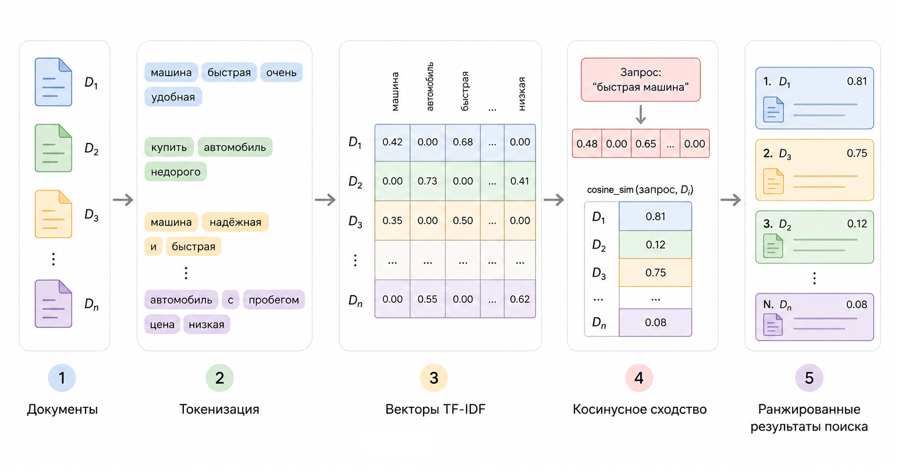

# Кейс 1. Поиск похожих документов (чистый PHP)

Одно из самых естественных применений TF–IDF – поиск похожих текстов. Именно ради таких задач эта идея когда-то и появилась: нужно было научить систему находить документы, максимально близкие к запросу пользователя.

Сегодня подобная логика используется практически везде:

* в поисковых системах
* в корпоративных базах знаний
* в helpdesk-системах
* в FAQ
* в поиске по логам и тикетам
* в документации

И что особенно интересно – для решения этой задачи вовсе не обязательно использовать нейросети или большие языковые модели. Во многих случаях достаточно классического TF–IDF и простой математики.

#### Цель кейса

Построить мини-поисковик на чистом PHP, который:

1. принимает набор документов
2. принимает текстовый запрос пользователя
3. превращает тексты в TF–IDF векторы
4. вычисляет similarity между запросом и документами
5. возвращает наиболее похожие документы

#### Сценарий

Представим простую базу знаний технической поддержки.

У нас есть несколько документов:

```
1. Как сбросить пароль пользователя
2. Ошибка подключения к базе данных
3. Настройка SMTP для отправки почты
4. Восстановление доступа к аккаунту
```

Пользователь вводит запрос:

```
не могу восстановить пароль
```

Система должна понять, какие документы наиболее близки по смыслу.

#### Почему TF–IDF подходит для этой задачи

Если использовать обычный Bag of Words, система будет просто считать совпадения слов. Но проблема в том, что некоторые слова встречаются слишком часто:

* "как"
* "к"
* "для"
* "ошибка"

Они почти ничего не говорят о смысле документа.

TF–IDF исправляет это:

* важные и редкие слова получают больший вес
* распространённые слова почти игнорируются

Именно поэтому запрос "восстановить пароль" окажется ближе к документам про доступ и пароль, а не к настройке SMTP.

#### Архитектура решения

Наш pipeline будет выглядеть так:

```
Документы
   ↓
Токенизация
   ↓
TF–IDF векторы
   ↓
TF–IDF вектор запроса
   ↓
Cosine Similarity
   ↓
Сортировка результатов
```

<figure><figcaption><p>19.4 Конвейер поиска</p></figcaption></figure>

**Шаг 1. Подготавливаем документы**

```php
$documents = [
    1 => 'как сбросить пароль пользователя',
    2 => 'ошибка подключения к базе данных',
    3 => 'настройка smtp для отправки почты',
    4 => 'восстановление доступа к аккаунту',
];

$query = 'восстановить пароль';
```

**Шаг 2. Токенизация**

Для простоты будем просто разбивать строку по пробелам.

```php
function tokenize(string $text): array {
    $text = mb_strtolower($text);

    return explode(' ', $text);
}
```

Преобразуем документы:

```php
$tokenizedDocs = array_map('tokenize', $documents);
$queryTokens = tokenize($query);
```

**Шаг 3. TF (Term Frequency)**

```php
function termFrequency(array $tokens): array {
    $tf = [];
    $count = count($tokens);

    foreach ($tokens as $token) {
        $tf[$token] = ($tf[$token] ?? 0) + 1;
    }

    foreach ($tf as $word => $value) {
        $tf[$word] = $value / $count;
    }

    return $tf;
}
```

**Шаг 4. IDF (Inverse Document Frequency)**

Теперь считаем, насколько слово редкое во всём корпусе.

```php
function inverseDocumentFrequency(array $documents): array {
    $df = [];
    $N = count($documents);

    foreach ($documents as $doc) {
        foreach (array_unique($doc) as $word) {
            $df[$word] = ($df[$word] ?? 0) + 1;
        }
    }

    $idf = [];

    foreach ($df as $word => $freq) {
        $idf[$word] = log($N / $freq);
    }

    return $idf;
}
```

**Шаг 5. TF–IDF вектор**

```php
function tfidf(array $tf, array $idf): array {
    $vector = [];

    foreach ($tf as $word => $value) {
        $vector[$word] = $value * ($idf[$word] ?? 0);
    }

    return $vector;
}
```

Строим векторы документов:

```php
$idf = inverseDocumentFrequency($tokenizedDocs);

$documentVectors = [];

foreach ($tokenizedDocs as $id => $tokens) {
    $tf = termFrequency($tokens);
    $documentVectors[$id] = tfidf($tf, $idf);
}
```

**Шаг 6. Вектор запроса**

```php
$queryTf = termFrequency($queryTokens);
$queryVector = tfidf($queryTf, $idf);
```

Теперь запрос пользователя представлен точно так же, как и документы.

Это очень важный момент.

После TF–IDF и документы, и запрос существуют в одном векторном пространстве.

**Шаг 7. Cosine Similarity**

Теперь нужно измерить близость между векторами.

Используем cosine similarity:

$$
cosine\_sim(A, B) =
\frac{A \cdot B}
{|A||B|}
$$

Интуитивно:

* угол маленький → документы похожи
* угол большой → документы разные

**Реализация cosine similarity**

Мы уже не раз показывали как реализовать функцию косинусного сравнения, но сделаем это ещё раз.

<details>

<summary><strong>Функция cosineSimilarity</strong></summary>

```php
function cosineSimilarity(array $a, array $b): float {
    $dot = 0;
    $normA = 0;
    $normB = 0;

    $words = array_unique(array_merge(
        array_keys($a),
        array_keys($b)
    ));

    foreach ($words as $word) {
        $va = $a[$word] ?? 0;
        $vb = $b[$word] ?? 0;

        $dot += $va * $vb;

        $normA += $va * $va;
        $normB += $vb * $vb;
    }

    if ($normA == 0 || $normB == 0) {
        return 0;
    }

    return $dot / (sqrt($normA) * sqrt($normB));
}
```


</details>

**Шаг 8. Поиск похожих документов**

```php
$results = [];

foreach ($documentVectors as $id => $vector) {
    $results[$id] = cosineSimilarity(
        $queryVector,
        $vector
    );
}

arsort($results);

print_r($results);
```

#### Результат

Пример вывода:

```
Array (
    [1] => 0.41
    [4] => 0.38
    [2] => 0
    [3] => 0
)
```

#### Интерпретация результата

Система считает наиболее похожими:

1. "как сбросить пароль пользователя"
2. "восстановление доступа к аккаунту"

И это уже выглядит вполне разумно.

Интересно, что:

* SMTP не имеет ничего общего с запросом
* ошибка базы данных тоже нерелевантна
* документы про пароль и доступ оказываются ближе

Хотя система:

* не понимает язык
* не знает смысл слов
* не использует нейросети

Она просто работает со статистикой слов.

#### Что здесь происходит на самом деле

Это очень важный момент.

TF–IDF не "понимает" текст. Он делает другое:

* строит пространство признаков
* оценивает важность слов
* превращает документы в математические объекты
* сравнивает их геометрически

Фактически поиск превращается в задачу линейной алгебры.

#### Где такой подход особенно хорош

Подобные системы отлично работают там, где:

* тексты короткие
* терминология стабильна
* важна скорость
* нужна объяснимость
* нельзя использовать тяжёлые модели

Например:

* внутренние поисковики
* enterprise knowledge base
* поиск по тикетам
* FAQ
* поиск по документации
* поиск по логам

#### Ограничения подхода

Важно понимать и слабые стороны.

Наша система:

* не знает синонимов
* не понимает контекст
* не различает формы слов
* не умеет работать со смыслом

Например:

```
восстановить пароль
```

и

```
сбросить доступ
```

для неё – почти разные вещи.

Чтобы решить это, обычно добавляют:

* [stemming](../../../vvedenie/glossarii.md#stemming)
* [lemmatization](../../../vvedenie/glossarii.md#lemmatizaciya)
* [word embeddings](../../../vvedenie/glossarii.md#embeddings-embeddingi)
* transformer-модели

Но фундамент остаётся тем же: текст всё равно превращается в вектор.

#### Ключевой вывод

Этот кейс показывает очень важную идею всей области NLP.

Даже простая статистика слов уже позволяет строить полезные поисковые системы.

Без нейросетей.\
Без GPU/TPU.\
Без LLM.

Только:&#x20;

* слова
* веса
* векторы
* немного линейной алгебры

Именно с таких систем исторически начинался поиск по тексту – и именно они до сих пор лежат внутри многих production-систем как быстрый и надёжный baseline.\
\
\
\
\
Сценарий.

Есть набор текстов (статьи, заметки, тикеты). Пользователь вводит запрос, нужно найти самый похожий текст.

Почему BoW / TF–IDF.

Это классическая задача информационного поиска, исторически именно для неё TF–IDF и придумали.

Что делаем.

– строим TF–IDF для всех документов

– строим TF–IDF для запроса

– считаем cosine similarity

– сортируем по убыванию

Практическая польза.

– поиск по базе знаний

– поиск по логам

– FAQ без LLM

Технически.

– TF–IDF: чистый PHP (из примера главы)

– cosine similarity: одна функция

– никаких библиотек

Ключевой вывод.

Даже без нейросетей можно делать осмысленный поиск.
