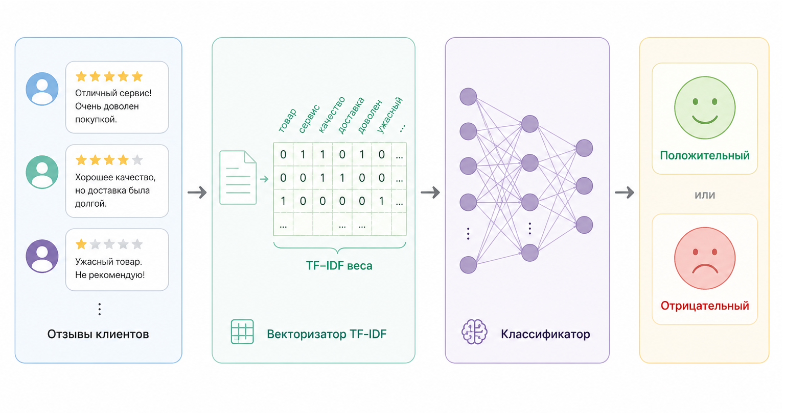

# Кейс 2. Классификация отзывов: "положительный / отрицательный" (RubixML)

Одно из самых популярных применений TF–IDF – анализ тональности текста. Компании ежедневно получают огромное количество коротких сообщений:

* отзывы клиентов
* комментарии
* тикеты поддержки
* сообщения в чатах
* оценки товаров
* письма пользователей

Ручная обработка быстро становится невозможной. Поэтому возникает естественная задача: автоматически определять, является ли отзыв положительным или отрицательным.

И здесь TF–IDF оказывается удивление эффективным.

Даже без нейросетей и больших языковых моделей можно построить систему, которая достаточно хорошо определяет настроение текста – особенно если тексты короткие и тематически однородные.

#### Цель кейса

Построить простую ML-систему на PHP, которая:

1. получает текстовые отзывы
2. превращает их в TF–IDF признаки
3. обучает классификатор
4. определяет тональность новых сообщений

Для реализации будем использовать библиотеку RubixML.

#### Сценарий

Представим интернет-магазин.

Пользователи оставляют отзывы:

```
"отличный сервис и быстрая доставка"
"ужасное качество товара"
"всё понравилось"
"поддержка отвечает очень медленно"
"прекрасный продукт"
```

Нужно автоматически определить:  положительный отзыв или отрицательный.

#### Почему TF–IDF хорошо подходит

Это как раз тот тип задач, где TF–IDF особенно силён.

Причины простые:

* тексты короткие
* словарь ограничен
* эмоциональные слова очень информативны
* редкие слова часто несут главный смысл

Например:

* "прекрасный"
* "ужасный"
* "отличный"
* "медленно

имеют значительно больший смысловой вес, чем:&#x20;

* "и"
* "очень"
* "это"

TF–IDF автоматически усиливает важные слова и ослабляет шум.

#### Архитектура решения

Наш pipeline будет выглядеть так:

```
Текст
   ↓
TF–IDF Vectorizer
   ↓
Числовой вектор
   ↓
Классификатор
   ↓
positive / negative
```

<figure><figcaption><p>Рис. 5.2-5. Конвейер анализа настроений</p></figcaption></figure>

#### Почему здесь уже нужен ML

В предыдущем кейсе мы сравнивали документы напрямую через [cosine similarity](../../../vvedenie/glossarii.md#cosine-similarity-kosinusnoe-skhodstvo).

Но теперь задача другая.

Нужно:

* не просто искать похожие тексты
* а научиться принимать решение по примерам

То есть модель должна сама понять:

* какие слова характерны для positive
* какие для negative

И здесь появляется supervised learning.

#### Подготовка данных

Для начала создадим небольшой датасет.

```php
$samples = [
    'отличный товар без проблем',
    'отличный товар на высшем уровне',
    'отличный товар все понравилось',
    'отличный заказ все понравилось',
    ...
    'ужасно доставка не стоит своих денег',
    'доставка очень медленная',
    'доставка пришла поздно и качество плохое',
    'ужасная доставка и сплошные проблемы',
];

$labels = [
    'positive',
    'positive',
    'positive',
    'positive',            
    ...
    'negative',
    'negative',
    'negative',
    'negative',
];
```

`samples` – тексты.\
`labels` – правильные ответы.

#### Подключение классов

```php
use Rubix\ML\Classifiers\GaussianNB;
use Rubix\ML\Datasets\Labeled;
use Rubix\ML\Pipeline;
use Rubix\ML\Tokenizers\NGram;
use Rubix\ML\Transformers\TextNormalizer;
use Rubix\ML\Transformers\TfIdfTransformer;
use Rubix\ML\Transformers\WordCountVectorizer;
```

#### Почему Naive Bayes здесь особенно хорош

Naive Bayes – исторически один из самых популярных алгоритмов для текстовой классификации.

Почему?

Потому что:

* работает быстро
* хорошо подходит для разреженных TF–IDF векторов
* отлично чувствует частоты слов
* требует мало данных

Для текстов это очень сильный baseline.

#### Создаём dataset

```php
$dataset = Labeled::build($samples, $labels);
```

#### Создаём pipeline

Теперь объединяем TF–IDF и классификатор в одну цепочку.

```php
$estimator = new Pipeline(
    [
        new TextNormalizer(),
        new WordCountVectorizer(tokenizer: new NGram(1, 2)),
        new TfIdfTransformer(),
    ],
    new GaussianNB()
);

$predictions = $estimator->train($dataset);
```

Это очень важный момент.

TF–IDF здесь – не отдельная модель, а этап подготовки признаков.

#### Обучение модели

```php
$estimator->train($dataset);
```

На этом этапе происходит следующее:

1. тексты превращаются в TF–IDF векторы
2. модель анализирует статистику слов
3. строится распределение признаков для классов

#### Проверяем модель

Теперь попробуем новые отзывы.

```php
$examples = [
    ['отличный товар'],
    ['сервис просто ужасный'],
    ['доставка очень быстрая'],
    ['качество плохое'],
];
```

#### Предсказываем:

```php
$predictions = $estimator->predict(Unlabeled::build($examples));

print_r($predictions);
```

<details>

<summary>Кейс 2. Полный пример кода</summary>

```php
use Rubix\ML\Classifiers\GaussianNB;
use Rubix\ML\Datasets\Labeled;
use Rubix\ML\Pipeline;
use Rubix\ML\Tokenizers\NGram;
use Rubix\ML\Transformers\TextNormalizer;
use Rubix\ML\Transformers\TfIdfTransformer;
use Rubix\ML\Transformers\WordCountVectorizer;

// Обучающие данные
$samples = [
    'отличный товар без проблем' => 'positive',
    'отличный товар на высшем уровне' => 'positive',
    'отличный товар все понравилось' => 'positive',
    'отличный товар всем рекомендую' => 'positive',
    'отличный товар ожидания оправданы' => 'positive',
    'отличный товар приятно удивил' => 'positive',
    'отличный товар очень порадовал' => 'positive',
    'отличный товар работает отлично' => 'positive',
    'отличный товар стоит своих денег' => 'positive',
    'отличный товар супер качество' => 'positive',
    'отличный интерфейс без проблем' => 'positive',
    'отличный интерфейс на высшем уровне' => 'positive',
    'отличный интерфейс все понравилось' => 'positive',
    'отличный интерфейс всем рекомендую' => 'positive',
    'отличный интерфейс ожидания оправданы' => 'positive',
    'отличный интерфейс приятно удивил' => 'positive',
    'отличный интерфейс очень порадовал' => 'positive',
    'отличный интерфейс работает отлично' => 'positive',
    'отличный интерфейс стоит своих денег' => 'positive',
    'отличный интерфейс супер качество' => 'positive',
    'отличный заказ без проблем' => 'positive',
    'отличный заказ на высшем уровне' => 'positive',
    'отличный заказ все понравилось' => 'positive',
    'отличный заказ всем рекомендую' => 'positive',
    'отличный заказ ожидания оправданы' => 'positive',
    'отличный заказ приятно удивил' => 'positive',
    'отличный заказ очень порадовал' => 'positive',
    'отличный заказ работает отлично' => 'positive',
    'отличный заказ стоит своих денег' => 'positive',
    'отличный заказ супер качество' => 'positive',
    'отличный опыт без проблем' => 'positive',
    'отличный опыт на высшем уровне' => 'positive',
    'отличный опыт все понравилось' => 'positive',
    'отличный опыт всем рекомендую' => 'positive',
    'отличный опыт ожидания оправданы' => 'positive',
    'отличный опыт приятно удивил' => 'positive',
    'отличный опыт очень порадовал' => 'positive',
    'отличный опыт работает отлично' => 'positive',
    'отличный опыт стоит своих денег' => 'positive',
    'отличный опыт супер качество' => 'positive',
    'отличный поддержка без проблем' => 'positive',
    'отличный поддержка на высшем уровне' => 'positive',
    'отличный поддержка все понравилось' => 'positive',
    'отличный поддержка всем рекомендую' => 'positive',
    'отличный поддержка ожидания оправданы' => 'positive',
    'отличный поддержка приятно удивил' => 'positive',
    'отличный поддержка очень порадовал' => 'positive',
    'отличный поддержка работает отлично' => 'positive',
    'отличный поддержка стоит своих денег' => 'positive',
    'отличный поддержка супер качество' => 'positive',
    'отличный доставка без проблем' => 'positive',
    'отличный доставка на высшем уровне' => 'positive',
    'отличный доставка все понравилось' => 'positive',
    'отличный доставка всем рекомендую' => 'positive',
    'отличный доставка ожидания оправданы' => 'positive',
    'отличный доставка приятно удивил' => 'positive',
    'отличный доставка очень порадовал' => 'positive',
    'отличный доставка работает отлично' => 'positive',
    'отличный доставка стоит своих денег' => 'positive',
    'отличный доставка супер качество' => 'positive',
    'отличный приложение без проблем' => 'positive',
    'отличный приложение на высшем уровне' => 'positive',
    'отличный приложение все понравилось' => 'positive',
    'отличный приложение всем рекомендую' => 'positive',
    'отличный приложение ожидания оправданы' => 'positive',
    'отличный приложение приятно удивил' => 'positive',
    'отличный приложение очень порадовал' => 'positive',
    'отличный приложение работает отлично' => 'positive',
    'отличный приложение стоит своих денег' => 'positive',
    'отличный приложение супер качество' => 'positive',
    'прекрасный сервис без проблем' => 'positive',
    'прекрасный сервис на высшем уровне' => 'positive',
    'прекрасный сервис все понравилось' => 'positive',
    'прекрасный сервис всем рекомендую' => 'positive',
    'прекрасный сервис ожидания оправданы' => 'positive',
    'прекрасный сервис приятно удивил' => 'positive',
    'прекрасный сервис очень порадовал' => 'positive',
    'прекрасный сервис работает отлично' => 'positive',
    'прекрасный сервис стоит своих денег' => 'positive',
    'прекрасный сервис супер качество' => 'positive',
    'прекрасный товар без проблем' => 'positive',
    'прекрасный товар на высшем уровне' => 'positive',
    'прекрасный товар все понравилось' => 'positive',
    'прекрасный товар всем рекомендую' => 'positive',
    'прекрасный товар ожидания оправданы' => 'positive',
    'прекрасный товар приятно удивил' => 'positive',
    'прекрасный товар очень порадовал' => 'positive',
    'прекрасный товар работает отлично' => 'positive',
    'прекрасный товар стоит своих денег' => 'positive',
    'прекрасный товар супер качество' => 'positive',
    'доставка очень быстрая' => 'positive',
    'очень быстрая доставка и отличный сервис' => 'positive',
    'доставка пришла быстро и все понравилось' => 'positive',
    'ужасный сервис не рекомендую' => 'negative',
    'ужасный сервис полное разочарование' => 'negative',
    'ужасный сервис очень много ошибок' => 'negative',
    'ужасный сервис деньги на ветер' => 'negative',
    'ужасный сервис никогда больше' => 'negative',
    'ужасный сервис работает ужасно' => 'negative',
    'ужасный сервис качество очень плохое' => 'negative',
    'ужасный сервис поддержка не отвечает' => 'negative',
    'ужасный сервис постоянные проблемы' => 'negative',
    'ужасный сервис не стоит своих денег' => 'negative',
    'ужасный товар не рекомендую' => 'negative',
    'ужасный товар полное разочарование' => 'negative',
    'ужасный товар очень много ошибок' => 'negative',
    'ужасный товар деньги на ветер' => 'negative',
    'ужасный товар никогда больше' => 'negative',
    'ужасный товар работает ужасно' => 'negative',
    'ужасный товар качество очень плохое' => 'negative',
    'ужасный товар поддержка не отвечает' => 'negative',
    'ужасный товар постоянные проблемы' => 'negative',
    'ужасный товар не стоит своих денег' => 'negative',
    'ужасный продукт не рекомендую' => 'negative',
    'ужасный продукт полное разочарование' => 'negative',
    'ужасный продукт очень много ошибок' => 'negative',
    'ужасный продукт деньги на ветер' => 'negative',
    'ужасный продукт никогда больше' => 'negative',
    'ужасный продукт работает ужасно' => 'negative',
    'ужасный продукт качество очень плохое' => 'negative',
    'ужасный продукт поддержка не отвечает' => 'negative',
    'ужасный продукт постоянные проблемы' => 'negative',
    'ужасный продукт не стоит своих денег' => 'negative',
    'ужасный магазин не рекомендую' => 'negative',
    'ужасный магазин полное разочарование' => 'negative',
    'ужасный магазин очень много ошибок' => 'negative',
    'ужасный магазин деньги на ветер' => 'negative',
    'ужасный магазин никогда больше' => 'negative',
    'ужасный магазин работает ужасно' => 'negative',
    'ужасный магазин качество очень плохое' => 'negative',
    'ужасный магазин поддержка не отвечает' => 'negative',
    'ужасный магазин постоянные проблемы' => 'negative',
    'ужасный магазин не стоит своих денег' => 'negative',
    'ужасный интерфейс не рекомендую' => 'negative',
    'ужасный интерфейс полное разочарование' => 'negative',
    'ужасный интерфейс очень много ошибок' => 'negative',
    'ужасный интерфейс деньги на ветер' => 'negative',
    'ужасный интерфейс никогда больше' => 'negative',
    'ужасный интерфейс работает ужасно' => 'negative',
    'ужасный интерфейс качество очень плохое' => 'negative',
    'ужасный интерфейс поддержка не отвечает' => 'negative',
    'ужасный интерфейс постоянные проблемы' => 'negative',
    'ужасный интерфейс не стоит своих денег' => 'negative',
    'ужасный заказ не рекомендую' => 'negative',
    'ужасный заказ полное разочарование' => 'negative',
    'ужасный заказ очень много ошибок' => 'negative',
    'ужасный заказ деньги на ветер' => 'negative',
    'ужасный заказ никогда больше' => 'negative',
    'ужасный заказ работает ужасно' => 'negative',
    'ужасный заказ качество очень плохое' => 'negative',
    'ужасный заказ поддержка не отвечает' => 'negative',
    'ужасный заказ постоянные проблемы' => 'negative',
    'ужасный заказ не стоит своих денег' => 'negative',
    'ужасный опыт не рекомендую' => 'negative',
    'ужасный опыт полное разочарование' => 'negative',
    'ужасный опыт очень много ошибок' => 'negative',
    'ужасный опыт деньги на ветер' => 'negative',
    'ужасный опыт никогда больше' => 'negative',
    'ужасный опыт работает ужасно' => 'negative',
    'ужасный опыт качество очень плохое' => 'negative',
    'ужасный опыт поддержка не отвечает' => 'negative',
    'ужасный опыт постоянные проблемы' => 'negative',
    'ужасный опыт не стоит своих денег' => 'negative',
    'ужасный поддержка не рекомендую' => 'negative',
    'ужасный поддержка полное разочарование' => 'negative',
    'ужасный поддержка очень много ошибок' => 'negative',
    'ужасный поддержка деньги на ветер' => 'negative',
    'ужасный поддержка никогда больше' => 'negative',
    'ужасный поддержка работает ужасно' => 'negative',
    'ужасный поддержка качество очень плохое' => 'negative',
    'ужасный поддержка поддержка не отвечает' => 'negative',
    'ужасный поддержка постоянные проблемы' => 'negative',
    'ужасный поддержка не стоит своих денег' => 'negative',
    'ужасный доставка не рекомендую' => 'negative',
    'ужасный доставка полное разочарование' => 'negative',
    'ужасный доставка очень много ошибок' => 'negative',
    'ужасный доставка деньги на ветер' => 'negative',
    'ужасный доставка никогда больше' => 'negative',
    'ужасный доставка работает ужасно' => 'negative',
    'ужасный доставка качество очень плохое' => 'negative',
    'ужасный доставка поддержка не отвечает' => 'negative',
    'ужасный доставка постоянные проблемы' => 'negative',
    'ужасный доставка не стоит своих денег' => 'negative',
    'доставка очень медленная' => 'negative',
    'доставка пришла поздно и качество плохое' => 'negative',
    'ужасная доставка и сплошные проблемы' => 'negative',
];

// Разделите пары текст=>метка на примеры Rubix и целевые метки.
$labels = array_values($samples);
$samples = array_map(
    static fn (string $text): array => [$text], array_keys($samples)
);

$dataset = Labeled::build($samples, $labels);

// Text classification pipeline.
$estimator = new Pipeline(
    [
        new TextNormalizer(),
        new WordCountVectorizer(tokenizer: new NGram(1, 2)),
        new TfIdfTransformer(),
    ],
    new GaussianNB()
);

// Обучите модель на подготовленном наборе данных.
$estimator->train($dataset);

$examples = [
    ['отличный товар'],
    ['сервис просто ужасный'],
    ['доставка очень быстрая'],
    ['качество плохое'],
];

$predictions = $estimator->predict(Unlabeled::build($examples));

echo 'Предсказание:' . PHP_EOL . '------------' . PHP_EOL;

print_r($predictions);
```

</details>

#### Результат

Пример вывода:

```
Предсказание:
------------

Array (
    [0] => positive
    [1] => negative
    [2] => positive
    [3] => negative
)
```

#### Что здесь особенно интересно

Модель:

* не знает грамматику
* не понимает смысл текста
* не умеет рассуждать

Но она уже умеет замечать статистические закономерности.

Например:

* "отличный" часто встречается в positive
* "ужасный" часто встречается в negative

TF–IDF усиливает такие слова, а Naive Bayes использует их как признаки для классификации.

#### Почему это работает неожиданно хорошо

На практике TF–IDF + Naive Bayes долгое время были стандартом индустрии для текстовой классификации.

И даже сегодня такой pipeline:

* очень быстрый
* дешёвый
* интерпретируемый
* хорошо работает на небольших данных

Во многих бизнес-задачах этого более чем достаточно.

#### Практическая польза

Подобные системы используются в:

* обработке отзывов
* мониторинге репутации
* triage (сортировке) тикетов
* классификации обращений
* анализе комментариев
* автоматизации support-систем

Например:

* negative → срочно отправить оператору
* positive → сохранить в отзывы
* neutral → обработать автоматически

#### Ограничения подхода

Но важно понимать ограничения.

Наша модель:

* не понимает сарказм
* плохо работает с длинным контекстом
* не различает сложные смыслы
* не знает семантику

Например:

```
"ну просто великолепно, опять всё сломалось"
```

может быть ошибочно определено как positive из-за слова "великолепно".

Это одна из причин, почему позже появились embeddings и transformer-модели.

#### Что здесь важно понять концептуально

Этот кейс показывает очень важную идею машинного обучения.

ML – это не обязательно сложная нейросеть.

Во многих задачах достаточно:

* хорошего представления признаков
* простого классификатора
* качественных данных

Именно TF–IDF здесь играет ключевую роль. Он превращает текст в информативный вектор признаков, с которым уже умеют работать обычные ML-алгоритмы.

#### Ключевой вывод

TF–IDF + простой классификатор – это один из самых сильных базовых подходов в NLP.

Он:

* быстрый
* понятный
* дешёвый
* объяснимый
* неожиданно эффективный

Именно поэтому даже сегодня многие production-системы начинают не с нейросетей, а с такого baseline.

Потому что очень часто этого уже достаточно.


Чтобы самостоятельно протестировать этот код, воспользуйтесь [онлайн-демонстрацией](https://aiwithphp.org/books/ai-for-php-developers/examples/part-5/bag-of-words-and-tf-idf) для его запуска.

