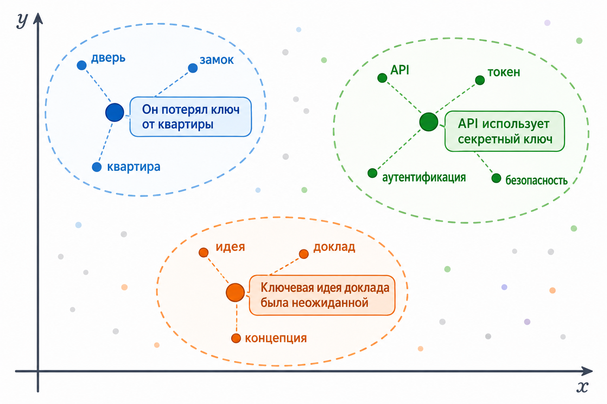

# Кейс 1. Один термин – разные смыслы (контекстные эмбеддинги предложений)

#### Цель кейса

Показать на практическом примере, что современные трансформерные модели работают не с отдельными словами, а с контекстом, в котором эти слова используются.

Мы часто говорим, что слово "ключ" может иметь разные значения. Для человека это очевидно: ключ может открывать дверь, использоваться для аутентификации в API или обозначать главную идею текста. Однако для классических моделей со статическими эмбеддингами все эти варианты были бы представлены одним фиксированным вектором независимо от контекста использования.

В этом кейсе мы увидим, как контекст влияет на векторные представления текста и почему одинаковые слова в разных предложениях могут приводить к различным семантическим представлениям.

#### Постановка задачи

Возьмём шесть предложений:

```
Он потерял ключ от квартиры
Она забыла ключи от дома
Ключ к пониманию темы оказался неожиданным
API использует секретный ключ
Для аутентификации API применяется ключ доступа
Главная ключевая идея помогла понять тему
```

Во всех примерах встречается слово "ключ" или производное от него. Однако смысл каждого предложения существенно отличается.

Наша задача:

1. Построить эмбеддинги предложений.
2. Вычислить косинусное сходство между ними.
3. Посмотреть, какие предложения модель считает близкими по смыслу.

#### Почему мы сравниваем предложения, а не слова

На первый взгляд может показаться, что для проверки достаточно получить эмбеддинг слова "ключ".

Но именно здесь скрывается главный урок этой главы.

Трансформер не хранит одно фиксированное представление слова. Его внутренний вектор зависит от контекста. Поэтому на практике гораздо полезнее сравнивать эмбеддинги предложений или фрагментов текста, поскольку они уже содержат информацию обо всём окружении слова.

Именно так работают современные системы семантического поиска, RAG-системы и интеллектуальные помощники.

Если бы мы хотели исследовать именно контекстные представления слова "ключ", нам пришлось бы извлекать скрытые состояния соответствующего токена внутри трансформера. Однако в прикладных задачах чаще используются эмбеддинги предложений и документов, поэтому в этом кейсе мы сосредоточимся именно на них.

#### Реализация на PHP

Для примера воспользуемся библиотекой transformers-php и моделью all-MiniLM-L6-v2, которая хорошо подходит для получения эмбеддингов предложений.

```php
use function Codewithkyrian\Transformers\Pipelines\pipeline;

// pipeline для извлечения эмбеддингов
$sentences = [
    'Он потерял ключ от квартиры',
    'Она забыла ключи от дома',
    'Ключ к пониманию темы оказался неожиданным',
    'API использует секретный ключ',
    'Для аутентификации API применяется ключ доступа',
    'Главная ключевая идея помогла понять тему',
];

$embedder = pipeline(
    task: 'embeddings',
    modelName: 'Xenova/paraphrase-multilingual-MiniLM-L12-v2'
);

// получаем эмбеддинги
$embeddings = $embedder($sentences);

// cosine similarity
function cosineSimilarity(array $a, array $b): float {
    $dot = 0.0;
    $normA = 0.0;
    $normB = 0.0;

    foreach ($a as $i => $v) {
        $dot += $v * $b[$i];
        $normA += $v ** 2;
        $normB += $b[$i] ** 2;
    }

    return $dot / (sqrt($normA) * sqrt($normB));
}

echo cosineSimilarity($embeddings[0], $embeddings[0]) . "\n";
echo cosineSimilarity($embeddings[0], $embeddings[1]) . "\n";
echo cosineSimilarity($embeddings[0], $embeddings[2]) . "\n";
echo cosineSimilarity($embeddings[0], $embeddings[3]) . "\n";
echo cosineSimilarity($embeddings[0], $embeddings[4]) . "\n";
echo cosineSimilarity($embeddings[0], $embeddings[5]) . "\n";

// Результат: для "ключ от квартиры"
// 0 ↔ 0 = 1.0000	↔ "ключ от квартиры"	  » полностью идентичные фразы
// 0 ↔ 1 = 0.6483	↔ "ключи от дома"	      » близкие бытовые фразы
// 0 ↔ 2 = 0.3702	↔ "ключ к пониманию"	  » есть общее слово, но смысл другой
// 0 ↔ 3 = 0.3124	↔ "секретный API-ключ"  » слово "ключ" есть, но технический домен
// 0 ↔ 4 = 0.2125	↔ "ключ доступа API"	  » слово "ключ" есть, но технический домен
// 0 ↔ 5 = 0.1191	↔ "ключевая идея"	      » метафорическое "ключевая идея", уже далеко
```

#### Анализ результатов

Точные значения будут зависеть от модели и версии эмбеддингов, однако обычно наблюдается следующая картина.

Предложение:

```
Он потерял ключ от квартиры
```

оказывается, например, достаточно далеко от предложения:

```
API использует секретный ключ
```

Несмотря на наличие общего слова "ключ", окружающий контекст совершенно разный.

В первом случае модель видит предмет физического мира: _"квартира", "дверь", "замок", "потерял"._

Во втором случае контекст связан с безопасностью и программированием: _"API", "доступ", "токен", "аутентификация", "секрет"._

Также последнее предложение:

```
Главная ключевая идея помогла понять тему
```

часто оказывается одной из наиболее удалённых точек в семантическом пространстве относительно первых двух, хотя точные значения зависят от модели и её обучения.

Для модели это не разновидность дверного или криптографического ключа, а совершенно другая семантическая область, связанная с концепциями, идеями и содержанием текста.

#### Что происходит внутри модели

Во время обработки предложения механизм self-attention анализирует весь контекст.

Для предложения:

```
Он потерял ключ от квартиры
```

при формировании контекстного представления модель учитывает слова "потерял", "квартира", "от" и другие элементы окружения.

Для предложения:

```
API использует секретный ключ
```

внимание смещается к словам: _"API", "секретный, "использует"_.

В результате контекст, в котором используется слово "ключ", оказывается различным.

Если извлечь внутренние представления соответствующего токена внутри трансформера, они будут заметно отличаться. На уровне эмбеддингов предложений это проявляется в том, что предложения попадают в разные области семантического пространства.

#### Визуализация результата

Если уменьшить размерность эмбеддингов до двух измерений с помощью PCA или t-SNE, результат можно представить следующим образом.

<figure><figcaption><p>Рис. 5.4-4. Двумерное семантическое векторное пространство после уменьшения размерности</p></figcaption></figure>

Несмотря на наличие общего слова "ключ", эмбеддинги предложений попадают в разные области семантического пространства, поскольку модель учитывает контекст, а не отдельные слова.

> "Общее слово ≠ близкие векторы"

#### Что мы узнали

Этот пример демонстрирует главное отличие трансформеров от классических моделей представления текста.

В классических статических эмбеддингах (Word2Vec, GloVe и др.) одно слово обычно соответствует одному базовому вектору независимо от контекста.

В трансформерах значение слова определяется контекстом его использования.

Поэтому современные модели способны различать омонимы, учитывать смысловые оттенки и строить гораздо более точные представления текста.

#### Выводы

1. Одно и то же слово может получать разные контекстные представления в зависимости от окружения.
2. Контекст влияет на итоговый смысл сильнее, чем отдельные слова.
3. Современные системы сравнивают не слова, а смысловые представления предложений и документов.
4. Именно благодаря этому стали возможны семантический поиск, RAG-системы и современные LLM.

Главный вывод кейса можно сформулировать одной фразой:

> Контекст задаёт геометрию пространства. Именно контекст определяет, какое значение слова будет отражено в его векторном представлении.


Чтобы самостоятельно протестировать этот код, воспользуйтесь [онлайн-демонстрацией](https://aiwithphp.org/books/ai-for-php-developers/examples/part-5/transformers-from-static-vectors-to-understanding-meaning) для его запуска.

