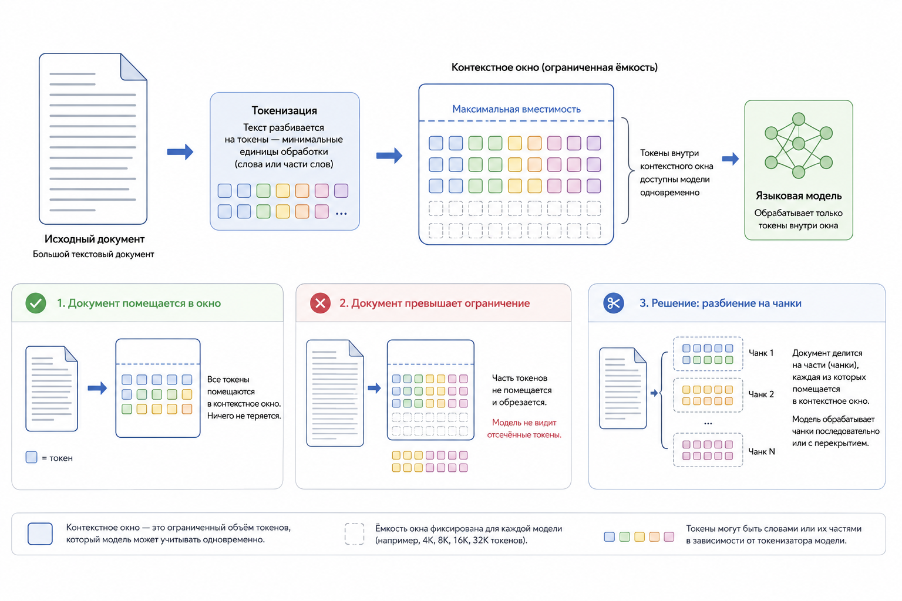

# Кейс 1. Поместится ли документ в окно модели?

#### Быстрая оценка размера контекста на чистом PHP

Работа с LLM часто начинается с простой задачи: отправить документ в модель и получить ответ.

На первый взгляд кажется, что проблема решается просто: "У меня есть PDF с инструкцией. Передам его в промпт и попрошу модель сделать краткое содержание."

Но уже на практике появляется ограничение: модель имеет конечное контекстное окно.

Если документ слишком большой, запрос не выполнится или часть информации будет потеряна. Поэтому перед отправкой данных в LLM необходимо понимать хотя бы приблизительный размер текста в токенах.

В этом кейсе мы реализуем простой механизм оценки размера контекста на чистом PHP без использования сторонних библиотек.

#### Цель кейса

Научиться:

* оценивать размер текста перед отправкой в LLM
* понимать связь между символами и токенами
* проверять, помещается ли документ в контекстное окно модели
* создавать первый простой слой контроля размера входных данных

#### Сценарий

Представим SaaS-платформу поддержки клиентов.

У нас есть база знаний:

```
knowledge-base.txt
```

В ней находятся:

* инструкции для пользователей
* ответы службы поддержки
* техническая документация

Перед внедрением AI-ассистента нужно понять: можем ли мы отправлять всю базу знаний в один запрос?

Например:

```
Документ: 200 страниц
Размер: 150 000 символов
```

Вопрос: поместится ли он в модель?

#### Как человек оценивает текст

Человек обычно думает в словах:

```
100 страниц текста ≈ много информации
```

Но LLM работает не со страницами и не со словами.

Для модели текст выглядит так:

```
Документ
   ↓
Токены
   ↓
Контекстное окно
   ↓
Transformer
```

Поэтому нам нужно приблизительно перевести размер текста в количество токенов.

#### Простая оценка количества токенов

В реальных системах используется специальный токенизатор модели.

Например:

* [TiktokenPHP](https://github.com/yethee/tiktoken-php)
* встроенные токенизаторы LLM-провайдеров

Но перед тем как подключать библиотеку, полезно понять сам принцип.

Для грубой оценки можно использовать приближение:

```
1 токен ≈ 3 символа русского текста
```

То есть:

```
Количество токенов ≈ количество символов / 3
```

#### Реализация на PHP

Создадим простой анализатор размера документа.

```php
$text = file_get_contents('knowledge-base.txt');

$chars = mb_strlen($text);

$estimatedTokens = (int)($chars / 3);

echo "Символов: {$chars}\n";
echo "Примерное количество токенов: {$estimatedTokens}\n";

// Результат:
// Символов: 802
// Примерное количество токенов (chars / 3): 267
```

Теперь мы можем получить приблизительный размер контекста.

#### Проверяем ограничение модели

Добавим проверку.&#x20;

Допустим, наша модель поддерживает:

```
128 000 токенов
```

Создадим простой валидатор:

```php
function fitsContext(int $tokens, int $limit): bool {
    return $tokens <= $limit;
}

$contextLimit = 128000;

if (fitsContext($estimatedTokens, $contextLimit)) {
    echo "Документ помещается";
} else {
    echo "Нужно разбивать документ";
}
```

Теперь перед отправкой запроса мы можем принять решение:

```
                 ┌ →  Документ небольшой → Отправляем напрямую
Размер документа |
                 └ →  Документ большой → Используем chunking
```

#### Пример результата

Допустим:

```
Размер документа: 210 000 символов
```

Расчёт:&#x20;

```
210000 / 3 = 70 000 токенов
```

Получаем:

```
Примерное количество токенов: 70 000
```

Проверка:

```
70000 < 128000
```

Результат:

```
Документ можно отправить целиком
```

Другой пример:

```
Размер документа: 600 000 символов
```

Расчёт:

```
600000 / 3 = 200 000 токенов
```

Проверка:

```
200000 > 128000
```

Результат:

```
Документ слишком большой
Необходимо использовать chunking
```

<figure><figcaption><p>Рис. 5.5-4. Документ и ограничение контекстного окна</p></figcaption></figure>

#### Что важно понимать

Этот пример специально упрощён.

Он не показывает точное количество токенов, потому что:

* разные модели используют разные токенизаторы
* русский и английский текст дают разное количество токенов
* код и таблицы могут токенизироваться иначе

Например:

```
authentication
```

и

```
аутентификация пользователя
```

могут занимать разное количество токенов, несмотря на похожий смысл.

#### Почему этот подход всё равно полезен

Несмотря на неточность, такая оценка полезна как первый защитный слой.

Например, перед запросом:

```php
if ($estimatedTokens > 50_000) {
    // запускаем chunking
}
```

Мы можем автоматически переключить обработку документа.

Это уже часть реальной архитектуры AI-приложения:

```
Пользовательский документ
     |
     ↓          ┌ → Маленький документ → LLM
 Оценка размера |
                └ → Большой документ → Chunking → Embeddings → RAG
```

#### Практический вывод

Даже простая проверка количества символов позволяет избежать одной из самых частых ошибок при интеграции LLM: отправлять большие документы напрямую в модель.

Контекстное окно является ограниченным ресурсом, таким же как память или время выполнения запроса.

В следующих кейсах мы перейдём от приблизительной оценки к реальной работе с токенами через TiktokenPHP и построим механизм подготовки документов для RAG-систем.


Чтобы самостоятельно протестировать этот код, воспользуйтесь [онлайн-демонстрацией](https://aiwithphp.org/books/ai-for-php-developers/examples/part-5/tokens-context-windows-and-chunking-how-llm-sees-text) для его запуска.

