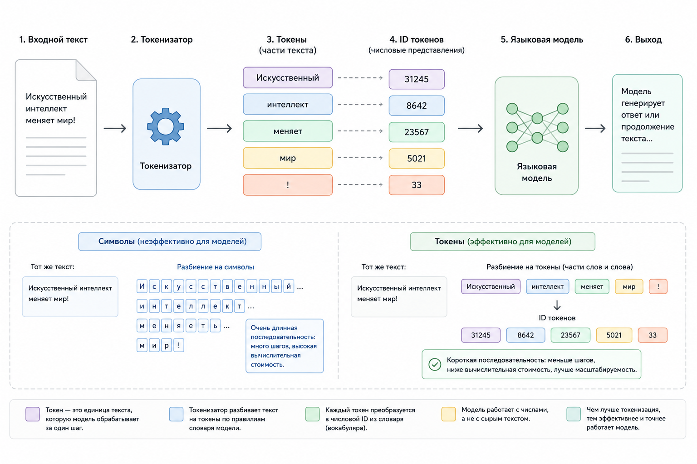

# Кейс 2. Под микроскопом токенизатора

#### Считаем реальные токены

В предыдущем кейсе мы сделали простую оценку размера текста через количество символов. Такой подход полезен для быстрой проверки, но он не показывает реальную картину.

Языковая модель не работает с символами.

Для неё текст сначала проходит через токенизатор:

```
Текст
   ↓
Токены
   ↓
Token IDs
   ↓
Модель
```

Поэтому два документа одинакового размера в символах могут занимать разное количество места в контекстном окне.

В этом кейсе мы заменим приблизительную оценку на настоящий подсчёт токенов с помощью библиотеки [TiktokenPHP](https://github.com/yethee/tiktoken-php).

#### Цель кейса

Научиться:

* получать реальное количество токенов текста
* использовать TiktokenPHP в PHP-проекте
* понимать разницу между символами и токенами
* оценивать настоящий размер контекста перед отправкой в LLM

#### Сценарий

Представим AI-помощника для службы поддержки.

У нас есть файл:

```
customer-manual.txt
```

В нём находится документация продукта:

* описание функций
* инструкции
* ответы на частые вопросы

Перед отправкой документа в LLM нужно узнать:

* сколько он занимает токенов
* помещается ли он в контекстное окно
* сколько места останется для ответа модели

#### Установка TiktokenPHP

Для работы используем библиотеку:

```bash
composer require yethee/tiktoken
```

После установки подключаем автозагрузчик Composer.

#### Подключение токенизатора

Создаём экземпляр энкодера.

```php
use Yethee\Tiktoken\EncoderProvider;

$provider = new EncoderProvider();
$encoder = $provider->getForModel('gpt-4o');
```

Теперь `$encoder` использует схему токенизации, соответствующую выбранной модели.

#### Подсчёт токенов документа

Читаем файл:

```php
$text = file_get_contents('customer-manual.txt');
```

Получаем токены:

```php
$tokens = $encoder->encode($text);
```

И считаем их количество:

```php
$count = count($tokens);
echo "Токенов: {$count}";
```

Теперь мы получили реальный размер текста с точки зрения модели.

<details>

<summary>Кейс 2. Полный пример кода на чистом PHP</summary>

```php
use Yethee\Tiktoken\EncoderProvider;

$provider = new EncoderProvider();
$encoder = $provider->getForModel('gpt-4o');
$text = file_get_contents('customer-manual.txt');

$tokens = $encoder->encode($text);

echo "Считаем реальные токены:\n";
echo "Символов: ";
echo mb_strlen($text) . "\n";
echo "Токенов: ";
echo count($tokens) . "\n";
```

</details>

#### Сравниваем символы и токены

Допустим, получили результат:

```
Считаем реальные токены:
Символов: 847
Токенов: 216
```

На первый взгляд кажется:

```
847 символов
```

должны превратиться примерно в:

```
216 токенов
```

Для данного текста это соотношение выглядит реалистично. Однако оно не является универсальным: для других языков, программного кода, таблиц, JSON и HTML количество токенов может отличаться значительно.&#x20;

#### Почему количество токенов отличается

Рассмотрим два текста:

**Вариант 1**

```
User authentication system
```

**Вариант 2**

```
Система аутентификации пользователя
```

Для человека оба предложения имеют похожий смысл.

Но токенизатор может разбить их по-разному.

Например:

```
User
authentication
system
```

может быть:

```
3 токена
```

А русский вариант:

```
Система
аутентификации
пользователя
```

может превратиться в большее количество частей.

#### Посмотрим сами токены

TiktokenPHP позволяет получить не только количество, но и сами токены.

```php
$tokens = $encoder->encode('Система аутентификации пользователя');
print_r($tokens);
```

Результат будет выглядеть примерно так:

```
Array (
    [0] => 3043
    [1] => 144225
    [2] => 960
    [3] => 3574
    [4] => 43706
    [5] => 119310
    [6] => 106778
)
```

Количество элементов массива зависит от текста и токенизатора. Для русских фраз число токенов часто оказывается больше количества слов.

Это числовые идентификаторы токенов из словаря токенизатора. Именно эти идентификаторы передаются модели на вход после токенизации.

#### Обратное преобразование

Можно восстановить текст из токенов:

```php
$decoded = $encoder->decode($tokens);
echo $decoded;
```

Получим:

```
Система аутентификации пользователя
```

То есть процесс выглядит так:

```
Текст
   ↓
Encode
   ↓
Token IDs
   ↓
Decode
   ↓
Текст
```

#### Практическая проверка контекста

Теперь добавим ограничение.

Допустим:

```php
$contextLimit = 128000;
```

В реальном приложении не стоит использовать весь лимит контекста под документ. Часть токенов потребуется для системных инструкций, сообщений пользователя и ответа модели.

Проверяем:

```php
if (count($tokens) > $contextLimit) {
    echo 'Документ слишком большой';
} else {
    echo 'Документ помещается';
}
```

Теперь перед отправкой запроса приложение может автоматически принимать решение.

> Важно помнить, что контекстное окно включает не только документ. В него также входят системный промпт, сообщения пользователя, история диалога и ответ модели. Поэтому документ, занимающий почти весь лимит контекста, на практике может не поместиться в запрос.

#### Использование в AI-пайплайне

В реальном приложении логика будет выглядеть так:

```
Документ
   ↓
TiktokenPHP
   ↓
Подсчёт токенов
   |
   ↓              ┌ → Маленький документ → LLM
Проверка размера  |
                  └ → Большой документ → Chunking → Embeddings → RAG
```

<figure><figcaption><p>Рис. 5.5-5. Работа токенизатора</p></figcaption></figure>

#### Выводы

В этом кейсе мы заменили приблизительную оценку размера текста на настоящий подсчёт токенов.

Главные выводы:

1. LLM работает не с символами и словами, а с токенами.
2. Количество символов не показывает реальный размер контекста.
3. Для точной оценки нужно использовать токенизатор, совместимый с выбранной моделью.
4. Перед отправкой больших документов в LLM полезно проверять размер контекста программно.

TiktokenPHP становится первым инструментом контроля между приложением и языковой моделью. В следующем шаге мы будем использовать эти знания для создания правильного chunking-пайплайна.
