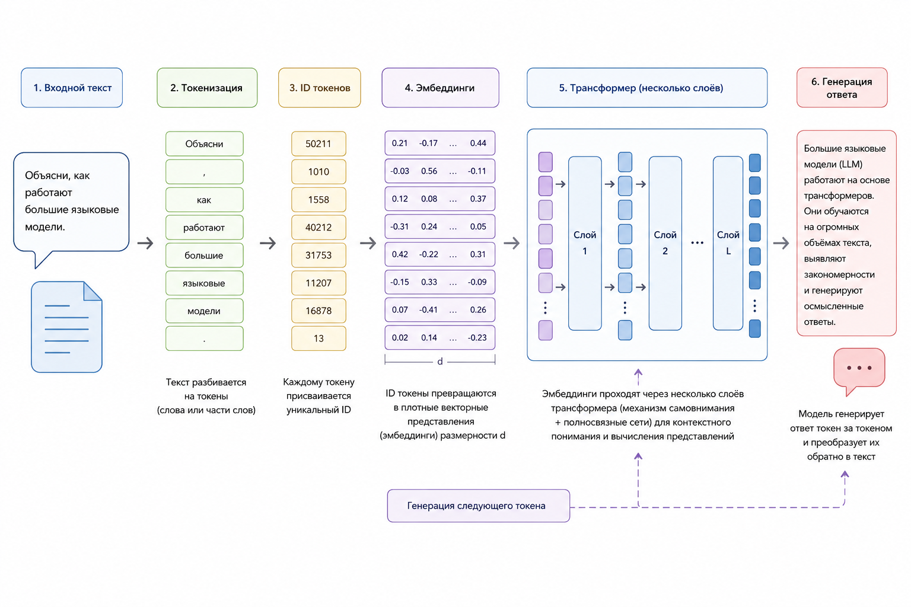
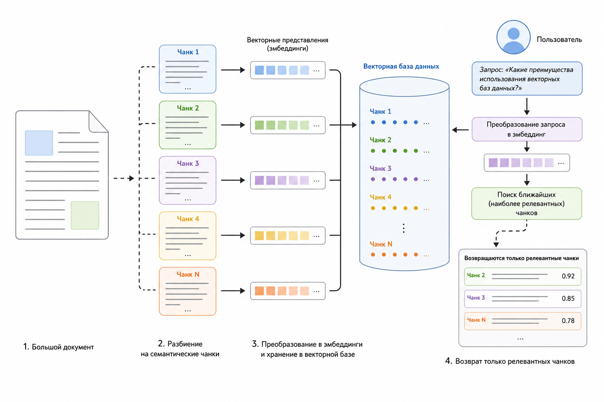
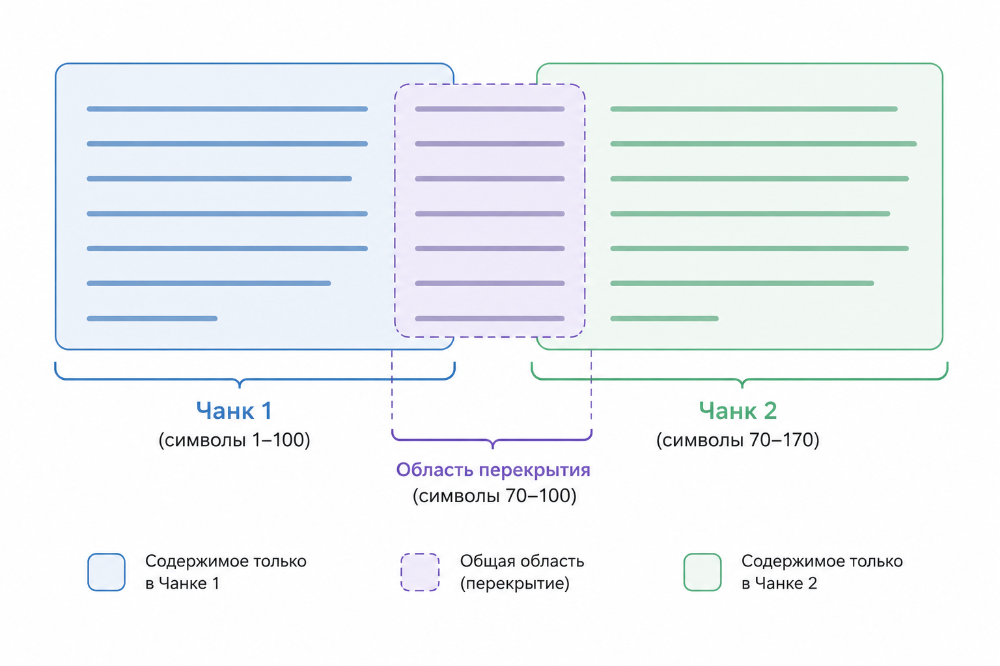

# 5.5 Токены, контекстное окно и чанкинг - как LLM видит текст

### Как LLM видит текст

До этого момента мы рассматривали эмбеддинги и трансформеры как механизмы понимания смысла текста. Однако между реальным документом и моделью существует ещё один важный слой абстракции.

Для человека текст состоит из букв, слов, предложений и абзацев. Для языковой модели всё выглядит иначе. Она никогда не видит документ целиком в привычном нам виде. Перед обработкой текст разбивается на специальные элементы – токены. Именно токены становятся базовыми единицами информации для LLM.

От того, как текст превращается в токены, зависит:

* сколько информации поместится в запрос
* сколько будет стоить обработка
* насколько качественно модель поймёт документ
* как работают RAG-системы и поиск по знаниям
* каким образом нужно разбивать большие документы на части

Поэтому понимание токенов и контекстного окна является фундаментальным навыком для любого PHP-разработчика, работающего с современными AI-системами.

### Как модель видит текст

Представим предложение:

> Клиент не может войти в личный кабинет.

Человек воспринимает его как последовательность слов.

Модель сначала выполняет токенизацию.

Условно это может выглядеть так:

```
[Кли]
[ент]
[ не]
[ может]
[ войти]
[ в]
[ личный]
[ кабинет]
[.]
```

Точное разбиение зависит от используемого токенизатора, но принцип остаётся одинаковым: текст превращается в последовательность токенов.

После этого каждый токен преобразуется в числовой идентификатор:

```
[4182]
[721]
[55]
[10341]
[9012]
...
```

Затем идентификаторы превращаются в векторы, которые уже участвуют в работе трансформера.

Получается цепочка:

```
Текст
 ↓
Токены
 ↓
Token IDs
 ↓
Векторы
 ↓
Transformer
 ↓
Ответ
```

На практике после преобразования токенов в эмбеддинги модель также получает информацию о положении токенов в последовательности (позиционные представления). Это позволяет различать порядок слов и учитывать структуру текста.

<figure><figcaption><p>Рис. 5.5-1. Путь текста внутри LLM</p></figcaption></figure>

### Что такое токен

Токен – это минимальная единица текста, с которой работает модель.

Токеном может быть:

* слово
* часть слова
* знак препинания
* число
* специальный символ

Важно понимать, что токен не имеет фиксированного размера и может соответствовать как целому слову, так и его части в зависимости от используемого токенизатора.

Например:

```
Hello world
```

может быть разбито как:

```
["Hello"]
[" world"]
```

А слово:

```
authentication
```

может превратиться в:

```
["auth"]
["entication"]
```

Для русского языка дробление обычно ещё сильнее.

Например:

```
авторизация
```

может быть разбито на:

```
["автор"]
["иза"]
["ция"]
```

Модель не понимает слов напрямую. Она получает на вход отдельные токены, однако смысл слов и фраз формируется уже в процессе обработки последовательности токенов трансформером.

### Почему используются токены, а не слова

На первый взгляд логично было бы хранить словарь слов.

Проблема заключается в размере языка.

Если использовать слова как единицы, придётся хранить:

* все словоформы
* опечатки
* новые термины
* фамилии
* названия компаний
* программный код

Количество вариантов становится практически бесконечным.

Токенизация позволяет собирать неизвестные слова из известных частей.

Например:

```
EventumXPlatform
```

может быть разбито как:

```
Event
um
X
Platform
```

Даже если такого слова никогда не существовало в обучающих данных.

### Приблизительная оценка количества токенов

Точное число зависит от модели.

Но на практике удобно использовать приблизительные правила.

Для английского языка:

```
1 токен ≈ 4 символа
```

Для русского языка:

```
1 токен ≈ 3-4 символа
```

Это очень грубая оценка. Фактическое количество токенов зависит от используемого токенизатора, языка текста, структуры документа, количества специальных символов, таблиц, кода и других факторов. Для точных расчётов всегда следует использовать токенизатор конкретной модели. Для интереса можете потестировать [токенайзер OpenAI](https://platform.openai.com/tokenizer).

Приблизительно:

| Текст         | Токены        |
| ------------- | ------------- |
| 100 слов      | 120–180       |
| 1000 слов     | 1200–1800     |
| 1 страница А4 | 500–900       |
| 100 страниц   | 50 000–90 000 |

Именно поэтому даже современные модели не могут бесконечно обрабатывать документы любого размера.

### Контекстное окно

Контекстное окно (Context Window) – это максимальное количество токенов, которое модель может одновременно видеть.

Упрощённо:

```
Контекст = инструкция + вопрос + документы + история диалога
```

Всё это должно помещаться в лимит модели.

Если лимит превышен, часть информации приходится удалять.

#### Формула контекста

Можно представить ограничение следующим образом.

$$
C = S + H + D + Q
$$

где:

* $$C$$ – общий размер контекста
* $$S$$ – системный промпт
* $$H$$ – история диалога
* $$D$$ – дополнительные документы
* $$Q$$ – текущий запрос пользователя

Если $$C > MaxContext$$, то часть данных не сможет попасть в модель.

В некоторых моделях часть контекстного окна дополнительно резервируется под генерируемый ответ. Поэтому на практике важно учитывать не только входные данные, но и предполагаемый размер ответа модели.

### Почему контекстное окно ограничено

Главная причина связана с механизмом самовнимания ([self-attention](../../vvedenie/glossarii.md#self-attention)).&#x20;

В классическом механизме self-attention каждый токен взаимодействует со всеми остальными токенами. Количество таких взаимодействий растёт квадратично.

$$
Attention\ Complexity \propto n^2
$$

Если количество токенов увеличить в два раза:

```
10 000 → 20 000
```

то вычислений станет примерно в четыре раза больше.

Поэтому увеличение контекстного окна требует всё больше памяти и вычислительных ресурсов. Современные модели используют различные оптимизации механизма внимания, однако несмотря на это большие контексты по-прежнему остаются дорогими с точки зрения вычислений и памяти.

### Проблема длинных документов

Представим PDF файл объёмом:

```
400 страниц
```

Это может быть:

```
300 000–500 000 токенов
```

Даже если модель поддерживает большое окно контекста, отправлять такой документ целиком:

* дорого
* медленно
* неэффективно

Кроме того, большая часть документа обычно не относится к текущему вопросу.

Поэтому появился подход Retrieval-Augmented Generation ([RAG](../../vvedenie/glossarii.md#retrieval-arkhitektury)), его мы рассмотрим в следующих главах.

### Откуда появляется чанкинг

Чанкинг (chunking) – это процесс разбиения документа на фрагменты, удобные для индексации, поиска и последующей передачи в модель.

Например:

```
Документ
    ↓
Глава
    ↓
Параграф
    ↓
Chunks
```

Для каждого чанка вычисляется эмбеддинг, который сохраняется вместе с текстом чанка в векторной базе данных.

Когда пользователь задаёт вопрос:

> Какие преимущества использования векторных баз данных?

Система ищет не весь документ, а только наиболее релевантные чанки.

<figure><figcaption><p>Рис. 5.5-2. Разбиение документа на чанки</p></figcaption></figure>

### Размер чанка

Один из самых важных вопросов при построении RAG-систем.

Слишком маленький chunk: 50 токенов – теряет контекст.

Например:

```
"...должен быть обработан в течение..."
```

Непонятно, что именно должно быть обработано.

Слишком большой chunk: 3000 токенов – содержит много лишней информации.

Поиск становится менее точным.

Типичные размеры:

| Сценарий     | Размер чанка (токенов) |
| ------------ | ---------------------- |
| FAQ          | 100–300                |
| Статьи       | 300–800                |
| Документация | 500–1000               |
| Книги        | 800–1500               |

На практике значения часто подбираются экспериментально.

### Что такое overlap

Если разбить текст слишком жёстко, можно потерять смысл на границах.

Например:

**Chunk 1**

```
Критические инциденты должны
```

**Chunk 2**

```
обрабатываться в течение
```

**Chunk 3**

```
15 минут после регистрации.
```

Ни один из чанков не содержит полную мысль.

Для решения используется частичное перекрытие (overlap).

### Перекрытие чанков

Overlap – это повторение части предыдущего чанка в следующем.

Например:

**Chunk 1**

```
1–500 токен
```

**Chunk 2**

```
401–900 токен
```

**Chunk 3**

```
801–1300 токен
```

Здесь:

```
401–500 и 801–00 
```

дублируются.

<figure><figcaption><p>Рис. 5.5-3. Перекрытие фрагментов (сhunk overlap)</p></figcaption></figure>

### Как выбрать overlap

Часто используются значения:

| Размер чанка | Overlap |
| ------------ | ------- |
| 200          | 20–40   |
| 500          | 50–100  |
| 1000         | 100–200 |

Типичное правило: overlap ≈ 10–20% от размера чанка.

### Чанкинг по символам и по смыслу

Существует два основных подхода.

#### Символьный чанкинг

Простейший вариант.

Например:

```
Каждые 1000 символов
```

Плюсы:

* быстро
* просто реализовать

Минусы:

* может разрезать предложение посередине
* ухудшает поиск

#### Семантический чанкинг

Система старается сохранить логические границы:

* абзацы
* разделы
* главы
* списки
* таблицы

Например:

```
Глава 1
 ↓
Chunk

Глава 2
 ↓
Chunk
```

Обычно такой подход показывает лучшие результаты для RAG, однако оптимальная стратегия чанкинга зависит от структуры данных и характера пользовательских запросов.

### Подсчёт токенов в PHP

При работе с OpenAI, а также другими моделями полезно заранее оценивать размер контекста.

Самый надёжный способ – использовать токенизатор модели.

Простейшая грубая оценка:

```php
$text = file_get_contents('document.txt');

$chars = mb_strlen($text);
$estimatedTokens = (int) ($chars / 3);

echo "Символов в document.txt: {$chars}\n";
echo "Примерно токенов: {$estimatedTokens}";

// Результат:
// Символов в document.txt: 936
// Примерно токенов: 312
```

Для русского языка такая оценка часто оказывается достаточно близкой.

### Пример простого чанкинга

Следующие примеры используются исключительно для демонстрации принципа работы чанкинга. В реальных RAG-системах разбиение текста обычно выполняется по токенам или по смысловым границам документа, а не по количеству символов.

```php
function chunkText(string $text, int $chunkSize = 1000): array {
    return mb_str_split($text, $chunkSize);
}

$text = file_get_contents('document.txt');
$chunks = chunkText($text);

echo "Пример чанков без overlap:\n";
foreach ($chunks as $index => $chunk) {
    echo ($index + 1) . '. ' . trim($chunk) . "\n";
}

// Результат:
// Пример чанков без overlap:
// 1. Большие языковые модели обрабатывают вход как токены, а не как символы
// 2. .Перед отправкой длинного документа полезно заранее оценить,поместится
// 3. ли он в контекстное окно модели и нужно ли делить текст на чанки.Когд
// ...
```

Для простоты пример разбивает текст по символам. В реальных RAG-системах чанкинг обычно выполняется по токенам или по смысловым границам документа.

Мы использовали самый простой вариант. Но он режет текст без понимания структуры.

### Чанкинг с overlap

```php
function chunkWithOverlap(string $text, int $size = 1000, int $overlap = 200): array {
    $chunks = [];

    if ($size <= $overlap) {
        return $chunks;
    }

    for ($i = 0; $i < mb_strlen($text); $i += ($size - $overlap)) {
        $chunks[] = mb_substr($text, $i, $size);
    }

    return $chunks;
}

$text = file_get_contents('document.txt');
$overlapChunks = chunkWithOverlap($text, 70, 20);

echo "Пример чанков с overlap:\n";
foreach ($overlapChunks as $index => $chunk) {
    echo ($index + 1) . '. ' . trim($chunk) . PHP_EOL;
}

// Результат:
// echo "Пример чанков с overlap:";
// 1. Большие языковые модели обрабатывают вход как токены, а не как символы
// 2. ны, а не как символы.Перед отправкой длинного документа полезно заране
// 3. мента полезно заранее оценить,поместится ли он в контекстное окно моде
// ...
```

Получаем последовательность перекрывающихся фрагментов.

Именно идея перекрывающихся фрагментов используется во многих RAG-пайплайнах, хотя на практике чанкинг обычно выполняется на уровне токенов или смысловых блоков текста.


Чтобы самостоятельно протестировать этот код, воспользуйтесь [онлайн-демонстрацией](https://aiwithphp.org/books/ai-for-php-developers/examples/part-5/tokens-context-windows-and-chunking-how-llm-sees-text) для его запуска.


### Итоги

Токены являются настоящей единицей информации для языковой модели. Любой текст перед обработкой превращается в последовательность токенов, затем в векторы и только после этого попадает в трансформер.

Контекстное окно определяет объём информации, который модель способна одновременно учитывать. Ограничения контекста напрямую влияют на стоимость, скорость и качество работы AI-систем.

При работе с большими документами используется чанкинг – разбиение текста на небольшие фрагменты, пригодные для поиска и последующей передачи в модель. Чтобы не терять смысл на границах фрагментов, применяется overlap – частичное перекрытие соседних чанков.

Понимание токенов, контекстного окна и чанкинга является фундаментом для построения эффективных RAG-систем, AI-поиска и современных интеллектуальных приложений на PHP.
