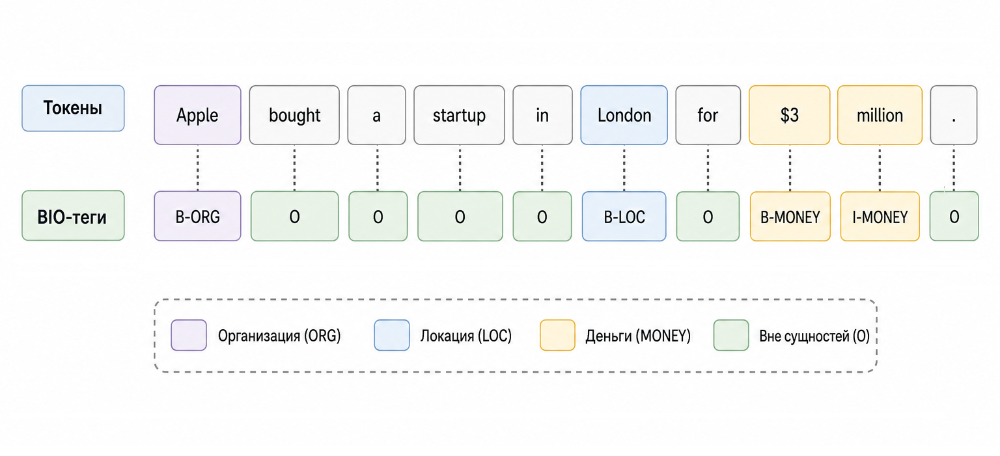
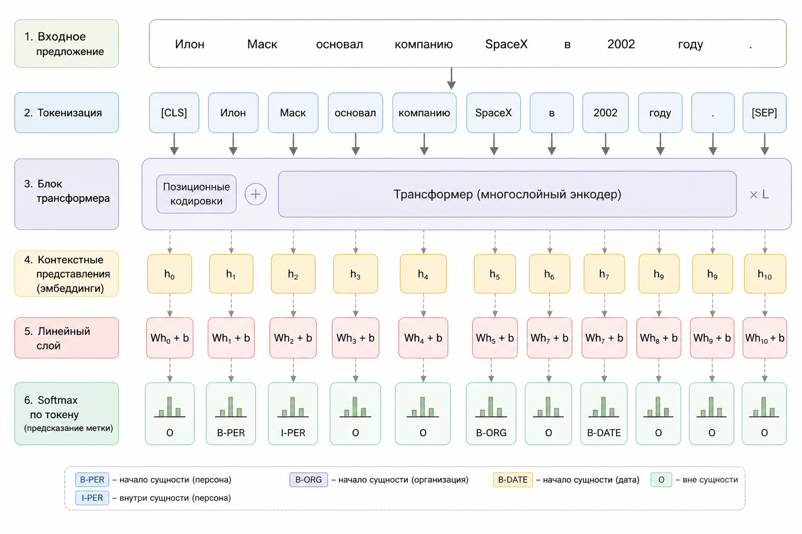

# 5.6 Named Entity Recognition (NER) – извлечение сущностей из текста

До этого момента мы работали в основном с представлением текста: превращали слова в числа, строили эмбеддинги и учились измерять смысловую близость между словами и предложениями.

Но в реальных задачах этого часто недостаточно.

Представьте, что в систему попадает новостная заметка:

> "Apple bought a startup in London for $3 million."

Человек почти мгновенно понимает, что здесь происходит. Он видит название компании, распознаёт город и замечает денежную сумму. Для нас это естественно.

Для модели всё выглядит иначе. Она получает лишь последовательность токенов и должна самостоятельно понять, какие из них представляют важные сущности.

Именно эту задачу решает Named Entity Recognition ([NER](../../vvedenie/glossarii.md#named-entity-recognition-ner-raspoznavanie-imenovannykh-sushnostei)) – распознавание именованных сущностей.

По сути, мы хотим не просто читать текст как набор слов, а находить внутри него структурированные данные: людей, компании, города, даты, денежные суммы и многое другое.

Давайте посмотрим, как такая задача выглядит с математической точки зрения.

### Что такое NER математически

Пусть текст – это последовательность токенов:

$$
x = (x_1, x_2, ..., x_n)
$$

Наша цель – предсказать последовательность меток:

$$
y = (y_1, y_2, ..., y_n)
$$

Каждый $$y_i$$ – класс токена, например:

* PERSON
* ORG
* LOC
* MONEY
* O (не сущность)
* и т.д.

Модель оценивает:

$$
P(y_1, y_2, ..., y_n \mid x_1, ..., x_n)
$$

В простейшем варианте – независимо по каждому токену:

$$
P(y_1,\ldots,y_n \mid x)
=
\prod_{i=1}^{n} P(y_i \mid x)
$$

То есть предполагается, что метки токенов независимы друг от друга, и для каждого токена отдельно вычисляется вероятность его класса:

$$
P(y_i \mid x)
$$

На первый взгляд задача кажется простой. Можно классифицировать каждый токен независимо от остальных.

Однако такой подход быстро сталкивается с проблемами.

Возьмём слово "Apple". Если смотреть только на него, невозможно понять, идёт речь о фрукте или о компании. Ответ появляется только после анализа окружающих слов.

Именно поэтому контекст становится ключевым элементом любой современной NER-модели.

### Почему Bag of Words здесь не работает

Здесь мы впервые сталкиваемся с серьёзным ограничением Bag of Words.

Раньше потеря порядка слов не всегда была критичной. Для задач вроде классификации документа информации о частоте слов часто оказывалось достаточно.

Но для NER порядок слов играет решающую роль.

Например, возьмём фразу:

> "Bank of America"

Если смотреть на слова по отдельности, тип сущности определить сложно.

Слово "America" может обозначать географический объект, а слово "Bank" само по себе вообще не является названием конкретной организации.

Но вместе "Bank of America" образует единую сущность типа ORG (организация).

Поэтому NER требует создания моделей, которые учитывают контекст и взаимосвязи между токенами: [RNN](../../vvedenie/glossarii.md#rnn-recurrent-neural-network-rekurrentnaya-neironnaya-set), [LSTM](../../vvedenie/glossarii.md#lstm-long-short-term-memory), а также современные [Transformer-модели](../../vvedenie/glossarii.md#transformer-modeli).

### BIO-разметка

Даже если модель научилась понимать контекст, остаётся ещё один вопрос. Как объяснить ей, где сущность начинается и где заканчивается?&#x20;

Например, "John Smith" – это одна сущность или две?

Для решения этой задачи обычно используется схема BIO (одна из наиболее распространённых схем разметки, хотя существуют и другие варианты):

* B-XXX (Beginning) – начало сущности
* I-XXX (Inside) – продолжение
* O (Outside) – вне сущности

Допустим, у нас есть текст:&#x20;

> "Apple bought a startup in London for $3 million from John Smith"

BIO разметка по нему покажет следующий результат:

| Токен   | Метка   |
| ------- | ------- |
| Apple   | B-ORG   |
| bought  | O       |
| a       | O       |
| startup | O       |
| in      | O       |
| London  | B-LOC   |
| for     | O       |
| $3      | B-MONEY |
| million | I-MONEY |
| from    | O       |
| John    | B-PER   |
| Smith   | I-PER   |

Это уже не классификация всего текста целиком. Это классификация каждого токена в последовательности ([sequence labeling](../../vvedenie/glossarii.md#sequence-labeling-razmetka-posledovatelnostei)).

<div align="left"><figure><figcaption><p>Рис. 5.6-1. BIO тэги</p></figcaption></figure></div>

### Sequence labeling как вероятностная задача

После появления BIO-разметки возникает следующая проблема.

Модель может правильно классифицировать отдельные токены, но при этом генерировать невозможные комбинации тегов.

Например:

$$
y_i = \arg\max_k P(y_i = k \mid x)
$$

Здесь возможны нелепые последовательности:

* I-ORG без B-ORG
* I-MONEY после O

Поэтому продвинутые модели (например, [CRF](../../vvedenie/glossarii.md#crf-sloi-conditional-random-field-uslovnoe-sluchainoe-pole)) моделируют согласованность всей последовательности меток и могут учитывать зависимости между соседними тегами.

Упрощённо это можно представить как зависимость:

$$
P(y_i \mid y_{i-1}, x)
$$

Это добавляет структуру в предсказание.

Трансформеры часто комбинируют:

* [contextual embeddings](../../vvedenie/glossarii.md#contextual-embeddings-kontekstnye-embeddingi)
* линейный классификатор
* иногда CRF-слой сверху

При этом многие современные NER-модели используют только линейный классификатор без CRF.

### Архитектура современной NER-модели

Если посмотреть внутрь современной NER-системы, то путь текста обычно выглядит следующим образом:

1. Текст → токенизация
2. Токены → эмбеддинги
3. Трансформер → контекстуальные векторы
4. Линейный слой → logits
5. Softmax → вероятности классов (или CRF-слой в некоторых архитектурах)

$$
\text{logits}_i = W h_i + b
$$

и

$$
P(y_i) = \text{softmax}(\text{logits}_i)
$$

Где $$h_i$$ – контекстный вектор токена.

<div align="left"><figure><figcaption><p>Рис. 5.6-2. Архитектура NER</p></figcaption></figure></div>

### Практический кейс – NER на PHP

Теория теорией, но давайте посмотрим, как NER используется в обычном бизнес-приложении.

#### Сценарий

Вы пишете CRM для юристов.

Нужно автоматически извлекать из договоров:

* имена
* даты
* компании
* суммы

Вместо регулярных выражений – используем модель NER.

#### Подход

Мы не обучаем модель.

Мы делаем inference через готовую модель – применяем уже обученную NER-модель к новому тексту. Само обучение и дообучение модели – отдельный этап, который обычно выполняется заранее.

#### Пример PHP-кода (через MITIE)

Сначала устанавливаем библиотеку:

```bash
composer require ankane/mitie-php
```

MITIE используется здесь как пример классического NER-пайплайна. В современных проектах чаще применяются модели на базе Transformer, поскольку они обычно обеспечивают более высокое качество распознавания сущностей.

Для примера будем использовать любую модель, которая вам больше подходит.&#x20;

Например официальную [MITIE модель](https://github.com/mit-nlp/MITIE/releases/download/v0.4/MITIE-models-v0.2.tar.bz2) (\~436Mb).

После скачивания и распаковки модели у нас появится файл:

```
ner_model.dat
```

Теперь выполним извлечение сущностей:

```php
use Mitie\Ner;

$text = "Apple signed a contract with John Smith in London for $3 million.";
$ner = new Ner(__DIR__ . "/models/ner_model.dat");

$entities = $ner->extractEntities($text);

foreach ($entities as $entity) {
    echo ($entity['text'] ?? '') . " → " . ($entity['tag'] ?? '') . "\n";
}
```

Пример вывода:

```
Apple → ORGANIZATION
John Smith → PERSON
London → LOCATION
```

Обратите внимание: набор типов сущностей зависит от конкретной модели. Например, стандартная модель MITIE обычно распознаёт PERSON, LOCATION и ORGANIZATION, но не выделяет денежные суммы как отдельный тип сущностей.

#### **Что происходит внутри**

Метод:

```php
$ner->extractEntities($text);
```

получает обычную строку:

```
Apple signed a contract with John Smith in London for $3 million.
```

и превращает её в последовательность сущностей:

```php
[
    [
        "text" => "Apple",
        "tag" => "ORGANIZATION"
    ],
    [
        "text" => "John Smith",
        "tag" => "PERSON"
    ],
    [
        "text" => "London",
        "tag" => "LOCATION"
    ],
]
```

#### **Сохранение результата в структуру приложения**

Например, для CRM:

```php
$document = [
    "text" => $text,
    "entities" => []
];

foreach ($entities as $entity) {
    $document["entities"][] = [
        "type" => $entity['tag'],
        "value" => $entity['text']
    ];
}

print_r($document);
```

Результат:

```php
Array (
    [text] => Apple signed a contract with John Smith in London for $3 million.
    [entities] => Array (
        [0] => Array (
                [type] => ORGANIZATION
                [value] => Apple
            )
        [1] => Array (
                [type] => PERSON
                [value] => John Smith
            )
        [2] => Array (
                [type] => LOCATION
                [value] => London
            )
    )
)
```

#### Пример PHP-кода (через TransformersPHP)

В этом случае выполним извлечение сущностей, используя модель `Xenova/bert-base-NER`:

```php
use Codewithkyrian\Transformers\Transformers;
use function Codewithkyrian\Transformers\Pipelines\pipeline;

$text = "Microsoft signed a contract with John Smith in London for $3 million.";
$pipeline = pipeline(task: 'token-classification', modelName: 'Xenova/bert-base-NER');
$entities = $pipeline($text);

foreach ($entities as $entity) {
    echo ($entity['word'] ?? '') . " → " . ($entity['entity'] ?? '') . "\n";
}
```

На этапе token classification модель возвращает BIO-теги для отдельных токенов. Позже такие токены могут быть объединены в полноценные сущности.

Пример вывода:

```
Microsoft → B-ORG
John → B-PER
Smith → I-PER
London → B-LOC
```

#### Почему трансформеры дали скачок качества

Исторически NER долгое время строился на правилах, статистических моделях и рекуррентных сетях.

Затем появились LSTM-модели, которые научились учитывать контекст значительно лучше.

Однако настоящий скачок произошёл после появления Transformer-архитектуры.

До трансформеров:

* LSTM учитывали контекст, но плохо масштабировались
* дальние зависимости обрабатывались тяжело

С трансформерами:

Механизм самовнимания позволяет каждому токену смотреть на все остальные:

$$
\text{Attention}(Q,K,V) = \text{softmax}\left(\frac{QK^T}{\sqrt{d}}\right)V
$$

Это означает:

Представление токена "Apple" может учитывать слово "bought" и другие окружающие токены, что помогает модели классифицировать его как компанию, а не фрукт.

### Где NER полезен в реальном PHP-проекте

На практике NER используется гораздо чаще, чем может показаться на первый взгляд.

Это:

* автоматическая обработка договоров
* финтех (извлечение сумм и дат)
* лог-анализ
* обработка email
* модерация контента
* построение knowledge graph

NER – это переход от текста к структуре.

### Ограничения

Важно понимать:

* модель не "понимает" текст
* она оптимизирует вероятности
* редкие сущности могут пропускаться
* часто нужна доменная адаптация

Для юридического текста часто требуется дообучение модели или использование специализированной модели, обученной на юридическом корпусе.

### Главное понимание

До этого момента многие рассмотренные нами модели отвечали на вопрос:

> "О чём этот текст?"

NER решает другую задачу:

> "Какие объекты содержатся внутри этого текста?"

Это важный переход.

Мы больше не пытаемся присвоить документу один класс. Вместо этого мы начинаем извлекать из текста структуру: людей, организации, города, даты, суммы и другие значимые объекты.

С математической точки зрения мы предсказываем последовательность меток.

С инженерной точки зрения мы превращаем неструктурированный текст в данные, с которыми уже может работать бизнес-логика приложения.

Именно поэтому NER остаётся одной из самых востребованных технологий обработки текста в реальных системах.


Чтобы самостоятельно протестировать этот код, воспользуйтесь [онлайн-демонстрацией](https://aiwithphp.org/books/ai-for-php-developers/examples/part-5/named-entity-recognition-ner-extracting-entities-from-text) для его запуска.

