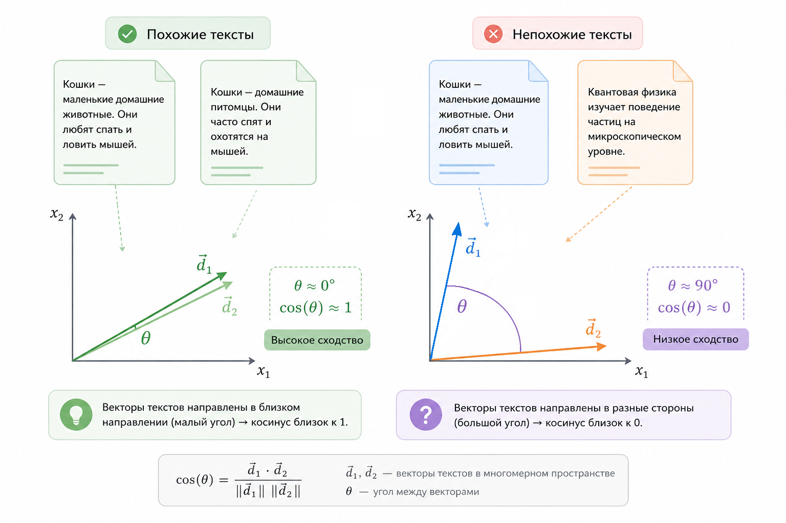
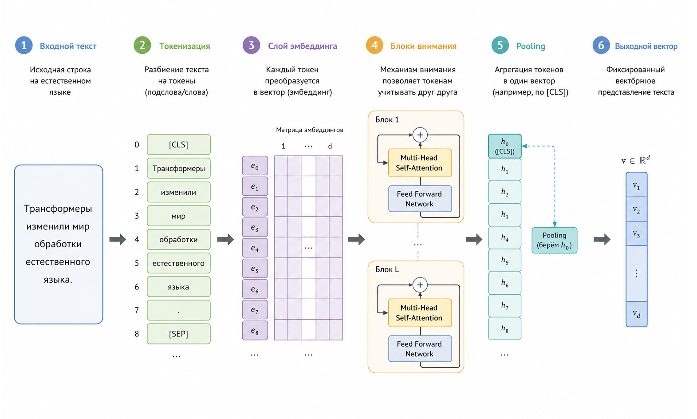
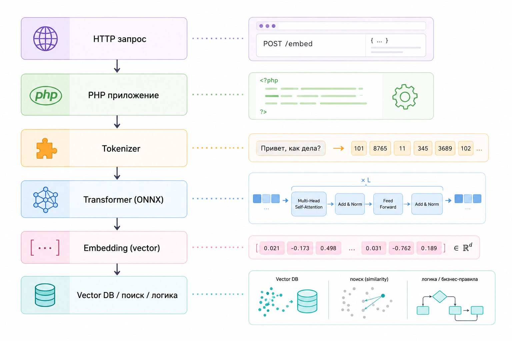
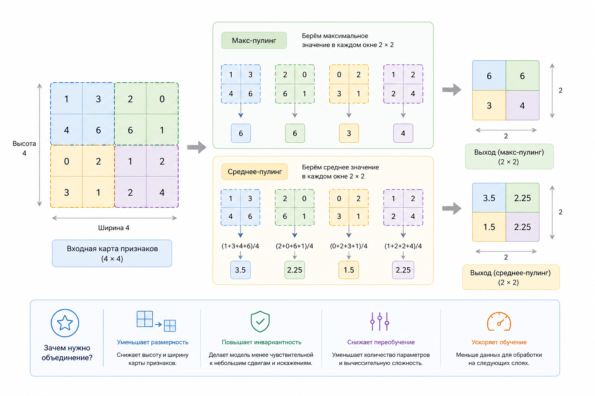
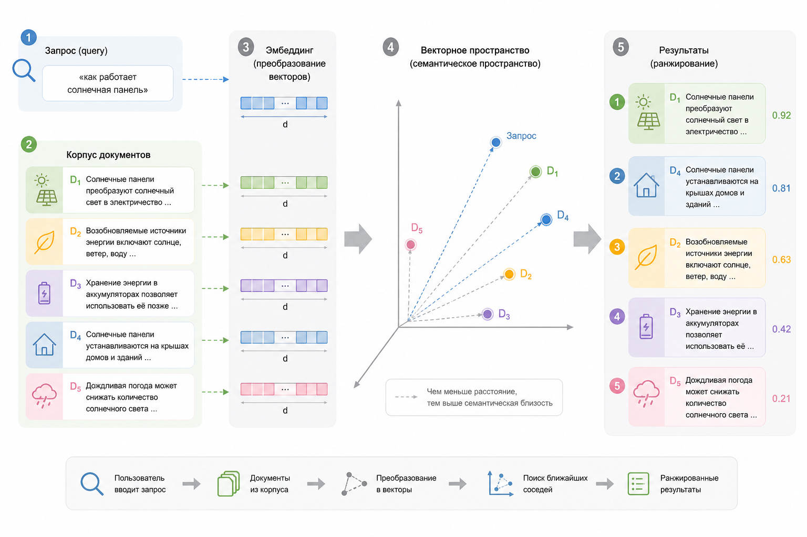

# 5.7 Практика: эмбеддинги на PHP с помощью трансформеров

В этой главе мы аккуратно приземлим теорию эмбеддингов на инженерную практику. Без обучения моделей, без GPU-кластеров и без магии. Только inference, готовые трансформеры и PHP как рабочий инструмент.

Наша цель проста и сугубо практична: научиться получать векторные представления текстов и использовать их для поиска, сравнения и анализа смысла. Мы будем относиться к трансформерам не как к объекту исследования, а как к инфраструктурному компоненту – примерно так же, как к базе данных или поисковому движку.

### Почему inference, а не обучение

Если вы работаете с PHP, почти наверняка большая часть вашей реальности – это веб-приложения, API, сервисы, где важны стабильность, повторяемость и предсказуемость. Обучение трансформеров плохо вписывается в эту картину: оно требует больших датасетов, серьёзных вычислительных ресурсов и отдельной MLOps-инфраструктуры.

[Inference](../../vvedenie/glossarii.md#inferens-inference), напротив, покрывает большую часть прикладных задач:

* семантический поиск
* кластеризация документов
* поиск похожих записей
* рекомендации
* дедупликация контента
* интеллектуальная навигация

Мы берём уже обученную модель и используем её как функцию:

$$
\text{text} \rightarrow \mathbf{v} \in \mathbb{R}^d
$$

В этом и заключается инженерный подход.

### Что такое эмбеддинг с точки зрения математики

Формально [эмбеддинг](../../vvedenie/glossarii.md#embeddings-embeddingi) – это отображение из пространства текстов в вещественное векторное пространство фиксированной размерности:

$$
f : T \rightarrow \mathbb{R}^d
$$

Где:

* T – множество всех возможных текстов
* d – размерность эмбеддинга (например, 384, 768, 1024, 1536, 3072 и другие значения в зависимости от архитектуры модели)

Ключевой момент здесь не в самой функции $$f$$, а в геометрии получившегося пространства.&#x20;

Хорошо обученные эмбеддинговые модели обычно размещают семантически близкие тексты рядом в векторном пространстве, поэтому такие тексты получают похожие векторные представления.

После получения эмбеддинга мы редко анализируем отдельные координаты вектора. Обычно нас интересуют операции над вектором целиком: поиск ближайших соседей, кластеризация или вычисление сходства.

#### Косинусное сходство

Самая популярная мера:

$$
\cos(a, b) = \frac{a \cdot b}{\lVert a \rVert \ \lVert b \rVert}
$$

Она отвечает на вопрос: "насколько одинаково направлены два вектора". Для эмбеддингов это обычно важнее, чем их длина. Подробно мы разбирали эту тему в главе "[Расстояния и сходство](../../chast-i.-matematicheskii-yazyk-ai/1.3-rasstoyaniya-i-skhodstvo/)".

<div align="left"><figure><figcaption><p>Рис 5.7-1. Векторы косинусного сходства</p></figcaption></figure></div>

### Трансформер как чёрный ящик

С инженерной точки зрения трансформер – это композиция функций:

```
text → tokens → embeddings → pooling → vector
```

Но в большинстве прикладных задач нас интересуют только вход и выход. Всё, что внутри – [self-attention](../../vvedenie/glossarii.md#self-attention), positional encoding, [multi-head attention](../../vvedenie/glossarii.md#multi-head-attention) – важно концептуально, но не обязательно для повседневного использования. Однако полезно понимать, как из представлений отдельных токенов формируется представление всего текста.

Тем не менее полезно понимать это хотя бы на уровне интуиции.

<div align="left"><figure><figcaption><p>Рис 5.7-2. Обзор трансформера</p></figcaption></figure></div>

### Рассмотрим TransformersPHP как инженерный инструмент

TransformersPHP – это PHP-обёртка вокруг идей и форматов, пришедших из экосистемы [Hugging Face](https://huggingface.co/). Обычно она используется вместе с [ONNX-моделями](../../vvedenie/glossarii.md#onnx-open-neural-network-exchange) или через внешние inference-движки.

Вы можете подробнее ознакомиться с этим пакетом на сайте: [https://transformers.codewithkyrian.com/](https://transformers.codewithkyrian.com/)

или на репозитории: \
[https://github.com/CodeWithKyrian/transformers-php](https://github.com/CodeWithKyrian/transformers-php)

Важно сразу зафиксировать философию этого инструмента:

* PHP управляет процессом
* модель – внешний, предобученный артефакт
* inference обычно воспроизводим и при одинаковой модели и настройках выдаёт практически одинаковые результаты для одного и того же входного текста
* никаких градиентов, оптимизаторов и эпох

Именно это делает подход надёжным и воспроизводимым.

### Архитектура практического решения

Типичная схема выглядит так:

```
HTTP запрос
   ↓
PHP приложение
   ↓
Tokenizer
   ↓
Transformer (ONNX)
   ↓
Embedding (vector)
   ↓
Vector DB / поиск / логика
```

<div align="left"><figure><figcaption><p>Рис 5.7-3. Конвейер встраивания (embedding pipeline) </p></figcaption></figure></div>

### Пример: получение эмбеддинга текста

Начнём с минимального примера. Предположим, у нас уже есть ONNX-модель для эмбеддингов, например из семейства [sentence-transformers](../../vvedenie/glossarii.md#sentence-transformers).

Ниже приведён упрощённый пример, иллюстрирующий общую идею получения эмбеддинга. Конкретный API может отличаться в зависимости от версии библиотеки и используемой модели.

```php
use function Codewithkyrian\Transformers\Pipelines\pipeline;

$text = 'PHP – это не только веб, но и инженерный инструмент.';

$embedder = pipeline(
    task: 'embeddings', 
    modelName: 'Xenova/paraphrase-multilingual-MiniLM-L12-v2'
);
$result = $embedder($text, normalize: true, pooling: 'mean');
$embedding = array_map(static fn ($v): float => (float) $v, $result[0]);

print_r($embedding);

// Результат:
// Array (
//   [0] => -0.285867
//   [1] => -0.532032
//   [2] => -0.117540
//   [3] => -0.080704
//   [4] => 0.094416
//   ...
//   [379] => 0.383363
//   [380] => -0.123445
//   [381] => 0.072758
//   [382] => 0.514027
//   [383] => -0.349335
// )
```

В реальных моделях sentence-transformers обычно выполняется усреднение векторов (mean pooling) с учётом маски внимания (attention mask), чтобы служебные символы и символы-дополнители не влияли на итоговое векторное представление. Для простоты здесь показана упрощённая схема.

Помимо этого, важно уяснить несколько моментов:

* мы не обучаем модель
* при одинаковой модели и настройках результат обычно воспроизводим для одного и того же текста
* размерность вектора фиксирована

### Pooling: почему это вообще нужно

Трансформер вычисляет векторное представление каждого токена, из которых затем формируется представление всего текста.

Самые популярные стратегии:

* mean pooling – среднее по токенам
* max pooling – максимум по каждому измерению
* CLS (Classification) token – специальный агрегирующий токен

Для многих моделей семейства sentence-transformers mean pooling даёт хорошие и стабильные результаты, хотя оптимальная стратегия зависит от конкретной архитектуры модели.

<div align="left"><figure><figcaption><p>Рис 5.7-4. Объяснение объединения (pooling explanation)</p></figcaption></figure></div>

### Сравнение: косинусное сходство на PHP

Теперь, когда у нас есть векторы, мы можем их сравнивать.

```php
function cosineSimilarity(array $a, array $b): float {
    $dot = 0.0;
    $normA = 0.0;
    $normB = 0.0;

    foreach ($a as $i => $val) {
        $dot += $val * $b[$i];
        $normA += $val * $val;
        $normB += $b[$i] * $b[$i];
    }

    return $dot / (sqrt($normA) * sqrt($normB));
}
```

Использование:

```php
$sim = cosineSimilarity($embedding1, $embedding2);

if ($sim > 0.8) {
    echo "Тексты семантически близки";
}
```

### Практический кейс: семантический поиск

Представим, что у нас есть набор статей или событий (например, таймлайн новостей), и мы хотим искать не по словам, а по смыслу.

Алгоритм:

1. Предварительно вычислить эмбеддинги всех документов
2. Сохранить их (БД, файл, vector store)
3. Для запроса пользователя получить его эмбеддинг
4. Найти ближайшие векторы

С точки зрения PHP это выглядит как обычная бизнес-логика, а не ML-экзотика.

<div align="left"><figure><figcaption><p>Рис 5.7-5. Семантический поиск</p></figcaption></figure></div>

### Инженерные замечания

Несколько практических наблюдений, которые обычно приходят только с опытом:

* Кэшируйте эмбеддинги – inference хоть и дешевле обучения, но не бесплатен
* Нормализуйте векторы заранее, если часто считаете сходство
* Размерность важна меньше, чем качество модели
* Для большинства задач достаточно готовых sentence-моделей

### Где эмбеддинги особенно хорошо ложатся на PHP

Эмбеддинги неожиданно хорошо сочетаются с PHP-экосистемой:

* CMS и контент-платформы
* корпоративные базы знаний
* поиск по логам и тикетам
* e-commerce каталоги
* аналитические панели

PHP здесь выступает не как ML-язык, а как связующее звено между бизнес-логикой и интеллектуальными моделями.

### Итог

В этой главе мы посмотрели на эмбеддинги не как на абстрактную ML-концепцию, а как на инженерный инструмент. Трансформеры в режиме inference отлично вписываются в PHP-приложения, если относиться к ним прагматично.

Вы не обучаете модель. Вы используете её.

Именно в этом месте машинное обучение перестаёт быть исследовательской задачей и становится инженерным компонентом системы.


Чтобы самостоятельно протестировать этот код, воспользуйтесь [онлайн-демонстрацией](https://aiwithphp.org/books/ai-for-php-developers/examples/part-5/hands-on-embedding-in-php-with-transformers) для его запуска.

