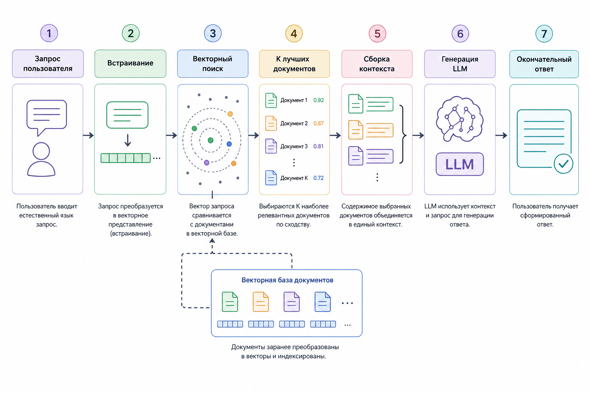
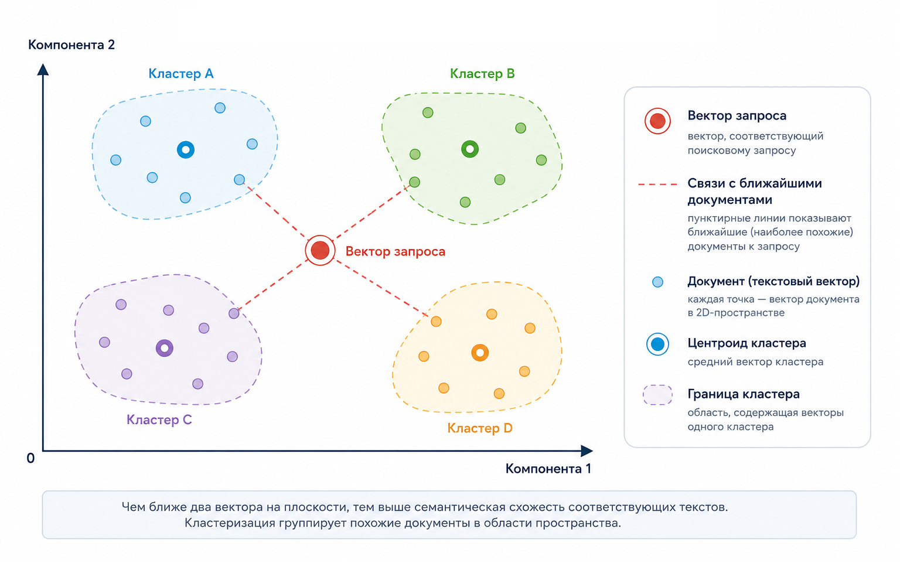

# 5.8 RAG: Retrieval-Augmented Generation как инженерная система

Когда говорят, что LLM "знает всё", это удобная, но опасная метафора.&#x20;

На самом деле модель не хранит знания в виде базы фактов и не выполняет поиск информации в момент ответа – математически модель предсказывает следующий токен, опираясь на статистические зависимости, выученные при обучении. Это приводит к способности анализировать текст, суммировать информацию и выполнять рассуждения.&#x20;

Именно поэтому в реальных продуктах почти всегда возникает вопрос:&#x20;

> _Как заставить модель отвечать на основе конкретных, актуальных, контролируемых данных?_

Ответом на этот вопрос стала архитектура [RAG](../../vvedenie/glossarii.md#rag-retrieval-augmented-generation) – Retrieval-Augmented Generation. Это не фича и не трюк с промптом, а полноценная инженерная система, в которой LLM – лишь последний этап пайплайна.

В этой главе мы разберём RAG как систему из трёх связанных фаз:

```
поиск → формирование контекста → генерация,
```

и посмотрим, где здесь математика, где инфраструктура, а где иллюзии.

### Зачем вообще нужен RAG

Представим простую задачу: у вас есть база документов – инструкции, договоры, статьи, тикеты поддержки. Пользователь задаёт вопрос, и вы хотите получить:

* ответ, основанный строго на этих документах
* с указанием терминологии именно из базы
* без галлюцинаций
* с возможностью обновлять данные без переобучения модели

Использование только LLM здесь не позволяет гарантировать корректность ответа. Она может выглядеть убедительно, но она:

* не имеет доступа к вашим документам, если они не переданы ей в контексте
* не знает, какая информация обновилось вчера
* не отличает "нет информации" от "попробую догадаться"

RAG решает это, разделяя ответственность, где поиск отвечает за факты, а LLM отвечает за формулировку.

### Общая схема RAG

В самом общем виде RAG выглядит так:

<figure><figcaption><p>Рис 5.8-1. Диаграмма RAG пайплайна</p></figcaption></figure>

Формально это можно записать так:

Пусть:

* $$q$$ – пользовательский запрос
* $$D = {d₁, d₂, …, dₙ}$$ – корпус документов
* $$E(·)$$ – функция эмбеддингов
* $$sim(a, b)$$ – мера близости (обычно cosine similarity).

Тогда RAG – это композиция функций:

1. Retrieval:\
   $$R(q) = \arg \mathrm{TopK}_{d_i \in D}\left(\mathrm{sim}\left(E(q), E(d_i)\right)\right)$$
2. Context construction:\
   $$C = \mathrm{concat}\bigl(d_{i_1}, d_{i_2}, \dots, d_{i_k}\bigr)$$
3. Generation:\
   $$\text{answer} = \mathrm{LLM}(q, C)$$

Важно понять: LLM не видит весь корпус, она видит только контекст $$C$$, который мы ей передали.

### Retrieval: поиск релевантного контекста

#### Почему не keyword-поиск

Классический поиск по словам (типа: [LIKE](../../vvedenie/glossarii.md#like-poisk), [TF-IDF](../../vvedenie/glossarii.md#tf-idf), [BM25](../../vvedenie/glossarii.md#bm25-best-matching-25)) ищет совпадения токенов (слов или термов). RAG же опирается на семантическую близость. При этом на практике многие production-системы используют гибридный поиск, объединяя BM25, векторный поиск и последующее ранжирование результатов.

Фразы:

* "расторгнуть договор"
* "прекращение действия контракта"

почти не имеют общих слов, но смысл у них один. Использование эмбеддингов позволяет это уловить.

#### Эмбеддинги и пространство

Эмбеддинг – это отображение текста в вектор:

$$
E \colon \text{text} \rightarrow \mathbb{R}^d
$$

Обычно $$d$$ = 384, 768, 1024 или 1536.


Размерность эмбеддинга определяется архитектурой трансформера: часто она кратна числу [attention heads](../../vvedenie/glossarii.md#multi-head-attention) и отражает компромисс между выразительностью и вычислительной стоимостью. В классической архитектуре она вычисляется как:

$$
d = h \times d_{\text{head}}
$$

Где:

* $$h$$ – число attention heads
* $$d_{\text{head}}$$​ – размерность одного head

Типичные конфигурации:

* 12 × 64 = 768
* 16 × 64 = 1024
* 24 × 64 = 1536

Однако в современных embedding-моделях итоговая размерность эмбеддинга может отличаться от $$d_{\text{head}}$$​. Для этого после трансформера используется проекционный слой, который преобразует внутреннее представление модели в эмбеддинг нужного размера.

Это позволяет:

* уменьшить вычислительные затраты и объем памяти
* оптимизировать поиск в векторной базе
* эффективнее использовать аппаратные возможности (GPU/CPU SIMD)


Интуитивно:

* близкие по смыслу тексты → близкие векторы
* дальние по смыслу → дальние векторы.

Чаще всего используется косинусная близость:

$$
\mathrm{sim}(a, b) = \frac{a \cdot b}{\lVert a \rVert \ \lVert b \rVert}
$$

Теоретический диапазон составляет $$[-1,1]$$. Однако большинство современных embedding-моделей возвращают значения преимущественно в положительной области от 0 до 1.

<figure><figcaption><p>Рис 5.8-2. Двумерная визуализация векторного пространства с кластеризованными текстовыми векторами.</p></figcaption></figure>

### Chunking: незаметная, но критическая часть

Документы редко кладут в векторную базу целиком. Их режут на чанки.

Почему?

* при кодировании длинного текста информация о нескольких темах смешивается в одном векторном представлении (смысл как бы усредняется)
* retrieval начинает возвращать "всё понемногу"
* контекст становится шумным

Типичные стратегии:

* 300–500 токенов
* overlap 10–20%
* логические границы (абзацы, заголовки).

Формально мы ищем не документы, а чанки:

$$
D = \{c_1, c_2, \dots, c_m\}
$$

Именно среди чанков выполняется поиск наиболее релевантных элементов (Top-K), которые затем передаются модели.

### Context building: инженерия промпта

Получив Top-K чанков, мы должны превратить их в контекст.

Это не просто склейка текста. Здесь решаются вопросы:

* порядок (по релевантности или по источнику)
* формат (plain text, bullets, JSON)
* инструкции для модели.

Пример шаблона:

```
Ты отвечаешь строго на основе контекста ниже. 
Если ответа нет – скажи, что информации недостаточно.
```

### Reranking

Во многих production-системах между retrieval и построением контекста добавляется этап reranking. На этом этапе найденные чанки повторно оцениваются более точной моделью, которая лучше понимает смысл запроса. Обычно быстрый векторный поиск сначала обычно несколько десятков или сотен кандидатов, после чего reranker оставляет лишь несколько наиболее релевантных. Такой подход позволяет значительно повысить качество итогового контекста без заметного увеличения времени ответа.

Таким образом, современный RAG-пайплайн чаще всего выглядит следующим образом:

```
Retrieval
    ↓
Reranking
    ↓
Context construction
    ↓
Generation
```

### Контекст:

\{{chunk\_1\}}\
\{{chunk\_2\}}

Вопрос: \{{query\}}”

Здесь RAG превращается в контролируемую систему, а не просто в "умного болтуна".

### Generation: что на самом деле делает LLM

LLM в RAG:

* не ищет информацию
* не имеет встроенного источника истины и не может сама проверять факты
* не знает, что было вне контекста

Она решает задачу:

$$
P(\text{token}_t \mid \text{tokens}_{1:t-1}, \text{context})
$$

То есть использует найденный контекст для построения ответа: суммирует информацию, сопоставляет факты, делает выводы и формулирует ответ.

Если retrieval плохой – генерация редко сможет полностью это компенсировать.

Если контекст шумный – ответ будет плохим.

Отсюда важный инженерный принцип:

> В большинстве RAG-систем качество ответа в первую очередь определяется качеством retrieval-а. Однако итоговый результат также зависит от чанкинга, формирования контекста, инструкций в промпте и возможностей самой LLM.

### Минимальный RAG на PHP (упрощённо)

Рассмотрим упрощённый пример без внешней векторной БД.

#### Хранение эмбеддингов

```php
$documents = [
    ['id' => 1, 'text' => 'Расторжение договора возможно по соглашению сторон'],
    ['id' => 2, 'text' => 'Договор может быть прекращён в одностороннем порядке'],
];

$embeddings = [
    1 => [0.12, 0.88, 0.44],
    2 => [0.10, 0.90, 0.40],
];
```

#### Косинусная близость

Для простоты предполагается, что все эмбеддинги имеют одинаковую размерность.

```php
function cosineSimilarity(array $a, array $b): float {
    $dot = $normA = $normB = 0.0;

    foreach ($a as $i => $v) {
        $dot += $v * $b[$i];
        $normA += $v * $v;
        $normB += $b[$i] * $b[$i];
    }

    $denominator = sqrt($normA) * sqrt($normB);

    return $denominator > 0 ? $dot / $denominator : 0.0;
}
```

#### Поиск Top-K

Предположим у нас есть запрос:

```php
$queryText = 'Можно ли расторгнуть договор в одностороннем порядке?';
$queryEmbedding = [0.11, 0.89, 0.42];
```

подсчитаем для него меру косинусного сходства с имеющимися документами и отсортируем результат по убыванию:

```php
$scores = [];
foreach ($embeddings as $id => $vector) {
    $scores[$id] = cosineSimilarity($queryEmbedding, $vector);
}

arsort($scores);
$topIds = array_slice(array_keys($scores), 0, 1);
```

#### Контекст

```php
$context = '';
foreach ($topIds as $id) {
    // предполагается, что id совпадает с индексом массива + 1
    $context .= $documents[$id - 1]['text'] . "\n";
}
```

Дальше этот контекст отправляется в LLM API.

### Типовые ошибки RAG

Ниже приведены типичные ошибки для RAG:

* слишком большие чанки
* слишком маленький Top-K
* отсутствие явной инструкции сообщать о недостатке информации, если ответ отсутствует в контексте
* надежда, что "более умная модель всё исправит".

RAG – это не магия, а баланс сигнал/шум.

### RAG как архитектурный паттерн

Важно понимать, что RAG – это не просто технология для ответа на вопросы. На практике это архитектурный паттерн, который используется в самых разных системах. На его основе строят корпоративных AI-ассистентов, аналитические платформы, поиск по документам, событиям и таймлайнам, а также системы explainable AI, где вместе с ответом пользователь получает ссылки на источники информации.

При таком подходе языковая модель не хранит знания сама по себе. Она получает необходимые данные из внешних источников, анализирует их и на их основе формирует ответ. Поэтому LLM здесь выступает не как основной источник знаний, а как интеллектуальный интерфейс для работы с внешними данными.

### Ключевая мысль главы

Главная идея этой главы заключается в том, что RAG возвращает разработчику контроль над тем, как языковая модель работает с информацией. Мы сами определяем, какие источники использовать, насколько актуальными должны быть данные и в каких ситуациях модель должна честно ответить, что не может дать достоверный ответ.

Именно поэтому RAG – это прежде всего инженерный подход к построению AI-систем. Языковая модель остаётся важной частью решения, но качество всей системы определяется не только выбранной LLM, а тем, как организованы хранение данных, поиск релевантной информации, построение контекста и генерация ответа.


Чтобы самостоятельно протестировать этот код, воспользуйтесь [онлайн-демонстрацией](https://aiwithphp.org/books/ai-for-php-developers/examples/part-5/retrieval-augmented-generation-as-engineering-system) для его запуска.

