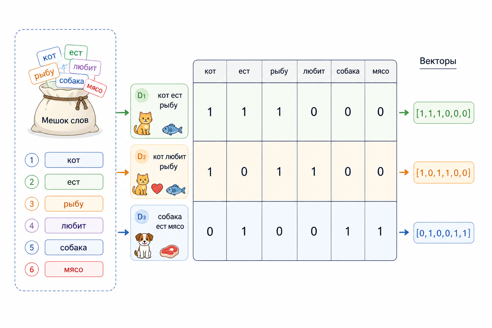
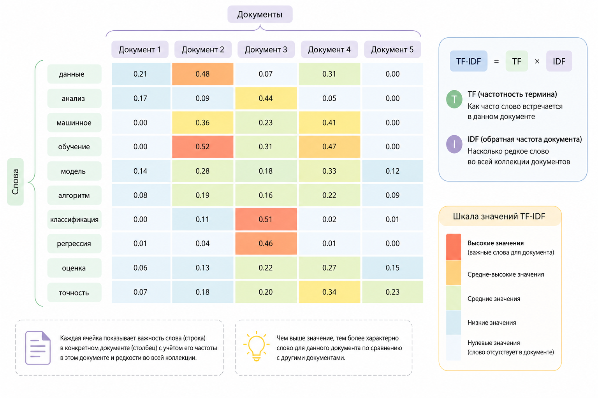
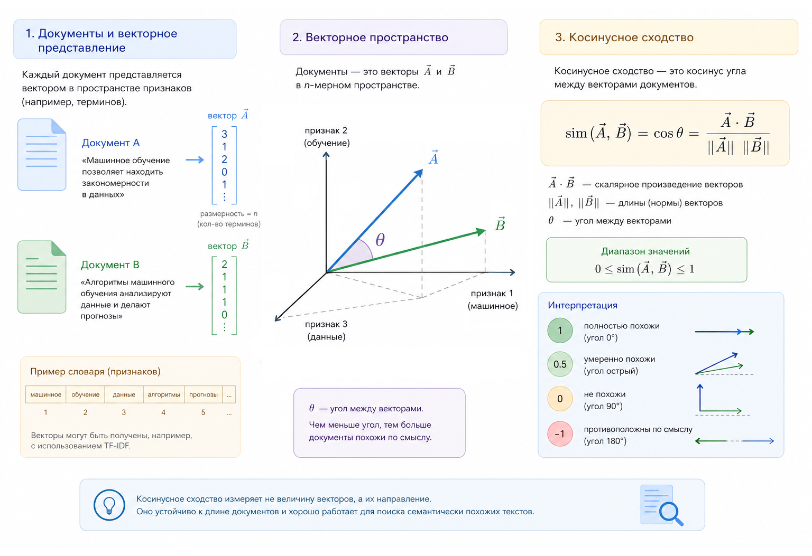

# Bag of Words и TF–IDF

В предыдущих главах мы говорили о тексте как о данных и о том, что компьютер не умеет читать слова "как человек". Для него текст – это набор символов, чисел и статистик. В этой главе мы разберём два базовых, но до сих пор крайне полезных подхода к представлению текста в виде чисел: Bag of Words и TF–IDF.

Они просты, почти наивны, но именно поэтому идеально подходят для понимания того, как из слов появляется математика. Более того, многие современные идеи в NLP логически вырастают именно из них.

### Идея Bag of Words

BOW - Bag of Words (мешок слов) – это способ представить текст без учёта порядка слов. Нас интересует только то, какие слова встретились и сколько раз.

Представим два предложения:

* "Кот ест рыбу"
* "Рыбу ест кот"

Для человека они почти одинаковы. Для Bag of Words – абсолютно одинаковы.

Мы как бы высыпаем слова из текста в мешок, перемешиваем их и считаем количество каждого слова.

### Формирование словаря

Первый шаг – построить словарь. Это просто список всех уникальных слов во всех документах.

Пусть у нас есть три документа:

* D1: "кот ест рыбу"
* D2: "кот любит рыбу"
* D3: "собака ест мясо"

Словарь будет таким:

```
[кот, ест, рыбу, любит, собака, мясо]
```

Каждому слову мы сопоставляем индекс.

```
[кот→0, ест→1, рыбу→2, любит→3, собака→4, мясо→5]
```

### Вектор Bag of Words

Теперь каждый документ превращается в вектор длины $$|V|$$, где $$|V|$$ – размер словаря.

D1: "кот ест рыбу":&#x20;

```
[1, 1, 1, 0, 0, 0]
```

D2: "кот любит рыбу"

```
[1, 0, 1, 1, 0, 0]
```

D3: "собака ест мясо"

```
[0, 1, 0, 0, 1, 1]
```

Каждое число – это количество вхождений слова.

<div align="left"><figure><figcaption><p>19.1 BOW - Мешок слов</p></figcaption></figure></div>

### Немного математики

Формально Bag of Words можно записать так.

Пусть:

* $$V = {w₁, w₂, …, wₙ}$$ – словарь
* $$d$$ – документ

Тогда вектор документа:

$$
x(d) = (c₁, c₂, …, cₙ)
$$

где $$cᵢ$$ – количество вхождений слова $$wᵢ$$ в документ $$d$$.

Это обычный вектор в $$\mathbb{R}^n$$ (для чистого Bag of Words – в $$\mathbb{N}^n$$).

И уже на этом этапе мы можем:

* сравнивать документы
* обучать классификаторы
* искать похожие тексты

Но есть одна проблема.

### Проблема частот

Рассмотрим слово "кот" и слово "и".

Слово "и" будет встречаться почти в каждом документе. Его частота большая, но смысловая ценность почти нулевая.

Bag of Words не различает:

* важные слова
* служебные слова
* редкие, но информативные термины

Все слова равны. А это плохо.

И тут появляется TF–IDF.

### TF–IDF: интуиция

TF–IDF расшифровывается как: Term Frequency – Inverse Document Frequency

Идея очень простая:

* слово важно, если оно часто встречается в документе
* но оно теряет ценность, если встречается почти во всех документах

TF – "насколько часто слово встречается в данном документе"

IDF – "насколько слово редкое в корпусе"

Итоговый вес – их произведение.

### Term Frequency (TF)

Самый простой вариант TF:

$$
\mathrm{TF}(w, d) = count(w, d)
$$

Но часто используют нормализацию:

$$
\mathrm{TF}(w, d) = \frac{count(w, d)}{|d|}
$$

где $$|d|$$ – общее количество слов в документе.

Интерпретация:

* 0 → слова нет
* чем больше значение, тем важнее слово для конкретного документа

### Inverse Document Frequency (IDF)

IDF показывает, насколько слово редкое.

Формула:

$$
\mathrm{IDF}(w) = \log\left(\frac{N}{df(w)}\right)
$$

где:

* где $$log$$ — натуральный логарифм (его же и используем далее)
* $$N$$ – общее число документов
* $$df(w)$$ – количество документов, где встречается слово w

Иногда добавляют сглаживание:

$$
\mathrm{IDF}(w) = \log\left(\frac{N + 1}{df(w) + 1}\right) + 1
$$

Интерпретация:

* редкое слово → высокий IDF
* частое слово → IDF мал (без сглаживания – близок к 0, со сглаживанием – близок к 1)

### Итоговая формула TF–IDF

Вес слова w в документе d:

$$
\mathrm{TF\text{-}IDF}(w, d) = \mathrm{TF}(w, d) \times \mathrm{IDF}(w)
$$

Таким образом:

* слово часто в документе → вес растёт
* слово часто во всех документах → вес падает

<div align="left"><figure><figcaption><p>19.2 Тепловая карта, отображающая значения TF-IDF</p></figcaption></figure></div>

### Пример расчёта

Пусть у нас 3 документа, и слово "кот" встречается в двух из них.

$$
N = 3 
\\\\
df(кот) = 2
$$

Итого

$$
\mathrm{IDF}(\text{кот}) = \log\left(\frac{3}{2}\right) \approx 0.176
$$

А слово "собака" встречается только в одном документе:

<br>

$$
df(\text{собака}) = 1
$$

Поэтому

$$
\mathrm{IDF}(\text{собака}) = \log\left(\frac{3}{1}\right) \approx 1.099
$$

Даже если в документе они встречаются по одному разу, "собака" будет весить значительно больше.

### Вектор TF–IDF

Как и Bag of Words, TF–IDF – это вектор.

Отличие только в том, что вместо целых чисел мы получаем вещественные веса.

$$
x(d) = (\mathrm{tfidf}_1, \mathrm{tfidf}_2, \dots, \mathrm{tfidf}_n)
$$

Этот вектор:

* обычно хранится в разреженном виде
* высокоразмерный
* хорошо отражает смысл документа на базовом уровне

### Сравнение документов

TF–IDF часто используют вместе с cosine similarity.

Почему? Потому что:

* длины документов разные
* важна не сумма весов, а направление вектора

Cosine similarity измеряет угол между векторами, а не расстояние между точками.

<div align="left"><figure><figcaption><p>19.3 Косинусное сходство документов</p></figcaption></figure></div>

### Ограничения Bag of Words и TF–IDF

Важно понимать границы этих моделей.

Они:

* не учитывают порядок слов
* не понимают контекст
* не различают омонимы
* не знают семантики

"river _bank_" и "_bank_ of money" для них – почти одно и то же.

Но при этом они:

* быстрые
* интерпретируемые
* отлично работают на малых данных
* являются хорошей базовой линией

### Почему это всё ещё важно

Bag of Words и TF–IDF — это фундамент.

Если вы понимаете:

* откуда берётся вектор
* почему вес слова именно такой
* как редкость влияет на значение

то эмбеддинги, attention и трансформеры перестают быть такими непонятными. Они просто делают то же самое, но сложнее и умнее.

Именно поэтому мы начали с мешка слов.

### Простой пример TF–IDF на PHP (без библиотек)

Ниже — максимально простой пример, который показывает саму механику, без оптимизаций и абстракций. Такой код легко читать и удобно разбирать построчно.

Пусть у нас есть три документа:

```php
$documents = [
    'кот ест рыбу',
    'кот любит рыбу',
    'собака ест мясо из консервов',
];
```

#### Шаг 1. Токенизация

```php
function tokenize(string $text): array {
    return explode(' ', $text);
}

$tokenized = array_map('tokenize', $documents);
```

#### Шаг 2. Словарь

```php
$vocab = [];
foreach ($tokenized as $doc) {
    foreach ($doc as $word) {
        $vocab[$word] = true;
    }
}

$vocab = array_keys($vocab);
```

#### Шаг 3. Term Frequency (TF)

```php
function termFrequency(array $doc): array {
    $tf = [];
    $length = count($doc);

    foreach ($doc as $word) {
        $tf[$word] = ($tf[$word] ?? 0) + 1;
    }

    foreach ($tf as $word => $count) {
        $tf[$word] = $count / $length;
    }

    return $tf;
}
```

#### Шаг 4. Document Frequency и IDF

```php
function documentFrequency(array $tokenized): array {
    $df = [];

    foreach ($tokenized as $doc) {
        foreach (array_unique($doc) as $word) {
            $df[$word] = ($df[$word] ?? 0) + 1;
        }
    }

    return $df;
}

$df = documentFrequency($tokenized);
$N = count($tokenized);

$idf = [];
foreach ($df as $word => $count) {
    $idf[$word] = log($N / $count);
}
```

#### Шаг 5. TF–IDF вектор документа

```php
function tfidf(array $tf, array $idf): array {
    $vector = [];

    foreach ($tf as $word => $value) {
        $vector[$word] = $value * ($idf[$word] ?? 0);
    }

    return $vector;
}

$tfidfVectors = [];
foreach ($tokenized as $doc) {
    $tf = termFrequency($doc);
    $tfidfVectors[] = tfidf($tf, $idf);
}
```

Теперь `$tfidfVectors` содержит TF–IDF веса слов для каждого документа.

<details>

<summary>Полный пример кода для TF-IDF</summary>

```php
// Исходные документы
$documents = [
    'кот ест рыбу',
    'кот любит рыбу',
    'собака ест мясо',
];

// --------------------
// Токенизация
// --------------------
function tokenize(string $text): array {
    return explode(' ', $text);
}

$tokenized = array_map('tokenize', $documents);

// --------------------
// Построение словаря
// --------------------
$vocab = [];
foreach ($tokenized as $doc) {
    foreach ($doc as $word) {
        $vocab[$word] = true;
    }
}
$vocab = array_keys($vocab);

// --------------------
// Term Frequency (TF)
// --------------------
function termFrequency(array $doc): array {
    $tf = [];
    $length = count($doc);

    foreach ($doc as $word) {
        $tf[$word] = ($tf[$word] ?? 0) + 1;
    }

    foreach ($tf as $word => $count) {
        $tf[$word] = $count / $length;
    }

    return $tf;
}

// --------------------
// Document Frequency + IDF
// --------------------
function documentFrequency(array $tokenized): array {
    $df = [];

    foreach ($tokenized as $doc) {
        foreach (array_unique($doc) as $word) {
            $df[$word] = ($df[$word] ?? 0) + 1;
        }
    }

    return $df;
}

$df = documentFrequency($tokenized);
$N  = count($tokenized);

$idf = [];
foreach ($df as $word => $count) {
    $idf[$word] = log($N / $count);
}

// --------------------
// TF–IDF
// --------------------
function tfidf(array $tf, array $idf): array {
    $vector = [];

    foreach ($tf as $word => $value) {
        $vector[$word] = $value * ($idf[$word] ?? 0);
    }

    return $vector;
}

$tfidfVectors = [];
foreach ($tokenized as $doc) {
    $tf = termFrequency($doc);
    $tfidfVectors[] = tfidf($tf, $idf);
}
```

</details>

#### Пример использования и результат

Добавим простой вывод результатов, чтобы увидеть реальные числа:

```php
foreach ($tfidfVectors as $i => $vector) {
    echo "Документ " . ($i + 1) . ":" . PHP_EOL;
    foreach ($vector as $word => $value) {
        echo "  $word => " . round($value, 3) . PHP_EOL;
    }
    echo PHP_EOL;
}
```

Вывод будет примерно таким:

```
Документ 1:
  кот => 0.135
  ест => 0.135
  рыбу => 0.135

Документ 2:
  кот => 0.135
  любит => 0.366
  рыбу => 0.135

Документ 3:
  собака => 0.22
  ест => 0.081
  мясо => 0.22
  из => 0.22
  консервов => 0.22
```


Чтобы самостоятельно протестировать этот код, установите примеры из официального репозитория [GitHub](https://github.com/apphp/ai-for-php-developers-examples) или воспользуйтесь [онлайн-демонстрацией](https://aiwithphp.org/books/ai-for-php-developers/examples/part-5/bag-of-words-and-tf-idf) для его запуска.


#### Как это интерпретировать

Слова "кот", "ест" и "рыбу" встречаются в нескольких документах, поэтому их IDF небольшой, а итоговый TF–IDF-вес низкий. Они не помогают сильно отличить один документ от другого, потому что являются относительно общими для корпуса.&#x20;

Напротив, слова "любит", "собака", "мясо", "из", "консервы" встречаются только в одном документе, поэтому их IDF выше и итоговый вес заметно больше – такие слова лучше характеризуют конкретный документ. Даже при одинаковой частоте внутри документа (например, по одному разу) редкость слова во всём корпусе существенно влияет на результат. Здесь нет никакой магии: код буквально реализует формулы TF и IDF – обычные относительные частоты и логарифм отношения общего числа документов к числу документов со словом.&#x20;

<details>

<summary><strong>Более подробное объяснение</strong></summary>

#### 1. Наша формула: &#x20;

$$idf = \log\left(\frac{N}{df}\right)$$

Где:

* $$N = 3$$ документа
* $$df =$$ в скольких документах встречается слово

#### **2. Посчитаем df:**

| Слово    | В скольких документах | df |
| -------- | --------------------- | -- |
| кот      | 1, 2                  | 2  |
| рыбу     | 1, 2                  | 2  |
| ест      | 1, 3                  | 2  |
| любит    | 2                     | 1  |
| собака   | 3                     | 1  |
| мясо     | 3                     | 1  |
| из       | 3                     | 1  |
| консервы | 3                     | 1  |

#### 3. Теперь считаем IDF:

**Если df = 2:**

$$idf = \log\left(\frac{3}{2}\right) \approx \log(1.5) \approx 0.405$$

**Если df = 1:**

$$idf = \log\left(\frac{3}{1}\right) = \log(3) \approx 1.099$$

#### Теперь считаем TF

Формула:  $$tf = \frac{\text{количество слова}}{\text{длина документа}}$$

**Документ 1: "кот ест рыбу"**

Длина = 3 слова\
Каждое встречается 1 раз:

```
tf = 1 / 3 ≈ 0.333
```

TF × IDF

Для слов с df = 2

```
0.333 × 0.405 ≈ 0.135
```

Именно поэтому:

```
кот   => 0.135
ест   => 0.135
рыбу  => 0.135
```

**Документ 2: "кот любит рыбу"**

Длина = 3\
TF = 0.333

Для "любит"

```
idf = 1.099
tfidf = 0.333 × 1.099 ≈ 0.366
```

Вот откуда:

```
любит => 0.366
```

А "кот" и "рыбу":

```
0.333 × 0.405 ≈ 0.135
```

**Документ 3: "собака ест мясо из консервы"**

Длина = 5 слов

TF:

```
1 / 5 = 0.2
```

Для слов с df = 1

```
0.2 × 1.099 ≈ 0.22
```

Отсюда:

```
собака   => 0.22
мясо     => 0.22
из       => 0.22
консервы => 0.22
```

Для "ест" (df = 2)

```
0.2 × 0.405 ≈ 0.081
```

Вот откуда:

```
ест => 0.081
```

#### 4. Итог

Числа получаются такими потому что:

1. Слова, которые встречаются в 2 документах → имеют маленький IDF (\~0.405)
2. Слова, которые встречаются в 1 документе → имеют большой IDF (\~1.099)
3. В 3-м документе слова делятся на 5 → TF меньше (0.2), поэтому значения меньш

</details>

В следующей главе мы сделаем следующий шаг и поговорим об эмбеддингах как о непрерывных пространствах смысла.
