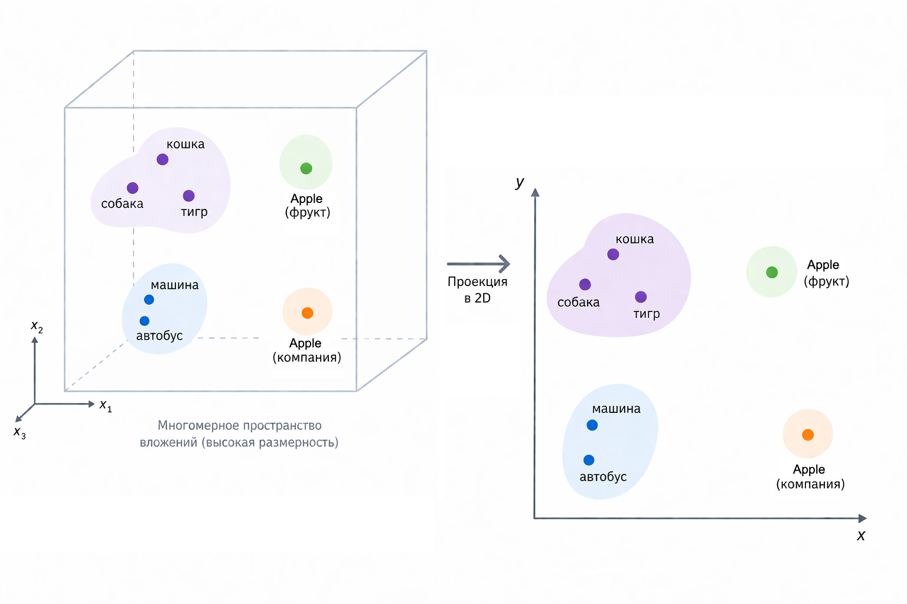
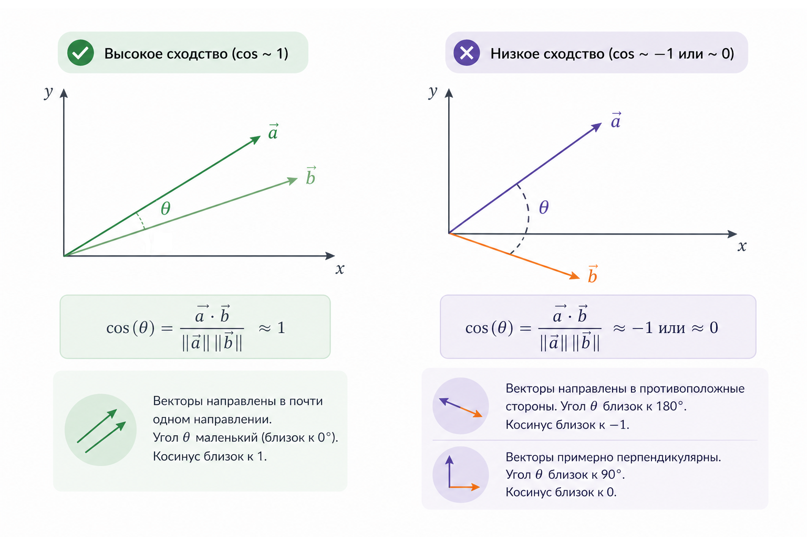
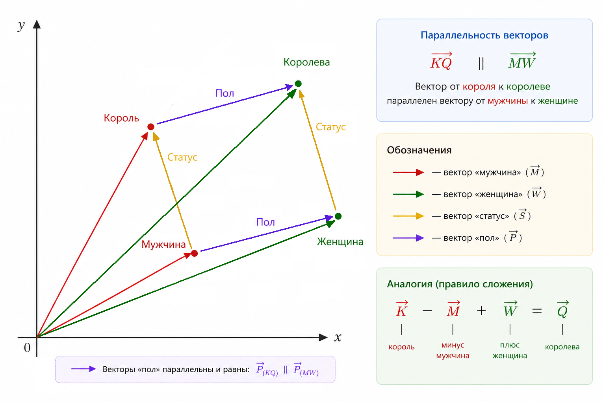
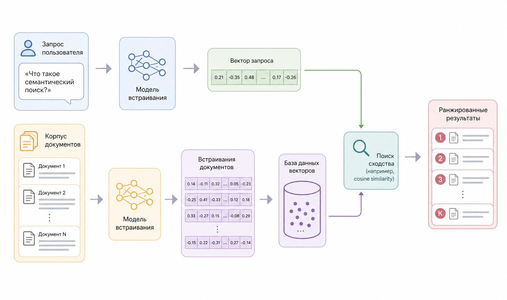

# Embeddings как непрерывные пространства смысла

### От слов и признаков – к пространству смысла

До этого момента мы много говорили о признаках, частотах, расстояниях и вероятностях. Все эти подходы объединяет одна важная особенность: мы описываем объекты через явно заданные признаки. Слово – это набор букв. Документ – это мешок слов. Пользователь – это таблица чисел.

[Embeddings](../../vvedenie/zaklyuchitelnye-materialy/glossarii.md#embeddings-embeddingi) меняют сам способ мышления.

Вместо вопроса "какие признаки у этого объекта?" мы задаем другой: "где он расположен в пространстве смысла?".

Embedding – это отображение объекта (слова, фразы, документа, пользователя, товара) в точку многомерного непрерывного пространства. Обычно это вектор из десятков, сотен или тысяч чисел:

$$
\text{embedding}(x) = \vec{v} \in \mathbb{R}^d
$$

Где $$d$$ – размерность пространства, а каждая координата не имеет отдельного человеческого смысла. Важно не значение координат, а геометрические отношения между векторами.

<div align="left"><figure><figcaption><p>20.1 Обзор embedding-пространства</p></figcaption></figure></div>

### Геометрия вместо логики

Ключевая идея embeddings звучит почти философски: смысл – это не правило, а положение.

Если два объекта похожи по смыслу, их векторы расположены близко друг к другу. Если смыслы различаются – точки удаляются.

Формально это выражается через метрику расстояния. На практике чаще всего используют косинусное сходство:

$$
\text{sim}(\vec{a}, \vec{b}) = \frac{\vec{a} \cdot \vec{b}}{|\vec{a}| |\vec{b}|}
$$

Или эквивалентную ему косинусную дистанцию:

$$
\text{dist}(\vec{a}, \vec{b}) = 1 - \text{sim}(\vec{a}, \vec{b})
$$

Важно заметить: нас интересует угол между векторами, а не их длина. Длина вектора часто нормализуется и перестает нести смысловую нагрузку.

<div align="left"><figure><figcaption><p>20.2 Косинусное сходство</p></figcaption></figure></div>

### Почему embeddings работают

На первый взгляд embeddings выглядят как магия: модель выдает набор чисел, а мы внезапно начинаем искать по смыслу, а не по словам.

Магии здесь нет. Есть статистика, оптимизация и контекст.

Embedding-модели обучаются так, чтобы объекты, встречающиеся в похожих контекстах, оказывались ближе друг к другу. Это обобщение старой идеи distributional semantics: \
"Смысл слова определяется его окружением".

Если слово "банк" часто встречается рядом со словами "деньги", "счет", "кредит", то оно будет близко к финансовым терминам. Если рядом с "река", "берег", "вода" – модель научится отделять другой смысл.

Современные модели (word2vec, GloVe, fastText, transformer-based embeddings) делают это на уровне предложений, абзацев и документов.

### Непрерывность как главное преимущество

Самое важное свойство embedding-пространства – непрерывность.

В классических подходах категории дискретны: либо слово совпало, либо нет. Либо класс A, либо класс B.

В embedding-пространстве возможны полутона.

Два текста могут быть:

* очень близкими по смыслу
* умеренно похожими
* слабо связанными
* почти ортогональными

Это позволяет работать с неопределенностью естественным образом, без жестких правил.

Математически это означает, что пространство $$\mathbb{R}^d$$ допускает интерполяцию. Между двумя смыслами существует бесконечное число промежуточных состояний:

$$
\vec{c}(\alpha) = \alpha \vec{a} + (1 - \alpha) \vec{b}, \quad \alpha \in [0, 1]
$$

Хотя такие интерполяции редко интерпретируются напрямую, сама возможность непрерывного перехода принципиально важна.

### Геометрические свойства смысла

Embedding-пространства обладают удивительными геометрическими эффектами.

Самый известный пример – линейные аналогии:

$$
\vec{king} - \vec{man} + \vec{woman} \approx \vec{queen}
$$

Это не трюк и не заранее запрограммированное правило. Модель просто выучила, что определенные направления в пространстве соответствуют устойчивым семантическим сдвигам: пол, время, степень, роль.

<div align="left"><figure><figcaption><p>20.3 Семантическая Аналогия</p></figcaption></figure></div>

Важно понимать: embeddings не хранят знания в виде фактов. Они хранят геометрию отношений.

### От embeddings к semantic search

Semantic search – это прямое следствие embedding-подхода.

Вместо того чтобы искать документы по совпадению слов, мы:

1. Преобразуем запрос пользователя в embedding-вектор.
2. Преобразуем все документы в embedding-векторы.
3. Ищем ближайшие векторы по выбранной метрике.

Формально задача сводится к поиску ближайших соседей:

$$
\arg\max_{d \in D} ; \text{sim}(\vec{q}, \vec{d})
$$

Где $$\vec{q}$$  – embedding запроса, а $$\vec{d}$$  – embedding документа.

<div align="left"><figure><figcaption><p>20.4 Семантический конвейер поиска</p></figcaption></figure></div>

### Почему semantic search лучше keyword search

Semantic search устойчив к:

* синонимам
* переформулировкам
* разному порядку слов
* частичным совпадениям

Запрос "как ускорить отправку email в PHP" и документ "оптимизация массовой рассылки писем на PHP" окажутся близкими, даже если ни одно слово не совпадает напрямую.

Это особенно важно для:

* поиска по документации
* внутренним базам знаний
* support-систем
* логам и событиям

Здесь embeddings начинают играть роль универсального языка между человеком и машиной.

### Embeddings как универсальный интерфейс

Один и тот же embedding-подход применяется для:

* текстов
* изображений
* аудио
* пользователей
* товаров
* событий

Если разные объекты отображены в одно и то же пространство, между ними можно искать связи.

Текст запроса → товар.

Изображение → описание.

Событие → похожие события.

Это особенно хорошо ложится на системы временных и контекстных данных, где важны не точные совпадения, а смысловая близость.

### Минимальный пример: embedding как вектор чисел (PHP)

Представим, что у нас уже есть функция, которая превращает текст в embedding. Не важно, как  именно она устроена внутри – сейчас нас интересует _результат_.

```php
function embed(string $text): array {
    // В реальности здесь будет модель или API.
    // Для учебного примера вернем фиксированный вектор.
    return match ($text) {
        'ускорить отправку email' => [0.12, 0.88, 0.34, 0.56],
        'оптимизация рассылки писем' => [0.10, 0.85, 0.30, 0.60],
        'как варить кофе' => [0.91, 0.05, 0.12, 0.02],
        default => [0.0, 0.0, 0.0, 0.0],
    };
}
```

Каждый текст теперь представлен точкой в пространстве из четырех измерений.

#### Косинусное сходство – мера близости смыслов

```php
function cosineSimilarity(array $a, array $b): float {
    $dot = 0.0;
    $normA = 0.0;
    $normB = 0.0;

    foreach ($a as $i => $value) {
        $dot += $value * $b[$i];
        $normA += $value ** 2;
        $normB += $b[$i] ** 2;
    }

    return $dot / (sqrt($normA) * sqrt($normB));
}
```

#### Semantic search в несколько строк

```php
$query = 'ускорить отправку email';
$queryEmbedding = embed($query);

$documents = [
    'оптимизация рассылки писем',
    'как варить кофе',
];

foreach ($documents as $doc) {
    $score = cosineSimilarity(
        $queryEmbedding,
        embed($doc)
    );

    echo $doc . ': ' . round($score, 3) . PHP_EOL;
}
```

Вывод будет примерно таким:

```
оптимизация рассылки писем: 0.998
как варить кофе: 0.072
```

#### Как это интерпретировать

Важно подчеркнуть, что в этом примере мы нигде напрямую не сравнивали слова, не проверяли совпадения строк и не вводили никаких правил или эвристик. Вся логика свелась к одному действию – измерению расстояния между точками в непрерывном пространстве.&#x20;

Тексты перестали быть последовательностями символов и превратились в геометрические объекты, смысловая близость которых определяется их взаимным расположением. В практических главах мы заменим учебную функцию `embed()` реальными моделями получения embeddings, но остальной код – работа с векторами, вычисление сходства и поиск ближайших соседей – почти не изменится.

### Ограничения и иллюзии

Важно не переоценивать embeddings.

Embedding-пространство:

* не является объективной картой мира
* отражает данные и цели обучения
* может содержать искажения и [bias](../../vvedenie/zaklyuchitelnye-materialy/glossarii.md#bias-smeshenie)

Близость векторов не означает истинность, причинность или логическое следование. Это всего лишь статистическая геометрия смысла.

### Итог

Embeddings – это переход от дискретных признаков к непрерывной геометрии.

Мы перестаем писать правила и начинаем измерять расстояния. Вместо логических условий появляется пространство, в котором смысл – это направление и близость.

Semantic search – лишь первый и самый очевидный шаг. Дальше идут кластеризация знаний, рекомендательные системы, retrieval augmented generation и гибридные модели мышления.

В следующих главах мы будем использовать embeddings как базовый строительный блок, почти как числа или строки – не задумываясь о том, как именно внутри устроена эта геометрия, но постоянно пользуясь ее свойствами.
