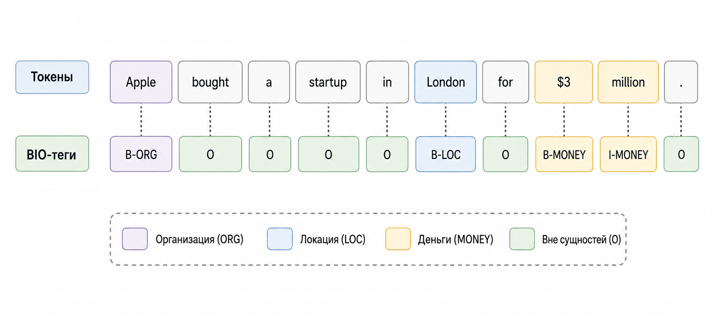
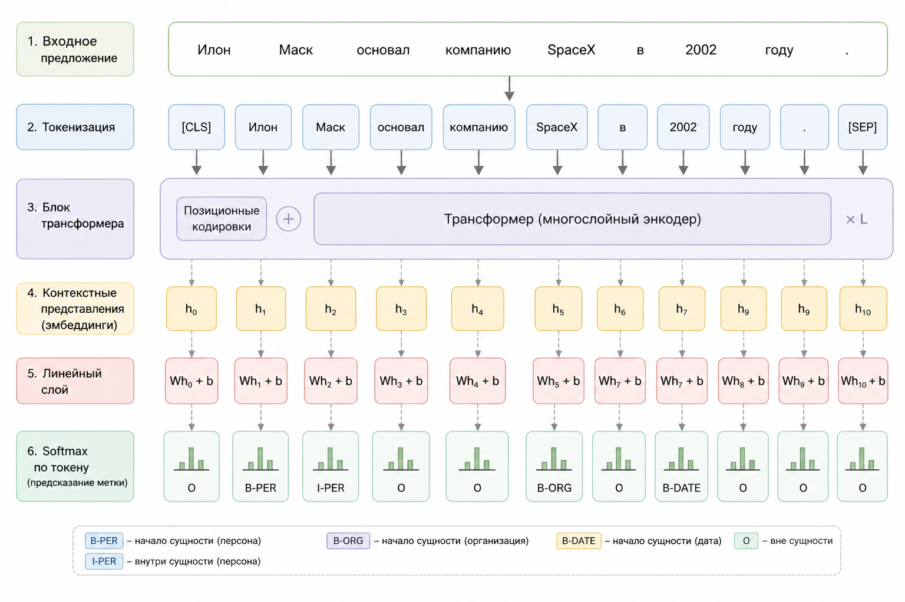

# Named Entity Recognition (NER) – извлечение сущностей из текста

До этого момента мы научились превращать слова в числа, числа – в векторы, а векторы – в осмысленные пространства. Теперь сделаем следующий шаг.

Представим текст:

> "Apple bought a startup in London for $3 million."

Человек мгновенно видит структуру:

* Apple – организация
* London – география
* $3 million – денежная сумма

Модель же видит последовательность токенов. Задача NER – научить модель выделять сущности внутри текста.

Это уже не просто классификация текста. \
Это классификация каждого токена в последовательности.

### Что такое NER математически

Пусть текст – это последовательность токенов:

$$
x = (x_1, x_2, ..., x_n)
$$

Наша цель – предсказать последовательность меток:

$$
y = (y_1, y_2, ..., y_n)
$$

Каждый $$y_i$$ – класс токена:

* PERSON
* ORG
* LOC
* MONEY
* O (не сущность)

Модель оценивает:

$$
P(y_1, y_2, ..., y_n \mid x_1, ..., x_n)
$$

В простейшем варианте – независимо по каждому токену:

$$
P(y_i \mid x)
$$

Но уже видно проблему: метка токена зависит от контекста.

Слово "Apple" может быть:

* фруктом
* компанией

Контекст решает всё.

### Почему Bag of Words здесь не работает

Bag of Words уничтожает порядок слов.

NER же – это задача, где порядок критичен.

Фраза:

> "Bank of America"

Если смотреть на слова по отдельности,

"Bank" – это организация,

"America" – география.

Но вместе – это одна сущность ORG.

Поэтому NER требует моделей, которые учитывают последовательность: RNN, LSTM, Transformers. Сегодня – чаще всего Transformers.

### BIO-разметка

Чтобы модель понимала границы сущностей, используется схема BIO:

* B-XXX (Beginning) – начало сущности
* I-XXX (Inside) – продолжение
* O (Outside) – вне сущности

Пример:

| Токен   | Метка   |
| ------- | ------- |
| Apple   | B-ORG   |
| bought  | O       |
| a       | O       |
| startup | O       |
| in      | O       |
| London  | B-LOC   |
| for     | O       |
| $       | B-MONEY |
| 3       | I-MONEY |
| million | I-MONEY |

Это уже не просто классификация. Это sequence labeling.

<div align="left"><figure><figcaption><p>22.1 BIO тэги</p></figcaption></figure></div>

### Sequence labeling как вероятностная задача

Наивный подход:

$$
y_i = \arg\max_k P(y_i = k \mid x)
$$

Но тогда возможны нелепые последовательности:

* I-ORG без B-ORG
* I-MONEY после O

Поэтому продвинутые модели (например, CRF) учитывают:

$$
P(y_i \mid y_{i-1}, x)
$$

Это добавляет структуру в предсказание.

Трансформеры часто комбинируют:

* contextual embeddings
* линейный классификатор
* иногда CRF-слой сверху

### Архитектура современной NER-модели

Схема:

1. Текст → токенизация
2. Токены → эмбеддинги
3. Трансформер → контекстуальные векторы
4. Линейный слой → logits
5. Softmax → вероятности классов

$$
\text{logits}_i = W h_i + b
$$

и

$$
P(y_i) = \text{softmax}(\text{logits}_i)
$$

Где $$h_i$$ – контекстный вектор токена.

<div align="left"><figure><figcaption><p>22.2 Архитектура NER</p></figcaption></figure></div>

### Практический кейс – NER на PHP

Представим задачу.

#### Сценарий

Вы пишете CRM для юристов.

Нужно автоматически извлекать из договоров:

* имена
* даты
* компании
* суммы

Вместо регулярных выражений – используем модель NER.

#### Подход

Мы не обучаем модель.

Мы делаем inference через готовую модель.

Допустим, используем REST API модели NER.

#### Пример PHP-кода (через HTTP API)

```
<?php

$text = "Apple signed a contract with John Smith in London for $3 million.";

$payload = [
    "inputs" => $text
];

$ch = curl_init("https://api.example.com/ner");
curl_setopt($ch, CURLOPT_RETURNTRANSFER, true);
curl_setopt($ch, CURLOPT_POSTFIELDS, json_encode($payload));
curl_setopt($ch, CURLOPT_HTTPHEADER, [
    "Content-Type: application/json",
    "Authorization: Bearer YOUR_API_KEY"
]);

$response = curl_exec($ch);
curl_close($ch);

$data = json_decode($response, true);

foreach ($data as $entity) {
    echo $entity['word'] . " → " . $entity['entity_group'] . PHP_EOL;
}
```

Пример ответа API:

```
[
  {"word": "Apple", "entity_group": "ORG"},
  {"word": "John Smith", "entity_group": "PER"},
  {"word": "London", "entity_group": "LOC"},
  {"word": "$3 million", "entity_group": "MONEY"}
]
```

#### Постобработка BIO-тегов

Если API возвращает токен-level BIO, нужно собрать сущности:

```
function extractEntities(array $tokens) {
    $entities = [];
    $current = null;

    foreach ($tokens as $token) {
        if (str_starts_with($token['entity'], 'B-')) {
            if ($current !== null) {
                $entities[] = $current;
            }
            $current = [
                'type' => substr($token['entity'], 2),
                'text' => $token['word']
            ];
        } elseif (str_starts_with($token['entity'], 'I-') && $current !== null) {
            $current['text'] .= ' ' . $token['word'];
        } else {
            if ($current !== null) {
                $entities[] = $current;
                $current = null;
            }
        }
    }

    if ($current !== null) {
        $entities[] = $current;
    }

    return $entities;
}
```

Это превращает sequence labeling в структурированные данные.

#### Почему трансформеры дали скачок качества

До трансформеров:

* LSTM учитывали контекст, но плохо масштабировались
* дальние зависимости обрабатывались тяжело

С трансформерами:

Self-attention позволяет каждому токену смотреть на все остальные:

$$
\text{Attention}(Q,K,V) = \text{softmax}\left(\frac{QK^T}{\sqrt{d}}\right)V
$$

Это означает:

Слово "Apple" может смотреть на "bought" и понять – это компания, а не фрукт.

### Где NER полезен в реальном PHP-проекте

NER – это не академическая игрушка.

Это:

* автоматическая обработка договоров
* финтех (извлечение сумм и дат)
* лог-анализ
* обработка email
* модерация контента
* построение knowledge graph

NER – это переход от текста к структуре.

### Ограничения

Важно понимать:

* модель не "понимает" текст
* она оптимизирует вероятности
* редкие сущности могут пропускаться
* доменная адаптация часто нужна

Для юридического текста – лучше дообучать модель.

### Главное понимание

NER – это первый момент в книге, где мы видим:

* AI не просто классифицирует
* AI структурирует хаос текста

С математической точки зрения: мы предсказываем последовательность меток.

С инженерной точки зрения: мы превращаем строку в данные.

И именно в этом – огромная ценность для PHP-разработчика.
