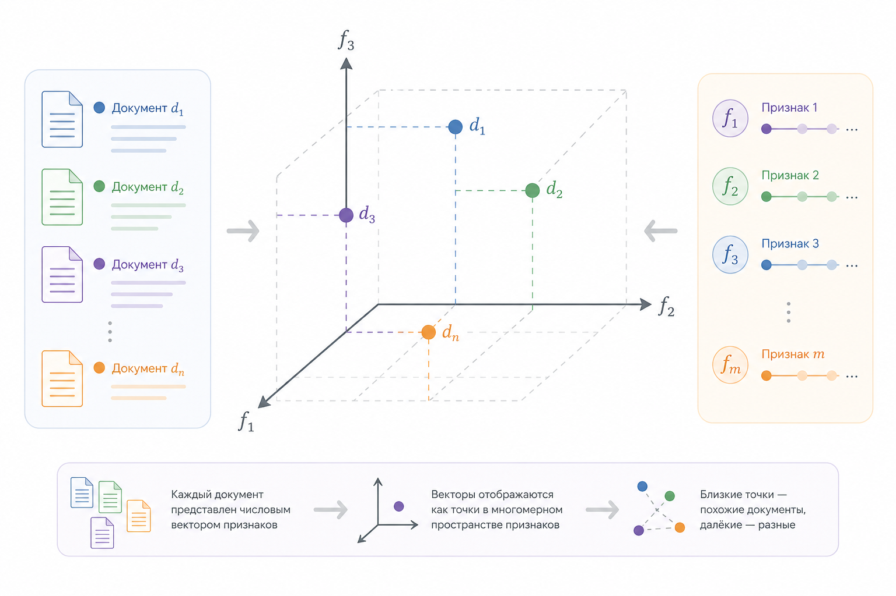
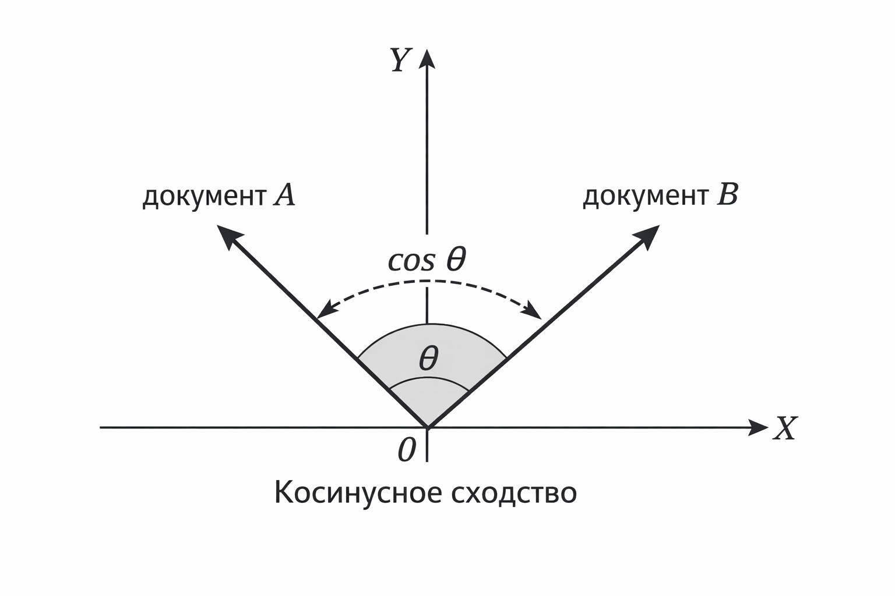
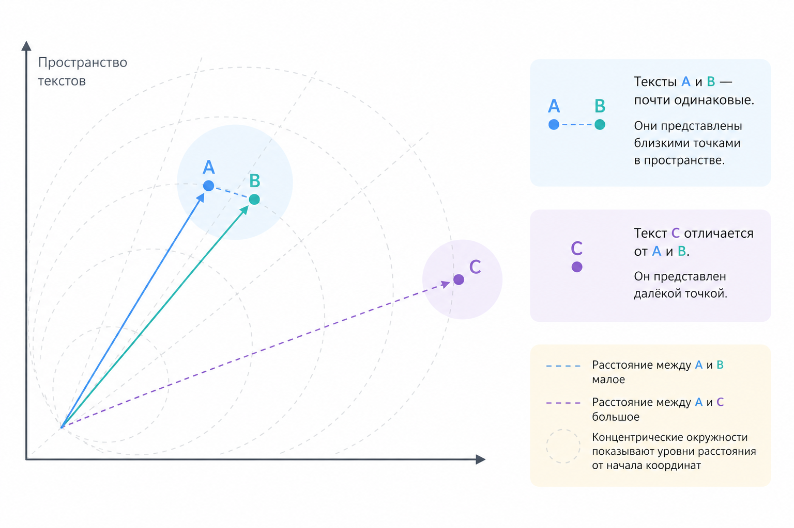

# Почему слова превращаются в числа

В предыдущих главах мы говорили о том, что для алгоритма мир – это числа. Температура, цена, возраст, расстояние – всё это легко представить в виде чисел, и тут обычно не возникает внутреннего сопротивления. Но как только мы подходим к тексту, мозг начинает протестовать.

Слова – это смысл. Фразы – это контекст. Текст – это культура, ирония, намёки, эмоции. Как вообще возможно превратить всё это в набор чисел так, чтобы машина "что-то поняла"?

Ответ одновременно простой и немного обидный: машина ничего не понимает. Она умеет считать. Под "пониманием" здесь имеется в виду человеческое, осмысленное понимание, а не способность воспроизводить статистические закономерности. Наша задача – придумать такое числовое представление текста, при котором подсчёты начинают коррелировать со смыслом.

Эта глава – про то, почему без чисел в тексте не обойтись, как возникает пространство слов и что такое признаки, если речь идёт не о росте и весе, а о предложениях и документах.

### Текст как объект для вычислений

Те алгоритмы машинного обучения, с которымы мы сталкивались раньше, принимают на вход вектор чисел:

$$
x = (x₁, x₂, …, xₙ)
$$

Линейная регрессия, логистическая регрессия, k-NN, деревья решений – все они работают в числовом пространстве. У них нет операций вида "если слово грустное" или "если фраза звучит агрессивно". Есть только сравнения, суммы, произведения и расстояния.

Поэтому первый и неизбежный шаг в работе с текстом – это отображение текста в числовое пространство. Математически это выглядит так:

$$
f: текст → ℝⁿ
$$

Где-то слева у нас строка символов, а справа – точка в $$n$$-мерном пространстве.

Важно сразу принять одну неприятную мысль: не существует "правильного" отображения текста в числа. Есть лишь более или менее полезные представления, которые хорошо работают для конкретной задачи.

### От слов к координатам

Начнём с интуиции. Представим, что у нас есть очень простой мир, в котором всего три слова:\
"кот", "пёс", "автомобиль".

Мы хотим представить их в виде точек. Самый прямолинейный подход – просто пронумеровать слова:

```
кот → 1
пёс → 2
автомобиль → 3
```

Формально это уже числа, но практически – это бесполезно. Почему?

Потому что расстояние между 1 и 2 меньше, чем между 1 и 3, но это не означает, что "кот" в каком-то смысле ближе к "псу", чем к "автомобилю". Числа здесь несут порядок, которого в словах нет.

Модель может начать использовать числовые закономерности, которые для нас не имеют смысловой интерпретации. Иными словами - видеть закономерности там, где их не существует. Особенно это критично для моделей, которые опираются на расстояния и линейные комбинации признаков.

Отсюда появляется ключевая идея: числа должны отражать свойства, а не просто идентификаторы.

### Признаки вместо слов

Когда мы говорим "признак", мы имеем в виду измеряемую характеристику объекта. Для текста объект – это слово, предложение или документ, а признаки – это ответы на вопросы вида (не обязательно интерпретируемые человеком напрямую):

* встречается ли это слово?
* сколько раз оно встречается?
* встречается ли оно рядом с другими словами?
* насколько часто оно встречается в этом документе по сравнению с другими?

Каждый такой вопрос даёт нам число. А набор таких чисел превращает текст в вектор.

Если у нас словарь из V слов, то самый простой вариант – завести по одному признаку на каждое слово.

Документ тогда выглядит как вектор длины V:

$$
x = (c₁, c₂, …, cᵥ)
$$

где $$cᵢ$$ – количество вхождений $$i$$-го слова в документе.

Это уже настоящее числовое представление, с которым можно считать расстояния, строить гиперплоскости и оптимизировать loss-функции.

<div align="left"><figure><figcaption><p>18.1 Документы как точки в пространстве признаков</p></figcaption></figure></div>

### Пространство слов

Когда каждый признак – это слово, мы получаем пространство слов. Геометрически это означает следующее:

* каждое слово соответствует оси (в рамках модели bag-of-words)
* каждый документ – это точка
* близость документов определяется их словарным составом

Если два документа используют похожие слова с похожими частотами, их векторы будут близки.

Если словарь состоит из 10 000 слов, то пространство становится 10 000-мерным. Это звучит пугающе, но для математики это нормально – все вычисления остаются теми же, просто векторы становятся длиннее.

Интересный момент: большинство координат в таких векторах равны нулю. В одном конкретном документе используется лишь малая часть словаря.

Это приводит нас к разреженным векторам – структурам, которые хранят только ненулевые значения. Без этого работать с текстами было бы вычислительно крайне неэффективно и практически неприемлемо.

### Немного математики: расстояния между текстами

Как только текст стал вектором, мы можем измерять расстояние между документами (мы уже говорили об этом в предыдущих главах).

Например, евклидово расстояние:

$$
‖x − y‖ = √(∑ᵢ (xᵢ − yᵢ)²)
$$

Или косинусное сходство:

$$
cos(x, y) = (x · y) / (‖x‖ ‖y‖)
$$

Косинусное сходство особенно важно для текстов, потому что оно сравнивает направление векторов, а не их длину. Это означает, что два документа могут считаться похожими, даже если один в десять раз длиннее другого – при условии, что относительные частоты слов в них схожи и используются те же слова в тех же пропорциях.

<div align="left"><figure><figcaption><p>18.2 Косинусное сходство между векторами документов</p></figcaption></figure></div>

### Развёрнутый пример: два текста → два вектора

Рассмотрим очень простой и намеренно игрушечный пример. Пусть у нас есть два коротких текста:

```
Текст A: "кот спит на диване"
Текст B: "пёс спит на диване"
```

С точки зрения человека тексты почти идентичны: отличается всего одно слово. Посмотрим, как они выглядят для алгоритма.

Предположим, что наш словарь состоит всего из пяти слов:

$$
\{ кот, пёс, спит, на, диване \}
$$

Теперь представим каждый текст в виде вектора частот слов (bag-of-words).

Для текста A:

$$
x_A = (1, 0, 1, 1, 1)
$$

Для текста B:

$$
x_B = (0, 1, 1, 1, 1)
$$

Геометрически это две точки в пятимерном пространстве. Они очень близки: отличаются только по одной координате.

Если мы посчитаем расстояние между ними или косинусное сходство, оно будет небольшим. Алгоритм "видит", что тексты почти одинаковы, хотя и не знает, что такое кот и пёс.

Теперь важный момент. Если мы возьмём третий текст:

```
Текст C: "автомобиль сломался на дороге"
```

И расширим словарь, то его вектор будет отличаться почти по всем координатам. Расстояние до A и B окажется существенно больше.

Так на уровне чистой геометрии появляется статистическое приближение к тому, что человеку кажется смысловой близостью.

<div align="left"><figure><figcaption><p>18.3 Два почти одинаковых текста как близкие точки</p></figcaption></figure></div>

### Почему размерность – это не проблема

Когда мы говорим, что пространство слов может иметь 10 000 или 100 000 измерений, это часто звучит пугающе. Кажется, что такая математика должна быть невероятно сложной.

Но здесь важно разделить два разных источника сложности: математический и вычислительный.

С математической точки зрения почти ничего не меняется. По крайней мере на уровне формул, а не их статистических свойств. Вектор остаётся вектором, расстояние остаётся расстоянием, а скалярное произведение – скалярным произведением:

$$
x · y = ∑ᵢ xᵢ yᵢ
$$

Формулы не усложняются из-за роста размерности. Однако интерпретация расстояний и поведение данных при этом заметно меняются. Сами вычисления при этом сводятся к суммированию большего числа слагаемых.

Сложность возникает на уровне данных и ресурсов: памяти, времени вычислений, хранения разреженных структур. Именно поэтому в машинном обучении так много внимания уделяется оптимизации и структурам данных, а не усложнению формул.

Важно и другое: высокая размерность – это не ошибка сама по себе, а отражение сложности языка, хотя она и создаёт отдельные статистические и вычислительные трудности. Чем богаче язык, тем больше осей требуется, чтобы его описать.

### Микро-антипример: где пространство слов ломается

Рассмотрим два предложения:

```
"Это хороший фильм"
"Это не хороший фильм"
```

Для человека разница принципиальная. Для модели bag-of-words – почти никакой.

Если мы не учитываем порядок слов и отрицания, оба предложения будут иметь почти одинаковые векторы. Слово "не" добавит лишь одну координату, но общий вектор всё равно останется очень близким.

Алгоритм не "ошибается" – он честно работает в том пространстве, которое мы ему задали.

Этот антипример полезен не для критики подхода, а для понимания ответственности инженера. Именно мы решаем, какие признаки существуют и какую геометрию будет иметь пространство текста.

### Почему это работает (хотя выглядит наивно)

На первый взгляд подход "слово = признак" кажется грубым. Он игнорирует порядок слов, грамматику, сарказм и половину того, что мы считаем смыслом.

Но на практике он часто работает удивительно хорошо. В первую очередь – в задачах классификации, поиска и тематического анализа, где важна статистика слов, а не точная семантика предложений.

А причина этого кроется в статистике. В реальных текстах слова распределены не случайно. Темы, эмоции и намерения проявляются через частоты и сочетания слов.

Алгоритм не понимает, что такое "грусть", но он может заметить, что слова "плохо", "устал", "бессмысленно" часто встречаются вместе и коррелируют с определённой меткой. Именно поэтому даже простые модели могут давать полезные результаты.&#x20;

Смысл возникает не внутри модели, а в данных и нашей постановке задачи.

### Ограничения пространства слов

Важно понимать, где этот подход ломается.

Он не различает:

* "кот укусил пса" и "пёс укусил кота"
* "это хорошо" и "это не хорошо"
* близкие по смыслу, но разные по написанию слова

Всё это мотивирует развитие более сложных представлений: n-грамм, TF–IDF, эмбеддингов, контекстных моделей.

Но фундамент остаётся тем же самым: текст превращается в числа, числа образуют пространство, а дальше вступает в игру математика.

### Главное, что стоит унести из этой главы

Текст для алгоритма – это не слова, а координаты.

Мы не "учим машину понимать язык", мы проектируем пространство признаков, в котором статистические методы начинают вести себя осмысленно.

В следующих главах мы будем усложнять это пространство, делая его менее наивным и более выразительным. Но идея отображения текста в $$ℝⁿ$$ останется с нами до самого конца книги.
