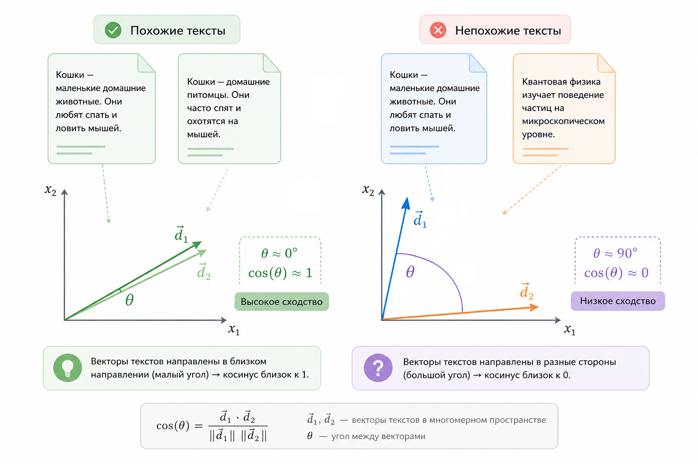
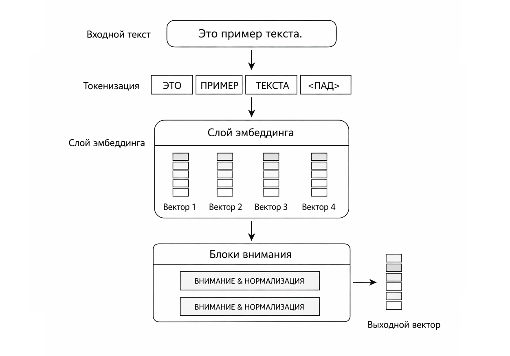
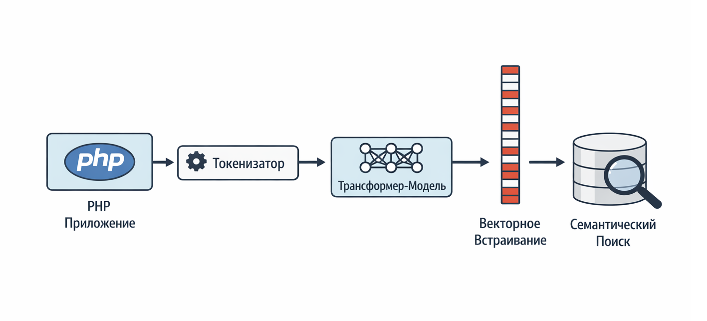
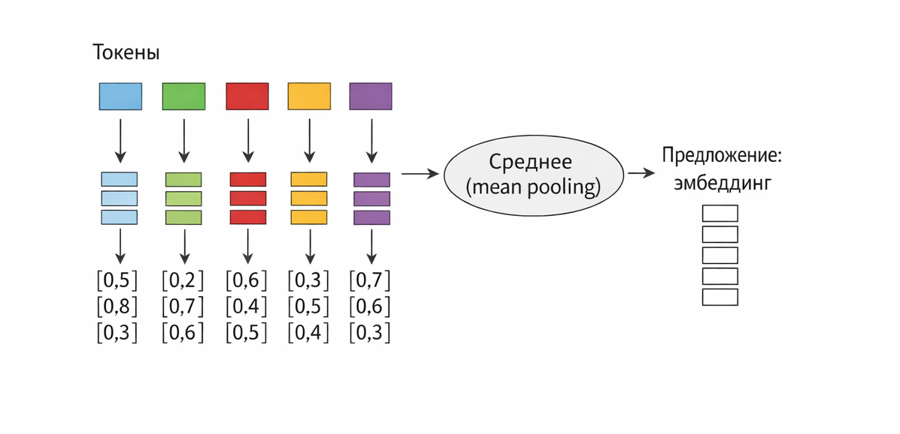
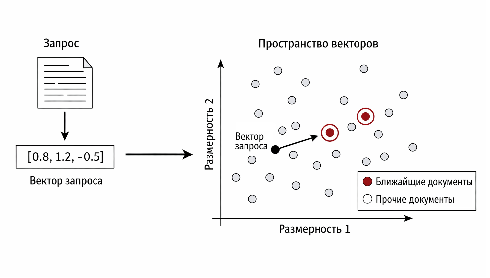

# Практика: эмбеддинги на PHP с помощью трансформеров

В этой главе мы аккуратно приземлим теорию эмбеддингов на инженерную практику. Без обучения моделей, без GPU-кластеров и без магии. Только inference, готовые трансформеры и PHP как рабочий инструмент.

Наша цель проста и имеет практическую цель: научиться получать векторные представления текстов и использовать их для поиска, сравнения и анализа смысла. Мы будем относиться к трансформерам не как к объекту исследования, а как к инфраструктурному компоненту – примерно так же, как к базе данных или поисковому движку.

### Почему inference, а не обучение

Если вы работаете с PHP, почти наверняка большая часть вашей реальности – это веб-приложения, API, сервисы, где важны стабильность, повторяемость и предсказуемость. Обучение трансформеров плохо вписывается в эту картину: оно требует больших датасетов, серьёзных вычислительных ресурсов и отдельной MLOps-инфраструктуры.

Inference, напротив, решает 80% прикладных задач:

* семантический поиск
* кластеризация документов
* поиск похожих записей
* рекомендации
* дедупликация контента
* интеллектуальная навигация

Мы берём уже обученную модель и используем её как функцию:

$$
\text{text} \rightarrow \mathbf{v} \in \mathbb{R}^d
$$

В этом и заключается инженерный подход.

### Что такое эмбеддинг с точки зрения математики

Формально [эмбеддинг](../../vvedenie/glossarii.md#embeddings-embeddingi) – это отображение из пространства текстов в евклидово пространство фиксированной размерности:

$$
f : T \rightarrow \mathbb{R}^d
$$

Где:

* T – множество всех возможных текстов
* d – размерность эмбеддинга (часто 384, 512, 768, 1024)

Ключевой момент здесь не в самой функции $$f$$, а в геометрии получившегося пространства. Семантически близкие тексты отображаются в точки, расположенные близко друг к другу.

На практике мы почти никогда не работаем с координатами напрямую. Нас интересует только расстояние между векторами:

* косинусное сходство
* евклидово расстояние
* иногда скалярное произведение

#### Косинусное сходство

Самая популярная мера:

$$
\cos(a, b) = \frac{a \cdot b}{\lVert a \rVert \, \lVert b \rVert}
$$

Она отвечает на вопрос: "насколько одинаково направлены два вектора". Для эмбеддингов это обычно важнее, чем их длина. Подробно мы разбирали эту тему в главе "[Расстояния и сходство](../../chast-i.-matematicheskii-yazyk-ai/rasstoyaniya-i-skhodstvo/)".

<div align="left"><figure><figcaption><p>22.1 Векторы косинусного сходства</p></figcaption></figure></div>

### Трансформер как чёрный ящик

С инженерной точки зрения трансформер – это композиция функций:

```
text → tokens → embeddings → pooling → vector
```

Нас интересует только вход и выход. Всё, что внутри – self-attention, positional encoding, multi-head attention – важно концептуально, но не обязательно для практического использования.

Тем не менее полезно иметь интуицию.

<div align="left"><figure><figcaption><p>22.2 Обзор трансформера</p></figcaption></figure></div>

### Рассмотрим TransformersPHP как инженерный инструмент

TransformersPHP – это PHP-обёртка вокруг идей и форматов, пришедших из экосистемы Hugging Face. Обычно она используется вместе с ONNX-моделями или через внешние inference-движки.

Вы можете подробнее ознакомиться с этим пакетом на сайте: [https://transformers.codewithkyrian.com/](https://transformers.codewithkyrian.com/)

или на репозитории: \
[https://github.com/CodeWithKyrian/transformers-php](https://github.com/CodeWithKyrian/transformers-php)

Важно сразу зафиксировать философию:

* PHP управляет процессом
* модель – внешний, предобученный артефакт
* inference детерминирован
* никаких градиентов, оптимизаторов и эпох

Именно это делает подход надёжным и воспроизводимым.

### Архитектура практического решения

Типичная схема выглядит так:

```
HTTP запрос
   ↓
PHP приложение
   ↓
Tokenizer
   ↓
Transformer (ONNX)
   ↓
Embedding (vector)
   ↓
Vector DB / поиск / логика
```

<div align="left"><figure><figcaption><p>22.3 Конвейер встраивания (embedding pipeline) </p></figcaption></figure></div>

### Первый пример: получение эмбеддинга текста

Начнём с минимального примера. Предположим, у нас уже есть ONNX-модель для эмбеддингов, например из семейства sentence-transformers.

```php
use Codewithkyrian\Transformers\PreTrainedTokenizers\AutoTokenizer;
use Codewithkyrian\Transformers\Models\Auto\AutoModel;

$tokenizer = AutoTokenizer::fromPretrained('sentence-transformers/all-MiniLM-L6-v2');
$model = AutoModel::fromPretrained('sentence-transformers/all-MiniLM-L6-v2');

$text = 'PHP – это не только веб, но и инженерный инструмент.';

$inputs = $tokenizer->encode($text);
$output = $model->forward($inputs);

// Обычно берут mean pooling по токенам
$embedding = array_map(
    fn($i) => array_sum(array_column($output, $i)) / count($output),
    array_keys($output[0])
);

print_r($embedding);

// Результат:
// Array (
//    [0] => -0.021347
//    [1] =>  0.084912
//    [2] => -0.317654
//    [3] =>  0.112903
//    [4] =>  0.045221
//    ...
//    [379] => -0.098234
//    [380] =>  0.204551
//    [381] => -0.011223
//    [382] =>  0.067891
//    [383] =>  0.154332
// )
```

Здесь важно несколько моментов:

* мы не обучаем модель
* результат всегда одинаков для одного и того же текста
* размерность вектора фиксирована

### Pooling: почему это вообще нужно

Трансформер возвращает эмбеддинг для каждого токена. Но нам нужен один вектор на весь текст.

Самые популярные стратегии:

* mean pooling – среднее по токенам
* max pooling – максимум по каждому измерению
* CLS token – специальный агрегирующий токен

На практике mean pooling чаще всего даёт стабильные результаты.

<div align="left"><figure><figcaption><p>22.4 Объяснение объединения (pooling_explanation)</p></figcaption></figure></div>

### Пример: косинусное сходство на PHP

Теперь, когда у нас есть векторы, мы можем их сравнивать.

```php
function cosineSimilarity(array $a, array $b): float {
    $dot = 0.0;
    $normA = 0.0;
    $normB = 0.0;

    foreach ($a as $i => $val) {
        $dot += $val * $b[$i];
        $normA += $val * $val;
        $normB += $b[$i] * $b[$i];
    }

    return $dot / (sqrt($normA) * sqrt($normB));
}
```

Использование:

```php
$sim = cosineSimilarity($embedding1, $embedding2);

if ($sim > 0.8) {
    echo "Тексты семантически близки";
}
```

### Практический кейс: семантический поиск

Представим, что у нас есть набор статей или событий (например, таймлайн новостей), и мы хотим искать не по словам, а по смыслу.

Алгоритм:

1. Предварительно вычислить эмбеддинги всех документов
2. Сохранить их (БД, файл, vector store)
3. Для запроса пользователя получить его эмбеддинг
4. Найти ближайшие векторы

С точки зрения PHP это выглядит как обычная бизнес-логика, а не ML-экзотика.

<div align="left"><figure><figcaption><p>22.5 Семантический поиск</p></figcaption></figure></div>

### Инженерные замечания

Несколько практических наблюдений, которые обычно приходят только с опытом:

* Кэшируйте эмбеддинги. Inference хоть и дешевле обучения, но не бесплатен.
* Нормализуйте векторы заранее, если часто считаете сходство.
* Размерность важна меньше, чем качество модели.
* Для большинства задач достаточно готовых sentence-моделей.

### Где эмбеддинги особенно хорошо ложатся на PHP

Эмбеддинги неожиданно хорошо сочетаются с PHP-экосистемой:

* CMS и контент-платформы
* корпоративные базы знаний
* поиск по логам и тикетам
* e-commerce каталоги
* аналитические панели

PHP здесь выступает не как ML-язык, а как связующее звено между бизнес-логикой и интеллектуальными моделями.

### Итог

В этой главе мы посмотрели на эмбеддинги не как на абстрактную ML-концепцию, а как на инженерный инструмент. Трансформеры в режиме inference отлично вписываются в PHP-приложения, если относиться к ним прагматично.

Вы не обучаете модель. Вы используете её.

Именно в этом месте машинное обучение перестаёт быть наукой и становится частью системы.
