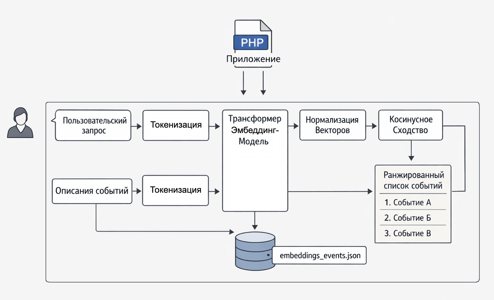

# Кейс 4. Интеллектуальная навигация по событиям / таймлайнам

#### Цель кейса

Показать, как с помощью эмбеддингов и inference можно реализовать поиск по смыслу в ленте событий или базе знаний, не прибегая к обучению моделей, сложному NLP-пайплайну или хрупким эвристикам. Кейс демонстрирует, как трансформеры в PHP превращаются из "ML‑экзотики" в обычный инженерный компонент.

#### Сценарий

Предположим, у нас есть лента событий или материалов, где каждое событие описано несколькими предложениями. Например:

* "введены новые ограничения в отношении технологических корпораций"
* "страны региона наращивают инвестиции в спутниковые программы"
* "обострение конфликта на политической почве в нескольких провинциях"

Пользователь вводит запрос:

> "космическая гонка среди стран региона"

Очевидная проблема: ни одно из слов запроса буквально не обязано встречаться в описании событий. Классический поиск по словам здесь быстро превращается в набор костылей: синонимы, морфология, разные языки, ручные словари и бесконечные исключения.

И это не ошибка данных. Это нормальное поведение человека – формулировать мысли иначе, чем их описывает система.

#### Идея решения

Вместо попытки угадать слова мы будем искать по смыслу. Не в философском, а в сугубо  инженерном смысле:

* описание события → вектор
* запрос пользователя → вектор
* дальше – обычный поиск ближайших значений

Эмбеддинги здесь выступают как универсальный индекс смысла. Мы переводим текст в геометрию, а дальше работаем уже с расстояниями.

Алгоритм выглядит так:

1. Берём массив событий `{id, title, description}`
2. Считаем эмбеддинг только по `description`, так как заголовки часто слишком короткие и добавляют шум
3. Эмбеддим пользовательский запрос
4. Считаем близость запроса к каждому событию
5. Сортируем и возвращаем `top‑N` результатов

Всё это - без обучения моделей и без сложной инфраструктуры.

#### Логика работы

Вынесем всю механику в отдельный класс `SemanticEventSearch`. Этот класс не претендует на идеальную архитектуру и используется исключительно в демонстрационных целях, поэтому мы сознательно опускаем вопросы абстракций и оптимизаций.

Класс `SemanticEventSearch`**:**

<details>

<summary>Код класса SemanticEventSearch</summary>

```php
use function Codewithkyrian\Transformers\Pipelines\pipeline;

final class SemanticEventSearch
{
    private string $model = 'Xenova/paraphrase-multilingual-MiniLM-L12-v2';
    private string $cachePath;
    private string $defaultQuery = 'санкции против IT-компаний';
    private int $topN;

    private ?string $query = null;

    /** @var list<array{id:int,title:string,description:string}> */
    private array $events;

    /** @var array<int, list<float|int>> */
    private array $eventEmbeddingsById = [];

    private $embedder;

    /**
     * Create a new semantic search instance.
     *
     * @param int $topN Number of results to return.
     */
    public function __construct(int $topN = 3)
    {
        $this->cachePath = __DIR__ . '/../embeddings.events.json';
        $this->events = [];
        $this->embedder = null;
        $this->topN = $topN;
    }

    /**
     * Inject events that will be indexed/searched.
     *
     * @param list<array{id:int,title:string,description:string}> $events
     * @return $this
     */
    public function setEvents(array $events): self
    {
        $this->events = $events;
        $this->eventEmbeddingsById = [];
        return $this;
    }

    /**
     * Set the embeddings model identifier.
     *
     * Switching model invalidates in-memory embeddings.
     *
     * @param string $model
     * @return $this
     */
    public function setModel(string $model): self
    {
        $this->model = $model;
        $this->embedder = null;
        $this->eventEmbeddingsById = [];
        return $this;
    }

    /**
     * Set the query to be searched.
     *
     * @param string $query
     * @return $this
     */
    public function setQuery(string $query): self
    {
        $q = trim($query);
        $this->query = $q === '' ? null : $q;
        return $this;
    }

    /**
     * Run the end-to-end semantic search pipeline (cache -> embed query -> score -> top-N).
     *
     * @return array{query:string,results:list<array{score:float,event:array{id:int,title:string,description:string}}>}
     * @throws RuntimeException If events are not set or embeddings output is unexpected.
     */
    public function run(): array
    {
        if (count($this->events) === 0) {
            throw new RuntimeException('Events list is empty. Call setEvents() before run().');
        }

        if ($this->embedder === null) {
            $this->embedder = pipeline('embeddings', $this->model);
        }

        $this->loadEmbeddingsFromCacheIfCompatible();
        $this->ensureAllEventEmbeddings();

        $query = $this->query ?? $this->defaultQuery;
        $queryVec = $this->embedText($query);

        $results = $this->search($queryVec);
        return [
            'query' => $query,
            'results' => $results,
        ];
    }

    /**
     * Compute an embedding vector for a single text.
     *
     * @param string $text
     * @return list<float|int>
     * @throws RuntimeException
     */
    private function embedText(string $text): array
    {
        $emb = ($this->embedder)($text, normalize: true, pooling: 'mean');
        if (!is_array($emb) || !isset($emb[0]) || !is_array($emb[0])) {
            throw new RuntimeException('Unexpected embeddings output format');
        }

        return $emb[0];
    }

    /**
     * Cosine similarity between two vectors.
     *
     * @param list<float|int> $a
     * @param list<float|int> $b
     * @return float
     */
    private function cosineSimilarity(array $a, array $b): float
    {
        $n = min(count($a), count($b));

        $dot = 0.0;
        $normA = 0.0;
        $normB = 0.0;

        for ($i = 0; $i < $n; $i++) {
            $x = (float) $a[$i];
            $y = (float) $b[$i];

            $dot += $x * $y;
            $normA += $x * $x;
            $normB += $y * $y;
        }

        if ($normA <= 0.0 || $normB <= 0.0) {
            return 0.0;
        }

        return $dot / (sqrt($normA) * sqrt($normB));
    }

    /**
     * Load a JSON file and decode to array.
     *
     * @param string $path
     * @return array|null
     */
    private function loadJsonFile(string $path): ?array
    {
        if (!is_file($path)) {
            return null;
        }

        $raw = file_get_contents($path);
        if ($raw === false) {
            return null;
        }

        $data = json_decode($raw, true);
        return is_array($data) ? $data : null;
    }

    /**
     * Encode and save data to JSON file.
     *
     * @param string $path
     * @param array $data
     * @throws RuntimeException
     */
    private function saveJsonFile(string $path, array $data): void
    {
        $json = json_encode($data, JSON_UNESCAPED_UNICODE | JSON_PRETTY_PRINT);
        if ($json === false) {
            throw new RuntimeException('Failed to encode JSON');
        }

        $ok = file_put_contents($path, $json);
        if ($ok === false) {
            throw new RuntimeException('Failed to write cache file: ' . $path);
        }
    }

    /**
     * Load cached event embeddings only if they were produced by the current model.
     *
     * @return void
     */
    private function loadEmbeddingsFromCacheIfCompatible(): void
    {
        $cached = $this->loadJsonFile($this->cachePath);

        if (!is_array($cached) || !isset($cached['model'], $cached['events']) || !is_array($cached['events'])) {
            return;
        }

        if ($cached['model'] !== $this->model) {
            return;
        }

        foreach ($cached['events'] as $row) {
            if (isset($row['id'], $row['embedding']) && is_array($row['embedding'])) {
                $this->eventEmbeddingsById[(int) $row['id']] = $row['embedding'];
            }
        }
    }

    /**
     * Ensure embeddings exist for all events and persist them to cache.
     *
     * @return void
     * @throws RuntimeException
     */
    private function ensureAllEventEmbeddings(): void
    {
        $missing = [];
        foreach ($this->events as $event) {
            $id = (int) $event['id'];
            if (!isset($this->eventEmbeddingsById[$id])) {
                $missing[] = $event;
            }
        }

        if (count($missing) === 0) {
            return;
        }

        foreach ($missing as $event) {
            $id = (int) $event['id'];
            $text = (string) $event['description'];

            $this->eventEmbeddingsById[$id] = $this->embedText($text);
        }

        $toCache = [
            'model' => $this->model,
            'events' => array_values(array_map(
                fn(array $event): array => [
                    'id' => (int) $event['id'],
                    'embedding' => $this->eventEmbeddingsById[(int) $event['id']],
                ],
                $this->events
            )),
        ];

        $this->saveJsonFile($this->cachePath, $toCache);
    }

    /**
     * Score all events against the query embedding and return the top-N results.
     *
     * @param list<float|int> $queryVec
     * @return list<array{score:float,event:array{id:int,title:string,description:string}}>
     */
    private function search(array $queryVec): array
    {
        $scored = [];

        foreach ($this->events as $event) {
            $id = (int) $event['id'];
            $score = $this->cosineSimilarity($queryVec, $this->eventEmbeddingsById[$id]);

            $scored[] = [
                'score' => $score,
                'event' => $event,
            ];
        }

        usort($scored, static fn(array $a, array $b): int => $b['score'] <=> $a['score']);

        return array_slice($scored, 0, $this->topN);
    }

    /**
     * Render results as plain text.
     *
     * @param string $query
     * @param list<array{score:float,event:array{id:int,title:string,description:string}}> $results
     * @return void
     */
    public function render(string $query, array $results): void
    {
        echo "Query: {$query}\n\n";
        foreach ($results as $row) {
            $event = $row['event'];
            $score = (float) $row['score'];

            echo "[" . number_format($score, 4) . "] #{$event['id']} {$event['title']}\n";
            echo "  {$event['description']}\n\n";
        }
    }
}

```


</details>

Снаружи мы задаём:

* список событий через `setEvents()`
* модель эмбеддингов через `setModel()`
* текст запроса через `setQuery()`
* количество результатов `topN` через конструктор

Дальше вызываем `run()` и получаем отсортированный результат.

#### Детали реализации

При первом запуске поднимается embedder:

```php
$this->embedder = pipeline('embeddings', $this->model);
```

При этом используется каталог `.transformers-cache`. При первом обращении модель, токенизатор и веса скачиваются и сохраняются локально. Все последующие запуски используют кэш, что делает работу существенно быстрее и предсказуемее.

Для самих событий используется локальный файл `embeddings.events.json`. Это простой кэш эмбеддингов:

* при запуске мы пытаемся его прочитать
* проверяем, совпадает ли модель в кэше с текущей
* если для каких-то событий эмбеддингов нет, считаем их и сохраняем обратно

Таким образом эмбеддинги событий считаются один раз и переиспользуются.

#### Поиск

После этого логика становится тривиальной:

* эмбеддим запрос пользователя
* нормализуем вектор (чтобы косинусная близость была стабильной)
* считаем cosine similarity с каждым событием
* сортируем по убыванию
* берём `top‑N`

Рендер результатов (`render(query, results)`) намеренно вынесен наружу. Класс поиска возвращает только данные, а не HTML или текстовый вывод.

#### Пример использования

**Список событий:**

<details>

<summary>Массив $events</summary>

```php
$events = [
    [
        'id' => 1,
        'title' => 'Ограничения против технологических корпораций',
        'description' => 'Введены новые экономические меры в отношении крупных технологических компаний.',
    ],
    [
        'id' => 2,
        'title' => 'Развитие космических программ',
        'description' => 'Несколько стран региона увеличили финансирование национальных спутниковых проектов.',
    ],
    [
        'id' => 3,
        'title' => 'Эскалация политического конфликта',
        'description' => 'Обострение конфликта на политической почве в нескольких провинциях.',
    ],
    [
        'id' => 4,
        'title' => 'Ограничения против ИТ-сектора',
        'description' => 'Правительство объявило о новых ограничениях для компаний, работающих в сфере информационных технологий.',
    ],
    [
        'id' => 5,
        'title' => 'Рост инфляции и пересмотр ключевой ставки',
        'description' => 'Центральный банк повысил ключевую ставку на фоне ускорения инфляции и роста цен на импортные товары.',
    ],
    [
        'id' => 6,
        'title' => 'Запуск программы поддержки малого бизнеса',
        'description' => 'Власти объявили о льготных кредитах и налоговых послаблениях для малого и среднего бизнеса в регионах.',
    ],
    [
        'id' => 8,
        'title' => 'Утечка данных в сфере онлайн-ритейла',
        'description' => 'Интернет-магазин расследует утечку персональных данных клиентов после компрометации учётных записей сотрудников.',
    ],
    [
        'id' => 9,
        'title' => 'Прорыв в медицине: новый метод диагностики',
        'description' => 'Исследователи представили метод ранней диагностики заболеваний по биомаркерам, сокращающий время анализа.',
    ],
    [
        'id' => 10,
        'title' => 'Сезонный рост заболеваемости',
        'description' => 'В нескольких городах отмечен рост заболеваемости респираторными инфекциями, клиники усилили приём пациентов.',
    ],
    [
        'id' => 12,
        'title' => 'Засуха и риски для сельского хозяйства',
        'description' => 'Из-за продолжительной засухи фермеры прогнозируют снижение урожайности, обсуждаются меры поддержки аграриев.',
    ],
    [
        'id' => 13,
        'title' => 'Финал крупного спортивного турнира',
        'description' => 'В решающем матче сезона команда одержала победу в дополнительное время, установив новый рекорд по посещаемости.',
    ],
    [
        'id' => 14,
        'title' => 'Трансфер игрока и усиление состава',
        'description' => 'Клуб подписал контракт с новым нападающим, рассчитывая усилить атакующую линию перед серией дерби.',
    ],
    [
        'id' => 15,
        'title' => 'Новые правила для маркетплейсов',
        'description' => 'Регулятор предложил требования к маркировке товаров и прозрачности комиссий на торговых онлайн-платформах.',
    ],
    [
        'id' => 17,
        'title' => 'Сбои в поставках полупроводников',
        'description' => 'Производители электроники предупредили о задержках поставок чипов из-за ограничений экспорта и перегрузки заводов.',
    ],
    [
        'id' => 18,
        'title' => 'Открытие фестиваля современного искусства',
        'description' => 'В столице стартовал фестиваль современного искусства с выставками, перформансами и лекциями художников.',
    ],
    [
        'id' => 19,
        'title' => 'Крупная сделка на рынке недвижимости',
        'description' => 'Инвестфонд приобрёл портфель коммерческой недвижимости, планируя реконструкцию и повышение энергоэффективности.',
    ],
    [
        'id' => 20,
        'title' => 'Исследование океана и новые данные',
        'description' => 'Научная экспедиция собрала данные о течениях и температуре воды, уточнив прогнозы по изменению климата.',
    ],
];
```

</details>

**Запускаем код:**

```php
$query = 'санкции против IT-компаний';

$search = new SemanticEventSearch(topN: 3);
$search->setModel('Xenova/paraphrase-multilingual-MiniLM-L12-v2');
$search->setEvents($events);
$search->setQuery($query);
$out = $search->run();
$search->render($out['query'], $out['results']);
```

**Результат:**

```
Query: санкции против IT-компаний

[0.4288] #4 Ограничения против ИТ-сектора
  Правительство объявило о новых ограничениях для компаний, работающих в сфере информационных технологий.

[0.3356] #15 Новые правила для маркетплейсов
  Регулятор предложил требования к маркировке товаров и прозрачности комиссий на торговых онлайн-платформах.

[0.2598] #8 Утечка данных в сфере онлайн-ритейла
  Интернет-магазин расследует утечку персональных данных клиентов после компрометации учётных записей сотрудников.
```

Мы получили совпадение не по словам, а по смыслу. Самое релевантное событие оказалось первым, хотя формулировки запроса и описания различаются.

#### Диаграмма пайплайна семантического поиска

Чтобы зафиксировать архитектуру решения целиком, полезно посмотреть на неё не через код, а через поток данных. В этом кейсе пайплайн предельно простой и именно поэтому хорошо масштабируется.

<div align="left"><figure><figcaption><p>23.6 Конвейер поиска семантических событий</p></figcaption></figure></div>

Диаграмма подчёркивает два ключевых момента:

Во‑первых, эмбеддинги событий считаются заранее и переиспользуются. Это превращает ML‑часть из дорогой операции в обычный кэшируемый ресурс.

Во‑вторых, запрос пользователя проходит тот же самый путь преобразования, что и данные. Благодаря этому мы сравниваем не слова, а представления в одном и том же семантическом пространстве.

#### Где это применять в продакшене

В целом это уже похоже на продуктовый подход, а не на эксперимент. К тому же вы можете легко заметить, что такой подход:

* слабо привязан к конкретной формулировке запроса
* хорошо работает на коротких описаниях
* легко комбинируется с обычными фильтрами (дата, регион, тип события)

#### Ограничения и подводные камни

Важно не воспринимать семантический поиск как серебряную пулю.

Модели весят немало, и производительность нужно учитывать. Для некоторых задач обычный SQL с `LIKE` или полнотекстовый индекс будет проще и надёжнее. Но это уже нормальный инженерный разговор про trade‑off'ы, а не про магию и чёрные ящики.

Именно в таком виде трансформеры и эмбеддинги перестают быть "AI ради AI" и становятся частью поддерживаемой, объяснимой системы.


Чтобы самостоятельно протестировать этот код, установите примеры из официального репозитория [GitHub](https://github.com/apphp/ai-for-php-developers-examples) или воспользуйтесь [онлайн-демонстрацией](https://aiwithphp.org/books/ai-for-php-developers/examples/part-5/hands-on-embedding-in-php-with-transformers) для его запуска.

