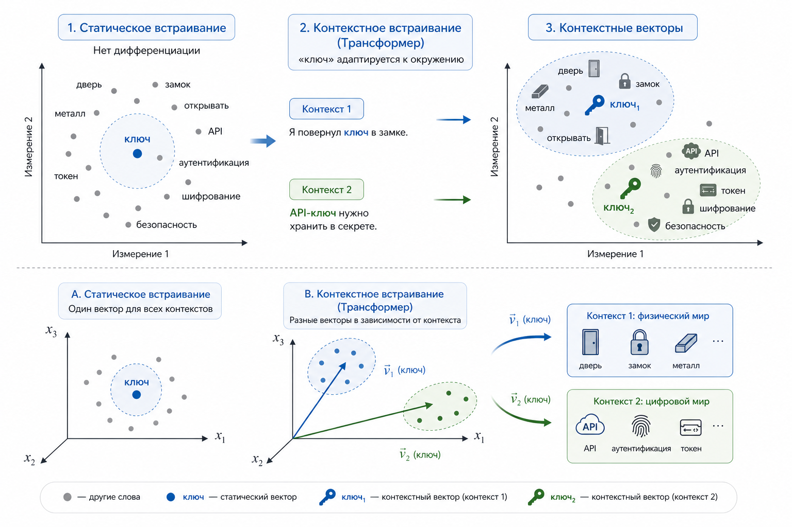
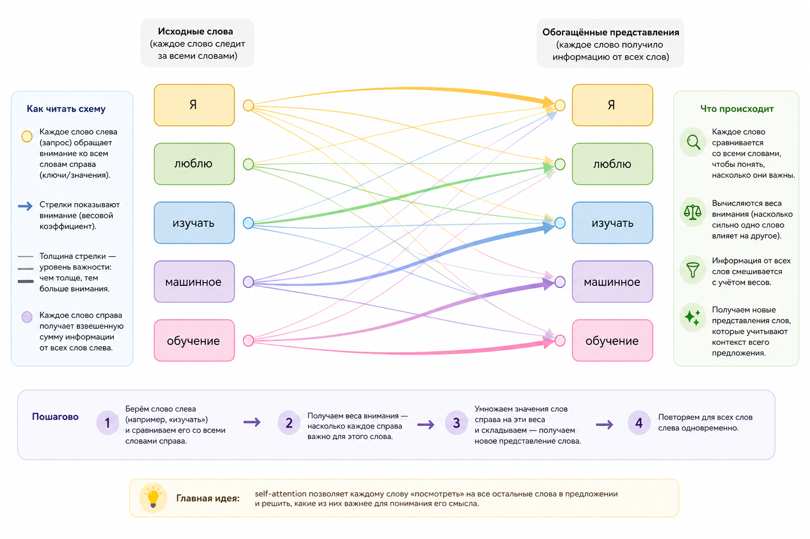
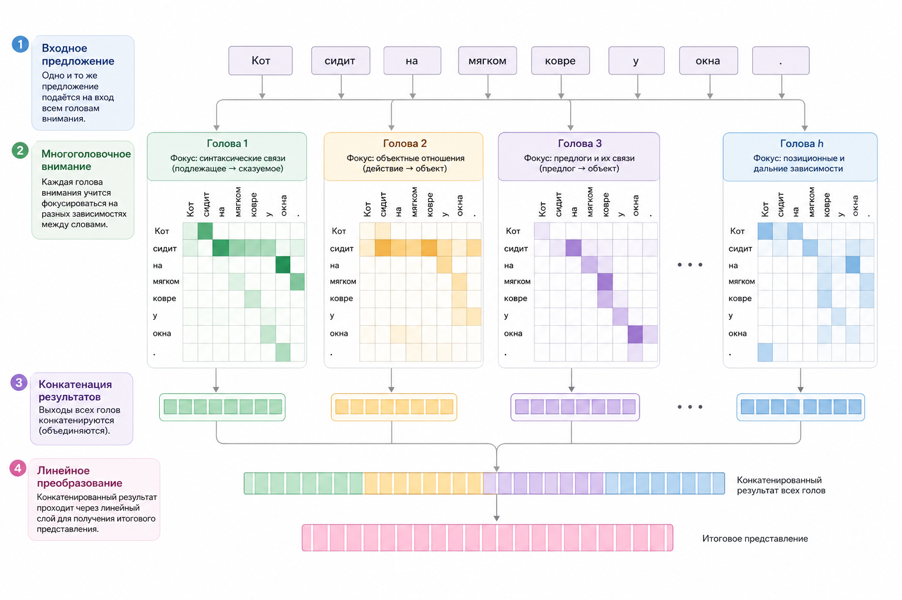

# Трансформеры и контекст: от статических векторов к пониманию смысла

### От статических слов к контексту

В предыдущих главах мы уже привыкли к мысли, что текст можно представить числами. Слова превращаются в векторы, предложения – в наборы точек в многомерном пространстве, а смысл начинает измеряться расстояниями. Однако у классических подходов есть фундаментальное ограничение: одно и то же слово почти всегда имеет один и тот же вектор.

Если мы возьмём слово "ключ", то в модели **word2vec** или **GloVe** оно будет представлено одной фиксированной точкой. Неважно, идёт ли речь о металлическом ключе от двери, о криптографическом ключе или о ключевой идее в тексте. Вектор один. Контекст исчезает.

На уровне здравого смысла это выглядит странно. Мы, люди, без усилий различаем значения:

"Он потерял ключ от квартиры" и "Секретный ключ утёк в сеть" – это два совершенно разных мира. Но для статических эмбеддингов это одно и то же слово.

Но для статических эмбеддингов это одно и то же слово.

> В PHP существуют библиотеки машинного обучения, такие как RubixML, которые позволяют векторизовать текст и сравнивать предложения по косинусному расстоянию. Однако эти методы основаны на статистике слов и не учитывают контекст. В них слово "ключ" всегда остаётся одним и тем же вектором, независимо от смысла. Именно эту границу и переходят трансформеры.

Трансформеры появились именно как ответ на эту проблему. Их ключевая идея проста и в то же время революционна: значение слова определяется не самим словом, а его окружением.

### Почему один "ключ" – разные векторы

В трансформере слово больше не имеет одного фиксированного вектора. Вместо этого для каждого вхождения слова строится свой вектор, зависящий от контекста.

В предложении:

```
"Мастер вставил ключ в замок"
```

слово "ключ" будет близко векторно к словам "замок", "дверь", "металл", "открывать".

А в предложении:

```
"API использует секретный ключ для аутентификации"
```

тот же самый токен "ключ" окажется ближе к "токен", "доступ", "шифрование", "безопасность".

Это не разные слова и не разные правила. Это результат работы механизма self-attention.

Важно, что контекст – это не только ближайшие слова. Self-attention позволяет слову учитывать информацию из любой части предложения, даже если между ними десятки токенов. Именно это принципиально отличает трансформеры от более ранних подходов, где влияние далёких слов быстро затухает.

<div align="left"><figure><figcaption><p>21.1 Контекстные векторы слова "ключ"</p></figcaption></figure></div>

### Self-attention: идея без формул

Self-attention можно объяснить без математики.

Представим, что каждое слово в предложении задаёт вопрос: "Кто из остальных слов здесь для меня важен?". Одновременно оно отвечает на вопросы других слов.

Слово "ключ" в предложении про API как бы смотрит по сторонам и замечает:

* рядом есть "API" – это важно
* рядом есть "аутентификация" – ещё важнее
* слово "для" – почти не важно

В результате его итоговый вектор формируется как взвешенная сумма других слов. Чем важнее слово – тем больший вклад оно вносит.

Важно подчеркнуть три момента:

1. Мы нигде не сравниваем слова напрямую.
2. Мы не пишем правил вида "если рядом API, то это криптография".
3. Мы просто перераспределяем внимание между словами.

Именно это внимание (attention) и даёт контекст.

При этом важно понимать: веса внимания не заданы заранее. Модель не знает "из коробки", какие слова важны, а какие нет. Эти веса она учится выставлять сама в процессе обучения, постепенно подстраиваясь под задачу и минимизируя ошибку. Здесь нет скрытого знания о языке – только оптимизация и большое количество примеров.

### Немного математики – ровно столько, сколько нужно

Совсем без математики всё-таки не обойтись, но мы обойдёмся интуицией.

Каждое слово внутри модели превращается не в один, а сразу в три вектора:

* Query – что я ищу
* Key – что я предлагаю
* Value – что во мне полезного

Название "ключ" здесь, кстати, совпадение и не имеет отношения к слову "ключ" из примеров выше.

Self-attention делает следующее:

* Query одного слова сравнивается с Key всех остальных
* получается набор чисел важности
* эти числа используются как веса для суммирования Value-векторов

В упрощённом виде это можно записать так:

$$
вектор\_слова ≈ сумма(важность_i × значение_i)
$$

Эта формула важна не как формула, а как идея: смысл слова – это агрегированный контекст.

<div align="left"><figure><figcaption><p>21.2 Схема self-attention</p></figcaption></figure></div>

### Почему трансформер понимает порядок слов

Ещё одна тонкость. Если модель просто суммирует контекст, то предложения

"Кот укусил собаку" и "Собака укусила кота"

выглядели бы одинаково.

Чтобы этого не произошло, в трансформерах используется позиционная информация. Каждому слову добавляется информация о его месте в предложении. Это не правило и не грамматика, а просто дополнительный числовой сигнал: "я первый", "я пятый", "я последний".

В результате attention учитывает не только то, какие слова рядом, но и где они находятся.

### Много голов лучше, чем одна

На практике self-attention работает не в одном, а сразу в нескольких параллельных проекциях. Это называется multi-head attention.

Одна "голова" может фокусироваться на синтаксисе: кто подлежащее, кто сказуемое. Другая – на семантике. Третья – на дальних связях через всё предложение.

В итоге итоговый вектор слова – это объединение нескольких разных взглядов на контекст.

<div align="left"><figure><figcaption><p>21.3 Многоголовочное (multi-head) внимание</p></figcaption></figure></div>

### Мини-пример на PHP: внимание как веса

Мы не будем реализовывать настоящий трансформер на PHP – это слишком тяжёлая задача. Но идею внимания можно показать на игрушечном примере.

Представим, что у нас есть слово "ключ" и три соседних слова с заранее заданной "важностью":

```php
$context = [
    'API' => 0.6,
    'аутентификация' => 0.9,
    'для' => 0.1,
];

$values = [
    'API' => [1.0, 0.2],
    'аутентификация' => [0.9, 0.8],
    'для' => [0.1, 0.0],
];

$result = [0.0, 0.0];

foreach ($context as $word => $weight) {
    $result[0] += $weight * $values[$word][0];
    $result[1] += $weight * $values[$word][1];
}

print_r($result);

// Результат
// Array (
//    [0] => 1.42
//    [1] => 0.84
// )
```

Этот код не обучается и ничего не "понимает", но он показывает сам принцип: итоговый вектор складывается из контекста с разными весами.

Именно так, только в миллионы раз сложнее, работают трансформеры.

### Что в итоге меняется принципиально

Трансформеры ломают старую интуицию "слово = значение". Теперь корректнее думать так:

$$
значение \ слова = функция \ контекста
$$

Это объясняет, почему современные модели:

* различают омонимы
* понимают длинные зависимости
* умеют обобщать без явных правил

Именно поэтому дальше, в практических главах, мы будем работать уже не с учебной функцией `embed()`, а с реальными трансформерными моделями. Там не сравниваются слова. Там измеряются расстояния между контекстами.

В результате мы перестаём сравнивать отдельные слова и начинаем сравнивать целые смысловые фрагменты: предложения, абзацы, документы. Именно это делает возможным поиск по смыслу, кластеризацию текстов и ответы на вопросы – задачи, которые практически недостижимы на уровне отдельных слов.

И именно там начинается ощущение, что модель не просто считает, а в каком-то смысле понимает текст.
