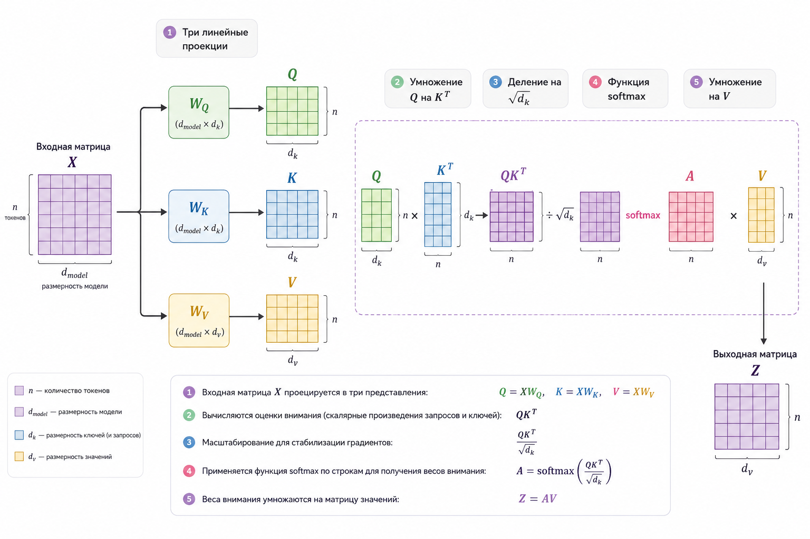
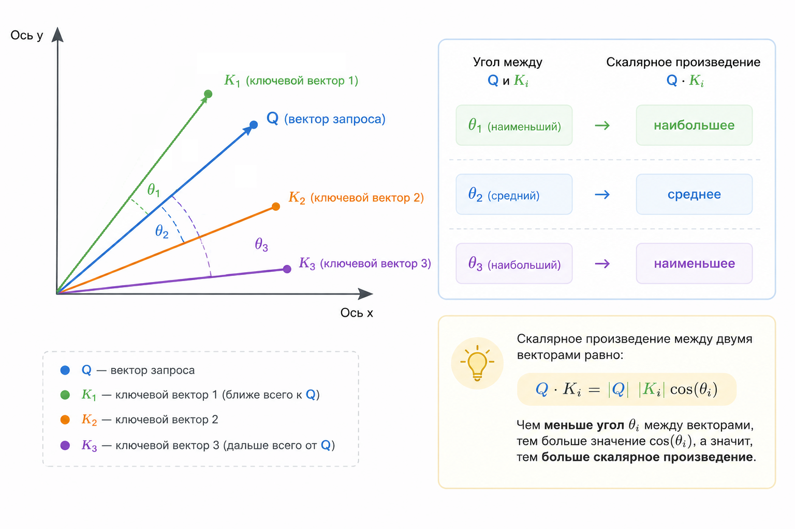

# Attention как взвешенное суммирование

Если убрать весь маркетинг вокруг LLM и трансформеров, attention – это очень простая идея: каждый элемент последовательности смотрит на другие элементы и берёт их в разной степени важности.

Математически это всего лишь взвешенное суммирование.

Инженерно – это самый важный блок в архитектуре Attention Is All You Need.

Разберёмся спокойно, без лишней суеты.

### Интуиция: внимание как "умное среднее"

Представим предложение:

> “The bank approved the loan.”

Слово _bank_ может означать и "банк", и "берег". Чтобы понять смысл, модель должна "посмотреть" на другие слова – _approved_, _loan_ – и понять контекст.

Механизм attention делает следующее:

1. Для каждого слова считает, насколько оно связано с другими словами.
2. Превращает эти оценки в веса.
3. Делает взвешенную сумму представлений слов.

Формально:

$$
\text{output}_i = \sum_{j=1}^{n} \alpha_{ij} \cdot v_j
$$

где:

* $$v_j$$ – вектор значения (value) слова j
* $$\alpha_{ij}$$ – насколько слово i “внимательно” к слову j
* $$\sum_j \alpha_{ij} = 1$$

Это обычное взвешенное среднее. Но веса считаются не вручную, а через Q/K/V.

### Откуда берутся Q, K и V

Каждое входное слово представлено вектором $$x \in \mathbb{R}^d$$.

Из него линейными преобразованиями получаем три новых вектора:

$$Q = XW_Q \\ K = XW_K \\ V = XW_V$$\
\
Где:

* $$W_Q, W_K, W_V$$  – обучаемые матрицы
* $$Q$$ – query (запрос)
* $$K$$  – key (ключ)
* $$V$$ – value (значение)

Интуитивно:

* Query – "что я ищу?"
* Key – "что я предлагаю?"
* Value – "что я передаю, если меня выбрали?"

### Скалярное произведение как мера похожести

Чтобы понять, насколько слово $$i$$ связано со словом $$j$$, берём:

$$
\text{score}_{ij} = Q_i \cdot K_j
$$

Это скалярное произведение. Если векторы сонаправлены – значение большое. Если ортогональны – около нуля.

Чтобы избежать слишком больших чисел, делим на $$\sqrt{d_k}$$:

$$
\text{score}_{ij} = \frac{Q_i \cdot K_j}{\sqrt{d_k}}
$$

Это называется Scaled Dot-Product Attention.

### Превращаем score в вероятности

Чтобы получить веса, применяем softmax:

$$
\alpha_{ij} = \frac{\exp(\text{score}_{ij})}{\sum_k \exp(\text{score}_{ik})}
$$

Теперь:

* все веса положительные
* сумма по $$j$$ равна 1

### Полная формула Attention

В матричной форме:

$$
\text{Attention}(Q, K, V) = \text{softmax}\left( \frac{QK^T}{\sqrt{d_k}} \right)V
$$

Это ключевая формула трансформера.

<div align="left"><figure><figcaption><p>27.1 Scaled dot product attention</p></figcaption></figure></div>

### Мини-пример с числами

Пусть у нас 2 токена и размерность 2.

```
Q1 = [1, 0]
Q2 = [0, 1]

K1 = [1, 0]
K2 = [0, 1]

V1 = [10, 0]
V2 = [0, 20]
```

#### Считаем score

Для первого токена:

```
score11 = 1
score12 = 0
```

После softmax:

```
alpha11 ≈ 0.73
alpha12 ≈ 0.27
```

Output:

$$
0.73 * V_1 + 0.27 * V_2 ≈ [7.3, 5.4]
$$

Мы получили смесь значений.

### Упрощённая реализация Attention на PHP

Ниже – минималистичная версия scaled dot-product attention.

```php
function dot($a, $b) {
    $sum = 0.0;
    for ($i = 0; $i < count($a); $i++) {
        $sum += $a[$i] * $b[$i];
    }
    return $sum;
}

function softmax($scores) {
    $max = max($scores); // стабилизация
    $exp = [];
    $sum = 0.0;

    foreach ($scores as $s) {
        $e = exp($s - $max);
        $exp[] = $e;
        $sum += $e;
    }

    return array_map(fn($e) => $e / $sum, $exp);
}

function attention($Q, $K, $V) {
    $d_k = count($Q[0]);
    $outputs = [];

    foreach ($Q as $i => $q) {

        $scores = [];
        foreach ($K as $k) {
            $scores[] = dot($q, $k) / sqrt($d_k);
        }

        $weights = softmax($scores);

        $output = array_fill(0, count($V[0]), 0.0);

        foreach ($weights as $j => $w) {
            foreach ($V[$j] as $k => $val) {
                $output[$k] += $w * $val;
            }
        }

        $outputs[] = $output;
    }

    return $outputs;
}
```

Это не оптимизированый код. Это демонстрация идеи.

### Где здесь обучение?

Матрицы:

* $$W_Q$$
* $$W_K$$
* $$W_V$$

обучаются через backpropagation.

Градиенты проходят:

1. Через умножение на $$V$$
2. Через softmax
3. Через деление на $$\sqrt{d}$$
4. Через $$Q$$ и $$K$$
5. Через линейные слои

Именно поэтому attention полностью дифференцируем.

### Геометрическая интерпретация

Attention – это:

> Проекция запроса в пространство ключей
>
> → измерение угла
>
> → смешивание значений

Если представить векторы в 2D, то скалярное произведение – это:  $$\lVert Q \rVert \, \lVert K \rVert \cos(\theta)$$

Чем меньше угол – тем больше вклад.

<div align="left"><figure><figcaption><p>27.2 Вклад угла между векторами на скалярное произведение</p></figcaption></figure></div>

### Почему это революция?

До трансформеров были:

* RNN
* LSTM
* GRU

Они обрабатывали текст последовательно.

Attention позволил:

* Параллельную обработку
* Глобальный контекст
* Масштабирование

И стал основой моделей вроде OpenAI и их GPT-линейки.

### Self-Attention

В self-attention:

$$
Q = K = V = XW
$$

То есть все три получаются из одного входа.

Каждый токен "смотрит" на всех остальных.

### Что важно понять разработчику

Attention – это не магия.

Это:

1. Линейные преобразования
2. Скалярное произведение
3. Softmax
4. Взвешенная сумма

И... Всё.

Если вы понимаете матрицы и взвешенные средние – вы понимаете attention.

### Как использовать это в PHP-проектах

В реальных PHP-проектах вы врядли будете реализовывать attention вручную.

Но понимание нужно, чтобы:

* понимать, что происходит в LLM API
* строить собственные lightweight-модели
* оптимизировать embedding-поиск
* объяснять клиенту, почему модель "так решила"
