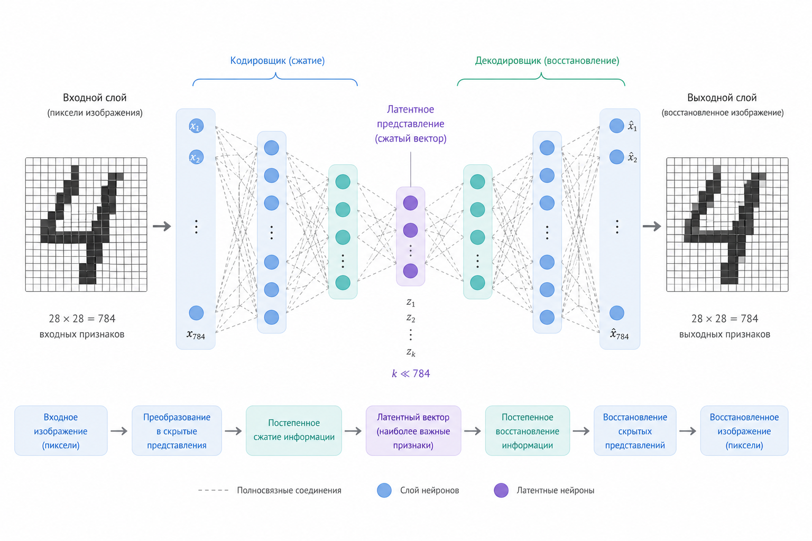
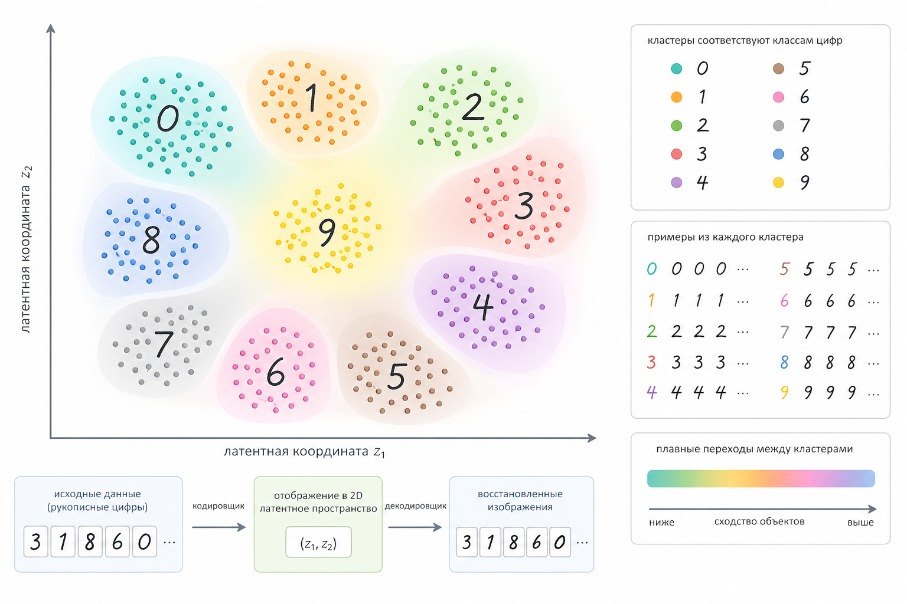

# Автокодировщики

Автокодировщик (autoencoder) – это один из самых "честных" типов нейросетей. Он не пытается напрямую предсказать класс, не ищет метку и не оптимизирует бизнес-метрику. Его задача проще и одновременно глубже: научиться сжать данные, а затем восстановить их обратно.

Если совсем упростить, автокодировщик отвечает на вопрос:&#x20;

> Как представить сложный объект максимально компактно, не потеряв его суть?

### Интуиция: архиватор для данных

Представьте, что у вас есть изображение 28×28 пикселей (как в MNIST). Это 784 числа.

Можно ли представить ту же цифру, скажем, всего в 16 числах, а потом восстановить обратно?

Автокодировщик делает именно это:

```
[784] → [128] → [32] → [16] → [32] → [128] → [784]
   Encoder         Latent         Decoder
```

* Encoder – сжимает данные
* Latent space – компактное представление
* Decoder – восстанавливает данные

### Архитектура

Автокодировщик состоит из двух частей:

#### 1. Encoder (кодировщик)

Преобразует вход x в скрытое представление z:

$$
z = f(x)
$$

#### 2. Decoder (декодировщик)

Пытается восстановить исходные данные:

$$
\hat{x} = g(z)
$$

#### Общая схема:

$$
\hat{x} = g(f(x))
$$

### Функция потерь

Автокодировщик обучается так, чтобы восстановленный вход был максимально похож на оригинал.

Самая простая функция ошибки: MSE (среднеквадратичная ошибка)

$$
L = ||x - \hat{x}||^2
$$

$$
L = |x - \hat{x}|^2
$$

То есть модель штрафуется за каждое отклонение между исходным и восстановленным значением.

### Важная идея: бутылочное горлышко (bottleneck)

Ключ к обучению – это узкое место (latent space).

Если просто сделать сеть:

```
784 → 784
```

она выучит тождественное отображение (identity function) и ничего не поймёт.

Но если заставить её пройти через:

```
784 → 16 → 784
```

модель вынуждена:

* отбросить шум
* выделить главное
* найти структуру данных

### Визуализация&#x20;

<figure><figcaption><p>28.1 Схема автокодировщика<em>: вход → encoder → латентное пространство → decoder → восстановленный выход</em></p></figcaption></figure>

### Что на самом деле хранится в latent space?

Вот где становится интересно.

Latent vector (например, 16 чисел) – это не просто "сжатые пиксели". Это абстрактные признаки:

Для цифр это может быть:

* наклон
* толщина линии
* наличие петли
* форма

То есть модель начинает понимать структуру данных, даже без учителя.

### Аналогия с PCA

Автокодировщик часто сравнивают с PCA (метод главных компонент).

PCA делает:

$$
z = W x
$$

Но:

| PCA               | Autoencoder           |
| ----------------- | --------------------- |
| Линейный          | Нелинейный            |
| Один слой         | Глубокая сеть         |
| Простая геометрия | Сложные представления |

Автокодировщик – это обобщение PCA.

### Простой пример на PHP (интуитивный)

Реализуем очень упрощённый Автокодировщик (без оптимизации, просто идея).

```php
class SimpleAutoencoder {
    private $encoderWeights;
    private $decoderWeights;

    public function __construct($inputSize, $latentSize) {
        // случайные веса
        $this->encoderWeights = $this->randomMatrix($inputSize, $latentSize);
        $this->decoderWeights = $this->randomMatrix($latentSize, $inputSize);
    }

    private function randomMatrix($rows, $cols) {
        $m = [];
        for ($i = 0; $i < $rows; $i++) {
            for ($j = 0; $j < $cols; $j++) {
                $m[$i][$j] = (mt_rand() / mt_getrandmax()) - 0.5;
            }
        }
        return $m;
    }

    private function dot($vector, $matrix) {
        $result = [];
        foreach ($matrix[0] as $j => $_) {
            $sum = 0;
            foreach ($vector as $i => $v) {
                $sum += $v * $matrix[$i][$j];
            }
            $result[$j] = $sum;
        }
        return $result;
    }

    public function encode($x) {
        return $this->dot($x, $this->encoderWeights);
    }

    public function decode($z) {
        return $this->dot($z, $this->decoderWeights);
    }

    public function forward($x) {
        $z = $this->encode($x);
        return $this->decode($z);
    }
}
```

Использование:

```php
$ae = new SimpleAutoencoder(784, 16);

$input = array_fill(0, 784, 0.5); // пример

$output = $ae->forward($input);

// сравниваем input и output
```

Это, конечно, ещё не обучение, но уже видно:

* есть сжатие
* есть восстановление

### Как происходит обучение

На практике:

1. Берём вход x
2. Получаем $$\hat{x}$$
3. Считаем ошибку
4. Делаем backpropagation
5. Обновляем веса

Точно так же, как в обычных нейросетях.

### Важный момент: автокодировщик может "читерить"

Если latent space слишком большой, модель может:

* просто запомнить вход
* не научиться структуре

Решения:

* уменьшать размер latent
* добавлять шум
* ограничивать веса

### Виды автокодировщиков

#### 1. Denoising Autoencoder

Добавляем шум:

$$
x_{noisy} \rightarrow x_{clean}
$$

Модель учится восстанавливать чистые данные.

#### 2. Sparse Autoencoder

Добавляем штраф за активность нейронов:

* большинство нейронов должны быть ≈ 0

Это заставляет модель учить более "чистые" признаки.

#### 3. Variational Autoencoder (VAE)

Здесь начинается настоящий ML-магия.

Вместо фиксированного вектора:

$$
z \sim \mathcal{N}(\mu, \sigma)
$$

Модель учится:

* генерировать новые данные
* работать с вероятностями

Это уже мост к генеративным моделям.

### Визуализация латентного пространства

<figure><figcaption><p>28.2 <em>Точки в 2D latent space, где похожие объекты расположены рядом</em></p></figcaption></figure>

### Где это применяется

Автокодировщики используются там, где важно представление данных:

* сжатие изображений
* удаление шума
* обнаружение аномалий
* предобучение моделей
* генерация (через VAE)

### Связь с предыдущими темами

Если вспомнить:

* kNN – хранит данные
* деревья – делят пространство
* логистическая регрессия – даёт вероятность

то автокодировщик делает другое:&#x20;

> он учится представлению данных, а не решению задачи напрямую

### Ключевая мысль

Автокодировщик – это переход от: "предсказывать ответ"

к "понять структуру данных"

### Выводы

* Автокодировщик – это модель сжатия и восстановления
* Центральное место – latent space
* Через bottleneck модель учится выделять главное
* Это фундамент для генеративных моделей

### Мост к следующей теме

Автокодировщики уже намекнули на важную идею: а что если не просто сжимать данные, а генерировать новые?

Следующий шаг – модели, которые не просто восстанавливают вход, а создают что-то новое. Это мы рассмотрим в следующих главах.

