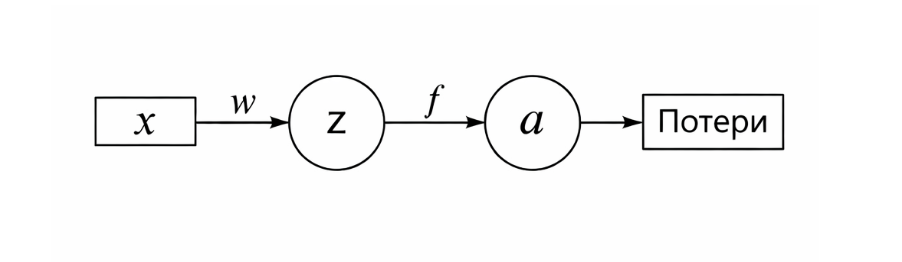

# Backpropagation – почему он работает

Если вы дошли до этой главы, значит уже понимаете две ключевые идеи: перцептрон считает линейную комбинацию признаков, а нейросеть – это композиция таких комбинаций плюс нелинейности.

Теперь главный вопрос: как сеть учится?

Почему вообще возможно подобрать тысячи и миллионы весов так, чтобы сеть начинала распознавать спам, лица или фишинговые письма?

Ответ – backpropagation.

Но без магии. И без ужаса из учебников.

### Интуиция: сеть как система труб

Представьте сеть как систему труб:&#x20;

```
вход → слой 1 → слой 2 → выход → ошибка
```

Вода течёт вперёд. Это forward pass.

На выходе мы сравниваем результат с правильным ответом и получаем ошибку.

А теперь вопрос: если ошибка равна 0.3 – какой именно вес виноват?

Вот тут и начинается backpropagation – метод распределения ответственности.

### Минимальная математика, без боли

Начнём с одного нейрона.

$$
z = w x + b
$$

Активация:

$$
a = f(z)
$$

Пусть ошибка:

$$
L = (a - y)^2
$$

Нам нужно понять:

$$
\frac{\partial L}{\partial w}
$$

То есть – как изменение веса влияет на ошибку.

#### Ключевая идея

Ошибка зависит от:

* активации
* активация зависит от z
* z зависит от w

Это цепочка зависимостей.

И тут в действие вступает цепное правило.

### Цепное правило – человеческое объяснение

Если:

$$
L = L(a) \\
a = f(z) \\
z = wx
$$

То:

$$
\frac{dL}{dw} = \frac{dL}{da} \cdot \frac{da}{dz} \cdot \frac{dz}{dw}
$$

Всё.

Это просто правило:&#x20;

> если что-то зависит через цепочку, то производные перемножаются.

### Почему это работает интуитивно

Представьте:

* $$L$$ - показывает, насколько нам плохо
* $$a$$ - говорит, что предсказала сеть
* $$z$$ - внутренний сигнал нейрона
* $$w$$ - ручка регулировки

Мы считаем:

1. Насколько ошибка чувствительна к выходу ( $$\frac{dL}{da}$$ )
2. Насколько выход чувствителен к внутреннему сигналу ( $$\frac{da}{dz}$$ )
3. Насколько сигнал зависит от веса ( $$\frac{dz}{dw}$$ )

И перемножаем.

Это просто распространение влияния назад.

<div align="left"><figure><figcaption><p>26.1 Вычислительный граф</p></figcaption></figure></div>

### Числовой пример

Пусть:

```
x = 2
w = 0.5
b = 0
f = sigmoid
z = 1
a = 0.73
```

Правильный ответ: y = 1

$$
L = (0.73 - 1)^2 = 0.0729
$$

Теперь считаем производные.

#### 1. $$\frac{dL}{da}$$

$$
2(a - y) = -0.54
$$

#### 2.  $$\frac{da}{dz}$$&#x20;

Для сигмоиды:

$$
a(1 - a) \\ 
0.73 * 0.27 ≈ 0.197
$$

#### 3. $$\frac{dz}{dw}$$

$$
x = 2
$$

Итог:

$$
-0.54 * 0.197 * 2 ≈ -0.213
$$

Это и есть градиент.

Вес нужно увеличить (минус на минус).

### Теперь несколько слоёв

Пусть есть:

$$
x → h → y \\
h = f(w_1 x) \\
y = g(w_2 h)
$$

Ошибка:

$$
L = (y - t)^2
$$

Теперь:

$$
\frac{dL}{dw_1} = \frac{dL}{dy} \cdot \frac{dy}{dh} \cdot \frac{dh}{dw_1}
$$

То есть цепочка просто становится длиннее.

Backpropagation – это автоматическое применение цепного правила ко всей сети.

#### \[Картинка 2 – сеть из двух слоёв]

Плейсхолдер:

```
x → w1 → h → w2 → y → Loss
```

Промпт:

“Two-layer neural network diagram, input node x, hidden node h, output node y, arrows with weights w1 and w2, simple white educational diagram”

***

### Почему это не магия

Всё сводится к трём фактам:

1. Сеть – композиция функций
2. Производная композиции – произведение производных
3. Мы можем считать их эффективно, проходя назад

Backprop – это не алгоритм обучения.

Это способ вычисления [градиента](../vvedenie/glossarii.md#gradient).

А уже градиентный спуск меняет веса.

## 8. Как это выглядит в чистом PHP

<br>

Минимальный пример одного нейрона.

```
<?php

function sigmoid($x) {
    return 1 / (1 + exp(-$x));
}

function sigmoid_derivative($a) {
    return $a * (1 - $a);
}

$x = 2;
$w = 0.5;
$y_true = 1;
$lr = 0.1;

// Forward
$z = $w * $x;
$a = sigmoid($z);
$loss = pow($a - $y_true, 2);

// Backward
$dL_da = 2 * ($a - $y_true);
$da_dz = sigmoid_derivative($a);
$dz_dw = $x;

$gradient = $dL_da * $da_dz * $dz_dw;

// Update
$w = $w - $lr * $gradient;

echo "New weight: " . $w;
```

Это и есть backprop – в 10 строках.

***

## 9. Что происходит в глубокой сети

<br>

В глубокой сети:

* на каждом слое считаем локальную производную
* умножаем на градиент следующего слоя
* передаём дальше

<br>

Это похоже на волну ответственности.

<br>

Ошибка с выхода “затухает” или “взрывается” в зависимости от производных.

<br>

Отсюда:

* проблема затухающего градиента
* проблема взрывающегося градиента

<br>

И поэтому:

* ReLU лучше сигмоиды в глубоких сетях
* нужна нормализация
* нужны хорошие инициализации

***

## 10. Геометрическая интерпретация

<br>

Градиент – это направление самого быстрого роста ошибки.

<br>

Мы идём в противоположную сторону.

<br>

Если представить поверхность ошибки:

<br>

\[Картинка 3 – поверхность функции ошибки]

<br>

Промпт:

<br>

“3D surface plot of loss landscape with a point and gradient arrow descending downhill, educational style, white background”

<br>

Backprop просто говорит:

вот вектор вниз.

***

## 11. Почему это вообще удивительно

<br>

Фактически:

* у нас могут быть миллионы параметров
* каждый параметр влияет на выход через длинную цепочку
* но мы можем посчитать всё за время, линейное по числу связей

<br>

Без backprop обучение глубокой сети было бы невозможным.

***

## 12. Связь с вашей практикой (B2B security, PHP)

<br>

Если вы работаете с:

* детекцией фишинга
* классификацией email
* поведением пользователя

<br>

То любая нейросеть в основе использует именно это.

<br>

Даже если вы применяете готовую библиотеку, например RubixML, внутри происходит именно это распространение градиента.

<br>

Понимание backprop даёт:

* уверенность
* способность дебажить
* понимание, почему модель “застряла”

***

## 13. Главное, что нужно запомнить

<br>

Backprop – это:

<br>

не магия

не искусственный интеллект

не нейробиология

<br>

Это просто:

<br>

цепное правило, применённое к графу вычислений.

***

## 14. Если хотите понять окончательно

<br>

Возьмите:

* 2 входа
* 1 скрытый слой
* 1 выход
* квадратичную ошибку

<br>

И распишите производные руками.

<br>

После этого вы перестанете бояться формул.

***

## Заключение

<br>

Backpropagation – один из самых красивых алгоритмов XX века.

<br>

Он прост:

* идём вперёд
* считаем ошибку
* идём назад
* распределяем ответственность
* обновляем веса

<br>

Всё остальное – детали.

<br>

И самое важное:

вы уже способны реализовать это в PHP.

<br>

А значит – понимаете, как учится современный ИИ.

***

Если хотите, я могу:

<br>

– добавить полный пример двухслойной сети на PHP

– добавить визуальный ASCII-разбор производных

– добавить раздел “Backprop и LLM – есть ли связь?”
