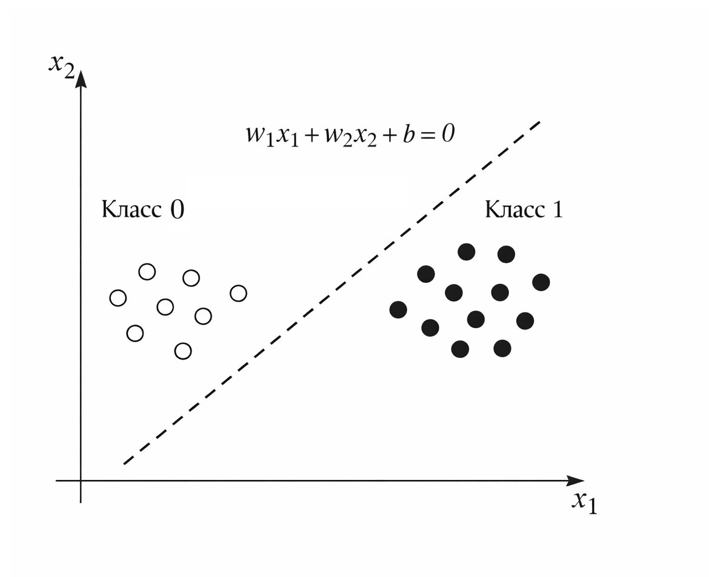
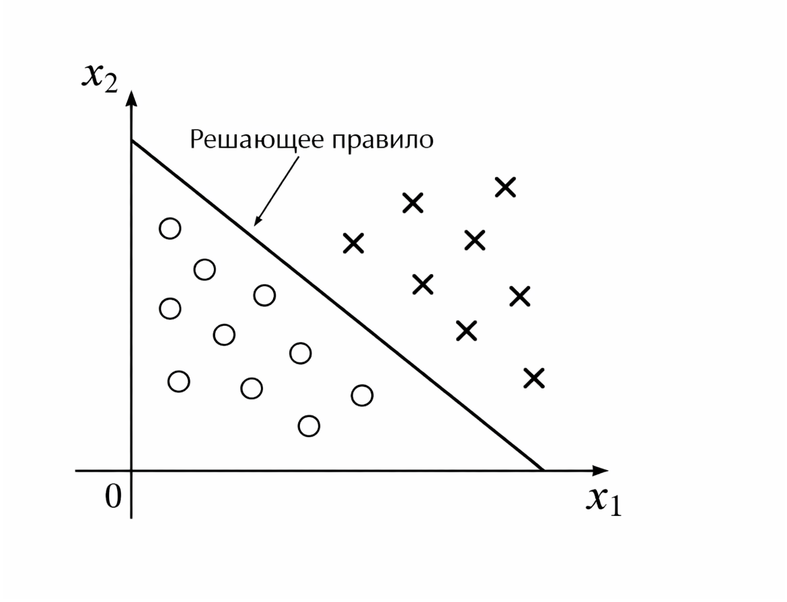
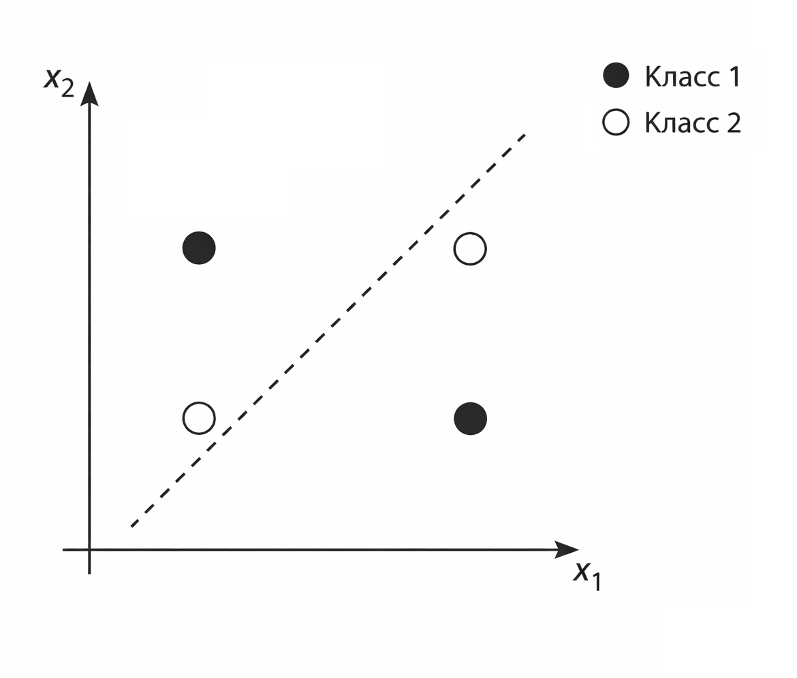
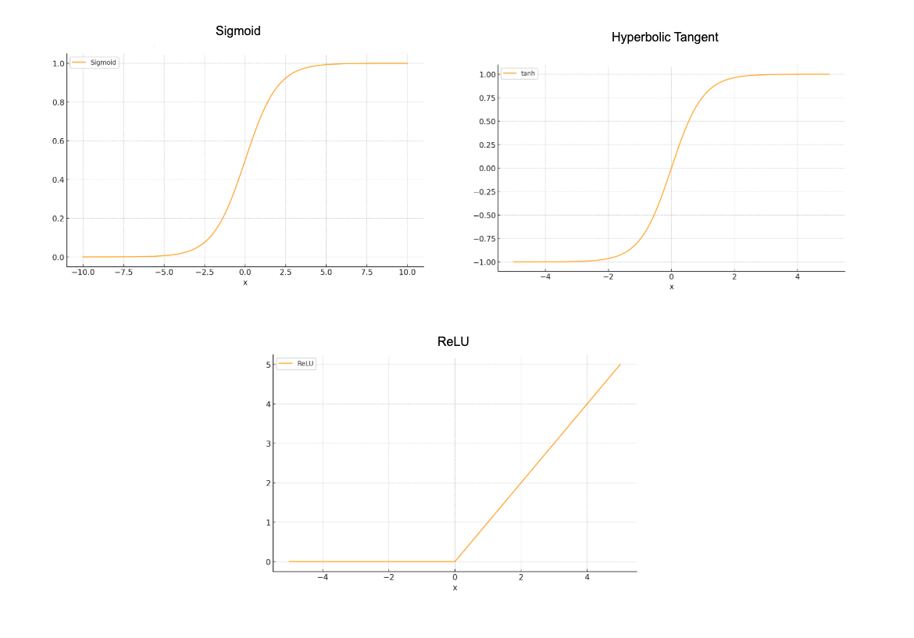
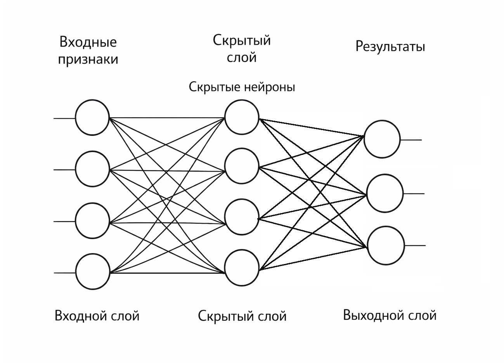

# Перцептрон и полносвязная сеть

### Что такое перцептрон

Перцептрон – это одна из самых простых моделей машинного обучения и одновременно фундаментальный строительный блок нейронных сетей. Несмотря на то что современные архитектуры выглядят невероятно сложными, в их основе по-прежнему лежит та же идея, что и в перцептроне: взвешенная сумма входов и принятие решения на основе порога.

Если убрать всю математику, перцептрон отвечает на очень простой вопрос:

"Если я сложу все аргументы с учетом их важности – достаточно ли их, чтобы принять решение?"

Представьте, что банк решает, выдавать ли кредит. Он учитывает:

* доход клиента
* стаж работы
* кредитную историю
* текущую долговую нагрузку

Каждый фактор имеет свою "важность". Доход может быть важнее стажа, просрочки – сильным отрицательным фактором. Все эти факторы складываются, и если итоговый "балл" превышает некоторый порог – кредит одобряется.

Перцептрон делает ровно это же, только в математической форме.

#### Исторический контекст

Перцептрон был предложен в 1957 году Фрэнком Розенблаттом. Это была одна из первых моделей, вдохновленных нейронами мозга.

Идея была простой: нейрон получает сигналы от других нейронов, суммирует их, и если сигнал превышает определенный порог – "выстреливает". В противном случае – молчит.

Математический нейрон делает то же самое:

1. Получает входы
2. Умножает каждый вход на вес
3. Складывает
4. Сравнивает с порогом

Если сумма достаточно велика – выдает 1. Если нет – выдает 0.

Это и есть вся логика. Но в этой простоте скрыта огромная сила.

#### Формальное определение

Пусть есть входной вектор:

$$
x = (x_1, x_2, \dots, x_n)
$$

У перцептрона есть параметры:

* веса $$w_1, w_2, ..., w_n$$&#x20;
* смещение $$b$$&#x20;

Он вычисляет:

$$
z = \sum_{i=1}^{n} w_i x_i + b
$$

Это линейная комбинация признаков.

После этого применяется пороговая функция:

$$
\hat{y} = \begin{cases} 1, & z > 0 \\ 0, & z \le 0 \end{cases}
$$

#### Геометрическая интерпретация

Очень важно понять, что перцептрон – это не просто формула, а геометрический объект.

Когда он складывает признаки и сравнивает результат с нулем, он фактически строит границу в пространстве признаков.

В двумерном случае это прямая.

В трехмерном – плоскость.

В n-мерном – гиперплоскость.

Эта граница делит пространство на две части:

* по одну сторону – класс 1
* по другую сторону – класс 0

Перцептрон не "угадывает" ответ. Он проводит разделяющую поверхность.

И если данные можно разделить одной плоской границей – перцептрон способен это сделать.

<div align="left"><figure><figcaption><p>25.1 Разделение гиперплоскостей</p></figcaption></figure></div>

#### Почему это линейный классификатор

Если переписать условие:

$$
w^T x + b > 0
$$

это означает: мы делим пространство линейной границей.

Никакой кривизны.

Никаких сложных форм.

Только плоская поверхность.

Поэтому перцептрон может решить:

* AND
* OR
* простую линейную классификацию

Но не может решить XOR.

#### Перцептрон как алгоритм обучения

Важно понимать: перцептрон – это не только формула, но и правило обновления весов.

Если модель ошиблась:

$$
w = w + \eta (y - \hat{y}) x
$$

где:

* $$\eta$$ – learning rate
* $$y$$ – правильный ответ
* $$\hat{y}$$ – предсказание

Если предсказание верное – веса не меняются.

Если ошибка – веса сдвигаются в сторону правильного класса.

Интуитивно это похоже на корректировку линии на графике так, чтобы она лучше разделяла точки разных классов.

С каждым проходом по данным граница постепенно "подстраивается".

### Линейная комбинация – фундамент

Пусть у нас есть объект с признаками:

$$
x = (x_1, x_2, \dots, x_n)
$$

Перцептрон сначала вычисляет линейную комбинацию:

$$
z = w_1 x_1 + w_2 x_2 + ... + w_n x_n + b
$$

или в векторной форме:

$$
z = \mathbf{w}^T \mathbf{x} + b
$$

где:

* $$w$$ – вектор весов
* $$b$$  – bias (смещение)
* $$x$$ – входной вектор

Это обычная гиперплоскость в n-мерном пространстве.

Если же у нас два признака, то это просто прямая:

$$
w_1 x_1 + w_2 x_2 + b = 0
$$

<div align="left"><figure><figcaption><p>25.2 Граница принятия решений</p></figcaption></figure></div>

Линейная комбинация – это та же идея, что и в линейной регрессии и логистической регрессии. Разница начинается дальше.

### Перцептрон

Классический перцептрон использует ступенчатую функцию:

$$
\hat{y} = \begin{cases} 1, & \text{если } z > 0 \\ 0, & \text{иначе} \end{cases}
$$

То есть:

1. Считаем линейную комбинацию
2. Применяем порог

Геометрически – разделяем пространство гиперплоскостью.

#### Ограничение

Перцептрон умеет решать только линейно разделимые задачи.

Например, XOR (как было упомянуть выше) он решить не может.

<div align="left"><figure><figcaption><p>25.3 Проблема XOR</p></figcaption></figure></div>

XOR требует нелинейности. И здесь начинается история многослойных сетей.

### Перцептрон на чистом PHP

Для начала, для более полного понимания, давайте реализуем перцептрон в минимальной форме:

```php
class Perceptron
{
    private array $weights;
    private float $bias;
    private float $learningRate;

    public function __construct(int $nFeatures, float $lr = 0.1) {
        $this->learningRate = $lr;
        $this->weights = array_fill(0, $nFeatures, 0.0);
        $this->bias = 0.0;
    }

    private function activation(float $z): int {
        return $z > 0 ? 1 : 0;
    }

    public function predict(array $x): int {
        $z = $this->bias;

        foreach ($x as $i => $value) {
            $z += $this->weights[$i] * $value;
        }

        return $this->activation($z);
    }

    public function train(array $X, array $y, int $epochs = 100): void {
        for ($e = 0; $e < $epochs; $e++) {
            foreach ($X as $i => $sample) {
                $prediction = $this->predict($sample);
                $error = $y[$i] - $prediction;

                foreach ($sample as $j => $value) {
                    $this->weights[$j] += $this->learningRate * $error * $value;
                }

                $this->bias += $this->learningRate * $error;
            }
        }
    }
}
```

Это реализация классического правила обучения Розенблатта.

### Почему нужна нелинейность

Представим, что мы делаем два слоя:

$$
h = W_1 x + b_1 
\\
y = W_2 h + b_2
$$

Если нет активации, то:

$$
y = W_2 (W_1 x + b_1) + b_2
\\
y = (W_2 W_1)x + (W_2 b_1 + b_2)
$$

Это снова линейная модель.

Следовательно:

> Несколько линейных слоев без нелинейности эквивалентны одному линейному слою.

Именно поэтому активация – не "декорация", а математическая необходимость.

### Функции активации

Самые распространенные:

#### 1. Sigmoid

$$
\sigma(z) = \frac{1}{1 + e^{-z}}
$$

Диапазон: (0, 1)

#### 2. ReLU

$$
ReLU(z) = \max(0, z)
$$

#### 3. Hyperbolic Tangent

$$
\tanh(x)={\frac {e^{x}-e^{-x}}{e^{x}+e^{-x}}}
$$

<div align="left"><figure><figcaption><p>25.4 Функции активации</p></figcaption></figure></div>

ReLU стал стандартом в глубоких сетях благодаря простоте и отсутствию насыщения на положительной части.

### Полносвязная сеть (MLP)

MLP (Multi-Layer Perceptron) – это несколько слоев перцептронов:

$$
h = \phi(W_1 x + b_1)
\\
y = \phi(W_2 h + b_2)
$$


Каждый нейрон связан со всеми нейронами предыдущего слоя – отсюда "полносвязная".

<div align="left"><figure><figcaption><p>25.5 Диаграмма MLP</p></figcaption></figure></div>

#### Один скрытый слой может всё

Теорема универсальной аппроксимации утверждает:

Сеть с одним скрытым слоем и нелинейной активацией может аппроксимировать любую непрерывную функцию с произвольной точностью.

Это фундаментальная причина, почему MLP – не просто игрушка.

#### Минимальный MLP на PHP

Пример с одним скрытым слоем:

```php
class SimpleMLP
{
    private array $W1;
    private array $W2;
    private float $lr;

    public function __construct(int $inputSize, int $hiddenSize, float $lr = 0.01)
    {
        $this->lr = $lr;

        $this->W1 = [];
        for ($i = 0; $i < $hiddenSize; $i++) {
            $this->W1[$i] = array_fill(0, $inputSize, mt_rand() / mt_getrandmax());
        }

        $this->W2 = array_fill(0, $hiddenSize, mt_rand() / mt_getrandmax());
    }

    private function relu(float $z): float
    {
        return max(0, $z);
    }

    public function forward(array $x): float
    {
        $hidden = [];

        foreach ($this->W1 as $weights) {
            $z = 0;
            foreach ($weights as $i => $w) {
                $z += $w * $x[$i];
            }
            $hidden[] = $this->relu($z);
        }

        $output = 0;
        foreach ($hidden as $i => $h) {
            $output += $this->W2[$i] * $h;
        }

        return $output;
    }
}
```

Это только forward-pass. Для обучения нужен backpropagation – мы разберем его в следующей главе.

#### Геометрическая интуиция MLP

Скрытый слой делает следующее:

1. Берет линейные комбинации
2. Применяет нелинейность
3. Создает новые признаки

Каждый нейрон – это новая проекция пространства.

Композиция таких преобразований позволяет:

* "сгибать" пространство
* строить сложные границы решений
* разделять нелинейные классы

### Связь с логистической регрессией

Логистическая регрессия – это перцептрон с sigmoid и обучением по [log loss](../../vvedenie/glossarii.md#log-loss-logarifmicheskaya-funkciya-poter).

То есть:

$$
\hat{y} = \sigma(w^T x + b)
$$

Перцептрон – исторический предок логистической регрессии.

### Главная идея главы и итог

Вся современная нейросетевая архитектура строится на трех вещах:

1. Линейная комбинация
2. Нелинейная активация
3. Композиция слоев

Глубина – это повторение этих трех шагов.

Итого, перцептрон – это:

* линейная модель
* с пороговой функцией
* способная разделять только линейные классы

MLP – это:

* композиция линейных преобразований
* с обязательной нелинейностью
* способная строить сложные поверхности решений

Именно добавление нелинейности превращает простую линейную алгебру в универсальный аппроксиматор.

В следующей главе мы подробно разберем backpropagation – механизм, который позволяет этим сетям обучаться эффективно.
