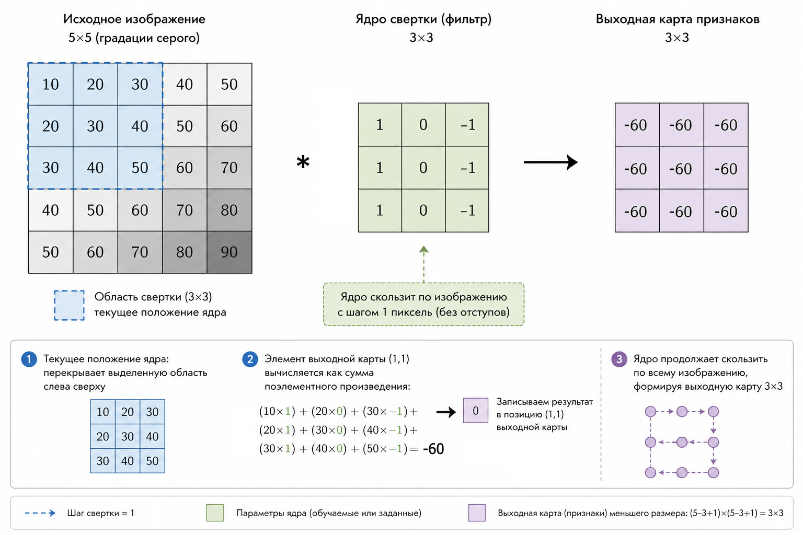
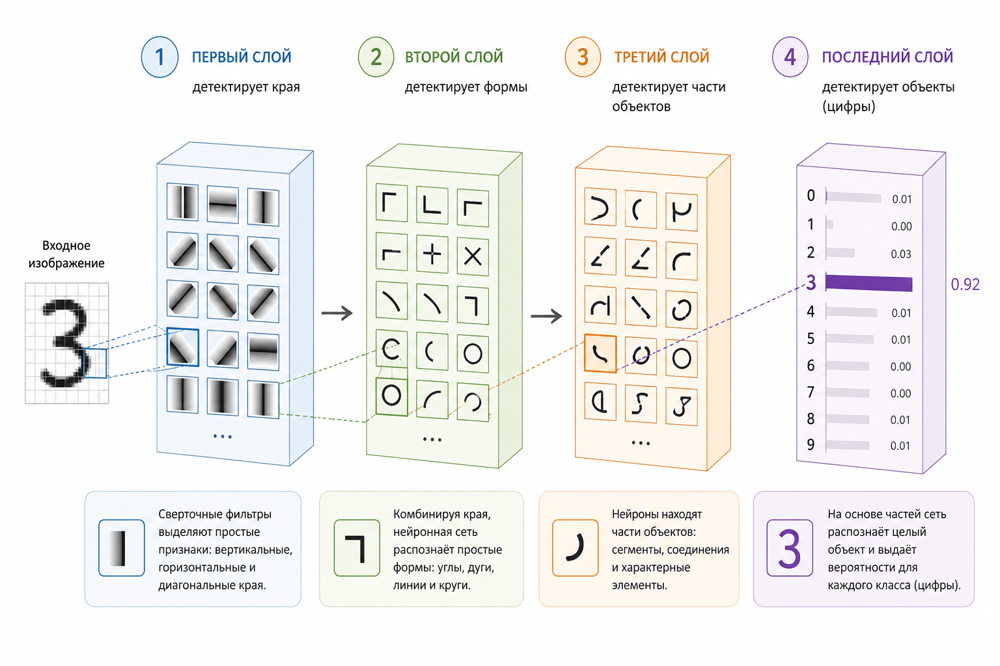
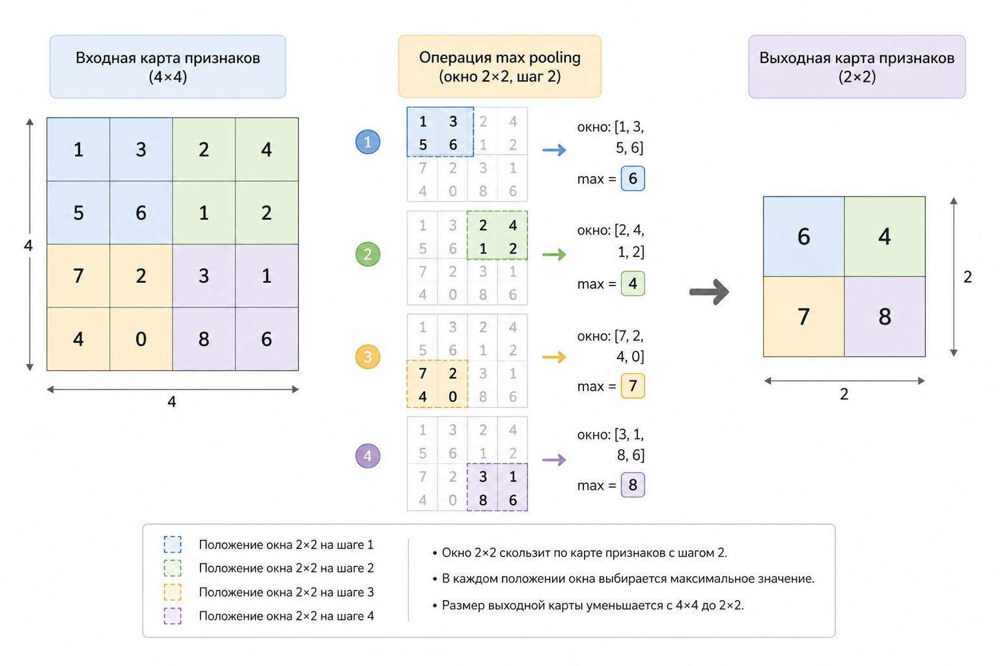

# Свёрточные нейронные сети (CNN)

Если в предыдущих главах модели работали с таблицами и векторами, то теперь мы переходим к гораздо более "богатому" типу данных – изображениям. Интуитивно мы воспринимаем картинку как нечто цельное: лицо, цифру, объект. Но для модели это совсем не так.

Для модели изображение – это просто числа. И именно в этом месте начинается магия  свёрточных нейронных сетей.

### Почему изображение – это матрица

Любая картинка в компьютере – это сетка пикселей.

Если изображение чёрно-белое (например, MNIST), то каждый пиксель – это одно число:

* 0 – чёрный
* 255 – белый (или 1 после нормализации)

Таким образом, картинка 28×28 превращается в матрицу:

$$
X \in \mathbb{R}^{28 \times 28}
$$

Цветные изображения чуть сложнее – там добавляется канал:

* RGB → 3 матрицы (красный, зелёный, синий)

$$
X \in \mathbb{R}^{H \times W \times 3}
$$

Важно не это.

Важно, что структура изображения сохраняется.

В отличие от обычного вектора (где порядок может быть условным), здесь:

* соседние пиксели связаны
* локальные паттерны имеют значение

И именно это используют CNN.

### Главная идея CNN: смотреть не на всё, а на куски

Обычная нейросеть (полносвязная) "смотрит" на всё сразу:

$$
y = f(Wx + b)
$$

Но для изображений это плохо:

* слишком много параметров
* теряется локальная структура
* нет понимания "рядом / далеко"

CNN делает иначе.

Она смотрит на маленькие области изображения – как будто "скользит" по нему маленьким окном.

Это окно называется фильтр (или ядро свёртки).

### Что такое свёртка (convolution)

Представим фильтр 3×3:

$$
K =
\begin{bmatrix}
1 & 0 & -1 \\
1 & 0 & -1 \\
1 & 0 & -1
\end{bmatrix}
$$

Он "накладывается" на изображение и считает взвешенную сумму.

Формально:

$$
y(i,j)=\sum_{m}\sum_{n} X(i+m,j+n)\cdot K(m,n)
$$

То есть:

* берём участок изображения
* умножаем поэлементно на фильтр
* складываем

Получаем одно число.

И так – для каждой позиции.

<figure><figcaption><p>27.1 Скольжение свёрточного ядра по изображению</p></figcaption></figure>

### Что делает фильтр на практике

Разные фильтры находят разные паттерны:

#### 1. Вертикальные границы

$$
\begin{bmatrix}
1 & 0 & -1 \\
1 & 0 & -1 \\
1 & 0 & -1
\end{bmatrix}
$$

→ реагирует на переход “светлое → тёмное”

#### 2. Горизонтальные границы

$$
\begin{bmatrix}
1 & 1 & 1 \\
0 & 0 & 0 \\
-1 & -1 & -1
\end{bmatrix}
$$

#### 3. Размытие, резкость, текстуры

И вот ключевая мысль:

Модель сама учится этим фильтрам.

Мы их не задаём.

### Локальные признаки – фундамент CNN

Почему это работает?

Потому что изображения состоят из локальных паттернов:

* линии
* углы
* текстуры

А дальше:

* линии → формы
* формы → части объектов
* части → целые объекты

Это и есть иерархия признаков.

<figure><figcaption><p>27.2 Иерархия обучения в сверточных нейросетях</p></figcaption></figure>

### Почему это лучше, чем обычная нейросеть

Если взять изображение 28×28 и “расплющить”:

$$
784 \text{ входов}
$$

Полносвязный слой:

$$
784 \times 100 = 78\,400 \text{ параметров}
$$

А теперь CNN:

* фильтр 3×3 → всего 9 параметров
* применяется ко всей картинке

Это называется разделение весов (weight sharing).

Один и тот же фильтр:

* ищет один и тот же паттерн
* везде

### Страйд и паддинг (коротко)

Чтобы управлять размером выхода:

* stride – шаг сдвига фильтра
* padding – добавление рамки вокруг изображения

Без формального перегруза:

* stride > 1 → уменьшаем размер
* padding → сохраняем размер

### Пулинг (Pooling): сжатие информации

После свёртки часто делают pooling.

Самый популярный – max pooling:

* берём окно 2×2
* выбираем максимум

$$
y = \max(x_1, x_2, x_3, x_4)
$$

Зачем?

* уменьшаем размер
* сохраняем важное
* уменьшаем переобучение

<figure><figcaption><p>27.3 Операция максимального пулинга на карте объектов</p></figcaption></figure>

### Полная архитектура CNN (интуитивно)

Типичный pipeline:

1. Свёртка (Conv)
2. Активация (ReLU)
3. Пулинг
4. Повторить несколько раз
5. Flatten
6. Полносвязные слои
7. Softmax

### Минимальный пример на PHP (интуитивно)

PHP не используется для deep learning в продакшене, но для понимания – отлично.

#### Простая свёртка

```php
function convolve($image, $kernel) {
    $h = count($image);
    $w = count($image[0]);

    $kh = count($kernel);
    $kw = count($kernel[0]);

    $output = [];

    for ($i = 0; $i <= $h - $kh; $i++) {
        for ($j = 0; $j <= $w - $kw; $j++) {

            $sum = 0;

            for ($m = 0; $m < $kh; $m++) {
                for ($n = 0; $n < $kw; $n++) {
                    $sum += $image[$i + $m][$j + $n] * $kernel[$m][$n];
                }
            }

            $output[$i][$j] = $sum;
        }
    }

    return $output;
}
```

#### Пример фильтра (вертикальные границы)

```php
$kernel = [
    [1, 0, -1],
    [1, 0, -1],
    [1, 0, -1],
];
```

***

#### Пример изображения (упрощённо)

```php
$image = [
    [10, 10, 10, 0, 0],
    [10, 10, 10, 0, 0],
    [10, 10, 10, 0, 0],
    [10, 10, 10, 0, 0],
    [10, 10, 10, 0, 0],
];
```

После свёртки вы получите карту признаков, где "светятся" границы.

### Почему CNN "понимает" картинки

Важно быть точным.

CNN ничего не "понимает" в человеческом смысле.

Она:

* ищет статистические закономерности
* строит иерархию признаков
* сопоставляет паттерны с классами

Но за счёт:

* локальности
* разделения весов
* глубины

она делает это невероятно эффективно.

### Связь с предыдущими главами

Если упростить:

* логистическая регрессия → линейная граница
* kNN → похожие объекты
* Naive Bayes → вероятности признаков
* CNN → учится извлекать сами признаки

И это по-настоящему следующий уровень.

### Выводы и следующие шаги

Свёрточные сети – это не просто ещё один алгоритм. Это принципиально другой способ смотреть на данные:

* изображение – это структура, а не просто набор чисел
* важны локальные зависимости
* признаки можно учить автоматически

И самое важное:

Модель перестаёт зависеть от ручного feature engineering.

В следующей главе мы сделаем шаг дальше и рассмотрим автокодировщики.
