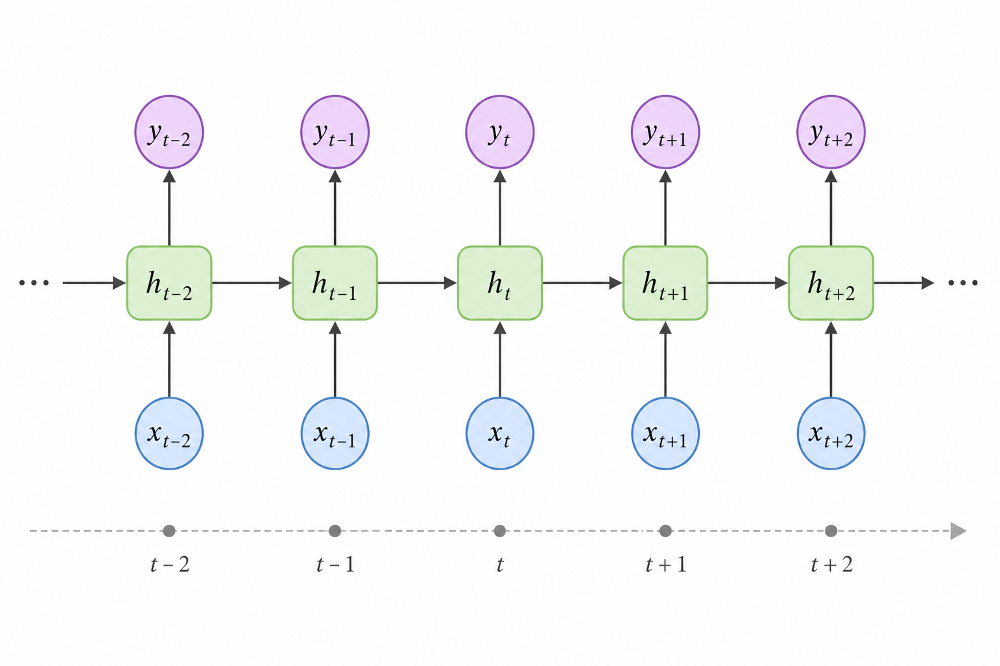
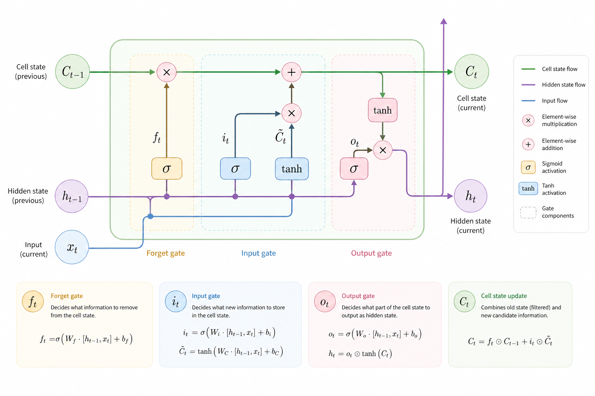

# Рекуррентные нейросети (RNN)

Когда мы работали с обычными нейронными сетями, мы предполагали одну важную вещь:  каждый вход независим от других. Картинка не зависит от предыдущей картинки, строка данных не зависит от прошлой строки.

Но в реальном мире это почти никогда не так.

Текст – это последовательность слов.\
Речь – это последовательность звуков.\
Временные ряды – это последовательность значений.

И здесь возникает ключевая проблема:

> как модели "помнить" прошлое?

Именно для этого появились рекуррентные нейросети.

### Идея RNN: память через состояние

В обычной нейросети есть вход $$x$$ и выход $$y$$.

В RNN появляется ещё один элемент: скрытое состояние (hidden state) – вектор, который переносит информацию из прошлого.

На каждом шаге времени модель получает:

* текущий вход $$x_t$$
* предыдущее состояние $$h_{t-1}$$

и вычисляет новое состояние:

$$
h_t = \tanh(W_x x_t + W_h h_{t-1} + b)
$$

А затем может выдать выход:

$$
y_t = W_y h_t
$$

Интуитивно:

* $$h_t$$ – это "память" модели на момент времени $$t$$
* она накапливает информацию из всей предыдущей последовательности

### Как это выглядит

Представим предложение: "Я пошёл в магазин и купил хлеб".

Модель читает слово за словом:

* "Я" → формируется первое состояние
* "пошёл" → состояние обновляется
* "в" → обновляется
* …
* "хлеб" → финальное состояние учитывает весь контекст

<figure><figcaption><p>29.1 Развёрнутая RNN во времени</p></figcaption></figure>

### Развёртка во времени (Unrolling)

Важно понимать: RNN – это не "магическая" структура. Это одна и та же сеть, применённая много раз.

Если "развернуть" её по времени, получится цепочка одинаковых блоков:

```
x1 → [RNN] → h1 → [RNN] → h2 → [RNN] → h3 → ...
```

Причём веса ($$W_x$$, $$W_h$$) одни и те же на каждом шаге.

Это ключевая идея:&#x20;

> модель учится универсальному правилу обновления состояния.

### Обучение: Backpropagation Through Time (BPTT)

RNN обучают с помощью специального варианта обратного распространения ошибки – **Backpropagation Through Time**, или **BPTT**.

Обычный backpropagation нельзя применить напрямую, потому что в RNN результат зависит не только от текущего входа, но и от предыдущих шагов. У модели есть "память", которая передаётся во времени.

Идея BPTT заключается в том, что сеть как бы разворачивают по временным шагам. После этого считают ошибку на каждом шаге и передают градиенты назад через всю последовательность.

То есть модель учится не только на последнем ответе, а на всей цепочке действий, которые привели к этому результату.

#### Проблема: исчезающие и взрывающиеся градиенты

При длинных последовательностях возникает проблема:

* градиенты могут затухать (vanishing gradients)
* или взрываться (exploding gradients)

Интуитивно:

> если на каждом шаге мы умножаем градиент на число < 1, он быстро стремится к нулю

$$
\frac{\partial L}{\partial h_0} \approx \prod_{t=1}^{T} W_h
$$

Если значения маленькие → всё исчезает.\
Если большие → всё взрывается.

### Ограничения классических RNN

У классических RNN есть важные ограничения. Они плохо работают в ситуациях, где нужно учитывать информацию на длинных промежутках.

Им сложно:

* улавливать длинные зависимости в данных
* понимать сложный контекст
* запоминать информацию, которая была много шагов назад

Например, в предложении: "Я вырос во Франции … (много слов) … и говорю на французском"\
важная информация находится в начале. Но пока модель дойдёт до конца, она может просто "забыть", что речь шла о Франции.

Из-за этого обычные RNN часто теряют смысл при работе с длинными последовательностями.

### Улучшения: LSTM и GRU

Чтобы решить проблему памяти, были придуманы более сложные архитектуры:

#### LSTM (Long Short-Term Memory)

LSTM работает так, чтобы лучше контролировать, что именно сеть запоминает и что забывает. Внутри неё есть специальные механизмы – "ворота" (гейты).

Они решают:

* какую информацию нужно забыть (forget gate)
* какую – сохранить и записать (input gate)
* какую – выдать на выход (output gate)

Благодаря этому LSTM лучше справляется с длинными последовательностями.

<figure><figcaption><p>29.2 Диаграмма ячейки LSTM</p></figcaption></figure>

#### GRU (Gated Recurrent Unit)

По сути это упрощённая версия LSTM. В ней меньше таких "ворот" и, соответственно, меньше параметров.

Из-за этого модель:

* быстрее обучается
* проще в использовании
* и при этом часто показывает результаты не хуже, чем LSTM

### Типы задач для RNN

RNN можно использовать для разных типов задач — всё зависит от того, какой у нас вход и какой нужен результат.

Самый простой вариант – **one-to-one**. Это обычная задача, где на один вход мы получаем один выход, как в классических нейросетях.

Есть задачи типа **one-to-many**, где из одного входа нужно получить целую последовательность. Например, по изображению модель может сгенерировать текстовое описание.

Другой вариант – **many-to-one**. Здесь на вход подаётся последовательность, а результат один. Типичный пример – анализ тональности текста, когда по всему предложению определяется, положительное оно или отрицательное.

И наконец, **many-to-many** – когда и вход, и выход являются последовательностями. Это используется, например, в машинном переводе или распознавании речи.

### Пример: простая RNN логика на PHP

Конечно, PHP – не инструмент для глубокого обучения, но для понимания логики можно написать упрощённую модель.

```php
function tanh_activation($x) {
    return tanh($x);
}

// умножение вектора на матрицу (упрощённо)
function dot($vector, $matrix) {
    $result = [];
    foreach ($matrix as $i => $row) {
        $sum = 0;
        foreach ($row as $j => $value) {
            $sum += $value * $vector[$j];
        }
        $result[] = $sum;
    }
    return $result;
}

// сложение векторов
function add($a, $b) {
    return array_map(fn($x, $y) => $x + $y, $a, $b);
}

// RNN шаг
function rnn_step($x_t, $h_prev, $W_x, $W_h, $b) {
    $part1 = dot($x_t, $W_x);
    $part2 = dot($h_prev, $W_h);
    $sum = add(add($part1, $part2), $b);

    return array_map('tanh_activation', $sum);
}

// пример
$x_sequence = [
    [1, 0],
    [0, 1],
    [1, 1]
];

$h = [0, 0];

$W_x = [
    [0.5, 0.2],
    [0.1, 0.7]
];

$W_h = [
    [0.6, 0.1],
    [0.3, 0.8]
];

$b = [0.0, 0.0];

foreach ($x_sequence as $x_t) {
    $h = rnn_step($x_t, $h, $W_x, $W_h, $b);
    print_r($h);
}
```

Этот код:

* последовательно обрабатывает входы
* хранит состояние $$h$$
* показывает, как память переносится между шагами

### Где RNN используются

Рекуррентные нейронные сети (RNN) раньше широко использовались в разных задачах. Например, их применяли для машинного перевода, генерации текста, распознавания речи и анализа временных рядов.

Со временем стало понятно, что у них есть ограничения. RNN обрабатывают данные последовательно, шаг за шагом, поэтому их сложно ускорить с помощью параллельных вычислений. Кроме того, им трудно запоминать информацию на длинных промежутках, а обучение таких моделей занимает много времени.

Из-за этого сегодня во многих задачах вместо RNN используют трансформеры, которые работают быстрее и эффективнее.

Тем не менее, RNN остаются важной частью истории развития нейросетей и помогают лучше понять, как работают модели, обрабатывающие последовательные данные.

### Интуитивный итог

Если свернуть всё в одну мысль:&#x20;

RNN – это модель, которая на каждом шаге говорит:

> Я вижу новое, но помню старое.

И вся её сила – в этом накоплении контекста.

### Выводы

Рекуррентные нейросети привнесли важную идею: данные – это не просто отдельные точки, а последовательности, где важен порядок и время.

Мы разобрались, как в таких моделях появляется скрытое состояние – своего рода память, которая переносит информацию от шага к шагу. За счёт этого сеть может учитывать прошлый контекст.

Также стало понятно, почему возникают проблемы с обучением, например затухание или взрыв градиентов, из-за чего модели трудно запоминать информацию на длинных промежутках.

И, наконец, мы увидели, как более продвинутые архитектуры – LSTM и GRU – помогают справляться с этими ограничениями и делают работу с последовательностями более эффективной.

### Что дальше

Логичный следующий шаг – разобраться, почему на смену RNN пришли трансформеры и что в них принципиально нового.

Главное отличие – механизм внимания (attention). Он позволяет модели сразу учитывать все элементы последовательности, не обрабатывая их строго по порядку, как это делали RNN. Благодаря этому обучение становится быстрее, а модель лучше улавливает связи даже между далёкими словами.

Именно с появлением трансформеров начался современный этап развития NLP – более мощный, гибкий и эффективный.
