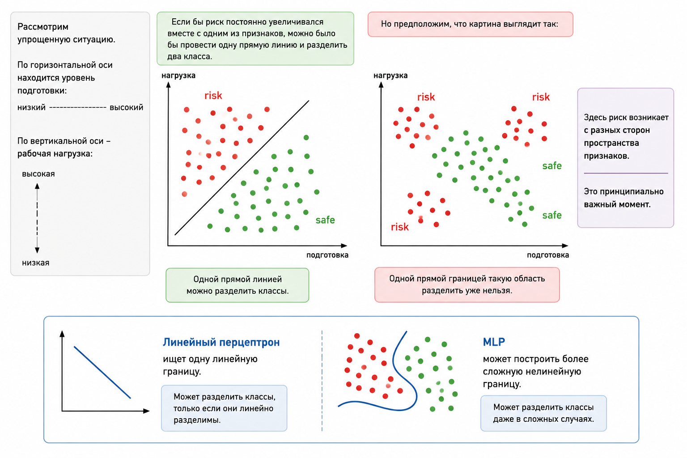

# Кейс 4. MLP для нелинейного риска фишинга (RubixML)

#### Цель

В предыдущих кейсах мы рассматривали задачи, которые можно решить с помощью линейных моделей. Теперь усложним задачу.

Предположим, мы хотим оценивать риск того, что сотрудник станет жертвой фишинговой атаки, используя два признака:

* уровень подготовки сотрудника по вопросам информационной безопасности
* текущую рабочую нагрузку

На первый взгляд кажется логичным, что чем хуже подготовка и чем выше нагрузка, тем выше риск. Но в реальности зависимость может оказаться значительно сложнее.

Например, можно предположить следующую зависимость:

* сотрудник с очень низкой подготовкой может относиться к группе риска
* сотрудник с очень высокой нагрузкой также может относиться к группе риска
* при этом сочетание умеренной подготовки и умеренной нагрузки может соответствовать относительно низкому риску
* кроме того, риск может возрастать при некоторых сочетаниях признаков, а не просто линейно увеличиваться вместе с каждым из них

Получается нелинейная зависимость между признаками и целевой переменной.

Для решения такой задачи используем многослойную нейронную сеть – **MLP (Multilayer Perceptron)**, реализованную с помощью RubixML.

#### Сценарий

Представим B2B-продукт для повышения осведомленности сотрудников в области информационной безопасности.

Система собирает различные характеристики сотрудников и хочет определить, кому стоит уделить дополнительное внимание.

Например:

* сотруднику с низким уровнем подготовки можно назначить дополнительное обучение
* сотруднику с высокой нагрузкой – напомнить о необходимости быть особенно внимательным
* сотруднику, который хорошо подготовлен и работает в нормальном режиме, можно не показывать дополнительные предупреждения

Таким образом, модель должна решить задачу бинарной классификации:

```
risk  → повышенный риск
safe  → относительно безопасный
```

#### Почему линейной модели недостаточно?

Рассмотрим упрощенную ситуацию.

Пусть по горизонтальной оси находится уровень подготовки, а по вертикальной – рабочая нагрузка.&#x20;

Если бы риск постоянно увеличивался вместе с одним из признаков, можно было бы провести одну прямую линию и разделить два класса.

Но предположим, что картина выглядит так:

<figure><figcaption><p>6.1-7. Линейная и нелинейная границы классификации</p></figcaption></figure>

Здесь классы расположены таким образом, что область повышенного риска окружает центральную область относительно безопасных объектов.

Одной прямой границей такую область разделить уже нельзя.

Это принципиально важный момент.

> Линейный перцептрон ищет одну линейную границу. MLP может построить более сложную нелинейную границу.

#### Данные

Для демонстрации возьмем два признака:

<table><thead><tr><th width="215.34765625">Признак</th><th>Значение</th></tr></thead><tbody><tr><td><code>x₁</code></td><td>уровень подготовки сотрудника</td></tr><tr><td><code>x₂</code></td><td>рабочая нагрузка</td></tr></tbody></table>

Пусть каждый признак находится примерно в диапазоне от 1 до 10.

Подготовим небольшой набор данных, который специально демонстрирует нелинейную зависимость.

В нашем условном сценарии сотрудники с очень низкой или очень высокой комбинацией факторов относятся к группе повышенного риска, а сотрудники из центральной области пространства признаков – к относительно безопасной группе:

```php
$samples = [[1, 1], [1, 10], [10, 1], [10, 10], [4, 4], [4, 6], [6, 4], [6, 6]]; 
$labels = ['risk', 'risk', 'risk', 'risk', 'safe', 'safe', 'safe', 'safe'];
```

Это очень маленький искусственный набор данных. Его задача – не построить качественную промышленную модель, а показать принцип работы MLP и отличие нелинейной границы от линейной.

В реальном продукте выборка должна быть значительно больше и формироваться на основе реальных исторических данных.

#### Подключаем RubixML

Для реализации модели воспользуемся RubixML.

Нам понадобятся:use Rubix\ML\Datasets\Labeled;

```
use Rubix\ML\Classifiers\MultilayerPerceptron;
use Rubix\ML\NeuralNet\ActivationFunctions\ReLU;
use Rubix\ML\NeuralNet\Layers\Activation;
use Rubix\ML\NeuralNet\Layers\Dense;
use Rubix\ML\Transformers\ZScaleStandardizer;
```

Здесь используются три основных компонента:

* `Labeled` – набор объектов с известными правильными ответами
* `ZScaleStandardizer` – стандартизация числовых признаков
* `MultilayerPerceptron` – многослойная нейронная сеть для классификации
* `Dense` –&#x20;
* `Activation` –

#### Создаем dataset

Сначала создадим размеченный набор данных:

```php
$dataset = new Labeled($samples, $labels);
```

Теперь RubixML знает, какие признаки соответствуют каким классам.

Например:

```
[1,  6] → risk
[5,  3] → safe
[10, 1] → risk
[3,  7] → safe
```

#### Зачем нужна стандартизация?

Перед обучением нейронной сети важно привести признаки к сопоставимому масштабу.

В нашем примере оба признака находятся примерно в одном диапазоне – от 1 до 10. Но в реальном проекте ситуация может быть совершенно другой.

Например:

```
уровень подготовки → 1 ... 10
количество часов работы → 0 ... 250
количество обработанных писем → 0 ... 50000
```

Если передать такие значения в сеть напрямую, признаки будут иметь очень разные масштабы.

Поэтому перед обучением применяем:

```php
$dataset->apply(new ZScaleStandardizer());
```

Стандартизация преобразует значения таким образом, чтобы признаки были представлены в сопоставимом масштабе.

Упрощенно идею можно представить так:

```
исходные данные
       ↓
    [1,  6]
    [5,  3]
      ...
    [3,  7]
       ↓
стандартизация
       ↓
значения в сопоставимом масштабе
       ↓
нейронная сеть
```

Это не делает модель "умнее", но делает обучение более удобным и устойчивым.

#### Создаем нейронную сеть

Теперь создадим MLP:

```php
$model = new MultilayerPerceptron([
    new Dense(8),
    new Activation(new ReLU()),
    new Dense(4),
    new Activation(new ReLU()),
]);
```

Запись:

```php
[
    new Dense(8),
    new Activation(new ReLU()),
    new Dense(4),
    new Activation(new ReLU()),
]
```

означает, что мы задаем два скрытых слоя:

```
Input
  ↓
8 нейронов
  ↓
4 нейрона
  ↓
Output
```

Входной слой получает наши два признака:

```
подготовка → [ ]
нагрузка   → [ ]
```

После этого информация проходит через два скрытых слоя.

#### Полная реализация

Теперь объединим все части:

```php
use Rubix\ML\Datasets\Labeled;
use Rubix\ML\Classifiers\MultilayerPerceptron;
use Rubix\ML\NeuralNet\ActivationFunctions\ReLU;
use Rubix\ML\NeuralNet\Layers\Activation;
use Rubix\ML\NeuralNet\Layers\Dense;
use Rubix\ML\Transformers\ZScaleStandardizer;

$samples = [
    [1, 6],
    [5, 3],
    [10, 1],
    [3, 7],
];

$labels = [
    'risk',
    'safe',
    'risk',
    'safe',
];

$dataset = new Labeled($samples, $labels);
$dataset->apply(new ZScaleStandardizer());

// Скрытые слои: 8 и 4 нейрона добавляют достаточно нелинейности 
// для этого небольшого демонстрационного набора данных.
$model = new MultilayerPerceptron([
    new Dense(8),
    new Activation(new ReLU()),
    new Dense(4),
    new Activation(new ReLU()),
]);
$model->train($dataset);

$inputSample = [4, 6];
$predictDataset = new Unlabeled([$inputSample]);
$predictDataset->apply($standardizer);
$prediction = $model->predict($predictDataset);

echo 'Прогноз риска фишинга:' . PHP_EOL;
echo ($prediction[0] === 'risk' ? 'risk (высокий риск)' : 'safe (низкий риск)');
```

Предположим, что модель классифицировала новый объект как:

```
safe (низкий риск)
```

То есть для сотрудника с характеристиками:

```
подготовка = 4
нагрузка   = 6
```

модель отнесла сотрудника к классу `safe`.

Важно понимать: на таком крошечном искусственном наборе нельзя делать реальные выводы о качестве модели. Здесь нас интересует архитектура и принцип работы.

#### Что происходит внутри MLP?

На этом этапе особенно важно связать код с теорией нейронных сетей.

Когда мы передаем модели:

```php
$predictDataset = new Unlabeled([[4, 6]]);
$predictDataset->apply($standardizer);
$prediction = $model->predict($predictDataset);
```

эти значения становятся входами первого слоя.

Каждый нейрон выполняет знакомую нам операцию.

Сначала вычисляется линейная комбинация:

$$
z = w_1 x_1 + w_2 x_2 + b
$$

Затем применяется функция активации:

$$
a = f(z)
$$

Полученное значение передается следующему слою.

#### Один слой

Упрощенно первый скрытый слой можно представить так:

```
подготовка ──→ ┐
               ├──→ Нейрон 1 ──→ следующий слой
нагрузка ────→ ┘
подготовка ──→ ┐
               ├──→ Нейрон 2 ──→ следующий слой
нагрузка ────→ ┘
              ...
подготовка ──→ ┐
               ├──→ Нейрон 8 ──→ следующий слой
нагрузка ────→ ┘
```

> Каждый нейрон получает оба входных признака, но использует собственные веса для каждого из них. Поэтому разные нейроны могут по-разному реагировать на одни и те же признаки и выделять разные их комбинации.

Отсюда

$$
z_j = w_{j1}x_1 + w_{j2}x_2 + b_j
$$

#### Зачем нужны несколько слоев?

Для интуиции можно представить, что некоторые нейроны реагируют на определенные области пространства признаков:

```
Нейрон 1 → область низкой подготовки 
Нейрон 2 → область высокой нагрузки 
Нейрон 3 → определенная комбинация подготовки и нагрузки 
Нейрон 4 → другая комбинация признаков
...
```

Следующий слой может комбинировать результаты этих нейронов.

Например:

```
низкая подготовка
        +
высокая нагрузка
        ↓
   высокий риск
```

Другой набор комбинаций может соответствовать безопасной ситуации:

```
средняя подготовка
        +
умеренная нагрузка
        ↓
     низкий риск
```

Именно последовательная комбинация преобразований позволяет сети строить сложные зависимости.

#### Где появляется нелинейность?

Это один из самых важных моментов всего кейса.

Если убрать функции активации и оставить только линейные преобразования, несколько последовательных линейных слоев можно математически свести к одному линейному преобразованию.

То есть:

```
Linear
   ↓
Linear
   ↓
Linear
```

не даст нам принципиально более сложную границу.

Нелинейность появляется благодаря функции активации:

```
линейная комбинация
        ↓
функция активации
        ↓
линейная комбинация
        ↓
функция активации
        ↓
результат
```

Именно поэтому многослойная сеть способна решать задачи, которые не под силу простому линейному перцептрону.

#### MLP как композиция функций

С математической точки зрения сеть можно представить как композицию функций:

$$
y = f₃(f₂(f₁(x)))
$$

где:

* $$x$$ – входные признаки
* $$f_1$$ – первый слой
* $$f_2$$ – второй слой
* $$f_3$$ – выходной слой
* $$y$$ – результат классификации

Каждый следующий слой получает не исходные признаки напрямую, а результат работы предыдущего слоя.

Получается цепочка:

```
признаки
   ↓
слой 1
   ↓
слой 2
   ↓
выход
   ↓
risk / safe
```

Это и есть многослойный перцептрон.

#### А как сеть обучается?

Мы не задаем вручную значения весов:

```
w₁ = ...
w₂ = ...
w₃ = ...
```

Сеть должна найти подходящие значения самостоятельно.

Во время обучения происходит следующий процесс.

**1. Forward pass**

Объект проходит через сеть:

```
input
  ↓
layer 1
  ↓
layer 2
  ↓
output
```

Сеть получает предсказание.

Например:

```
правильный ответ: risk
предсказание:     safe
```

Возникает ошибка.

**2. Backpropagation**

Ошибка, точнее значение функции потерь, распространяется обратно через сеть.

```
input
  ↑
layer 1
  ↑
layer 2
  ↑
output
```

С помощью производных и цепного правила вычисляется, как изменение каждого параметра сети влияет на значение функции потерь. Результатом backpropagation являются градиенты по отношению к параметрам сети.&#x20;

Само обновление весов выполняет оптимизатор. Мы подробно рассмотрим как это работает в следующей главе.

**3. Обновление весов**

Полученные градиенты передаются оптимизатору, который изменяет веса и bias в направлении, уменьшающем функцию потерь.

Этот процесс повторяется много раз на обучающей выборке. В результате сеть постепенно подбирает параметры, которые позволяют ей лучше разделять классы.

#### Почему это уже не просто перцептрон?

Важно не создавать ложного противопоставления.

Каждый нейрон скрытого слоя выполняет знакомую нам операцию: получает входы, вычисляет их взвешенную сумму с добавлением bias и передает результат через функцию активации:

```
входы
  ↓
взвешенная сумма
  ↓
активация
  ↓
выход
```

Новизна заключается в их организации.

Вместо одного слоя:

```
input → neuron → output
```

мы получаем:

```
Input
  ↓
Dense(8)
  ↓
ReLU
  ↓
Dense(4)
  ↓
ReLU
  ↓
Output
```

Поэтому MLP можно рассматривать как сеть из множества связанных нейронов, организованных в несколько слоев.

#### Проверяем новый объект

После обучения модель можно использовать для новых данных.

Например:

```php
use Rubix\ML\Datasets\Unlabeled;

$inputSample = [4, 6];
$predictDataset = new Unlabeled([$inputSample]);
$predictDataset->apply($standardizer);
$prediction = $model->predict($predictDataset);
```

Или проверить несколько сотрудников одновременно:

```php
$inputSample = [
    [4, 6],
    [1, 9],
    [8, 2],
    [5, 5],
];
$predictDataset = new Unlabeled(inputSample);
$predictDataset->apply($standardizer);
$prediction = $model->predict($predictDataset);
```

Модель вернет соответствующий класс для каждого объекта.

В реальном приложении результат можно использовать дальше:

```
MLP
 ↓
risk
 ↓
создать рекомендацию
 ↓
назначить дополнительное обучение
```

или:

```
MLP
 ↓
safe
 ↓
ничего не предпринимать
```

#### Что мы получили?

Мы перешли от простой линейной модели к полноценной многослойной нейронной сети.

Сравним два подхода.

|                                              | Линейный перцептрон | MLP                           |
| -------------------------------------------- | ------------------- | ----------------------------- |
| Скрытые слои                                 | нет                 | один или несколько            |
| Граница решения                              | линейная            | может быть нелинейной         |
| Нелинейные функции активации                 | нет                 | используются                  |
| Сложность                                    | низкая              | выше                          |
| Интерпретируемость                           | высокая             | ниже                          |
| Способность моделировать сложные зависимости | ограниченная        | значительно выше              |
| Обучение                                     | простое             | backpropagation + оптимизация |

Главное отличие не в том, что MLP использует какие-то совершенно другие нейроны. Главное отличие – композиция слоев и нелинейностей.

#### Что важно запомнить

В этом кейсе появились сразу несколько фундаментальных идей.

**1. Не всякая задача является линейной**

Иногда невозможно провести одну прямую или гиперплоскость, которая правильно разделит данные.

**2. Один перцептрон имеет ограничения**

Если классы нелинейно разделимы, одного линейного перцептрона недостаточно.

**3. MLP добавляет скрытые слои**

Несколько слоев позволяют сети строить более сложные представления данных.

**4. Нелинейность имеет принципиальное значение**

Именно функции активации позволяют многослойной сети моделировать нелинейные зависимости.

**5. Параметры сети обучаются автоматически**

Мы не определяем вручную, какой вес должен отвечать за "низкую подготовку", а какой – за "высокую нагрузку".

Сеть сама подбирает веса и bias на основе обучающих примеров, используя функцию потерь, backpropagation и оптимизатор.

#### Ограничения кейса

Наш пример специально сделан маленьким, чтобы сосредоточиться на механике MLP. Для реального B2B-продукта такой dataset использовать нельзя.

Понадобятся:

* большая историческая выборка
* реальные признаки сотрудников;
* корректная разметка `risk` / `safe`
* разделение данных на training и test sets; \
  для временных данных – корректное разделение по времени
* подбор архитектуры сети
* настройка гиперпараметров
* оценка precision, recall, F1-score и других метрик
* контроль переобучения
* регулярное обновление или переобучение модели по мере накопления новых данных и при необходимости

Кроме того, сам по себе "риск фишинга" не должен автоматически означать, что сотрудник совершит ошибку. Модель оценивает вероятность на основе обнаруженных закономерностей, а не предсказывает поведение человека с абсолютной точностью.

#### Где этот подход полезен в B2B-продукте?

MLP может быть полезен там, где на результат одновременно влияет несколько факторов и их взаимодействие не является линейным.

Например:

```
уровень подготовки
        +
рабочая нагрузка
        +
частота ошибок
        +
результаты предыдущих тестов
        +
история phishing simulations
        ↓
       MLP
        ↓
     risk score
```

На основе результата продукт может формировать персонализированные рекомендации:

```
Высокий риск
    ↓
дополнительное обучение
```

или:

```
Средний риск
    ↓
повторный awareness-тест
```

или:

```
Низкий риск
    ↓
стандартная программа обучения
```

Таким образом, MLP может стать частью системы персонализации Security Awareness, где результат классификации используется для выбора дальнейших действий.

#### Итог

В предыдущем кейсе мы построили линейный классификатор на чистом PHP. Он хорошо показывает фундаментальный принцип работы перцептрона, но имеет естественное ограничение – он способен строить только линейную границу решения.

В этом кейсе мы столкнулись с задачей, где риск зависит от сочетания нескольких факторов нелинейным образом. Для такой ситуации используем многослойный перцептрон – **MLP**.

С помощью RubixML мы создали сеть:

```
2 входных признака
       ↓
8 нейронов
       ↓
4 нейрона
       ↓
класс risk / safe
```

Для нашего учебного примера выбрана простая архитектура с двумя скрытыми слоями. Это не означает, что именно такая архитектура является оптимальной для задачи.

Каждый нейрон выполняет взвешенную сумму входов с добавлением bias. Затем к полученному значению применяется функция активации. Последовательность линейных преобразований и нелинейных функций активации позволяет сети формировать сложные зависимости.

Главная идея кейса:

> **Один перцептрон строит линейную границу. MLP благодаря нескольким слоям и нелинейным функциям активации способен моделировать сложные нелинейные зависимости.**

При этом фундаментальный механизм остается тем же: \
**forward pass → вычисление функции потерь → backpropagation → вычисление градиентов → обновление параметров оптимизатором.**

Именно поэтому MLP – естественный следующий шаг после изучения простого перцептрона.


Чтобы самостоятельно протестировать этот код, воспользуйтесь [онлайн-демонстрацией](https://aiwithphp.org/books/ai-for-php-developers/examples/part-6/perceptron-and-fully-connected-network) для его запуска.

