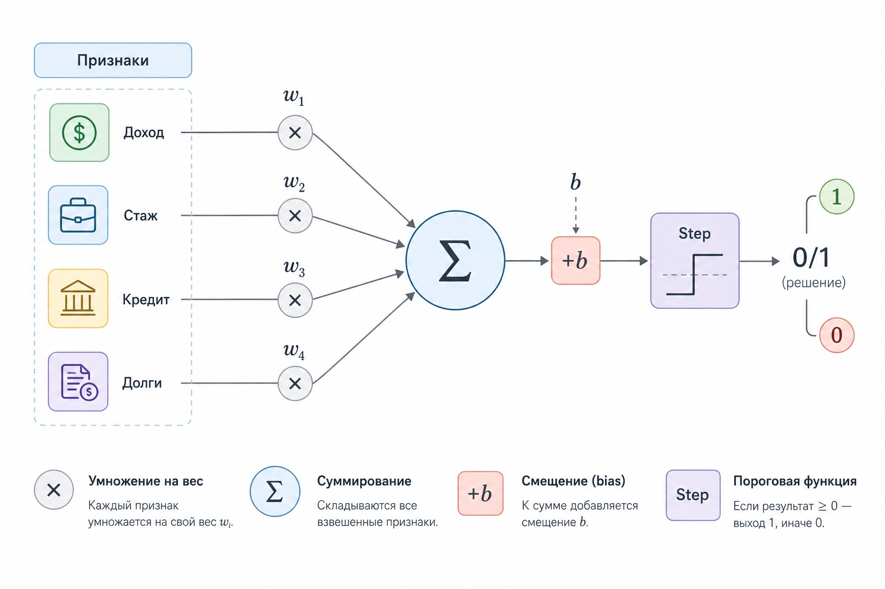
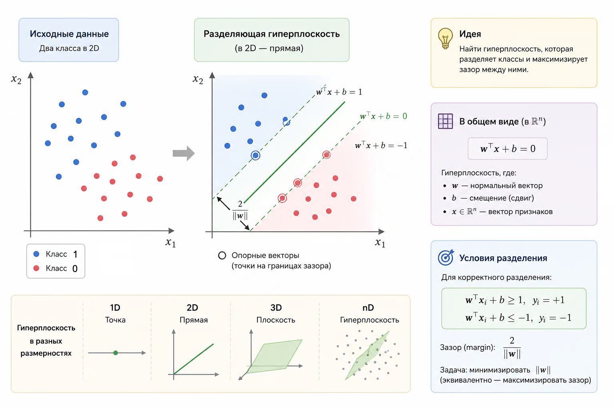
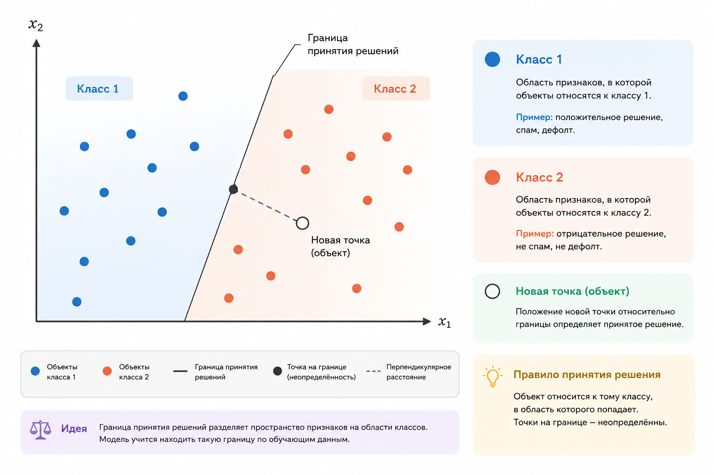
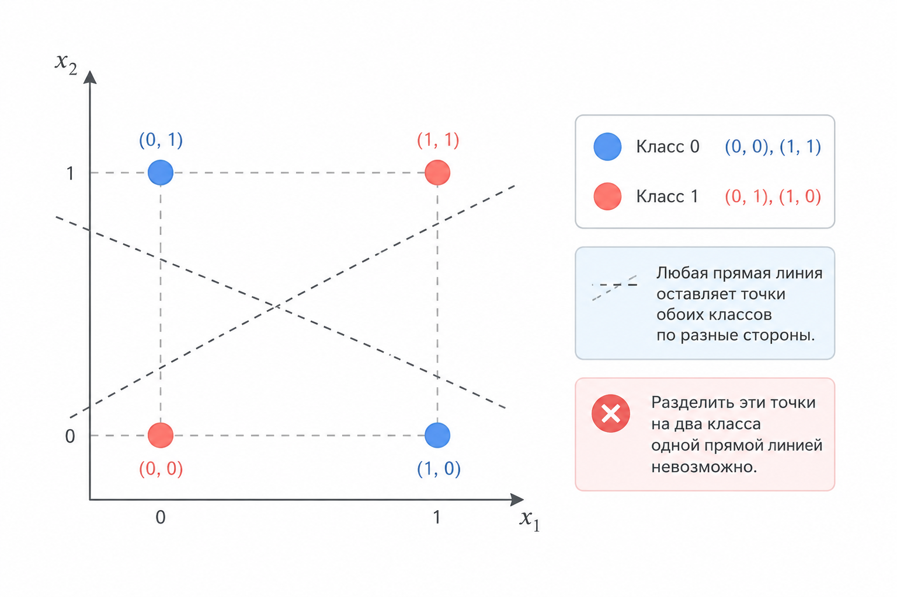
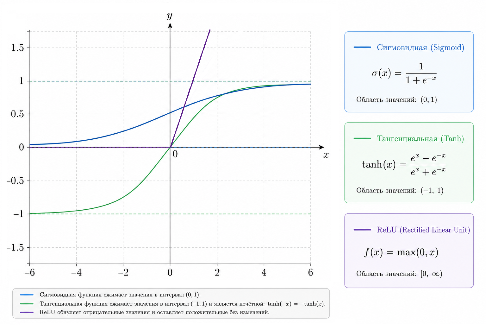
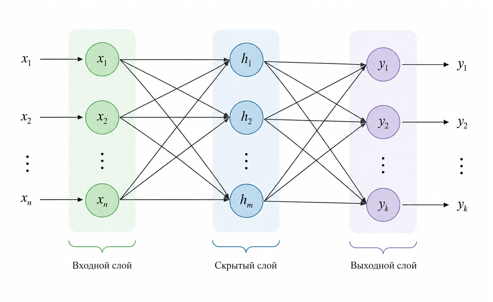

# 6.1 Перцептрон и полносвязная сеть

### Что такое перцептрон

Перцептрон – это одна из самых простых моделей машинного обучения и одновременно фундаментальный строительный блок нейронных сетей.&#x20;

Несмотря на то что современные архитектуры выглядят невероятно сложными, в их основе по-прежнему лежит тот же принцип: вычисление взвешенной суммы входов с последующим применением функции активации. Классический перцептрон использовал пороговую функцию, тогда как современные нейронные сети почти всегда используют непрерывные нелинейные функции активации.

Если убрать всю математику, перцептрон отвечает на очень простой вопрос:

> "Если я сложу все аргументы с учетом их важности – достаточно ли их, чтобы принять решение?"

Представьте, что банк решает, выдавать ли кредит. Он учитывает:

* доход клиента
* стаж работы
* кредитную историю
* текущую долговую нагрузку

Каждый фактор имеет свою "важность". Доход может быть важнее стажа, просрочки – сильным отрицательным фактором. Каждый фактор сначала умножается на свой вес, после чего результаты складываются. Если итоговый "балл" превышает некоторый порог  – кредит одобряется.

Перцептрон делает очень похожую операцию, только в математической форме.

Исторически перцептрон сравнивал полученную сумму с некоторым порогом. В современной записи этот порог обычно включают в смещение (bias), поэтому вместо сравнения с произвольным порогом используют условие $$w^{\top}x + b > 0$$

<figure><figcaption><p>Рис. 6.1-1. Схема одного перцептрона</p></figcaption></figure>

#### Исторический контекст

Перцептрон был предложен [Фрэнком Розенблаттом](https://ru.wikipedia.org/wiki/%D0%A0%D0%BE%D0%B7%D0%B5%D0%BD%D0%B1%D0%BB%D0%B0%D1%82%D1%82,_%D0%A4%D1%80%D1%8D%D0%BD%D0%BA). Это была одна из первых моделей, вдохновленных нейронами мозга.


В 1958 году Розенблатт опубликовал работу [_The Perceptron: A Probabilistic Model for Information Storage and Organization in the Brain_](https://homepages.math.uic.edu/~lreyzin/papers/rosenblatt58.pdf), благодаря которой модель получила широкую известность.


Идея была простой: нейрон получает сигналы от других нейронов, суммирует их, и если сигнал превышает определенный порог – "выстреливает". В противном случае – молчит.

Математическая модель классического перцептрона делает то же самое:

1. Получает входы
2. Умножает каждый вход на вес
3. Складывает
4. Сравнивает с порогом

Если сумма достаточно велика – выдает 1. Если нет – выдает 0.

Это и есть вся логика. Но в этой простоте скрыта огромная сила.

#### Формальное определение

Пусть есть входной вектор:

$$
x = (x_1, x_2, \dots, x_n)
$$

У перцептрона есть параметры:

* веса $$w_1, w_2, ..., w_n$$&#x20;
* смещение $$b$$&#x20;

Он вычисляет:

$$
z = \sum_{i=1}^{n} w_i x_i + b
$$

Это линейная комбинация признаков.&#x20;

Если у нас всего два признака, то выражение $$w_1​x_1​+w_2​x_2​+b=0$$ представляет собой обычное уравнение прямой, знакомое еще из школьной математики. Именно поэтому перцептрон строит линейную границу между классами.

Поскольку в выражении присутствует смещение (bias), такое преобразование также называют [аффинным](../../vvedenie/glossarii.md#affinnoe-preobrazovanie).

После этого применяется пороговая функция:

$$
\hat{y} = \begin{cases} 1, & z > 0 \\ 0, & z \le 0 \end{cases}
$$

#### Геометрическая интерпретация

Очень важно понять, что перцептрон – это не просто формула, а геометрический объект.

Когда он складывает признаки и сравнивает результат с нулем, он фактически строит границу в пространстве признаков.

В двумерном случае это прямая.

В трехмерном – плоскость.

В n-мерном – гиперплоскость.

Эта граница делит пространство на две части:

* по одну сторону – класс 1
* по другую сторону – класс 0

Во время обучения перцептрон ищет разделяющую гиперплоскость, которая лучше всего отделяет один класс от другого (на рисунке ниже показано, как одна прямая разделяет два класса объектов).

И если данные можно разделить одной плоской границей – перцептрон способен это сделать.

Более того, [теорема сходимости перцептрона](https://ru.wikipedia.org/wiki/%D0%A2%D0%B5%D0%BE%D1%80%D0%B5%D0%BC%D0%B0_%D1%81%D1%85%D0%BE%D0%B4%D0%B8%D0%BC%D0%BE%D1%81%D1%82%D0%B8_%D0%BF%D0%B5%D1%80%D1%86%D0%B5%D0%BF%D1%82%D1%80%D0%BE%D0%BD%D0%B0) утверждает, что если данные линейно разделимы, алгоритм обучения гарантированно найдет такую разделяющую гиперплоскость за конечное число шагов.

<div align="left"><figure><figcaption><p>Рис. 6.1-2. Разделение классов гиперплоскостью</p></figcaption></figure></div>

#### Почему это линейный классификатор

Если переписать условие:

$$
w^T x + b > 0
$$

это означает: мы делим пространство линейной границей.

Никакой кривизны.

Никаких сложных форм.

Только плоская поверхность.

Поэтому перцептрон может решить:

* [AND](https://ru.wikipedia.org/wiki/%D0%9A%D0%BE%D0%BD%D1%8A%D1%8E%D0%BD%D0%BA%D1%86%D0%B8%D1%8F) (конъюнкция)
* [OR](https://ru.wikipedia.org/wiki/%D0%94%D0%B8%D0%B7%D1%8A%D1%8E%D0%BD%D0%BA%D1%86%D0%B8%D1%8F) (дизъюнкция)
* простую линейную классификацию

Но не может решить [XOR](https://ru.wikipedia.org/wiki/%D0%98%D1%81%D0%BA%D0%BB%D1%8E%D1%87%D0%B0%D1%8E%D1%89%D0%B5%D0%B5_%C2%AB%D0%B8%D0%BB%D0%B8%C2%BB) (исключающее "или").

#### Перцептрон как алгоритм обучения

Важно понимать: перцептрон – это не только формула, но и правило обновления весов.

Если модель ошиблась:

$$
w = w + \eta (y - \hat{y}) x
$$

где:

* $$\eta$$ – learning rate
* $$y$$ – правильный ответ
* $$\hat{y}$$ – предсказание

Если предсказание верное – веса не меняются.

Если ошибка – веса сдвигаются в сторону правильного класса.&#x20;

Аналогичным образом обновляется и смещение (bias):

$$
b = b + \eta(y − ŷ)
$$

Интуитивно это похоже на корректировку линии на графике так, чтобы она лучше разделяла точки разных классов.

С каждым проходом по данным граница постепенно "подстраивается".

### Линейная комбинация – фундамент

Пусть у нас есть объект с признаками:

$$
x = (x_1, x_2, \dots, x_n)
$$

Перцептрон сначала вычисляет линейную комбинацию:

$$
z = w_1 x_1 + w_2 x_2 + ... + w_n x_n + b
$$

или в векторной форме:

$$
z = \mathbf{w}^T \mathbf{x} + b
$$

где:

* $$w$$ – вектор весов
* $$b$$  – bias (смещение)
* $$x$$ – входной вектор

Это обычная гиперплоскость в n-мерном пространстве.

Если же у нас два признака, то это просто прямая:

$$
w_1 x_1 + w_2 x_2 + b = 0
$$

<div align="left"><figure><figcaption><p>Рис. 6.1-3. Граница принятия решений</p></figcaption></figure></div>

Линейная комбинация – это та же идея, что и в линейной регрессии и логистической регрессии. Разница начинается дальше.

### Перцептрон

Классический перцептрон использует ступенчатую функцию:

$$
\hat{y} = \begin{cases} 1, & \text{если } z > 0 \\ 0, & \text{иначе} \end{cases}
$$

То есть:

1. Считаем линейную комбинацию
2. Применяем порог

Геометрически – разделяем пространство гиперплоскостью.

#### Ограничение

Перцептрон умеет решать только [линейно разделимые задачи](https://ru.wikipedia.org/wiki/%D0%9B%D0%B8%D0%BD%D0%B5%D0%B9%D0%BD%D0%B0%D1%8F_%D1%81%D0%B5%D0%BF%D0%B0%D1%80%D0%B0%D0%B1%D0%B5%D0%BB%D1%8C%D0%BD%D0%BE%D1%81%D1%82%D1%8C).

Например, XOR (как было упомянуто выше) он решить не может.

<div align="left"><figure><figcaption><p>Рис. 6.1-4. Проблема XOR</p></figcaption></figure></div>

XOR невозможно разделить одной гиперплоскостью, для его решения необходима нелинейность.&#x20;

Возникает естественный вопрос: можно ли объединить несколько перцептронов таким образом, чтобы вместе они смогли описывать более сложные границы? В конечном счёте, именно эта идея и привела к созданию многослойных нейронных сетей.

### Перцептрон на чистом PHP

Для начала, для более полного понимания, давайте реализуем перцептрон в минимальной форме:

```php
class Perceptron {
    // Один вес на каждый входной параметр
    private array $weights;

    private float $bias;

    private float $learningRate;

    public function __construct(int $nFeatures, float $lr = 0.1) {
        $this->learningRate = $lr;
        $this->weights = array_fill(0, $nFeatures, 0.0);
        $this->bias = 0.0;
    }

    public function getWeights(): array {
        return $this->weights;
    }

    public function getBias(): float {
        return $this->bias;
    }

    private function activation(float $z): int {
        // Бинарная пороговая функция активации.
        return $z > 0 ? 1 : 0;
    }

    public function predict(array $x): int {
        $z = $this->bias;

        foreach ($x as $i => $value) {
            $z += $this->weights[$i] * $value;
        }

        return $this->activation($z);
    }

    public function train(array $X, array $y, int $epochs = 100): void {
        // Правило обновления Розенблатта применяется к набору данных в несколько проходов
        for ($e = 0; $e < $epochs; $e++) {
            foreach ($X as $i => $sample) {
                $prediction = $this->predict($sample);
                $error = $y[$i] - $prediction;

                foreach ($sample as $j => $value) {
                    $this->weights[$j] += $this->learningRate * $error * $value;
                }

                $this->bias += $this->learningRate * $error;
            }
        }
    }
}
```

Это реализация классического правила обучения Розенблатта.

**Пример использования:**

```php
$X = [
    [0, 0],
    [0, 1],
    [1, 0],
    [1, 1],
];

$y = [0, 0, 0, 1];

$perceptron = new Perceptron(2, 0.1);
$perceptron->train($X, $y, 20);

echo "Перцептрон (правило Розенблатта) для логического AND:\n";
echo "-----------\n";
foreach ($X as $sample) {
    echo '[' . implode(', ', $sample) . '] => ' . $perceptron->predict($sample) . "\n";
}

echo "\nВеса и смещение:\n";
echo "-----------\n";
echo 'w1 = ' . $perceptron->getWeights()[0] . "\n";
echo 'w2 = ' . $perceptron->getWeights()[1] . "\n";
echo 'b = ' . $perceptron->getBias() . "\n";

// Результат:
// Перцептрон (правило Розенблатта) для логического AND:
// -----------
// [0, 0] => 0
// [0, 1] => 0
// [1, 0] => 0
// [1, 1] => 1

// Веса и смещение:
// -----------
// w1 = 0.2
// w2 = 0.1
// b = -0.2
```

Однако даже такой обучаемый перцептрон по-прежнему остается линейной моделью. Чтобы научиться решать более сложные задачи, необходимо объединить несколько нейронов в слои. Но прежде нужно понять, почему простого добавления новых линейных слоев недостаточно.

### Почему нужна нелинейность

Представим, что мы делаем два слоя:

$$
\begin{aligned}
h &= W_1 x + b_1 \\
y &= W_2 h + b_2
\end{aligned}
$$

Если между слоями не применять нелинейную функцию активации (или использовать тождественную функцию), то:

$$
\begin{aligned}
y &= W_2 (W_1 x + b_1) + b_2 \\
y &= (W_2 W_1)x + (W_2 b_1 + b_2)
\end{aligned}
$$

Это снова линейная модель.

Следовательно:

> Несколько линейных (точнее – аффинных) слоев без нелинейности эквивалентны одному аффинному преобразованию.

Именно поэтому активация – не "декорация", а математическая необходимость.&#x20;

Функция активации "ломает" линейность преобразования. Благодаря этому сеть получает возможность строить нелинейные границы между классами.

### Функции активации

Самые распространенные:

#### 1. Sigmoid

$$
\sigma(z) = \frac{1}{1 + e^{-z}}
$$

Диапазон: (0, 1)

#### 2. ReLU

$$
ReLU(z) = \max(0, z)
$$

#### 3. Hyperbolic Tangent

$$
\tanh(x)={\frac {e^{x}-e^{-x}}{e^{x}+e^{-x}}}
$$

<div align="left"><figure><figcaption><p>Рис. 6.1-5. Функции активации</p></figcaption></figure></div>

В отличие от сигмоиды, ReLU не ограничивает большие положительные значения сверху. На положительной части его производная равна 1, поэтому градиенты сохраняются значительно лучше и значительно реже затухают, что ускоряет обучение глубоких сетей.

В отличие от сигмоиды, он не ограничивает большие положительные значения сверху. Благодаря этому во время обучения градиенты значительно реже затухают, а сеть обучается быстрее.

### Полносвязная сеть (MLP)

MLP (Multi-Layer Perceptron) – это несколько слоев искусственных нейронов. Несмотря на историческое название, современные MLP используют не классические перцептроны со ступенчатой функцией, а дифференцируемые нейроны с нелинейными функциями активации (для нас это в данном случае не принципиально):

$$
\begin{aligned}
h &= \phi(W_1 x + b_1) \\
y &= \phi(W_2 h + b_2)
\end{aligned}
$$


Каждый нейрон связан со всеми нейронами предыдущего слоя – отсюда "полносвязная".

<div align="left"><figure><figcaption><p>Рис. 6.1-6. Диаграмма MLP</p></figcaption></figure></div>

Каждый скрытый слой можно интерпретировать как набор "детекторов" различных признаков. Следующий слой комбинирует найденные признаки в более сложные структуры, постепенно формируя итоговое решение.

#### Теоретически одного скрытого слоя достаточно

[Теорема универсальной аппроксимации](https://ru.wikipedia.org/wiki/%D0%A2%D0%B5%D0%BE%D1%80%D0%B5%D0%BC%D0%B0_%D0%A6%D1%8B%D0%B1%D0%B5%D0%BD%D0%BA%D0%BE) утверждает:

> Сеть с одним скрытым слоем и нелинейной активацией может аппроксимировать любую непрерывную функцию с произвольной точностью.

Важно понимать, что теорема гарантирует существование такой сети, но не утверждает, что нужные веса можно легко найти в процессе обучения.

Это фундаментальная причина, почему MLP – не просто игрушка.

#### Минимальный MLP на PHP

Пример с одним скрытым слоем:

```php
class SimpleMLP {
    // Веса скрытого слоя: [hidden_neuron][input_feature].
    private array $W1;
    private array $W2;
    private float $lr;
    private array $hidden;

    // Для простоты веса инициализируются случайными числами из диапазона [0; 1]. 
    // На практике обычно используют симметричную инициализацию 
    // (например, Xavier или He).    
    public function __construct(int $inputSize, int $hiddenSize, float $lr = 0.01) {
        $this->lr = $lr;

        // Random initialization in [0, 1] for tutorial simplicity.
        $this->W1 = [];

        for ($i = 0; $i < $hiddenSize; $i++) {
            $this->W1[$i] = array_fill(0, $inputSize, mt_rand() / mt_getrandmax());
        }

        $this->W2 = array_fill(0, $hiddenSize, mt_rand() / mt_getrandmax());
    }

    public function getW1() {
        return $this->W1;
    }

    public function getW2() {
        return $this->W2;
    }

    public function getHidden() {
        return $this->hidden;
    }

    private function relu(float $z): float {
        return max(0, $z);
    }

    public function forward(array $x): float {
        // Вычислить скрытые активации
        $hidden = [];

        foreach ($this->W1 as $weights) {
            $z = 0.0;

            foreach ($weights as $i => $w) {
                $z += $w * $x[$i];
            }

            $hidden[] = $this->relu($z);
        }
        
        $this->hidden = $hidden;

        $output = 0.0;

        // Линейный выходной сигнал от скрытых активаций
        foreach ($hidden as $i => $h) {
            $output += $this->W2[$i] * $h;
        }

        return $output;
    }
}
```

Для простоты пример не использует смещения (bias). В реальных нейронных сетях каждый нейрон обычно имеет собственный bias.

**Пример использования:**

```php
echo "Минимальный MLP (только forward-pass):\n";
echo "-----------\n";
$mlp = new SimpleMLP(2, 3, 0.01);
$input = [1.0, 0.5];
$output = $mlp->forward($input);

echo 'Вход: [' . implode(', ', array_map(static fn (float $v): string => (string) $v, $input)) . "]\n";
echo 'Скрытый слой:' . '[' . implode(', ', array_map(static fn (float $v): string => (string) round($v, 2), $mlp->getHidden())) . "]\n";
echo 'Выход: ' . number_format($output, 6, '.', '') . "\n";

// Результат:
// Минимальный MLP (только forward-pass):
// -----------
// Вход: [1, 0.5]
// Скрытый слой:     [1.48, 1.39, 0.36]
// Выход: 3.018517
```

Это только forward-pass. Для обучения нужен backpropagation – мы разберем его в следующей главе.

#### Геометрическая интуиция MLP

Скрытый слой делает следующее:

1. Берет линейные комбинации
2. Применяет нелинейность
3. Создает новые признаки

Каждый нейрон вычисляет новое представление данных – новую нелинейную комбинацию исходных признаков.

Композиция таких преобразований позволяет:

* "сгибать" пространство
* строить сложные границы решений
* разделять нелинейные классы

### Связь с логистической регрессией

Перцептрон и логистическая регрессия используют одну и ту же линейную комбинацию признаков. Главное отличие заключается в функции активации и способе обучения. Перцептрон использует ступенчатую функцию и правило обучения Розенблатта, тогда как логистическая регрессия использует сигмоиду и оптимизирует логарифмическую функцию потерь ([log loss](../../vvedenie/glossarii.md#log-loss-logarifmicheskaya-funkciya-poter)).

<table><thead><tr><th width="355.5078125">Перцептрон</th><th>Логистическая регрессия</th></tr></thead><tbody><tr><td>Step</td><td>Sigmoid</td></tr><tr><td>0 или 1</td><td>Вероятность</td></tr><tr><td>Правило Розенблатта</td><td>Gradient Descent</td></tr><tr><td>Ступенчатая функция недифференцируема</td><td>Сигмоида дифференцируема</td></tr></tbody></table>

То есть:

$$
\hat{y} = \sigma(w^T x + b)
$$

Перцептрон и логистическая регрессия используют одну и ту же линейную комбинацию признаков, но различаются функцией активации и способом обучения. Логистическую регрессию можно рассматривать как дифференцируемый аналог перцептрона, что позволяет обучать её с помощью градиентных методов.

### Главная идея главы и итог

Вся современная нейросетевая архитектура строится на трех вещах:

1. Линейная комбинация
2. Нелинейная активация
3. Композиция слоев

Глубина – это повторение этих трех шагов.

Итого, перцептрон – это:

* линейная модель
* с пороговой функцией
* способная разделять только линейные классы

MLP – это:

* композиция линейных (аффинных) преобразований
* с обязательной нелинейностью
* способная строить сложные поверхности решений

Именно добавление нелинейности превращает простую линейную алгебру в универсальный аппроксиматор.

В следующей главе мы подробно разберем backpropagation – механизм, который позволяет этим сетям обучаться эффективно.


Чтобы самостоятельно протестировать этот код, воспользуйтесь [онлайн-демонстрацией](https://aiwithphp.org/books/ai-for-php-developers/examples/part-6/perceptron-and-fully-connected-network) для его запуска.

